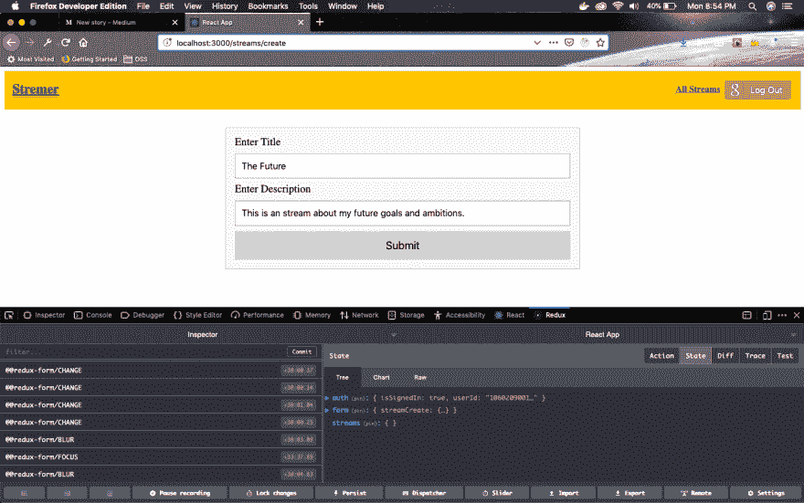
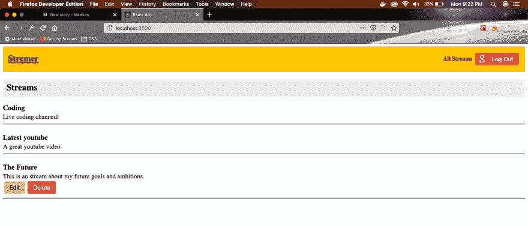
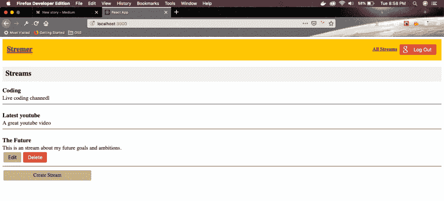
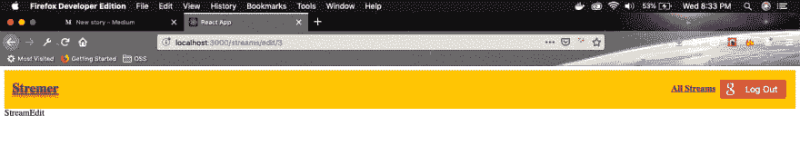
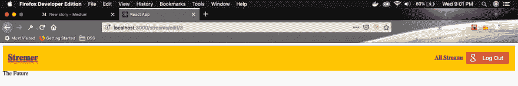
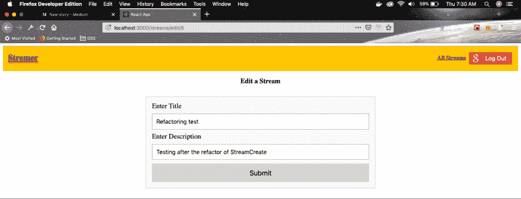

# 使用 React -5 创建抽动克隆

> 原文：<https://dev.to/nabendu82/create-a-twitch-clone-using-react-5-1o3e>

欢迎来到本系列的第 5 部分。让我们从我们离开的地方开始。我们希望将用户关联到我们的流，以便我们可以为该流的登录用户添加删除和编辑按钮。

打开 *src - > actions* 文件夹中的 **index.js** 文件，在 createStream()中添加 userId。

```
 export const createStream = formValues => async (dispatch, getState) => {
        const { userId } = getState().auth;
        const response = await streams.post('/streams', {...formValues, userId});
        dispatch({ type: CREATE_STREAM, payload: response.data })
    } 
```

现在，移动到[http://localhost:3000/streams/create](http://localhost:3000/streams/create)并创建一个新的流。

[ ](https://res.cloudinary.com/practicaldev/image/fetch/s--BqXjPFDq--/c_limit%2Cf_auto%2Cfl_progressive%2Cq_auto%2Cw_880/https://cdn-images-1.medium.com/max/2876/1%2AKTok2OS9ima1ulGg3Clq-Q.png) *带用户 Id 的新流*

现在，我们将为创建流的用户显示删除和编辑按钮。因此，转到 **StreamList.js** 并更新 mapStateToProps 以包含当前用户 id(currUserId)。
接下来，我们创建一个新函数 **renderAdmin()** ，我们从 renderList()内部调用它。这里，我们首先检查我们的流用户是否等于我们从 redux state 接收的用户。
如果相同，我们显示两个按钮。

```
 import React from 'react';
    import { connect } from 'react-redux';
    import { fetchStreams } from '../../actions';
    import './StreamList.css';

    class StreamList extends React.Component {
      componentDidMount() {
        this.props.fetchStreams();
      }

      renderAdmin(stream) {
        if(stream.userId === this.props.currUserId) {
          return (
            <div>
              <button className="editBtn">Edit</button>
              <button className="deleteBtn">Delete</button>
            </div>
          )
        }
      }

      renderList() {
        return this.props.streams.map(stream => {
          return (
            <div className="item" key={stream.id}>
              <div className="content">{stream.title}</div>
              <div className="description">{stream.description}</div>
              {this.renderAdmin(stream)}
              <hr />
            </div>
          )
        })
      }

      render() {
        return (
          <div>
            <h2 className="header">Streams</h2>
            <div className="list">{this.renderList()}</div>
          </div>
        )
      }
    }

    const mapStateToProps = (state) => {
      return {
        streams: Object.values(state.streams),
        currUserId: state.auth.userId
      };
    }

    export default connect(mapStateToProps, { fetchStreams })(StreamList); 
```

接下来，我们也在 **StreamList.css**
中给这些按钮添加一些 CSS

```
 .editBtn,.deleteBtn {
        box-sizing: border-box;
        position: relative;
        margin: 0.2em;
        padding: 0 15px 0 15px;
        border: none;
        text-align: center;
        line-height: 34px;
        white-space: nowrap;
        border-radius: 0.2em;
        font-size: 16px;
        color: black;
        background: burlywood;
    }

    .deleteBtn {
        background: #DD4B39;
        color:white;
    }

      .editBtn:hover,
      .deleteBtn:hover {
        background: #E74B37;
        cursor: pointer;
      } 
```

现在，在 [http://localhost:3000/](http://localhost:3000/) 中，我们只能看到这两个按钮，因为我们最新流有一个 userId。

[ ](https://res.cloudinary.com/practicaldev/image/fetch/s--3-Xb7f9q--/c_limit%2Cf_auto%2Cfl_progressive%2Cq_auto%2Cw_880/https://cdn-images-1.medium.com/max/2880/1%2AunubQqA9RmXxTlhIdbNv6Q.png) *漂亮的纽扣*

接下来，我们将在主页上创建一个“创建流”按钮。现在，打开 **StreamList.js** ，添加一个新方法。它将包含一个链接标记，单击它我们将转到创建表单页面。

```
 import React from 'react';
    import { connect } from 'react-redux';
    import { Link } from 'react-router-dom';
    import { fetchStreams } from '../../actions';
    import './StreamList.css';

    class StreamList extends React.Component {
      componentDidMount() {
        this.props.fetchStreams();
      }

    …
    …
      renderCreate() {
        if(this.props.isSignedIn) {
          return (
            <div className="editBtn createBtn">
              <Link to="/streams/create">Create Stream</Link>
            </div>
          )
        }
      }

      render() {
        return (
          <div>
            <h2 className="header">Streams</h2>
            <div className="list">{this.renderList()}</div>
            {this.renderCreate()}
          </div>
        )
      }
    }

    const mapStateToProps = (state) => {
      return {
        streams: Object.values(state.streams),
        currUserId: state.auth.userId,
        isSignedIn: state.auth.isSignedIn
      };
    }

    export default connect(mapStateToProps, { fetchStreams })(StreamList);

Next, we also add some CSS to this Link button in **StreamList.css**

    .createBtn{
          width:20%;
      }

      .createBtn>a{
        color: black;
        text-decoration: none;
     } 
```

[ ](https://res.cloudinary.com/practicaldev/image/fetch/s--zhdRdpsd--/c_limit%2Cf_auto%2Cfl_progressive%2Cq_auto%2Cw_880/https://cdn-images-1.medium.com/max/2880/1%2AiuWDJDMJJU32WPETryx5vw.png) *创建流按钮*

现在，每当我们在[http://localhost:3000/streams/create](http://localhost:3000/streams/create)中创建新的流时，我们应该将用户移动到主页并显示新的流。

我们将创建自己的历史对象，而不是依赖于 react 路由器。因此，在 **src** 文件夹中创建一个新文件 **history.js** 。

```
 import { createBrowserHistory } from 'history';

    export default createBrowserHistory(); 
```

现在，我们将更改 App.js 以使用这个新的历史对象。我们把我们的**浏览器**改成了**路由器**。

```
 import React from 'react';
    import { Router, Route } from 'react-router-dom';
    import StreamCreate from './streams/StreamCreate';
    import StreamEdit from './streams/StreamEdit';
    import StreamDelete from './streams/StreamDelete';
    import StreamList from './streams/StreamList';
    import StreamShow from './streams/StreamShow';
    import Header from './Header';
    import history from '../history';

    const App = () => {
        return (
            <div>
                <Router history={history}>
                    <div>
                        <Header />
                        <Route path="/" exact component={StreamList} />
                        <Route path="/streams/create" exact component={StreamCreate} />
                        <Route path="/streams/edit" exact component={StreamEdit} />
                        <Route path="/streams/delete" exact component={StreamDelete} />
                        <Route path="/streams/show" exact component={StreamShow} />
                    </div>
                </Router>
            </div>
        );
    }

    export default App; 
```

接下来，打开 *src - > actions* 文件夹中的 **index.js** 文件。在顶部和内部导入历史记录`createStream(), add histoy.push(‘/’).`,因此，当流创建被分派时，我们返回到主页。

```
 import history from '../history';
    …
    …

    export const createStream = formValues => async (dispatch, getState) => {
        const { userId } = getState().auth;
        const response = await streams.post('/streams', {...formValues, userId});
        dispatch({ type: CREATE_STREAM, payload: response.data })
        history.push('/');
    }

    …
    … 
```

接下来，我们将在应用程序中添加编辑功能。这将允许用户编辑流。现在，打开 **StreamList.js** ，将`renderAdmin()`中的编辑按钮改为链接标签。

```
 renderAdmin(stream) {
        if(stream.userId === this.props.currUserId) {
          return (
            <div>
              <Link to={`/streams/edit/${stream.id}`} className="editBtn linkBtn">Edit</Link>
              <button className="deleteBtn">Delete</button>
            </div>
          )
        }
      } 
```

另外，在 **StreamList.css**
中添加一些 CSS

```
 .linkBtn{
        color: black;
        text-decoration: none;
        padding: 0.6rem;
     } 
```

接下来，在 App.js 中，我们修改路线以进行编辑。

```
 const App = () => {
        return (
            <div>
                <Router history={history}>
                    <div>
                        <Header />
                        <Route path="/" exact component={StreamList} />
                        <Route path="/streams/create" exact component={StreamCreate} />
                        <Route path="/streams/edit/:id" exact component={StreamEdit} />
                        <Route path="/streams/delete" exact component={StreamDelete} />
                        <Route path="/streams/show" exact component={StreamShow} />
                    </div>
                </Router>
            </div>
        );
    } 
```

现在，当您单击“编辑”按钮时，它将导航到编辑组件。

[](https://res.cloudinary.com/practicaldev/image/fetch/s--tntkJtZ3--/c_limit%2Cf_auto%2Cfl_progressive%2Cq_auto%2Cw_880/https://cdn-images-1.medium.com/max/2880/1%2A84PvlK-qXZgG-jFN3cpNWw.png)*stream edit 组件*

现在，是时候处理我们的 **StreamEdit.js** 文件了。我们基本上像 **StreamList** 组件一样改变了它，并从全局 redux 状态获取所有流的列表。但是，我们只想要用户选择的那个流的内容。

因此，我们正在使用户*this . props . match . params . id*

```
 import React from 'react';
    import { connect } from 'react-redux';
    import { fetchStream } from '../../actions';

    class StreamEdit extends React.Component {
      componentDidMount() {
        this.props.fetchStream(this.props.match.params.id);
      }

      render() {
        if(!this.props.stream){
          return <div>Loading...</div>
        }

        return (
          <div>
            {this.props.stream.title}
          </div>
        )
      }

    }

    const mapStateToProps = (state, ownProps) => {
      return { stream: state.streams[ownProps.match.params.id]}
    }

    export default connect(mapStateToProps, { fetchStream })(StreamEdit); 
```

现在，点击“编辑”按钮，它会显示该流的标题。

[ ](https://res.cloudinary.com/practicaldev/image/fetch/s--K9MY1Mj---/c_limit%2Cf_auto%2Cfl_progressive%2Cq_auto%2Cw_880/https://cdn-images-1.medium.com/max/2880/1%2A5ulA0jaRnhlohLLRxCJzJQ.png) *标题显示*

我们的 **StreamEdit** 组件将与 **StreamCreate** 组件非常相似。因此，我们将重构代码，制作一个通用组件，我们将把它命名为 **StreamForm** 。

继续在 streams 目录中创建 **StreamForm.js** 。我们将所有的表单逻辑从 **StreamCreate** 移到这里。

```
 import React, {Fragment} from 'react';
    import { Field, reduxForm } from 'redux-form';
    import './formStyles.css';

    class StreamForm extends React.Component {
      renderError(meta) {
        if(meta.touched && meta.error) {
          return (
            <div className="err__msg">{meta.error}</div>
          );
        }
      }

      renderInputBox = ({input, label, meta}) => {
        return (
          <Fragment>
            <label>{label}</label>
            <input {...input} />
            {this.renderError(meta)}
          </Fragment>
        )
      }

      onSubmitForm = (formValues) => {
        this.props.parentSubmit(formValues);
      }

      render() {
        return (
          <form onSubmit={this.props.handleSubmit(this.onSubmitForm)} className="ui__form">
            <Field name="title" label="Enter Title" component={this.renderInputBox} />
            <Field name="description" label="Enter Description" component={this.renderInputBox} />
            <button>Submit</button>
          </form>
        )
      }
    }

    const validate = (formValues) => {
      const errors = {};
      if(!formValues.title) {
        errors.title = "You must enter a title";
      }
      if(!formValues.description) {
        errors.description = "You must enter a description";
      }

      return errors;
    }

    export default reduxForm({form: 'streamForm', validate})(StreamForm); 
```

接下来，我们重构 **StreamCreate.js** 文件，使其仅包含连接逻辑。

```
 import React from 'react';
    import { connect } from 'react-redux';
    import { createStream } from '../../actions';
    import StreamForm from './StreamForm';
    import './formStyles.css';

    class StreamCreate extends React.Component {

      onSubmit = (formValues) => {
        this.props.createStream(formValues);
      }

      render() {
        return (
         <div>
           <h3>Create a Stream</h3>
           <StreamForm parentSubmit={this.onSubmit} />
         </div>
        )
      }
    }

    export default connect(null, { createStream })(StreamCreate); 
```

之后，这个重构创建一个新的流并检查它是否工作。

现在，我们重构 **StreamEdit.js** 文件，以使用这个 **StreamForm** 组件。与 StreamCreate 的一个主要区别是，我们将一组**初始值**传递给 StreamForm。这个 **initialValues** 是一个 Redux 表单的概念，我们可以向表单传递任何初始值，它会显示它。

在 **initialValues** 中，我们传递一个包含标题和描述的对象。

```
 import React from 'react';
    import { connect } from 'react-redux';
    import { fetchStream, editStream } from '../../actions';
    import StreamForm from './StreamForm';
    import './formStyles.css';

    class StreamEdit extends React.Component {
      componentDidMount() {
        this.props.fetchStream(this.props.match.params.id);
      }

      onSubmit = (formValues) => {
        console.log(formValues);
      }

      render() {
        if (!this.props.stream) {
          return <div>Loading...</div>
        }

        return (
          <div>
            <h3>Edit a Stream</h3>
            <StreamForm initialValues={{title: this.props.stream.title, description: this.props.stream.description }} parentSubmit={this.onSubmit} />
          </div>
        )
      }

    }

    const mapStateToProps = (state, ownProps) => {
      return { stream: state.streams[ownProps.match.params.id] }
    }

    export default connect(mapStateToProps, { fetchStream, editStream })(StreamEdit); 
```

一个微小的样式添加到我们的 **formStyles.css**

```
 h3{
        text-align: center;
      } 
```

现在，编辑一个流，你会看到它的内容。

[ ](https://res.cloudinary.com/practicaldev/image/fetch/s--nOZM2OpP--/c_limit%2Cf_auto%2Cfl_progressive%2Cq_auto%2Cw_880/https://cdn-images-1.medium.com/max/2880/1%2ATC0Ayg2FUtWuc3ytNG7aiw.png) *编辑一个流*

接下来，让我们更新* *StreamEdit.js ** 中的 **onSubmit()** ，将我们的更改保存到后端。因此，我们用流 id 和 formValues 调用 editStream 操作 creator。

```
 onSubmit = (formValues) => {
        this.props.editStream(this.props.match.params.id, formValues);
      } 
```

我们还对 *src - > actions* 文件夹中的 **index.js** 文件做了一个小改动。在派遣完成后，我们将路径更改为主页 url，并将 put 请求更改为 patch。

```
 export const editStream = (id, formValues) => async dispatch => {
        const response = await streams.patch(`/streams/${id}`, formValues);
        dispatch({ type: EDIT_STREAM, payload: response.data });
        history.push('/');
    } 
```

所以，继续编辑表格并提交。如果一切正常，您将带着更改返回主页。

本系列的第 5 部分到此结束。你可以在这里找到到这个点[的代码。](https://github.com/nabendu82/streams)