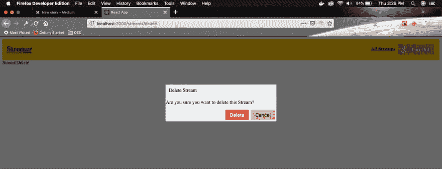

# 使用 React -6 创建抽动克隆

> 原文：<https://dev.to/nabendu82/create-a-twitch-clone-using-react-6-5gbm>

欢迎来到本系列的第 6 部分。让我们从我们离开的地方开始。接下来，我们将创建删除组件。我们将展示一个删除流的模式。

我们将为此使用 React 门户，因为在 React 中创建一个模型是很棘手的。

因此，继续在**组件**文件夹中创建一个 **Modal.js** 文件。向其中添加以下代码。我们使用 createPortal 方法，其中第二个参数是选择一个 id modal。

```
 import React from 'react';
    import ReactDOM from 'react-dom';
    import history from '../history';
    import './Modal.css';

    const Modal = props => {
        return ReactDOM.createPortal(
            <div onClick={() => history.push('/')} className="modal-body">
                <div onClick={(e) => e.stopPropagation()} className="modal-main delete-modal">
                    <div className="header">Delete Stream</div>
                    <div className="modal-text">Are you sure you want to delete this Stream?</div>
                    <div className="modal-buttons">
                        <button className="deleteBtn">Delete</button>
                        <button className="editBtn">Cancel</button>
                    </div>
                </div>
            </div>,
            document.querySelector('#modal')
        );
    };

    export default Modal; 
```

让我们在公共文件夹的**index.html**文件中创建 id="modal"。因为，大多数人可能知道整个 React 应用程序是在 id="root "中呈现的。因此，在 React Portal 的帮助下，我们可以创建另一个元素并使用它来显示我们的模态。

```
 …
    …   
    <div id="root"></div>
    <div id="modal"></div>
    …
    … 
```

接下来，在**组件**文件夹中创建 **Modal.css** 文件。添加代码以显示基本模式。

```
 .modal-body {
        position: fixed;
        top: 0;
        left: 0;
        width:100%;
        height: 100%;
        background: rgba(0, 0, 0, 0.6);
      }

      .modal-main {
        position:fixed;
        background: white;
        width: 25%;
        height: auto;
        top:50%;
        left:50%;
        transform: translate(-50%,-50%);
      }

      .delete-modal{
        display: grid;
        grid-gap: 10px;
        border: 1px solid #c1c1c1;
      }
      .modal-buttons{
          justify-self: end
      } 
```

现在，继续将这个模态组件添加到我们的 **StreamDelete.js** 文件中。

```
 import React from 'react';
    import Modal from '../Modal';

    const StreamDelete = () => {
      return (
        <div>
          StreamDelete
          <Modal />
        </div>
      )
    }

    export default StreamDelete; 
```

现在，在浏览器中进入[http://localhost:3000/streams/delete](http://localhost:3000/streams/delete)，你可以看到我们的模型。

[ ](https://res.cloudinary.com/practicaldev/image/fetch/s--l7eebO_H--/c_limit%2Cf_auto%2Cfl_progressive%2Cq_auto%2Cw_880/https://cdn-images-1.medium.com/max/2880/1%2AkuhZ14gcyFMvQcrbnbBeUg.png) *美丽莫代尔*

在 Modal.js 文件中需要注意的一点是，我们在主 div 上使用了 onClick 事件处理程序。如果用户点击模式窗口之外的任何地方，即灰色区域，它用于导航用户到主页。
但不要这样做，如果他点击模态窗口内的任何地方，我们就使用 e.stopPropagation

```
 <div onClick={() => history.push('/')} className="modal-body">
                <div  onClick={(e) => e.stopPropagation()} className="modal-main delete-modal"> 
```

我们的模态组件是不可重用的，所以让我们使它更加可重用，这样我们也可以在其他地方使用。我们将把所有硬编码的逻辑移到父组件中，并在这里通过 props 使用它。所以，在 **Modal.js** 中做如下修改。

```
 import React from 'react';
    import ReactDOM from 'react-dom';
    import './Modal.css';

    const Modal = props => {
        return ReactDOM.createPortal(
            <div onClick={props.onDismiss} className="modal-body">
                <div onClick={(e) => e.stopPropagation()} className="modal-main delete-modal">
                    <div className="header">{props.title}</div>
                    <div className="modal-text">{props.content}</div>
                    {props.actions}
                </div>
            </div>,
            document.querySelector('#modal')
        );
    };

    export default Modal; 
```

接下来，在 **StreamDelete.js** 中，添加那些部分。

```
 import React from 'react';
    import Modal from '../Modal';
    import history from '../../history';

    const StreamDelete = () => {
      const actions = (
        <div className="modal-buttons">
          <button className="deleteBtn">Delete</button>
          <button className="editBtn">Cancel</button>
        </div>
      );

      return (
        <div>
          StreamDelete
          <Modal
           title="Delete Stream"
            content="Are you sure you want to delete this Stream?"
            actions={actions}
            onDismiss={() => history.push('/')}
          />
        </div>
      )
    }

    export default StreamDelete; 
```

现在，我们将向这些删除和取消按钮添加逻辑。因此，移动到 **App.js** 并将 delete 也改为包含 id。

```
 const App = () => {
        return (
            <div>
                <Router history={history}>
                    <div>
                        <Header />
                        <Route path="/" exact component={StreamList} />
                        <Route path="/streams/create" exact component={StreamCreate} />
                        <Route path="/streams/edit/:id" exact component={StreamEdit} />
                        <Route path="/streams/delete/:id" exact component={StreamDelete} />
                        <Route path="/streams/show" exact component={StreamShow} />
                    </div>
                </Router>
            </div>
        );
    } 
```

接下来，转到 **StreamList.js** 并向那里的 delete 按钮添加逻辑。

```
 renderAdmin(stream) {
        if(stream.userId === this.props.currUserId) {
          return (
            <div>
              <Link to={`/streams/edit/${stream.id}`} className="editBtn linkBtn">Edit</Link>
             <Link to={`/streams/delete/${stream.id}`}  className="deleteBtn linkBtn">Delete</Link>
            </div>
          )
        }
      } 
```

现在，如果你去主页点击删除按钮，它将打开我们的模式。

接下来，我们将把我们的 **StreamDelete.js** 更改为基于类的组件，因为我们将在这里使用 redux 状态。

```
 import React from 'react';
    import Modal from '../Modal';
    import history from '../../history';

    class StreamDelete extends React.Component {
      renderActions() {
        return (
          <div className="modal-buttons">
            <button className="deleteBtn">Delete</button>
            <button className="editBtn">Cancel</button>
          </div>
        );
      }

      render() {
        return (
          <div>
            StreamDelete
            <Modal
              title="Delete Stream"
              content="Are you sure you want to delete this Stream?"
              actions={this.renderActions()}
              onDismiss={() => history.push('/')}
            />
          </div>
        )
      }
    }

    export default StreamDelete; 
```

现在，我们将在 StreamDelete 组件中使用所有 redux 状态。该逻辑与我们为 StreamEdit 组件所做的几乎相似。所以，继续编辑 **StreamDelete.js**

```
 import React from 'react';
    import Modal from '../Modal';
    import { connect } from 'react-redux';
    import { fetchStream, deleteStream } from '../../actions';
    import history from '../../history';

    class StreamDelete extends React.Component {
      componentDidMount() {
        this.props.fetchStream(this.props.match.params.id);
      }

      renderActions() {
        const id = this.props.match.params.id;
        return (
          <div className="modal-buttons">
            <button onClick={() => this.props.deleteStream(id)} className="deleteBtn">Delete</button>
            <button onClick={() => history.push('/')} to={'/'} className="editBtn">Cancel</button>
          </div>
        );
      }

     renderContent() {
        if(!this.props.stream) {
          return 'Are you sure you want to delete this Stream?'
        }
        return `Are you sure you want to delete the Stream - ${this.props.stream.title}`
      }

      render() {
        return (
            <Modal
              title="Delete Stream"
              content={this.renderContent()}
              actions={this.renderActions()}
              onDismiss={() => history.push('/')}
            />
        )
      }
    }

    const mapStateToProps = (state, ownProps) => {
      return { stream: state.streams[ownProps.match.params.id] }
    }

    export default connect(mapStateToProps, { fetchStream, deleteStream } )(StreamDelete); 
```

最后一件事是在 action 文件夹中更新 **index.js** 内的 **deleteStream** ()。我们添加了 **history.push('/')** 类似于 edit 和 create，一旦流被删除，用户就可以返回到主页。

```
 export const deleteStream = (id) => async dispatch => {
        await streams.delete(`/streams/${id}`);
        dispatch({ type: DELETE_STREAM, payload: id });
        history.push('/');
    } 
```

所以，继续删除一个流。一切都应该正常工作。

本系列的第 6 部分到此结束。你可以在这里找到到这个点[的代码。](https://github.com/nabendu82/streams)