# 使用 React -7 创建抽动克隆

> 原文：<https://dev.to/nabendu82/create-a-twitch-clone-using-react-7-1pk3>

欢迎来到本系列的第 7 部分。我们将首先创建 **StreamShow** 组件。因此，每当用户点击一个流，它就会显示一个。

因此，首先打开 **App.js** ，因为我们必须更新我们的路线。粗体字表示已更改。我们使用开关来包装所有路由，因为要在 StreamCreate 和 StreamShow 中解决相同类型的路由。

```
 import React from 'react';
    import { Router, Route, Switch } from 'react-router-dom';
    …
    …

    const App = () => {
        return (
            <div>
                <Router history={history}>
                    <div>
                        <Header />
                        <Switch>
                            <Route path="/" exact component={StreamList} />
                            <Route path="/streams/create" exact component={StreamCreate} />
                            <Route path="/streams/edit/:id" exact component={StreamEdit} />
                            <Route path="/streams/delete/:id" exact component={StreamDelete} />
                            <Route path="/streams/:id" exact component={StreamShow} />
                        </Switch>
                    </div>
                </Router>
            </div>
        );
    }

    export default App; 
```

接下来，我们将更新我们的 **StreamList.js** 文件的 renderList()。这里，我们添加了一个到流标题的链接。

```
 renderList() {
        return this.props.streams.map(stream => {
          return (
            <div className="item" key={stream.id}>
              <div className="content">
              <Link to={`/streams/${stream.id}`}>{stream.title}</Link>
              </div>
              <div className="description">{stream.description}</div>
              {this.renderAdmin(stream)}
              <hr />
            </div>
          )
        })
      } 
```

所以，现在在主页上你有一个链接，点击它将进入我们的 **StreamShow** 页面。

[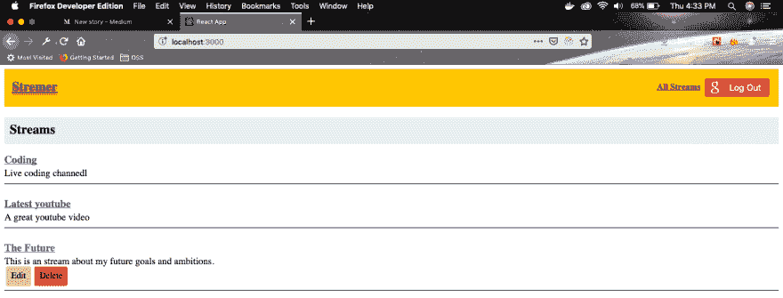](https://res.cloudinary.com/practicaldev/image/fetch/s--0pk1lcEd--/c_limit%2Cf_auto%2Cfl_progressive%2Cq_auto%2Cw_880/https://cdn-images-1.medium.com/max/2880/1%2A8YYp5jgFH7NYzhiS8c0s3A.png)T3】标题链接

接下来，我们将在 **StreamShow.js** 文件中添加 redux 状态的基本样板文件。这类似于我们为 **StreamEdit** 和 **StreamDelete** 所做的事情。

```
 import React, { Component } from 'react';
    import { connect } from 'react-redux';
    import { fetchStream } from '../../actions';

    class StreamShow extends Component {
      componentDidMount() {
        this.props.fetchStream(this.props.match.params.id);
      }

      render() {
        if (!this.props.stream) {
          return <div>Loading...</div>
        }

        return (
          <div>
            <h1>{this.props.stream.title}</h1>
            <h5>{this.props.stream.description}</h5>
          </div>
        )
      }
    }

    const mapStateToProps = (state, ownProps) => {
      return { stream: state.streams[ownProps.match.params.id] }
    }

    export default connect(mapStateToProps, { fetchStream })(StreamShow); 
```

现在，如果我们单击任何标题，就会显示这个基本页面。

[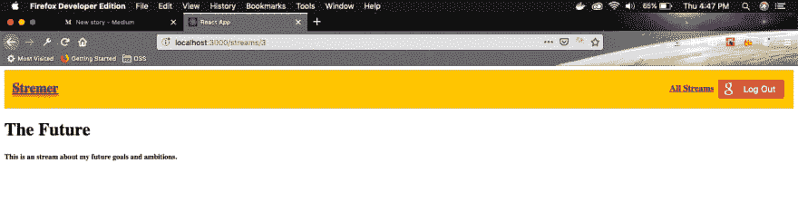 ](https://res.cloudinary.com/practicaldev/image/fetch/s--_WAb6Ftp--/c_limit%2Cf_auto%2Cfl_progressive%2Cq_auto%2Cw_880/https://cdn-images-1.medium.com/max/2880/1%2An1qPmp2RTznYkq19Q4S-Fg.png) *未来*

现在，是时候设置我们的 RTMP(实时消息协议)服务器了。因此，进入包含我们的 **api** 和**客户端**文件夹的根目录。并制作一个目录 **rtmpserver** 和光盘放入其中。

[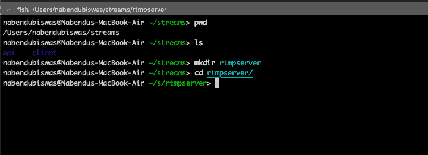 ](https://res.cloudinary.com/practicaldev/image/fetch/s--kRyz1Dj4--/c_limit%2Cf_auto%2Cfl_progressive%2Cq_auto%2Cw_880/https://cdn-images-1.medium.com/max/2000/1%2AOPPmj2zK-K-L38DO8678Pg.png) * mkdir*

接下来执行一个 **npm init** 来创建一个 package.json 文件。一切按回车键，这样它就可以采用默认值。

[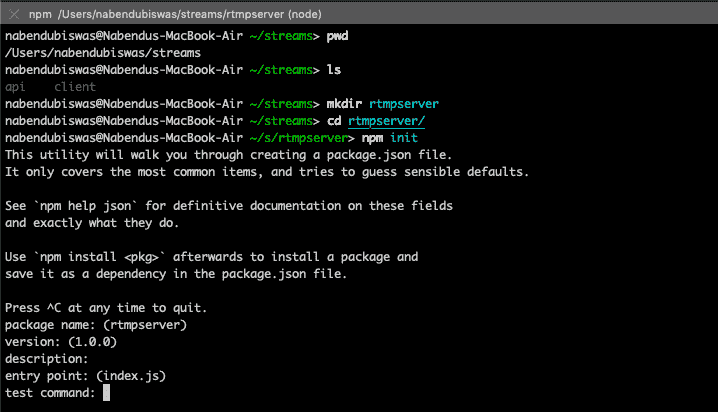 ](https://res.cloudinary.com/practicaldev/image/fetch/s--qAKxBg4---/c_limit%2Cf_auto%2Cfl_progressive%2Cq_auto%2Cw_880/https://cdn-images-1.medium.com/max/2000/1%2ANygYy3nGsxViZ1of7uWMpQ.png) * npm 初始化*

接下来，安装软件包**节点-媒体-服务器**。

[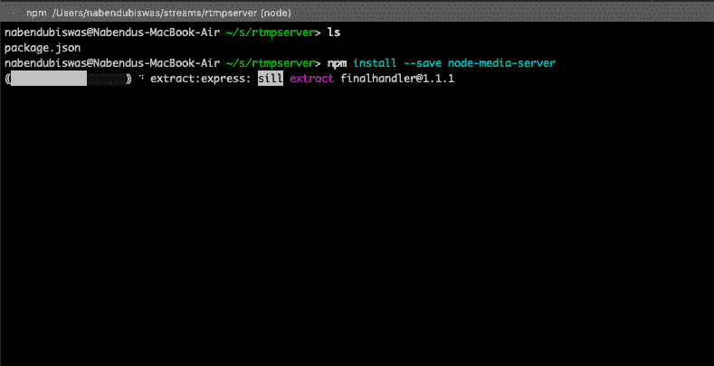 ](https://res.cloudinary.com/practicaldev/image/fetch/s--nsbzhqXJ--/c_limit%2Cf_auto%2Cfl_progressive%2Cq_auto%2Cw_880/https://cdn-images-1.medium.com/max/2000/1%2A0-iNO9qBSMCrQy5Ea1Y4Xw.png) *节点-媒体-服务器*

接下来，在代码编辑器中打开它，并在其中创建一个 **index.js** 文件。

[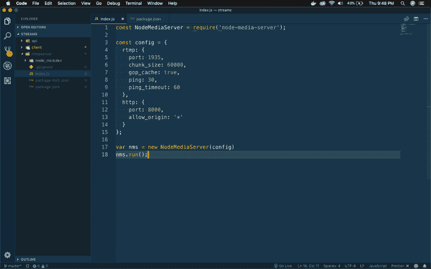 ](https://res.cloudinary.com/practicaldev/image/fetch/s--uELvIWu---/c_limit%2Cf_auto%2Cfl_progressive%2Cq_auto%2Cw_880/https://cdn-images-1.medium.com/max/2880/1%2A4IVDK6kA8pPJkQUeSJCt9Q.png) * rtmp 服务器*

接下来，放上我们从**节点-媒体-服务器** github [页面](https://github.com/illuspas/Node-Media-Server)获得的样板代码。

```
 const NodeMediaServer = require('node-media-server');

    const config = {
      rtmp: {
        port: 1935,
        chunk_size: 60000,
        gop_cache: true,
        ping: 30,
        ping_timeout: 60
      },
      http: {
        port: 8000,
        allow_origin: '*'
      }
    };

    var nms = new NodeMediaServer(config)
    nms.run(); 
```

接下来，在 rtmp 服务器的 **package.json** 中，我们添加了一个启动脚本。

```
 {
      "name": "rtmpserver",
      "version": "1.0.0",
      "description": "",
      "main": "index.js",
      "scripts": {
        "start": "node index.js"
      },
      "author": "",
      "license": "ISC",
      "dependencies": {
        "node-media-server": "^2.1.0"
      }
    } 
```

因此，现在我们可以在我们的 **rtmpserver** 目录中执行 **npm start** 。

[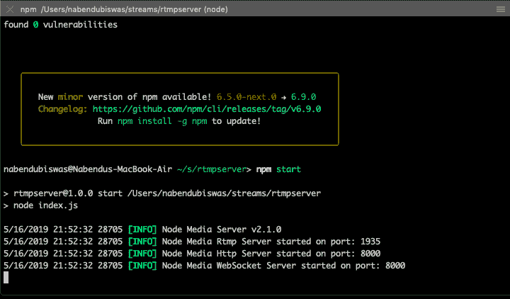](https://res.cloudinary.com/practicaldev/image/fetch/s--kneRdwsn--/c_limit%2Cf_auto%2Cfl_progressive%2Cq_auto%2Cw_880/https://cdn-images-1.medium.com/max/2000/1%2AoOVyezicxunqyrfkGr1tpg.png)T3】NPM 开始

接下来，我们将在我们的电脑里设置一个 OBS，来共享视频和音频。我们遵循下图中的方法。

[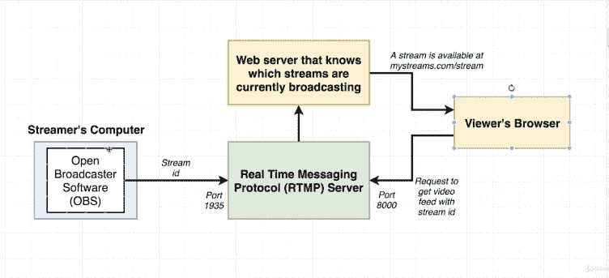](https://res.cloudinary.com/practicaldev/image/fetch/s--HeUiF1Sm--/c_limit%2Cf_auto%2Cfl_progressive%2Cq_auto%2Cw_880/https://cdn-images-1.medium.com/max/2000/1%2APkC1D4nKW8LGQqhQbnxEVQ.png)T3】OBS

所以，去[https://obsproject.com/](https://obsproject.com/)安装符合你操作系统的版本。

[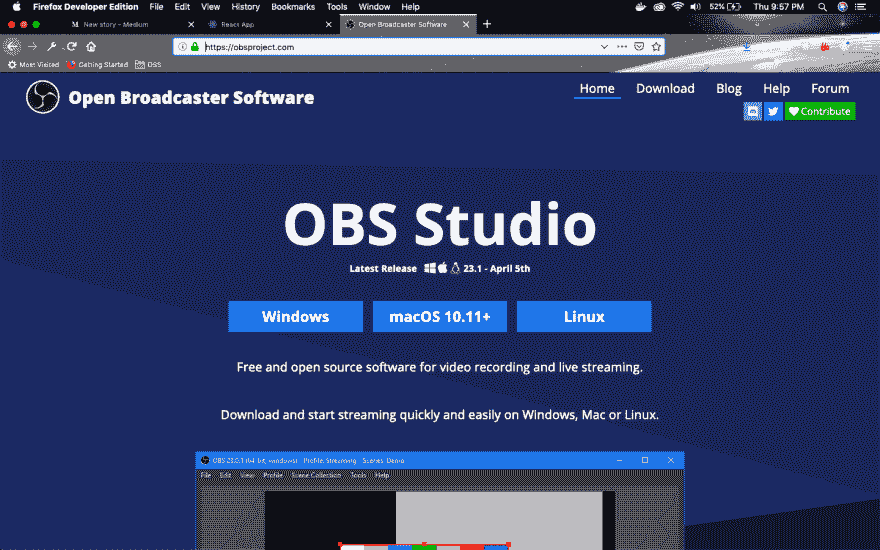](https://res.cloudinary.com/practicaldev/image/fetch/s--JjEmklPw--/c_limit%2Cf_auto%2Cfl_progressive%2Cq_auto%2Cw_880/https://cdn-images-1.medium.com/max/2880/1%2ANSR3RW3zytLDUHTf-goNfQ.png)*OBS*

接下来，在您的机器上打开 OBS 软件。

[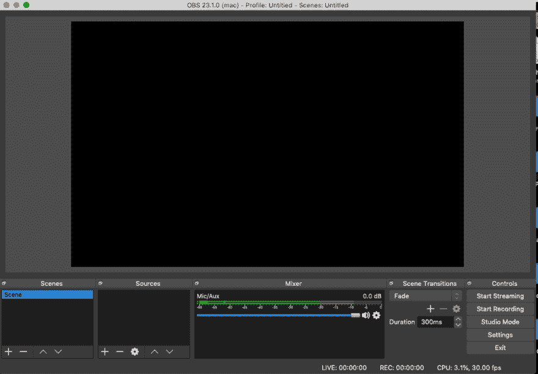](https://res.cloudinary.com/practicaldev/image/fetch/s--5gVL_dbb--/c_limit%2Cf_auto%2Cfl_progressive%2Cq_auto%2Cw_880/https://cdn-images-1.medium.com/max/2164/1%2Ay5CNblwG7oZA9dH9rvj0Vw.png)*OBS 软件*

现在，我们将开始安装 OBS 软件。在**场景**中点击右下角的“+”号。这将打开一个弹出窗口，在这里输入任何你喜欢的名字。

[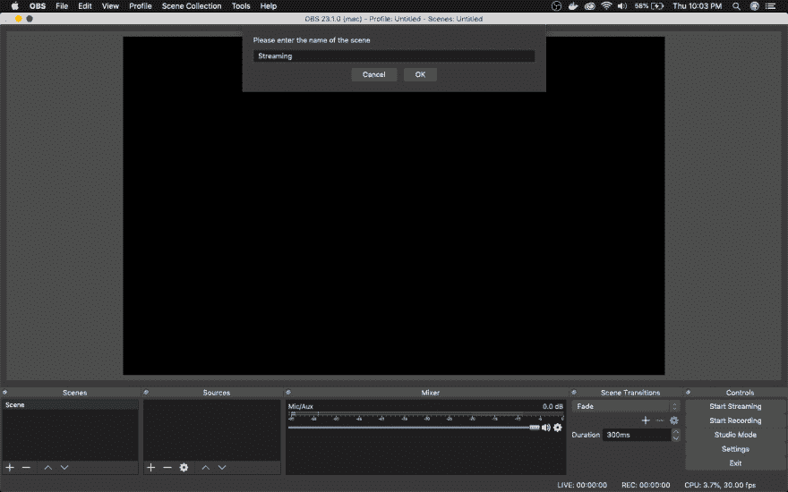 ](https://res.cloudinary.com/practicaldev/image/fetch/s--nUjhBcrB--/c_limit%2Cf_auto%2Cfl_progressive%2Cq_auto%2Cw_880/https://cdn-images-1.medium.com/max/2880/1%2AP2W59O1O465V67L4dVUYtQ.png) *场景名称*

接下来，点击**源**中的“+”。在这里点击**显示捕捉**

[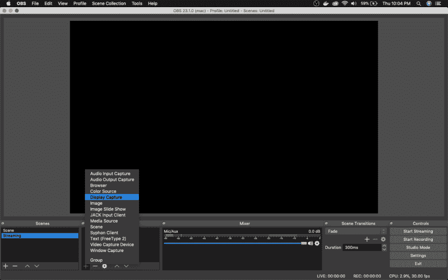 ](https://res.cloudinary.com/practicaldev/image/fetch/s--zdOC3Dmp--/c_limit%2Cf_auto%2Cfl_progressive%2Cq_auto%2Cw_880/https://cdn-images-1.medium.com/max/2880/1%2AhjAW_lvLaR5Jp6ugEI3QqA.png) *来源*

现在，它将打开一个弹出窗口。点击确定即可。

[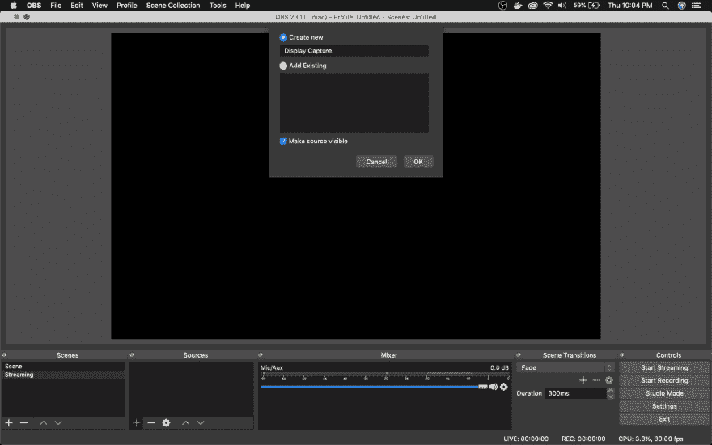 ](https://res.cloudinary.com/practicaldev/image/fetch/s--kgEGX3Zu--/c_limit%2Cf_auto%2Cfl_progressive%2Cq_auto%2Cw_880/https://cdn-images-1.medium.com/max/2880/1%2A0lwAYF16IaJ4lwBeIPwo8w.png) *点击确定*

接下来，将打开另一个弹出窗口。您可以在这里选择您想要捕获的监视器。

[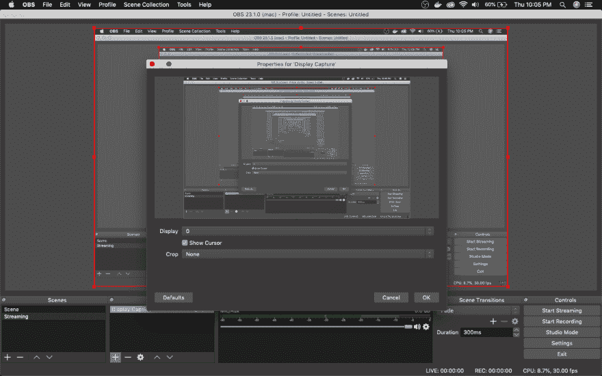 ](https://res.cloudinary.com/practicaldev/image/fetch/s--6HuN0l3N--/c_limit%2Cf_auto%2Cfl_progressive%2Cq_auto%2Cw_880/https://cdn-images-1.medium.com/max/2880/1%2AEoSEmc4pZY25ctgLUZQ1kA.png) *显示捕获弹出*

再次点击**信号源**中的“+”，然后点击**音频输入采集**。

[ ](https://res.cloudinary.com/practicaldev/image/fetch/s--QueY2WcL--/c_limit%2Cf_auto%2Cfl_progressive%2Cq_auto%2Cw_880/https://cdn-images-1.medium.com/max/2880/1%2AoRowmtmHI9DMofgV3m0cew.png) *音频输入捕捉*

现在，它将打开一个弹出窗口。点击确定即可。

[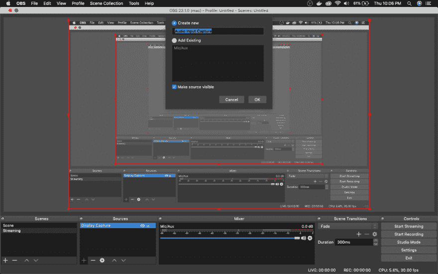 ](https://res.cloudinary.com/practicaldev/image/fetch/s--XM9c24R7--/c_limit%2Cf_auto%2Cfl_progressive%2Cq_auto%2Cw_880/https://cdn-images-1.medium.com/max/2880/1%2AUS3cL9-Z_vthKHP2NbFXeQ.png) *点击确定*

接下来，弹出你可以选择你的麦克风，你将用于记录。

[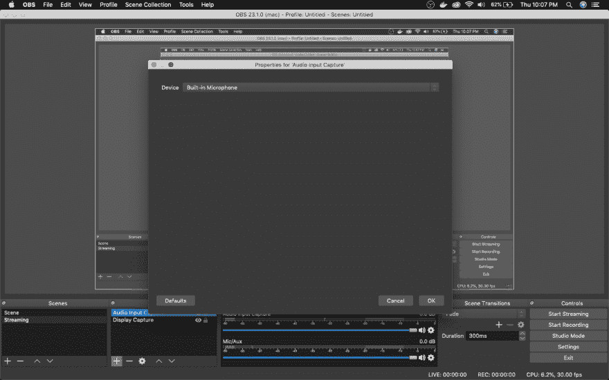 ](https://res.cloudinary.com/practicaldev/image/fetch/s--ljrhqW9Y--/c_limit%2Cf_auto%2Cfl_progressive%2Cq_auto%2Cw_880/https://cdn-images-1.medium.com/max/2880/1%2AmIG9fCmQK6zTwkyYbZRB7A.png) *用于录音的麦克风*

现在，该录音了。点击左下角的**开始录制**，录制画面和部分音频。现在，点击**停止录制**。现在，要知道 OBS 保存文件的位置，点击弹出窗口中的**设置**和**输出**。你会在这里得到**记录路径**。

[ ](https://res.cloudinary.com/practicaldev/image/fetch/s--4Ul0Wxlh--/c_limit%2Cf_auto%2Cfl_progressive%2Cq_auto%2Cw_880/https://cdn-images-1.medium.com/max/2880/1%2AlG6SkVN0T1ZPLC0PDb87ug.png) *录音路径*

现在，是时候创建我们的媒体播放器了。为此，我们将在我们的**客户端**文件夹中安装 **flv.js** 。因此，继续停止我们的 React 客户端并安装它。

[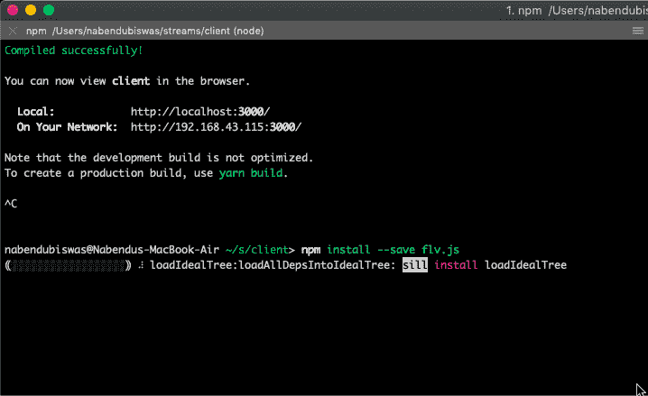](https://res.cloudinary.com/practicaldev/image/fetch/s--EvQxprSL--/c_limit%2Cf_auto%2Cfl_progressive%2Cq_auto%2Cw_880/https://cdn-images-1.medium.com/max/2000/1%2AUIKjESRzjMqQ9gZRrZBwaQ.png)T3】flv . js

不要忘记通过 npm start 启动我们的 react 客户端。接下来打开 **StreamShow.js** 文件，并添加逻辑以显示视频播放器，通过它将完成流。大部分代码是在**节点-媒体-服务器** github [页面](https://github.com/illuspas/Node-Media-Server)找到的样板文件。
我们使用 React 的 ref 系统，因为我们需要访问 fly.js 的 DOM 元素

```
 import React, { Component } from 'react';
    import { connect } from 'react-redux';
    import { fetchStream } from '../../actions';
    import flv from 'flv.js';

    class StreamShow extends Component {
      constructor(props) {
        super(props);
        this.videoRef = React.createRef();
      }

      componentDidMount() {
        const id = this.props.match.params.id;
        this.props.fetchStream(id);
        this.buildPlayer();
      }

      componentDidUpdate() {
        this.buildPlayer();
      }

      componentWillUnmount() {
        this.player.destroy();
      }

      buildPlayer() {
        if (this.player || !this.props.stream)
          return;

        const id = this.props.match.params.id;

        this.player = flv.createPlayer({
          type: 'flv',
          url: `http://localhost:8000/live/${id}.flv`
        });
        this.player.attachMediaElement(this.videoRef.current);
        this.player.load();

      }

      render() {
        if (!this.props.stream) {
          return <div>Loading...</div>
        }

        return (
          <div>
           <video ref={this.videoRef} style={{ width: '100%' }} controls={true} />
            <h1>{this.props.stream.title}</h1>
            <h5>{this.props.stream.description}</h5>
          </div>
        )
      }
    }

    const mapStateToProps = (state, ownProps) => {
      return { stream: state.streams[ownProps.match.params.id] }
    }

    export default connect(mapStateToProps, { fetchStream })(StreamShow); 
```

接下来，我们需要一个流的 id。因此，打开您创建的任何流，并记下 **id** 。

[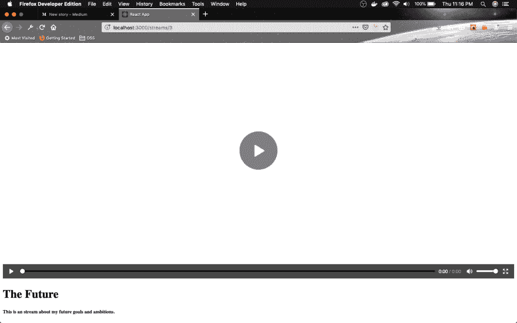 ](https://res.cloudinary.com/practicaldev/image/fetch/s--8W3TvV7C--/c_limit%2Cf_auto%2Cfl_progressive%2Cq_auto%2Cw_880/https://cdn-images-1.medium.com/max/2880/1%2AvCkBhQZEXTY_1sCYmETscA.png) *注意 id*

现在，我们项目的最后一步是在 OBS 软件中进行设置。点击弹出窗口中的**设置**和**流**。这里选择**服务**作为*自定义*，然后将**服务器**作为 *rtmp://localhost/live* ，将**流密钥**作为上一步的 *id* 。

[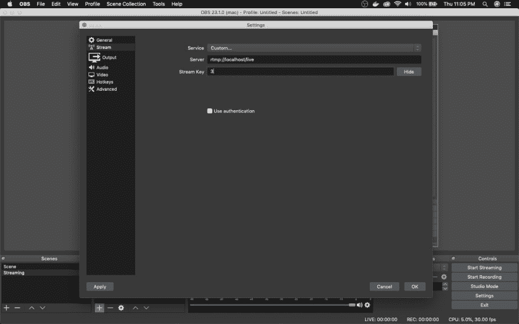](https://res.cloudinary.com/practicaldev/image/fetch/s--SEBfP8j9--/c_limit%2Cf_auto%2Cfl_progressive%2Cq_auto%2Cw_880/https://cdn-images-1.medium.com/max/2880/1%2A_eY0ERMf_DhVJZ8FKORh4g.png)T3】最后一步

现在，到了关键时刻的时候了。点击**开始流媒体**并返回 React 应用和该流媒体。无论你做什么，你都会看到和听到。可能会有 2-3 秒的延迟，但没关系。

[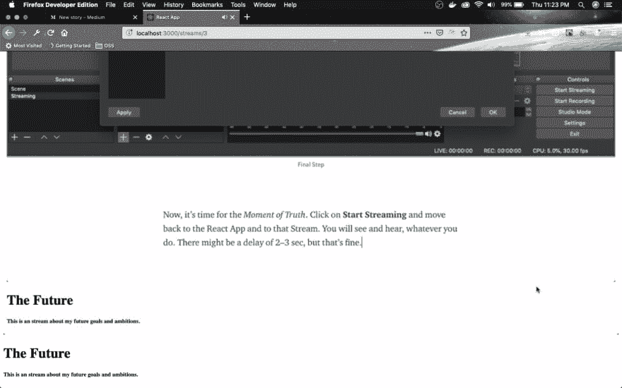 ](https://res.cloudinary.com/practicaldev/image/fetch/s--p8bJBP4k--/c_limit%2Cf_auto%2Cfl_progressive%2Cq_auto%2Cw_880/https://cdn-images-1.medium.com/max/2880/1%2Aw4-_Gz74W17EEK4MMGJP5w.png) *最终 App*

希望你喜欢和我一起建造抽动克隆体。再见，直到我的下一次冒险。

你可以在这里找到到这个点[的代码。](https://github.com/nabendu82/streams)