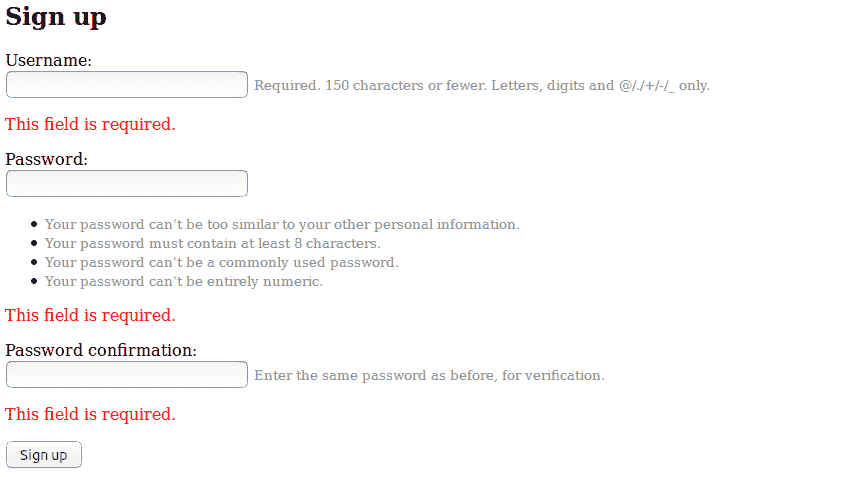
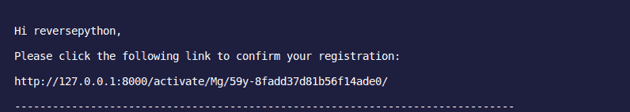
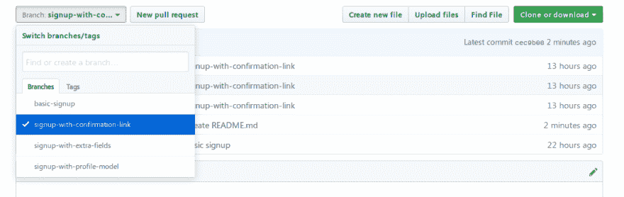

# 在 Django |逐步创建高级用户注册视图

> 原文：<https://dev.to/thepylot/create-advanced-user-sign-up-view-in-django-step-by-step-k9m>

通过[反转 Python](https://reversepython.net)

Youtube 频道有视频教程- [反向 Python Youtube](https://www.youtube.com/channel/UCEwYRHE5ZAOMfUaIpCQvjEQ)

你好 DEV 网络！

在本教程中，我们将介绍 Django 的高级用户注册视图。

首先，让我们建立基本的注册视图，然后我们将添加一些额外的领域和确认邮件功能，使其先进。

我假设您已经创建了您的 Django 项目。

#### 基本注册

Django 身份验证框架提供了一个名为 UserCreationForm 的表单(从 ModelForm 类继承而来)来处理新用户的创建。它有三个字段，即用户名、密码 1 和密码 2(用于密码确认)。

在您的 **views.py** 中:

```
from django.shortcuts import render
from django.contrib.auth import login, authenticate
from django.contrib.auth.forms import UserCreationForm
from django.shortcuts import render, redirect

def home_view(request):
    return render(request, 'home.html')

def signup_view(request):
    form = UserCreationForm(request.POST)
    if form.is_valid():
        form.save()
        username = form.cleaned_data.get('username')
        password = form.cleaned_data.get('password1')
        user = authenticate(username=username, password=password)
        login(request, user)
        return redirect('home')
    return render(request, 'signup.html', {'form': form}) 
```

Enter fullscreen mode Exit fullscreen mode

cleaned_data 保存经过验证的表单数据，authenticate()方法将凭据作为关键字参数，默认情况下是用户名和密码，根据每个身份验证后端检查它们，如果凭据对后端有效，则返回一个用户对象。

一旦验证了用户，login()方法就使用 Django 的会话框架，获取一个 HttpRequest 对象和一个 user 对象，并将用户的 ID 保存在会话中。最后，redirect()方法基本上将登录用户重定向到主 URL。

**urls.py**

```
from django.contrib import admin
from django.urls import path
from accounts.views import home_view, signup_view

urlpatterns = [
    path('admin/', admin.site.urls),
    path('', home_view, name="home"),
    path('signup/', signup_view, name="signup")
] 
```

Enter fullscreen mode Exit fullscreen mode

基本注册的最后一步，在您的**signup.html**模板中:

```
<h2>Sign up Form</h2>
<form method="post">
  
  
    <p>
      {{ field.label_tag }}<br>
      {{ field }}
      
        <small style="color: grey">{{ field.help_text }}</small>
      
      
        <p style="color: red">{{ error }}</p>
      
    </p>
  
  <button type="submit">Sign up</button>
</form> 
```

Enter fullscreen mode Exit fullscreen mode

为了避免错误，我们在表单中显示了每个字段的帮助文本。如果注册时出现任何错误，最好向用户显示是什么导致了这些错误。

[](https://res.cloudinary.com/practicaldev/image/fetch/s--dQ1t2QPO--/c_limit%2Cf_auto%2Cfl_progressive%2Cq_auto%2Cw_880/https://thepracticaldev.s3.amazonaws.com/i/a8raq15wolv3phzxdqok.png)

#### 用额外字段注册

如果我们想用电子邮件或用户名注册用户呢？因此，创建 **forms.py** 并扩展 UserCreationForm。

```
from django import forms
from django.contrib.auth.models import User
from django.contrib.auth.forms import UserCreationForm

class SignUpForm(UserCreationForm):
    username = forms.CharField(max_length=30)
    email = forms.EmailField(max_length=200)

    class Meta:
        model = User
        fields = ('username', 'email', 'password1', 'password2', ) 
```

Enter fullscreen mode Exit fullscreen mode

然后，只需在 **views.py** 中将 UserCreationForm 改为 SignUpForm:

```
from django.shortcuts import render
from django.contrib.auth import login, authenticate
from .forms import SignUpForm
from django.shortcuts import render, redirect

def home_view(request):
    return render(request, 'home.html')

def signup_view(request):
    form = SignUpForm(request.POST)
    if form.is_valid():
        form.save()
        username = form.cleaned_data.get('username')
        password = form.cleaned_data.get('password1')
        user = authenticate(username=username, password=password)
        login(request, user)
        return redirect('home')
    else:
        form = SignUpForm()
    return render(request, 'signup.html', {'form': form}) 
```

Enter fullscreen mode Exit fullscreen mode

就是这样！现在，用户可以通过他/她的用户名和电子邮件注册。

#### 向简档模型注册

在我看来，这是在您的 Django 应用程序中实现注册系统的最好和推荐的方法。我们将使用 **Django 信号**在用户注册后立即创建一个用户配置文件。所以，来看看 **models.py**

```
from django.db import models
from django.contrib.auth.models import User
from django.db.models.signals import post_save
from django.dispatch import receiver

class Profile(models.Model):
    user = models.OneToOneField(User, on_delete=models.CASCADE)
    first_name = models.CharField(max_length=100, blank=True)
    last_name = models.CharField(max_length=100, blank=True)
    email = models.EmailField(max_length=150)
    bio = models.TextField()

    def __str__(self):
        return self.user.username

@receiver(post_save, sender=User)
def update_profile_signal(sender, instance, created, **kwargs):
    if created:
        Profile.objects.create(user=instance)
    instance.profile.save() 
```

Enter fullscreen mode Exit fullscreen mode

使用@receiver 装饰器，我们可以将信号与函数联系起来。因此，每次用户模型实例结束运行其 save()方法时(或者当用户注册结束时)，update_profile_signal 将在用户保存后立即开始工作。

*   **发送方** -模型类。
*   **实例** -正在保存的实际实例。
*   **创建了** -一个布尔型；如果创建了新记录，则为 True。

嗯，我们想从用户输入他/她的信息到上面的额外字段来完成注册。让我们更新一下 **forms.py** :

```
from django import forms
from django.contrib.auth.forms import UserCreationForm
from django.contrib.auth.models import User

class SignUpForm(UserCreationForm):
    first_name = forms.CharField(max_length=100, help_text='Last Name')
    last_name = forms.CharField(max_length=100, help_text='Last Name')
    email = forms.EmailField(max_length=150, help_text='Email')

    class Meta:
        model = User
        fields = ('username', 'first_name', 'last_name',
'email', 'password1', 'password2',) 
```

Enter fullscreen mode Exit fullscreen mode

并且在 **views.py** 中:

```
from django.shortcuts import render
from django.contrib.auth import login, authenticate
from .forms import SignUpForm
from django.shortcuts import render, redirect

def home_view(request):
    return render(request, 'home.html')

def signup_view(request):
    form = SignUpForm(request.POST)
    if form.is_valid():
        user = form.save()
        user.refresh_from_db()
        user.profile.first_name = form.cleaned_data.get('first_name')
        user.profile.last_name = form.cleaned_data.get('last_name')
        user.profile.email = form.cleaned_data.get('email')
        user.save()
        username = form.cleaned_data.get('username')
        password = form.cleaned_data.get('password1')
        user = authenticate(username=username, password=password)
        login(request, user)
        return redirect('home')
    else:
        form = SignUpForm()
    return render(request, 'signup.html', {'form': form}) 
```

Enter fullscreen mode Exit fullscreen mode

我们使用 refresh_from_db()方法来处理同步问题，基本上是在信号之后重新加载数据库，因此通过这种方法我们的概要文件实例将被加载。一旦加载了概要文件实例，就将清除的数据设置到字段中，并保存用户模型。

#### 用确认邮件注册

在此阶段，我们将配置电子邮件后端来发送确认链接。在本教程中，让我们在控制台上测试它。

将以下行添加到您的 **settings.py** 中:

```
EMAIL_BACKEND = 'django.core.mail.backends.console.EmailBackend' 
```

Enter fullscreen mode Exit fullscreen mode

然后，通过添加确认检查字段来更新 **models.py** 。

```
from django.db import models
from django.contrib.auth.models import User
from django.db.models.signals import post_save
from django.dispatch import receiver

class Profile(models.Model):
    user = models.OneToOneField(User, on_delete=models.CASCADE)
    first_name = models.CharField(max_length=100, blank=True)
    last_name = models.CharField(max_length=100, blank=True)
    email = models.EmailField(max_length=150)
    signup_confirmation = models.BooleanField(default=False)

    def __str__(self):
        return self.user.username

@receiver(post_save, sender=User)
def update_profile_signal(sender, instance, created, **kwargs):
    if created:
        Profile.objects.create(user=instance)
    instance.profile.save() 
```

Enter fullscreen mode Exit fullscreen mode

现在，让我们创建一个名为 **tokens.py** 的新模块

```
from django.contrib.auth.tokens import PasswordResetTokenGenerator
from django.utils import six

class AccountActivationTokenGenerator(PasswordResetTokenGenerator):
    def _make_hash_value(self, user, timestamp):
        return (
            six.text_type(user.pk) + six.text_type(timestamp) +
            six.text_type(user.profile.signup_confirmation)
        )

account_activation_token = AccountActivationTokenGenerator() 
```

Enter fullscreen mode Exit fullscreen mode

PasswordResetTokenGenerator 正在生成一个令牌，但没有将其保存在数据库中，因此，我们对其进行了扩展，以创建一个唯一的令牌生成器来确认注册或电子邮件地址。这利用了您项目的 SECRET_KEY，因此是一种安全可靠的方法。

一旦用户点击了链接，它将不再有效。PASSWORD_RESET_TIMEOUT_DAYS 的默认值是 7 天，但是您可以在 settings.py 中更改它的值。

下面是 **forms.py** :

```
from django import forms
from django.contrib.auth.forms import UserCreationForm
from django.contrib.auth.models import User

class SignUpForm(UserCreationForm):
    first_name = forms.CharField(max_length=100, help_text='Last Name')
    last_name = forms.CharField(max_length=100, help_text='Last Name')
    email = forms.EmailField(max_length=150, help_text='Email')

    class Meta:
        model = User
        fields = ('username', 'first_name', 'last_name', 'email', 'password1', 'password2', ) 
```

Enter fullscreen mode Exit fullscreen mode

在 **views.py** 中，我们将不再验证用户，而是发送激活链接。

**views.py**

```
def signup_view(request):
    if request.method  == 'POST':
        form = SignUpForm(request.POST)
        if form.is_valid():
            user = form.save()
            user.refresh_from_db()
            user.profile.first_name = form.cleaned_data.get('first_name')
            user.profile.last_name = form.cleaned_data.get('last_name')
            user.profile.email = form.cleaned_data.get('email')
            # user can't login until link confirmed
            user.is_active = False
            user.save()
            current_site = get_current_site(request)
            subject = 'Please Activate Your Account'
            # load a template like get_template() 
            # and calls its render() method immediately.
            message = render_to_string('activation_request.html', {
                'user': user,
                'domain': current_site.domain,
                'uid': urlsafe_base64_encode(force_bytes(user.pk)),
                # method will generate a hash value with user related data
                'token': account_activation_token.make_token(user),
            })
            user.email_user(subject, message)
            return redirect('activation_sent')
    else:
        form = SignUpForm()
    return render(request, 'signup.html', {'form': form}) 
```

Enter fullscreen mode Exit fullscreen mode

因此，基本上我们是用用户相关数据生成激活 url 并发送它。注意，我们设置 user.is_active = False，这意味着用户在确认注册之前不能登录。

现在，创建 **activation_request.html** 模板，该模板将要求用户确认链接(这将显示在您的控制台中)。

```

Hi {{ user.username }},

Please click the following link to confirm your registration:

http://{{ domain }}
 
```

Enter fullscreen mode Exit fullscreen mode

检查您的控制台:

[](https://res.cloudinary.com/practicaldev/image/fetch/s--ICU_6H6_--/c_limit%2Cf_auto%2Cfl_progressive%2Cq_auto%2Cw_880/https://thepracticaldev.s3.amazonaws.com/i/f0zlo8tw0un5v2b9nx6d.png)

再创建一个名为 **activation_sent.html** 的模板。这将通知用户检查他/她的邮件以确认注册

```
<h3>Activation link sent! Please check your console or mail.</h3> 
```

Enter fullscreen mode Exit fullscreen mode

当用户点击链接时，我们必须检查用户是否存在以及令牌是否有效。

```
def activate(request, uidb64, token):
    try:
        uid = force_text(urlsafe_base64_decode(uidb64))
        user = User.objects.get(pk=uid)
    except (TypeError, ValueError, OverflowError, User.DoesNotExist):
        user = None
    # checking if the user exists, if the token is valid.
    if user is not None and account_activation_token.check_token(user, token):
        # if valid set active true 
        user.is_active = True
        # set signup_confirmation true
        user.profile.signup_confirmation = True
        user.save()
        login(request, user)
        return redirect('home')
    else:
        return render(request, 'activation_invalid.html') 
```

Enter fullscreen mode Exit fullscreen mode

一旦注册被确认，用户成为活跃的，并能够登录。

**views.py** 的完整代码:

```
from django.contrib.auth import login, authenticate
from django.shortcuts import render, redirect, get_object_or_404, HttpResponseRedirect
from django.contrib.sites.shortcuts import get_current_site
from django.utils.encoding import force_text
from django.contrib.auth.models import User
from django.db import IntegrityError
from django.utils.http import urlsafe_base64_decode
from django.utils.encoding import force_bytes
from django.utils.http import urlsafe_base64_encode
from .tokens import account_activation_token
from django.template.loader import render_to_string

from .forms import SignUpForm
from .tokens import account_activation_token

def home_view(request):
    return render(request, 'home.html')

def activation_sent_view(request):
    return render(request, 'activation_sent.html')

def activate(request, uidb64, token):
    try:
        uid = force_text(urlsafe_base64_decode(uidb64))
        user = User.objects.get(pk=uid)
    except (TypeError, ValueError, OverflowError, User.DoesNotExist):
        user = None
    # checking if the user exists, if the token is valid.
    if user is not None and account_activation_token.check_token(user, token):
        # if valid set active true 
        user.is_active = True
        # set signup_confirmation true
        user.profile.signup_confirmation = True
        user.save()
        login(request, user)
        return redirect('home')
    else:
        return render(request, 'activation_invalid.html')

def signup_view(request):
    if request.method  == 'POST':
        form = SignUpForm(request.POST)
        if form.is_valid():
            user = form.save()
            user.refresh_from_db()
            user.profile.first_name = form.cleaned_data.get('first_name')
            user.profile.last_name = form.cleaned_data.get('last_name')
            user.profile.email = form.cleaned_data.get('email')
            # user can't login until link confirmed
            user.is_active = False
            user.save()
            current_site = get_current_site(request)
            subject = 'Please Activate Your Account'
            # load a template like get_template() 
            # and calls its render() method immediately.
            message = render_to_string('activation_request.html', {
                'user': user,
                'domain': current_site.domain,
                'uid': urlsafe_base64_encode(force_bytes(user.pk)),
                # method will generate a hash value with user related data
                'token': account_activation_token.make_token(user),
            })
            user.email_user(subject, message)
            return redirect('activation_sent')
    else:
        form = SignUpForm()
    return render(request, 'signup.html', {'form': form}) 
```

Enter fullscreen mode Exit fullscreen mode

最后，让我们配置我们的 **urls.py** :

```
from django.contrib import admin
from django.urls import path
from django.conf.urls import url
from accounts.views import home_view, signup_view, activation_sent_view, activate

urlpatterns = [
    path('admin/', admin.site.urls),
    path('', home_view, name="home"),
    path('signup/', signup_view, name="signup"),
    path('sent/', activation_sent_view, name="activation_sent"),
    path('activate/<slug:uidb64>/<slug:token>/', activate, name='activate'),
] 
```

Enter fullscreen mode Exit fullscreen mode

我在 GitHub 中推送了所有这些项目，你可以通过选择正确的分支来克隆你想要的项目。

[](https://res.cloudinary.com/practicaldev/image/fetch/s--HGAmSYvt--/c_limit%2Cf_auto%2Cfl_progressive%2Cq_auto%2Cw_880/https://thepracticaldev.s3.amazonaws.com/i/rm9y8zon2tympq8veqws.png)T3】

## [the pylot](https://github.com/thepylot)/[django-高级-注册-教程](https://github.com/thepylot/django-advanced-signup-tutorial)

### 在 Django |逐步创建高级用户注册视图

<article class="markdown-body entry-content container-lg" itemprop="text">

# django-高级-注册-教程

在 Django |逐步创建高级用户注册视图

## 入门指南

本教程适用于 **Python 3+** 和 Django 2+。

通过选择右分支克隆项目，并运行以下命令:

```
python3 manage.py makemigrations accounts
python3 manage.py migrate
python3 manage.py runserver 
```

</article>

[View on GitHub](https://github.com/thepylot/django-advanced-signup-tutorial)

太好了！在本教程中，我们使用控制台来检查我们的链接，但您可以配置一个生产质量的电子邮件服务来发送实际的确认邮件。我的下一个教程将涉及这个主题，所以请确保你在社交媒体上关注我，并查看 [Reverse Python](https://reversepython.net) 以获得更多类似的文章。

[Instagram](https://www.instagram.com/coderasha/?hl=en)
[推特](https://twitter.com/coderasha?lang=en)