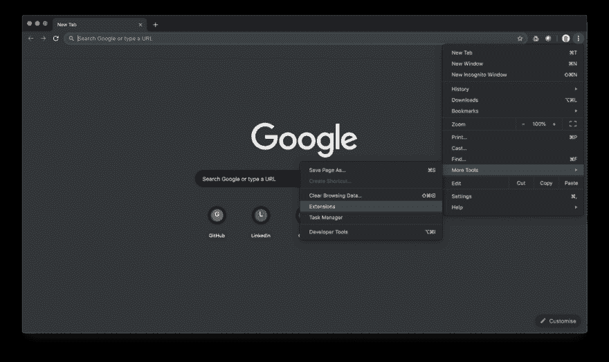
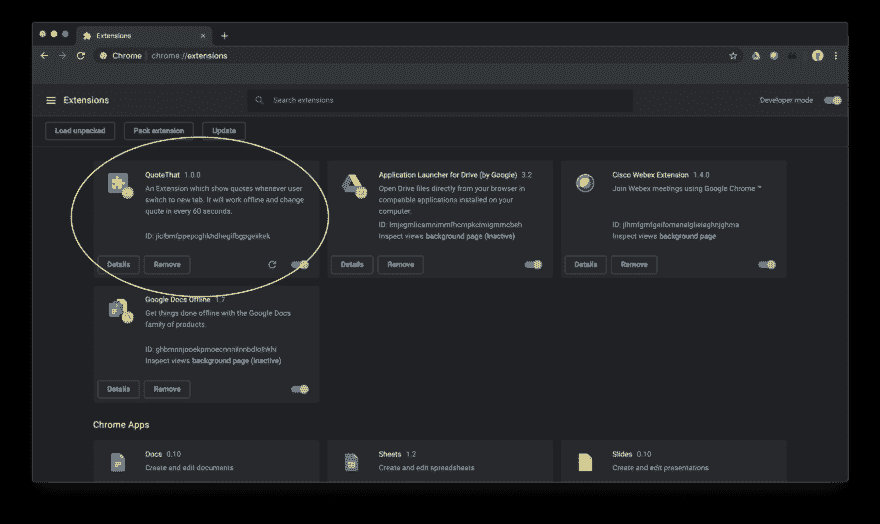
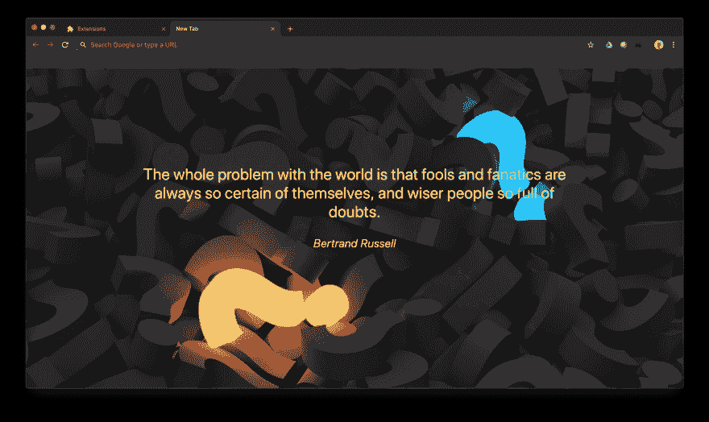
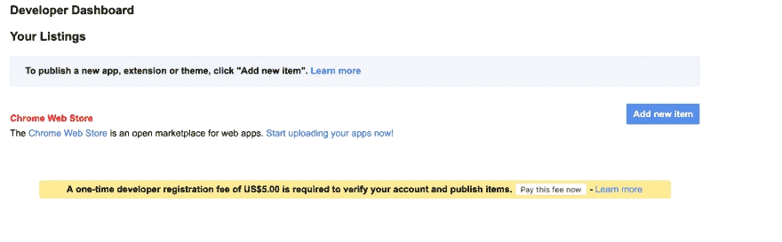

# 创建和发布你的第一个 Chrome 扩展只需 5 个步骤。

> 原文：<https://dev.to/sahilrajput/create-and-publish-your-first-chrome-extension-in-just-5-steps-3c3n>

#### 什么是 Chrome 扩展？

> 扩展是定制浏览体验的小软件程序。它们使用户能够根据个人需求或偏好定制 Chrome 的功能和行为。它们建立在 HTML、JavaScript 和 CSS 等 web 技术之上。— [Chrome 开发者](https://developer.chrome.com/extensions)

#### 入门

在直接深入开发部分之前。先退一步想想 ***你要创造什么？*T3】**

今天，我们正在创建一个扩展，每当用户切换到新标签时，它将显示新的报价。

#### 第一步:告诉 Chrome 你的扩展

我们必须创建一个 JSON 格式的清单文件，其中包含您的扩展的详细信息，如扩展的名称、描述等。

对于这个扩展，我们需要类似于 **activeTab 的权限。**

打开一个文件名**manifest . JSON**T2】

```
{    
  "manifest_version": 2,

  "name": "QuoteThat",    
  "description": "An Extension which show quotes whenever user switch to new tab. It will work offline and change quote in every 60 seconds.",    
  "version": "1.0.0",    
  "chrome_url_overrides" : {  
    "newtab": "newtab.html"    
  },  
  "browser_action":{      
    "default_icon": "icon.png"    
  },  
  "permissions": ["activeTab"]  
} 
```

正如你在" *newtab* "中看到的，我们想要 _ newtab.html _ 每当用户切换到新标签时，它都会呈现。

#### 步骤二:制作 HTML 文件

打开**newtab.html**T2】

```
<!DOCTYPE html>  
<html>  
<head>  
  New Tab  
</head>  
<body>  
  <blockquote>  
    <center>  
      <p id="quote"></p>  
      <footer>   
        <cite id="author"></cite>  
      </footer>  
    </center>  
  </blockquote>  
</body>  
</html> 
```

添加一些 **CSS** 让你的页面变得漂亮。

```
<style>  
    body   
    {  
      background-image: url("back.jpg");   
      -webkit-background-size: cover;  
      -moz-background-size: cover;  
      -o-background-size: cover;  
      background-size: cover;  
      position: absolute;  
      width: 70%;  
      top: 25%;  
      left: 0;  
      right: 0;  
      margin: auto;  
    }  
    p   
    {  
     font-size:35px;  
     color: white;  
    }  
    cite   
    {  
      font-size:25px;  
      color: yellow;  
    }  
</style> 
```

所以，你的**newtab.html**将看起来像这样

```
<!DOCTYPE html>  
<html>  
<head>  
  New Tab  
  <style>  
    body   
    {  
      background-image: url("back.jpg");   
      -webkit-background-size: cover;  
      -moz-background-size: cover;  
      -o-background-size: cover;  
      background-size: cover;  
      position: absolute;  
      width: 70%;  
      top: 25%;  
      left: 0;  
      right: 0;  
      margin: auto;  
    }  
    p   
    {  
     font-size:35px;  
     color: white;  
    }  
    cite   
    {  
      font-size:25px;  
      color: yellow;  
    }  
  </style>  
</head>  
<body>  
  <blockquote>  
    <center>  
      <p id="quote"></p>  
      <footer>   
        <cite id="author"></cite>  
      </footer>  
    </center>  
  </blockquote>  
  <script src="jquery.min.js"></script>  
  <script src="javascript.js"></script>  
</body>  
</html> 
```

现在，如你所见，我们添加了一个 Javascript 文件，但在此之前，让我们看看一个 JSON 文件，其中包含将在新选项卡中显示的报价。

**quotes.json**

```
[  
 [  
  "William James",  
  " Act as if what you do makes a difference. It does."  
 ],  
 [  
  "Bill Cosby",  
  " Decide that you want it more than you are afraid of it."  
 ],  
 [  
  "Judy Collins",  
  " I think people who are creative are the luckiest people on earth. I know that there are no shortcuts, but you must keep your faith in something Greater than You, and keep doing what you love. Do what you love, and you will find the way to get it out to the world."  
 ],  
 [  
  "Jessica Savitch",  
  " No matter how many goals you have achieved, you must set your sights on a higher one."  
 ], 
```

因此，我们可以看到，在 json 文件中，我们有一个作者和一个引用。因此，我们将显示引文及其作者。

现在，让我们编写 **javascript.js**

```
function Quote(callback)   
{  
  $.getJSON('quotes.json',function(data)   
  {  
    var rN=Math.round(Math.random()*(data.length-1));  
    var author=data[rN][0];  
    var quote=data[rN][1];  
    callback(quote,author);  
  });  
};  
function changeQuote()   
{  
  callback=function(quote, author)   
  {  
    $("p#quote,cite#author").fadeOut(function()   
    {  
      $("p#quote").text(quote).fadeIn(function()   
      {  
        $("cite#author").text(author).fadeIn();  
      });  
    });  
  };  
  Quote(callback);  
};  
$(window).load(function()   
{  
  changeQuote();  
  setInterval(changeQuote,60000);  
}); 
```

**函数 Quote()** 将从 quote.json 文件中随机选择数据，并使用 Quote 及其作者进行回调。

函数 changeQuote() 无论何时被调用都会改变报价。$(窗口)。load(function(){})会在每个时间间隔调用 changeQuote()。

#### 第三步:查看您的扩展工作

进入谷歌 Chrome ->右上角(三个点)->更多工具->扩展。

[](https://res.cloudinary.com/practicaldev/image/fetch/s--NFsL4a7Z--/c_limit%2Cf_auto%2Cfl_progressive%2Cq_auto%2Cw_880/https://cdn-images-1.medium.com/max/1600/1%2AVLEGpYn8xJ5oh0wsD3cmjg.png)

之后，打开**开发者选项**，点击* *加载解包* *

[](https://res.cloudinary.com/practicaldev/image/fetch/s--IDp98Qnn--/c_limit%2Cf_auto%2Cfl_progressive%2Cq_auto%2Cw_880/https://cdn-images-1.medium.com/max/1600/1%2Ay1e4QBKqCmU7f0I6nRxUPg.png)

你会看到你的扩展

[](https://res.cloudinary.com/practicaldev/image/fetch/s--kR6bAkl6--/c_limit%2Cf_auto%2Cfl_progressive%2Cq_auto%2Cw_880/https://cdn-images-1.medium.com/max/1600/1%2A5wr_mS4YQMlcN8BLv9ijwQ.png)

现在，打开一个新标签，看看你的扩展是否工作

[](https://res.cloudinary.com/practicaldev/image/fetch/s--MmGE_8AB--/c_limit%2Cf_auto%2Cfl_progressive%2Cq_auto%2Cw_880/https://cdn-images-1.medium.com/max/1600/1%2AgUbYcPAzJLhkhfZgCTj2XQ.png)

**第五步:发布**

转到此[链接](https://chrome.google.com/webstore/developer/dashboard?pli=1)，使用您的 gmail 帐户登录，然后点击**添加新项目**

[](https://res.cloudinary.com/practicaldev/image/fetch/s--Xg8Jl1ko--/c_limit%2Cf_auto%2Cfl_progressive%2Cq_auto%2Cw_880/https://cdn-images-1.medium.com/max/1600/1%2APjR9VGSSBPw01K34C_tWcA.png)

注意:*您必须支付 5 美元来验证您的帐户*

上传文件后，您将看到一个表单，您需要在其中添加关于您的扩展名的信息、添加图标、详细描述等等。在 Chrome 网上商店上看到你的扩展。

你可以在 Github 上看到完整的代码