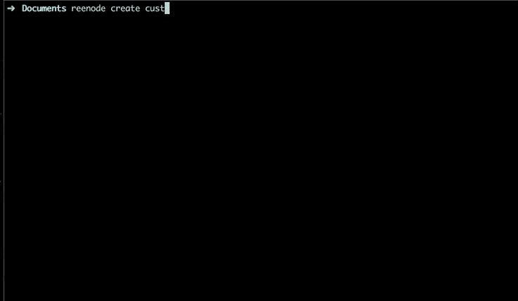

# 使用 reenode 创建全栈样板文件。

> 原文：<https://dev.to/am_pra_veen/create-full-stack-boilerplate-using-reenode-33i9>

## 创建 fullstack 样板文件的问题:

为全栈应用创建一个初学者工具包需要大量的工作，有时会令人头疼。starter 项目初始化中的一个小错误可能会破坏您的整个代码，然后您会看到一大堆控制台错误。

当我学习创建全栈应用程序时，每次我根据 sketch 编写应用程序，并一次又一次地重复大量代码，这有时会让我感到头疼，如果我在应用程序的设置中做错了什么，我的整个应用程序都会中断。

犯错误可能是一个原因，但主要原因是它非常耗时，就像每次你需要安装软件包，配置 webpack，babel，eslint，prettier 等，有时这让我恶心。然后，我创建了一些样板文件，如 [simple-react-boilerplate](https://github.com/praveen-me/simple-react-boilerplate) 、[MERN-样板文件](https://github.com/praveen-me/MERN-boilerplate)、 [react-redux-ssr](https://github.com/praveen-me/react-redux-ssr) ，当我需要创建一个项目时，我只需克隆这个库并开始工作。
但问题仍然是，每个目的都有不同的存储库，即有时我不需要 node，但有时我需要。

因此，这就是我创建`reenode`的原因，它是一个 CLI，用于生成样板文件，并提供所有必要的最小配置来编写全栈应用程序。

## 实际上`reenode`是什么？

`reenode`是一个简单的 CLI，可为全栈应用程序生成起始代码，而不会像您从头开始编写时那样痛苦。`reenode`也有创建不同样板文件的定制选项。最好的部分是它节省时间，你的启动代码将在几分钟内准备好。

## 怎么用？

首先你需要通过键入:

`npm install -g reenode`或`yarn add global reenode`来全局安装它。

就这么简单。😃

**重新节点**提供`create`命令创建项目。为此你只需要运行:

```
reenode create project-name 
```

之后，终端提示会询问一些问题:
[](https://res.cloudinary.com/practicaldev/image/fetch/s--dYYssnaI--/c_limit%2Cf_auto%2Cfl_progressive%2Cq_66%2Cw_880/https://praveen-me.github.io/reenode-b24111efa3e9d9a9791a2165834c4e0b.gif)

这就是你需要做的。🚀

通过`reenode --version`可以获得键入`reenode --help`和 CLI 版本的帮助。

从这里查看 reenode 的全部文档:

https://www.npmjs.com/package/reenode 链接:

Github 链接:[https://github.com/praveen-me/reenode](https://github.com/praveen-me/reenode)

**请求**:如果您觉得使用它有问题，请在这里评论，或者您可以在**re node 的** GitHub repo 添加问题。

* * *

在 [Twitter](https://twitter.com/am_pra_veen) 和 [Github](https://github.com/praveen-me) 关注我。