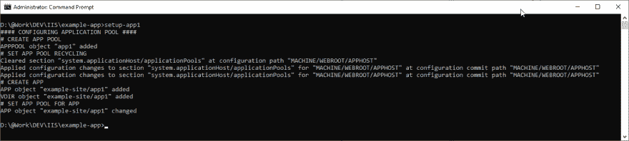
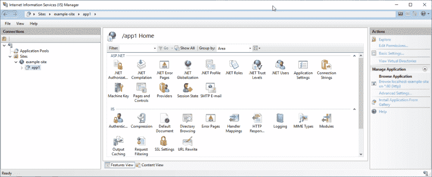
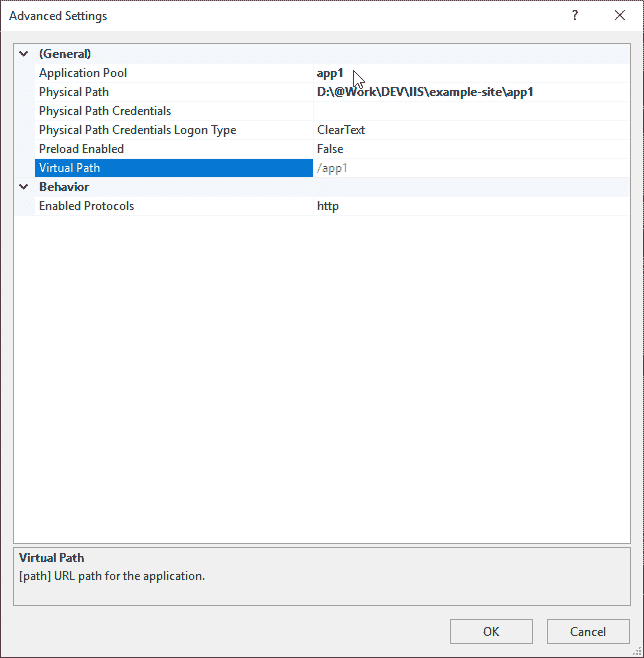
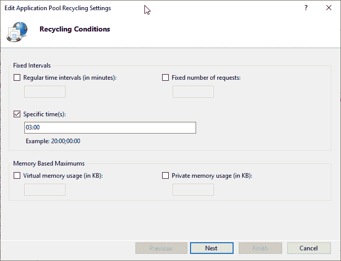

# 通过命令行创建 IIS 应用程序池和应用程序

> 原文：<https://dev.to/mirogrenda/create-iis-application-pool-and-application-via-command-line-i73>

假设您有一个现有的 IIS 站点，并想向其中添加一个应用程序。通常，您打开 Internet 信息服务(IIS)管理器，并在那里使用上下文菜单进行操作。

但是现在假设——在我的例子中也是如此——您有多台服务器托管同一个站点(在一个负载平衡器后面)。取决于服务器的数量，这将需要一段时间，并不真正令人兴奋，而且可能容易出错。

我认为应该有一个更好的解决方案——是的，确实有一个，管理 IIS 的命令行工具——参见[https://docs . Microsoft . com/en-us/IIS/get-started/getting-started-with-IIS/getting-started-with-appcmdexe](https://docs.microsoft.com/en-us/iis/get-started/getting-started-with-iis/getting-started-with-appcmdexe)

所以我创建了一个批处理文件(。bat)，它创建一个应用程序池，设置回收选项，在现有站点内创建一个应用程序，然后在新应用程序上设置应用程序池:

```
@ECHO OFF

ECHO # CREATE APP POOL
%systemroot%\system32\inetsrv\appcmd add apppool /name:app1 /managedRuntimeVersion:"v4.0" /managedPipelineMode:"Integrated"

ECHO # SET APP POOL RECYCLING
%systemroot%\system32\inetsrv\appcmd clear config -section:system.applicationHost/applicationPools /[name='app1'].recycling.periodicRestart.schedule 
%systemroot%\system32\inetsrv\appcmd set config -section:system.applicationHost/applicationPools /+[name='app1'].recycling.periodicRestart.schedule.[@0,value='03:00:00'] /commit:apphost
%systemroot%\system32\inetsrv\appcmd set config -section:system.applicationHost/applicationPools /[name='app1'].recycling.periodicRestart.time:00:00:00 /commit:apphost

ECHO # CREATE APP
MD D:\@Work\DEV\IIS\example-site\app1
%systemroot%\system32\inetsrv\appcmd add app /site.name:example-site /path:/app1 /physicalPath:D:\@Work\DEV\IIS\example-site\app1

ECHO # SET APP POOL FOR APP
%systemroot%\system32\inetsrv\appcmd set app "example-site/app1" /applicationPool:app1 
```

我运行它——并通过 IIS 管理器检查结果——正如预期的那样，一切都设置正确。以下是截图:

[](https://res.cloudinary.com/practicaldev/image/fetch/s--txk7VoXH--/c_limit%2Cf_auto%2Cfl_progressive%2Cq_auto%2Cw_880/https://thepracticaldev.s3.amazonaws.com/i/v9sxy7rnb58ufal22pu1.png)
[](https://res.cloudinary.com/practicaldev/image/fetch/s--SQQtMcSH--/c_limit%2Cf_auto%2Cfl_progressive%2Cq_auto%2Cw_880/https://thepracticaldev.s3.amazonaws.com/i/zfbep69xcnucg1k5gim1.png)
[](https://res.cloudinary.com/practicaldev/image/fetch/s--qSz41Bzl--/c_limit%2Cf_auto%2Cfl_progressive%2Cq_auto%2Cw_880/https://thepracticaldev.s3.amazonaws.com/i/77143vxvv28ktyfhispr.png)
[](https://res.cloudinary.com/practicaldev/image/fetch/s--D3TwbQQM--/c_limit%2Cf_auto%2Cfl_progressive%2Cq_auto%2Cw_880/https://thepracticaldev.s3.amazonaws.com/i/5ahvz4oe6tenze12ne46.png)