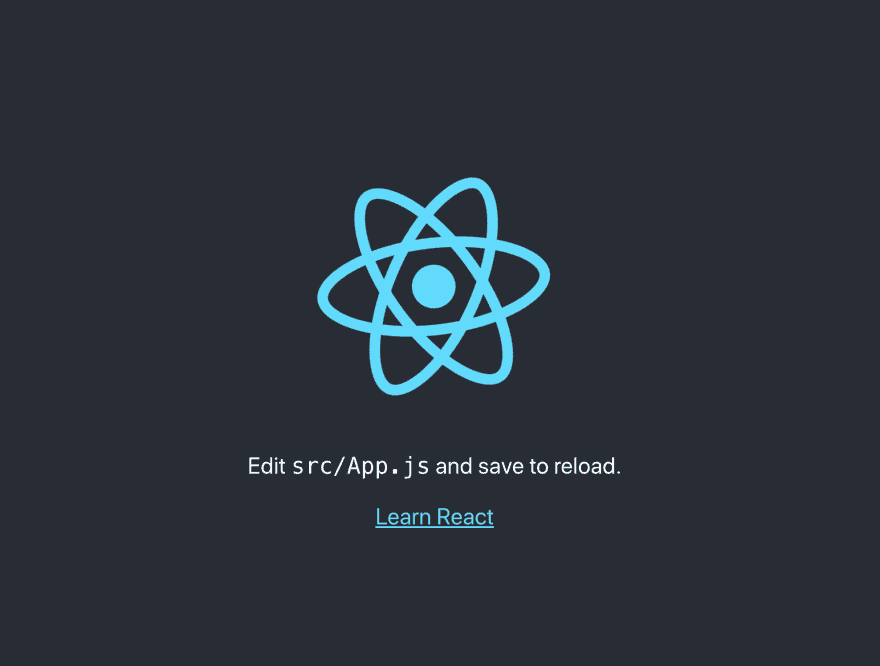
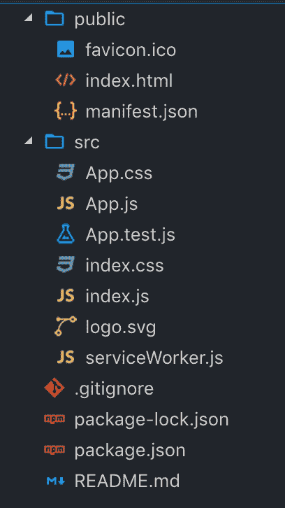
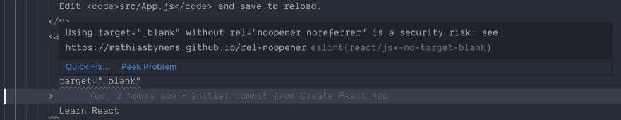
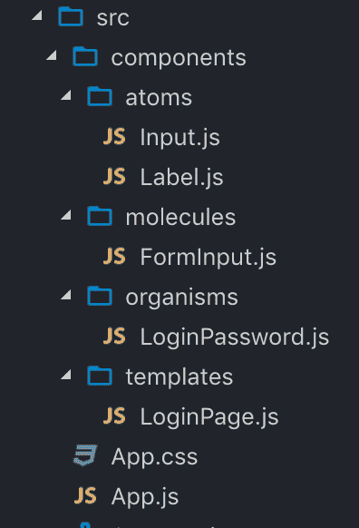

# 用 VS 代码创建-反应-应用

> 原文：<https://dev.to/tducasse/create-react-app-with-vs-code-22j8>

*使用 create-react-app 和 VS 代码建立一个基本的 React 开发环境*

## 要求

*   [VS 代码](https://code.visualstudio.com/)
*   [Node.js](https://nodejs.org)

*注:我在 [GitHub](https://github.com/tducasse/setup-react) 上传了最终代码。*

## 使用 create-react-app 创建一个新项目

[create-react-app](https://github.com/facebook/create-react-app) 提供了一个非常简单的方法，可以在几秒钟内生成一个 React app。这是目前由脸书开发的，也是启动新项目的推荐方法。
打开一个终端，转到想要的文件夹(create-react-app 会为你的 app 创建一个文件夹)。

```
cd ~/Projects # this is my projects folder
npx create-react-app my-app # replace `my-app` with the name of your app
cd myapp
npm start 
```

你应该看到这样的东西:
[](https://res.cloudinary.com/practicaldev/image/fetch/s--_bs49eO8--/c_limit%2Cf_auto%2Cfl_progressive%2Cq_auto%2Cw_880/https://cdn.hashnode.com/res/hashnode/image/upload/v1561037381611/U2dPz0e03.png)

### 文件夹结构

该脚本将生成几个文件，看起来应该是这样的:
[](https://res.cloudinary.com/practicaldev/image/fetch/s--wrr4QBBD--/c_limit%2Cf_auto%2Cfl_progressive%2Cq_auto%2Cw_880/https://cdn.hashnode.com/res/hashnode/image/upload/v1561037397601/XVONw9BKB.png)

让我们来看看创造了什么:

1.  `package.json`:该文件与 npm 相关。它保存了我们的依赖项(您希望能够在代码中使用的库)。您还可以描述您的应用程序，添加有用的脚本以便自动化常见任务，例如运行测试、启动服务器、部署等。
2.  `package-lock.json`:这是 npm 每次添加新的依赖项时自动生成的。您不应该接触它，将它提交到您的存储库中是一个好的实践。
3.  `.gitignore`:当你提交文件到一个 git 存储库时，git 将(默认)想要添加你的项目中的每一个文件。但是有时你可能想排除一个文件，而`.gitignore`就是这样。默认情况下，create-react-app 不包括`node_modules`，例如，它是包含我们所有依赖项的文件夹。既然我们无论如何都要提交`package.json`和`package-lock.json`，那么根本没有必要提交它们(加上它们*超级*重)。
4.  **`public`文件夹**:这是我们找到应用程序的根目录`index.html`和我们的图标`favicon.ico`的地方。
5.  **`src`文件夹**:我们的 app 文件夹。这是我们的代码所在的地方，也是我们将花费 98%时间的地方。

### 让我们来看看代码

首先，我们到`index.html`，看一下这一行:

```
...
  <body>
    <noscript>You need to enable JavaScript to run this app.</noscript>
// the next line
    <div id="root"></div>

... 
```

这将是 React 应用程序将附加到的 HTML 元素。

`index.js`是应用程序中加载的第一个文件。

```
import React from 'react';
import ReactDOM from 'react-dom';
import './index.css';
import App from './App';
import * as serviceWorker from './serviceWorker';

// the next line
ReactDOM.render(<App />, document.getElementById('root')); 
```

这一行实际上将我们的 React 应用程序链接到 DOM ( `root`节点，正如我们之前看到的)。

```
// the two next lines
import React from 'react';
import ReactDOM from 'react-dom';
import './index.css';
import App from './App';
import * as serviceWorker from './serviceWorker';

ReactDOM.render(<App />, document.getElementById('root')); 
```

前两行是编写 React 代码所需的全部内容。

```
import React from 'react';
import ReactDOM from 'react-dom';
// the two next lines
import './index.css';
import App from './App';
import * as serviceWorker from './serviceWorker';

ReactDOM.render(<App />, document.getElementById('root')); 
```

这些只是导入我们的 React 组件(这里是`App`)和 CSS 文件。

```
import React from 'react';
import ReactDOM from 'react-dom';
import './index.css';
import App from './App';
// the next line
import * as serviceWorker from './serviceWorker';

ReactDOM.render(<App />, document.getElementById('root')); 
```

这最后一行只有在你写 PWA (Progressive Web App，更多关于这个[这里](https://developers.google.com/web/progressive-web-apps/))的时候才会用到。是的，create-react-app 已经配置为 PWA！

那么这个`App.js`在做什么呢？我们来看看:

```
import React from 'react';
import logo from './logo.svg';
import './App.css';

function App() {
  return (
    <div className="App">
      <header className="App-header">
        
        <p>
          Edit <code>src/App.js</code> and save to reload.
        </p>
        <a
          className="App-link"
          href="https://reactjs.org"
          target="_blank"
          rel="noopener noreferrer"
        >
          Learn React
        </a>
      </header>
    </div>
  );
}

export default App; 
```

一开始，您可以看到标准的`import React from 'react'`，您需要将它包含在使用`jsx`的每个文件中(这是一种很酷的类似 HTML 的语法，我们用来编写 React 组件)。
你可能已经注意到我们导入了一个名为`App.css`的文件。
打开它，看看这里写着什么:

```
.App {
  text-align: center;
}

.App-logo {
  animation: App-logo-spin infinite 20s linear;
  height: 40vmin;
  pointer-events: none;
}

.App-header {
  background-color: #282c34;
  min-height: 100vh;
  display: flex;
  flex-direction: column;
  align-items: center;
  justify-content: center;
  font-size: calc(10px + 2vmin);
  color: white;
}

.App-link {
  color: #61dafb;
}

@keyframes App-logo-spin {
  from {
    transform: rotate(0deg);
  }
  to {
    transform: rotate(360deg);
  }
} 
```

我不打算在这上面花太多时间，但我们来举第一节课的例子:

```
.App {
  text-align: center;
} 
```

让我们看看如何在 React 组件中使用它:

```
function App() {
  return (
    // the next line
    <div className="App">
      <header className="App-header">
        
        <p>
          Edit <code>src/App.js</code> and save to reload.
        </p>
        <a
          className="App-link"
          href="https://reactjs.org"
          target="_blank"
          rel="noopener noreferrer"
        >
          Learn React
        </a>
      </header>
    </div>
  );
} 
```

如您所见，与“普通”HTML 的主要区别在于属性的名称是`className`，而不是`class`。

## 配置 VS 代码

关于`create-react-app`和它生成的代码已经说得够多了，是时候配置我们的代码编辑器了。VS 代码有很好的默认设置(语法高亮、自动完成、“转到定义”等)。但是你可以做得更好！

### ESlint

因为 JavaScript 不是编译语言，所以在我们实际运行它之前，没有什么可以告诉我们某个东西*看起来*像是要失败了。ESLint 恰恰解决了这个问题。

[ESLint](https://eslint.org/) 是最流行的 JavaScript **linter** 。linter 是一个程序，它分析你的代码，并试图在运行之前发现潜在的错误。ESLint 是高度可配置的，您可以扩展预先制定的规则集，定义自己的规则，覆盖现有的规则，等等。

幸运的是，ESlint 已经提供了 create-react-app。所以我们没有太多事情要做！

为 VS 代码安装 [ESLint 扩展。这将允许我们在 VS 代码中直接看到 ESLint 的结果。](https://marketplace.visualstudio.com/items?itemName=dbaeumer.vscode-eslint)

安装后，您可以快速测试它。再次转到`App.js`，删除这一行:

```
<a
    className="App-link"
    href="https://reactjs.org"
    target="_blank"
    // the next line
    rel="noopener noreferrer"
  > 
```

VS 代码要开始*对着你吼*:
[](https://res.cloudinary.com/practicaldev/image/fetch/s--Kt6B1r1H--/c_limit%2Cf_auto%2Cfl_progressive%2Cq_auto%2Cw_880/https://cdn.hashnode.com/res/hashnode/image/upload/v1561037447706/H_0OLLhUo.png)

### 漂亮些

[更漂亮](https://prettier.io/)是一个固执己见的代码格式化程序。人们过去常常围绕逗号、分号等争论几个小时。《更漂亮》试图结束这场争论。由于大多数编辑器都有一个更漂亮的插件，你可以“保存时自动套用格式”，这意味着你可以写难看的代码，永远不用担心格式！

你可以用不同的方式使用 beauty。我最喜欢的一种方法是将它作为 ESLint 规则的一部分来运行。

首先，安装更漂亮的依赖项:

```
npm i -D prettier eslint-config-prettier eslint-plugin-prettier 
```

然后，在应用程序的根目录下创建一个名为`.eslintrc.json`的文件:

```
{  "extends":  [  "react-app",  "prettier",  "prettier/react"  ],  "plugins":  [  "prettier"  ],  "rules":  {  "prettier/prettier":  "error"  }  } 
```

那么我们做了什么？

*   `eslint-config-prettier`是一个软件包，它允许我们禁用与 Prettier 定义的规则相冲突的规则。
*   作为一个 ESLint 规则，它允许运行得更漂亮。

如果你看一下我们刚刚创建的`.eslintrc.json`文件，你会注意到我们添加了一条规则，基本上是说“所有漂亮的报告都应该被视为错误”。

一旦一切都保存好了，再回到`App.js`看看现在 ESLint 在说什么:
[](https://res.cloudinary.com/practicaldev/image/fetch/s--o6_nA95h--/c_limit%2Cf_auto%2Cfl_progressive%2Cq_auto%2Cw_880/https://cdn.hashnode.com/res/hashnode/image/upload/v1561037460079/0Pr5vVAgd.png)

### 自动套用格式

这一切都很好，现在我们看到了我们的代码有什么问题，但是如果我们可以自动修复一切不是很好吗？对于计算机来说，用单引号替换双引号应该很简单，对吗？

ESLint 有一个选项可以自动修复每个可以自动修复的错误。在命令行上，它是`--fix`，你可以配置你的 VS 代码，这样每次你保存的时候都会发生。

在你的应用程序的根目录下创建一个名为`.vscode`的新文件夹，在这个文件夹中，有一个名为`settings.json` :
的文件

```
{  "eslint.autoFixOnSave":  true  } 
```

回到`App.js`，现在试着保存你的文件，它会立刻被重新格式化！

### 预提交挂钩

现在我们已经把林挺和格式都整理好了，如果有人决定为我们的代码做贡献而不设置我们刚刚设置的所有东西，会发生什么呢？它将打破一切，你将回到编码风格的地狱。那么我们能做些什么呢？

有两个包可以帮助我们:

*   husky 给了我们一个非常简单的方法来设置 git 挂钩。
*   [lint-staged](https://github.com/okonet/lint-staged#readme) 将 lint 准备提交的文件。

首先，用
安装它们

```
npm i -D lint-staged husky 
```

转到您的`package.json`并添加:

```
"lint-staged":  {  "**/*.js":  [  "eslint --fix",  "git add"  ]  },  "husky":  {  "hooks":  {  "pre-commit":  "lint-staged"  }  } 
```

你完了！现在，每当你试图提交未格式化的文件时，`husky`就会启动`lint-staged`，它会拦截进程并首先运行 ESLint。如果有一个错误 ESLint 无法修复，它将停止整个过程。这意味着您不能提交不再工作的代码！

### 绝对进口

在 React 项目中，将代码组织在多个嵌套文件夹中是很常见的。

比方说，我们决定实现像 Brad Frost 的原子设计那样的东西。一种常见的实现方式是(这个例子在 [GitHub](https://github.com/tducasse/setup-react) 上):
[](https://res.cloudinary.com/practicaldev/image/fetch/s--9Bu2MPag--/c_limit%2Cf_auto%2Cfl_progressive%2Cq_auto%2Cw_880/https://cdn.hashnode.com/res/hashnode/image/upload/v1561037473760/jAwGKrvDL.png)

`App.js`会像这样导入`LoginPage`模板:

```
import React from "react";
// the next line
import LoginPage from "./components/templates/LoginPage";

function App() {
  return (
    <div style={{ padding: 20 }}>
      <LoginPage />
    </div>
  );
}

export default App; 
```

这一切都很好！但是现在，如果你去`LoginPage.js`，看看我们如何进口`LoginPassword` :

```
import React, { useState } from "react";
// the next line
import LoginPassword from "../organisms/LoginPassword";

const LoginPage = props => {
  return (
    <>
      <LoginPassword />
    </>
  );
};

export default LoginPage; 
```

注意到上一个文件夹的`../`了吗？一旦我们开始深入嵌套文件夹和文件，这将变得非常困难。

一个很好的解决办法是所谓的绝对进口 T2。在应用程序的根目录下，创建一个名为`jsconfig.json` :
的文件

```
{  "compilerOptions":  {  "baseUrl":  "./src/"  },  "include":  [  "src"  ]  } 
```

现在您可以使用绝对路径导入文件，从`./src/` :
开始

```
import React from "react";
// the next line
import LoginPassword from "components/organisms/LoginPassword";

const LoginPage = () => {
  return (
    <>
      <LoginPassword />
    </>
  );
};

export default LoginPage; 
```

虽然现在看起来没什么大不了的，因为我们只有一层嵌套，但大型应用程序往往有非常深的嵌套组件，这使得导入看起来非常快！

*在 [GitHub](https://github.com/tducasse/setup-react) 上找到最终代码。*