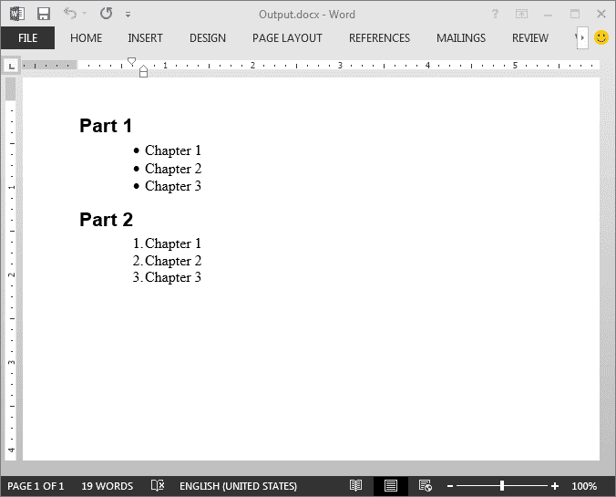
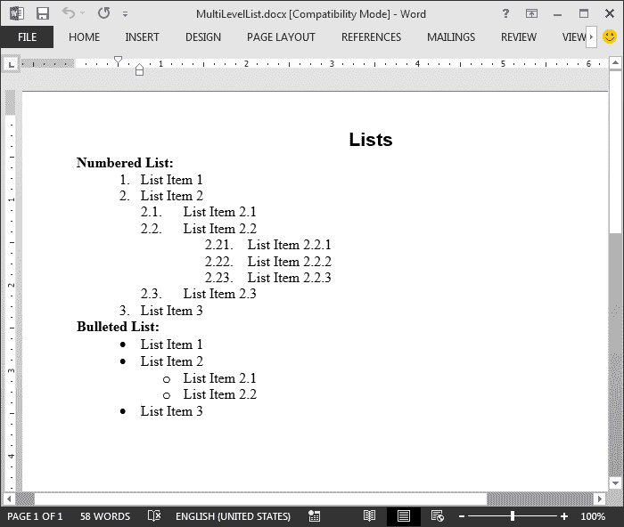

# 用 Java 语言在 Word 中创建、阅读和删除项目符号和编号列表

> 原文：<https://dev.to/eiceblue/create-read-and-remove-bulleted-and-numbered-lists-in-word-in-java-16co>

## 简介

Microsoft Word 提供了项目符号和数字来帮助我们将 Word 文档中的项目列表整理得井井有条。本文演示了如何在 Word 文档中添加项目符号和编号列表，然后在 Java 应用程序中读取和删除 Word 文档中的项目符号和编号列表。

## 我们需要的库

**自由的尖顶。Java 文档**

在使用下面的代码之前，我们需要添加对 Free Spire 的依赖。Java 库的文档。对于 maven 应用，我们可以将下面的代码添加到 *pom.xml* 中安装免费的 Spire。来自 maven 资源库的 Java 文档(版本 2.6.2 ):

```
<repositories>
        <repository>
            <id>com.e-iceblue</id>
            <name>e-iceblue</name>
            <url>http://repo.e-iceblue.com/nexus/content/groups/public/</url>
        </repository>
</repositories>
<dependencies>
    <dependency>
        <groupId>e-iceblue</groupId>
        <artifactId>spire.doc.free</artifactId>
        <version>2.6.2</version>
    </dependency>
</dependencies> 
```

我们也可以下载免费的 Spire。来自官网的 Java 的 doc:
[https://www.e-iceblue.com/Download/doc-for-java-free.html](https://www.e-iceblue.com/Download/doc-for-java-free.html)

## 样本代码

**创建简单的项目符号和编号列表**

```
import com.spire.doc.*;
import com.spire.doc.documents.*;

public class SimpleList {
    public static void main(String[] args){
        //create a Word document and add a section
        Document document = new Document();
        Section section = document.addSection();

        //Add 8 paragraphs
        Paragraph paragraph = section.addParagraph();
        paragraph.appendText("Part 1");
        paragraph.applyStyle(BuiltinStyle.Heading_1);
        paragraph = section.addParagraph();
        paragraph.appendText("Chapter 1");
        paragraph = section.addParagraph();
        paragraph.appendText("Chapter 2");
        paragraph = section.addParagraph();
        paragraph.appendText("Chapter 3");
        paragraph = section.addParagraph();
        paragraph.appendText("Part 2");
        paragraph.applyStyle(BuiltinStyle.Heading_1);
        paragraph = section.addParagraph();
        paragraph.appendText("Chapter 1");
        paragraph = section.addParagraph();
        paragraph.appendText("Chapter 2");
        paragraph = section.addParagraph();
        paragraph.appendText("Chapter 3");

        //apply bullets to the 2-4 paragraphs
        for(int i = 1; i < 4; i++){
            Paragraph para = section.getParagraphs().get(i);
            para.getListFormat().applyBulletStyle();
            para.getListFormat().getCurrentListLevel().setNumberPosition(-10);
        }

        //apply numbering to the 6-8 paragraphs
        for(int i = 5; i < 8; i++){
            Paragraph para = section.getParagraphs().get(i);
            para.getListFormat().applyNumberedStyle();
            para.getListFormat().getCurrentListLevel().setNumberPosition(-10);
        }

        //save the resultant document
        document.saveToFile("Output.docx", FileFormat.Docx_2013);
    }
} 
```

输出:
[](https://res.cloudinary.com/practicaldev/image/fetch/s--y2X9YEyk--/c_limit%2Cf_auto%2Cfl_progressive%2Cq_auto%2Cw_880/https://thepracticaldev.s3.amazonaws.com/i/nzemgfnzjd471uscw6hi.png)

**创建多级项目符号和编号列表**

```
import com.spire.doc.*;
import com.spire.doc.documents.*;

public class MultiLevelList {
    public static void main(String[] args){
        //create a Word document and add a section
        Document document = new Document();
        Section section = document.addSection();

        //add a title paragraph
        Paragraph paragraph = section.addParagraph();
        paragraph.appendText("Lists");
        paragraph.applyStyle(BuiltinStyle.Title);

        //add a paragraph
        paragraph = section.addParagraph();
        paragraph.appendText("Numbered List:").getCharacterFormat().setBold(true);

        //create a numbered list
        ListStyle numberList = new ListStyle(document, ListType.Numbered);
        numberList.setName("numberList");
        numberList.getLevels().get(1).setNumberPrefix("\u0000.");
        numberList.getLevels().get(1).setPatternType(ListPatternType.Arabic);
        numberList.getLevels().get(2).setNumberPrefix("\u0000.\u0001");
        numberList.getLevels().get(2).setPatternType(ListPatternType.Arabic);

        //create a bulleted list
        ListStyle bulletList= new ListStyle(document, ListType.Bulleted);
        bulletList.setName("bulletList");

        //add the numbered and bulleted list into the document
        document.getListStyles().add(numberList);
        document.getListStyles().add(bulletList);

        //add paragraphs and apply the numbered list
        paragraph = section.addParagraph();
        paragraph.appendText("List Item 1");
        paragraph.getListFormat().applyStyle(numberList.getName());

        paragraph = section.addParagraph();
        paragraph.appendText("List Item 2");
        paragraph.getListFormat().applyStyle(numberList.getName());

        paragraph = section.addParagraph();
        paragraph.appendText("List Item 2.1");
        paragraph.getListFormat().applyStyle(numberList.getName());
        paragraph.getListFormat().setListLevelNumber(1);

        paragraph = section.addParagraph();
        paragraph.appendText("List Item 2.2");
        paragraph.getListFormat().applyStyle(numberList.getName());
        paragraph.getListFormat().setListLevelNumber(1);

        paragraph = section.addParagraph();
        paragraph.appendText("List Item 2.2.1");
        paragraph.getListFormat().applyStyle(numberList.getName());
        paragraph.getListFormat().setListLevelNumber(2);
        paragraph = section.addParagraph();
        paragraph.appendText("List Item 2.2.2");
        paragraph.getListFormat().applyStyle(numberList.getName());
        paragraph.getListFormat().setListLevelNumber(2);
        paragraph = section.addParagraph();
        paragraph.appendText("List Item 2.2.3");
        paragraph.getListFormat().applyStyle(numberList.getName());
        paragraph.getListFormat().setListLevelNumber(2);

        paragraph = section.addParagraph();
        paragraph.appendText("List Item 2.3");
        paragraph.getListFormat().applyStyle(numberList.getName());
        paragraph.getListFormat().setListLevelNumber(1);

        paragraph = section.addParagraph();
        paragraph.appendText("List Item 3");
        paragraph.getListFormat().applyStyle(numberList.getName());

        //add paragraphs and apply the bulleted list
        paragraph = section.addParagraph();
        paragraph.appendText("Bulleted List:").getCharacterFormat().setBold(true);

        paragraph = section.addParagraph();
        paragraph.appendText("List Item 1");
        paragraph.getListFormat().applyStyle(bulletList.getName());
        paragraph = section.addParagraph();
        paragraph.appendText("List Item 2");
        paragraph.getListFormat().applyStyle(bulletList.getName());

        paragraph = section.addParagraph();
        paragraph.appendText("List Item 2.1");
        paragraph.getListFormat().applyStyle(bulletList.getName());
        paragraph.getListFormat().setListLevelNumber(1);
        paragraph = section.addParagraph();
        paragraph.appendText("List Item 2.2");
        paragraph.getListFormat().applyStyle(bulletList.getName());
        paragraph.getListFormat().setListLevelNumber(1);
        paragraph = section.addParagraph();
        paragraph.appendText("List Item 3");
        paragraph.getListFormat().applyStyle(bulletList.getName());

        //save the resultant document
        document.saveToFile("MultiLevelList.docx", FileFormat.Docx);

    }
} 
```

输出:
[](https://res.cloudinary.com/practicaldev/image/fetch/s--XSdMP7AW--/c_limit%2Cf_auto%2Cfl_progressive%2Cq_auto%2Cw_880/https://thepracticaldev.s3.amazonaws.com/i/2gde2bqg04nc30gcxw94.png)

**阅读项目符号和编号列表**

```
import com.spire.doc.*;
import com.spire.doc.documents.Paragraph;

public class ReadList {
    public static void main(String[] args){
        //load the MultiLevelList.docx document
        Document document = new Document();
        document.loadFromFile("MultiLevelList.docx");

        //get the 1st section
        Section section = document.getSections().get(0);

        //loop through the paragraphs in the section and read lists
        for(int i = 0; i < section.getParagraphs().getCount(); i++){
            Paragraph paragraph = section.getParagraphs().get(i);
            String list = paragraph.getListText();
            System.out.println(list);
        }
    }
} 
```

输出:
[](https://res.cloudinary.com/practicaldev/image/fetch/s--uKu-UWG6--/c_limit%2Cf_auto%2Cfl_progressive%2Cq_auto%2Cw_880/https://thepracticaldev.s3.amazonaws.com/i/ug3w49rcgid9ntvvvq25.png)

**删除项目符号和编号列表**

```
import com.spire.doc.*;
import com.spire.doc.documents.Paragraph;

public class RemoveList {
    public static void main(String[] args){
        //load the MultiLevelList.docx document
        Document document = new Document();
        document.loadFromFile("MultiLevelList.docx");

        //get the 1st section
        Section section = document.getSections().get(0);

        //Loop through the paragraphs in the section and remove lists
        for(int i = 0; i < section.getParagraphs().getCount(); i++){
            Paragraph paragraph = section.getParagraphs().get(i);
            paragraph.getListFormat().removeList();
        }

        //save the resultant document
        document.saveToFile("RemoveList.docx", FileFormat.Docx_2013);
    }
} 
```

输出:
[](https://res.cloudinary.com/practicaldev/image/fetch/s--byA5jTHU--/c_limit%2Cf_auto%2Cfl_progressive%2Cq_auto%2Cw_880/https://thepracticaldev.s3.amazonaws.com/i/8w7q8d4wuah803kuxrhr.png)

## 更多信息:

**产品首页:**【https://www.e-iceblue.com/Introduce/free-doc-for-java.html】
**论坛:**[https://www.e-iceblue.com/forum/spire-doc-f6.html?sid = b 288 c 0 f 77 c 705 ba 49870210964622 CD 8](https://www.e-iceblue.com/forum/spire-doc-f6.html?sid=b288c0f77c705ba49870210964622cd8)