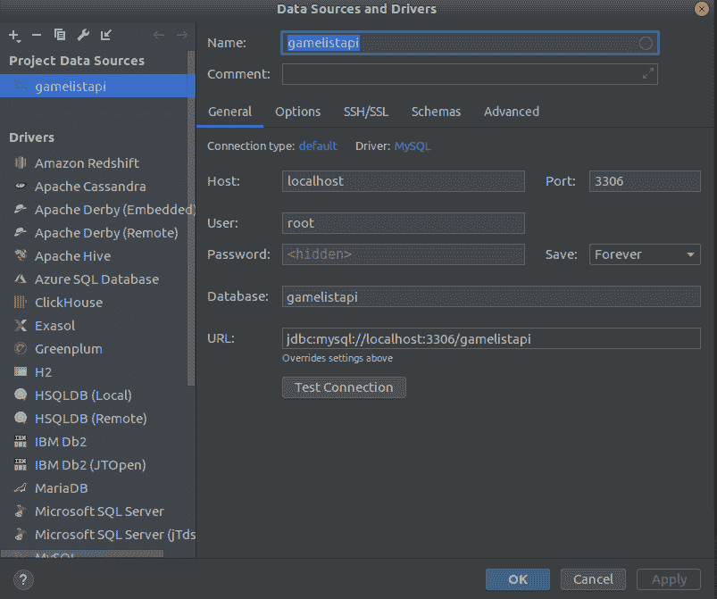
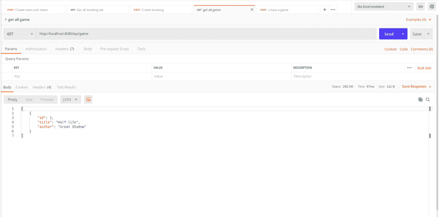
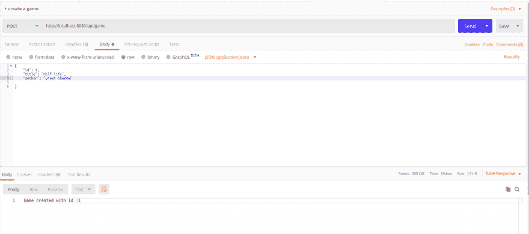

# 为实践自动化测试创建简单的 REST API

> 原文：<https://dev.to/cuongld2/create-simple-rest-api-for-practice-automation-testing-md8>

API 是 Application Programming Interface 的首字母缩写，它是一个软件中介，允许两个应用程序(服务)相互通信。

想象一下，就像餐馆里的服务员。这将有助于您获得订单信息，并将其传递给厨房的厨师。当食物准备好了，它会去拿食物给你。

用技术术语来说，数据库就像一个厨房。API 就像一个服务员。而你(客户)就像客户要求的那样。

要创建 API，我们可以用很多方法/语言来做。但是在本教程中，我将向您展示如何使用带有 mvn 的 Java Spring/Tomcat 实现这一点。

我们与之交互的数据库将是 MySQL。

1.安装 MySQL 并创建一个新数据库:

MySQL 是一个开源的 RDMBS，所以可以自由安装和使用。
由于我使用的是 Ubuntu，安装指南你可以参考 [MySQL 安装](https://www.digitalocean.com/community/tutorials/how-to-install-mysql-on-ubuntu-18-04)

之后，你可以创建你自己的数据库，在这篇博文中，命名为 gamelistapi。

关于如何在 MySQL [创建数据库](https://www.a2hosting.com/kb/developer-corner/mysql/managing-mysql-databases-and-users-from-the-command-line)中创建数据库，请参考此处。

为了处理数据库，我经常使用 DataGrip(由 Jetbrains 创建的开发工具)。DataGrip 支持很多数据库:MySQL、Oracle、SQL server、Postgres、MariaDB 等..

Datagrip 官方网站是【这里】[[https://www.jetbrains.com/datagrip/](https://www.jetbrains.com/datagrip/)

创建新数据库后，您可以打开 Datagrip，通过 SQL 查询或 Datagrip GUI 与数据库进行交互。

创建新连接:
[](https://res.cloudinary.com/practicaldev/image/fetch/s--ovozSFWp--/c_limit%2Cf_auto%2Cfl_progressive%2Cq_auto%2Cw_880/https://thepracticaldev.s3.amazonaws.com/i/7m8kg6r5kjkdggsd9j7q.png)

与游戏列表 api 连接的配置:

[](https://res.cloudinary.com/practicaldev/image/fetch/s--IkNA5z4O--/c_limit%2Cf_auto%2Cfl_progressive%2Cq_auto%2Cw_880/https://thepracticaldev.s3.amazonaws.com/i/f2lrkl8veghwcu1rrv2w.png)

2.设置 Java 和 Maven 环境:

你需要安装 Java(我现在用的是 Java 11，但是你可以用 Java 8，因为它是稳定版本)。

到 oracle 网站下载适合您系统的 java 安装程序: [Java oracle](https://www.oracle.com/technetwork/java/javase/downloads/index.html)

之后安装 maven 工具(用于构建 java 应用程序)。请到 maven 下载官方网站下载 maven : [maven 最新版本](https://maven.apache.org/download.cgi)

在项目中使用 java 和 maven 之前，您需要设置 java 的全局环境和 maven 环境。(设置取决于您使用的操作系统)

3.项目结构:

*   在 maven 项目中，我们将拥有 pom 文件:用于存储我们将在项目中使用的依赖项(库)

*   在 src/resources 文件夹中，我们通常放入用于项目的数据库、环境、配置信息。在这个项目中，我们将 db.properties。

db.properties 文件如下所示:

```
 // MySQL properties

mysql.driver=com.mysql.cj.jdbc.Driver
mysql.url=jdbc:mysql://localhost:3306/gamelistapi?useSSL=false
mysql.user=****
mysql.password=*****

// Hibernate properties

hibernate.show_sql=true
hibernate.hbm2ddl.auto=update

// C3P0 properties

hibernate.c3p0.min_size=5
hibernate.c3p0.max_size=20
hibernate.c3p0.acquire_increment=1
hibernate.c3p0.timeout=1800
hibernate.c3p0.max_statements=150 
```

Enter fullscreen mode Exit fullscreen mode

mysql.driver 是我们将用于 mysql 的 jdbc 驱动程序的参数。mysql.url 是我们本地数据库的 url。(通常 MySQL 将使用端口 3306)
mysql.user 和 mysq.password 您将把您创建的数据库的用户名和密码放在那里。

*   在 src/main 包中，你将拥有实现 gamelist api 的源代码。

我将在另一篇博文中介绍 Spring 框架的结构。

*   游戏列表 api 的功能将有:创建新游戏，更新游戏，获取游戏数据，并删除游戏。

4.用 maven 构建游戏列表 api:

通常要从 maven 运行项目，您将使用' mvn ... '运行

由于我们的项目使用 tomcat7，命令行将是:

mvn tomcat7:运行

5.使用 gamelist api 和 postman:

Postman 是用户与 API 交互的免费工具。
你可以从这个链接下载邮差:[邮差](https://www.getpostman.com/downloads/)

比如你想从 API 中获取所有游戏，截图是这样的。

[](https://res.cloudinary.com/practicaldev/image/fetch/s--fv-ppY_H--/c_limit%2Cf_auto%2Cfl_progressive%2Cq_auto%2Cw_880/https://thepracticaldev.s3.amazonaws.com/i/swz1w88uc326677x702h.png)

如果你想创建新游戏:

[](https://res.cloudinary.com/practicaldev/image/fetch/s--gyk9OSzb--/c_limit%2Cf_auto%2Cfl_progressive%2Cq_auto%2Cw_880/https://thepracticaldev.s3.amazonaws.com/i/lyvenzqdjvmycx2kvfc0.png)

请随意从我的 github [游戏列表-api](https://github.com/cuongld2/gameListApi) 获取代码

下一篇博文，我将向您展示如何用 Serenity 测试这些 API。

感谢大家的阅读！:-*

注意:如果你觉得这个博客对你有帮助，想表达你的感激之情，请随时访问:

[](https://www.buymeacoffee.com/dOaeSPv)

这将有助于我贡献更多有价值的内容。