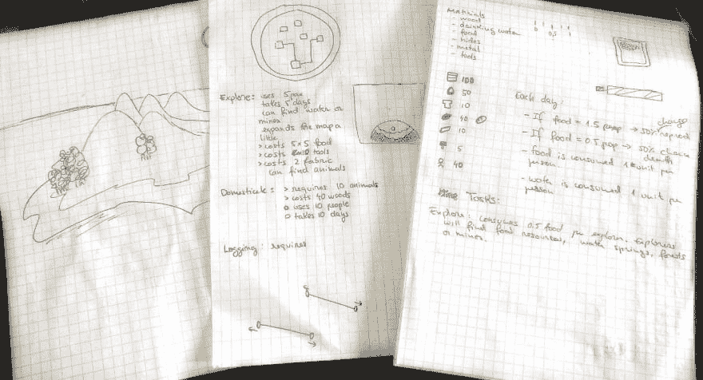
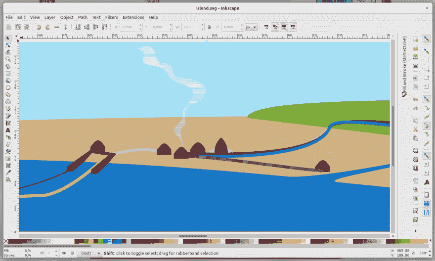
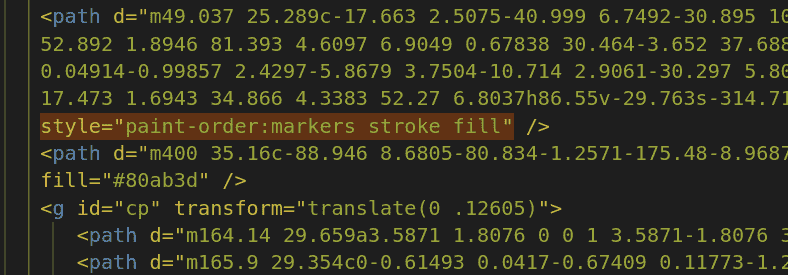
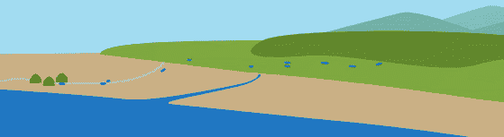
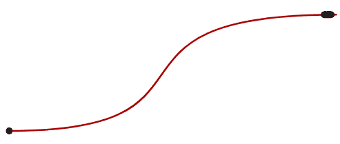
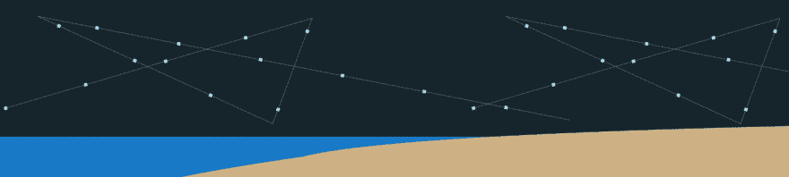
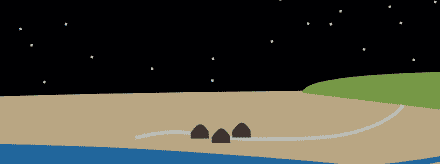

# 使用 SVG 创建 13KB 的 JS 游戏

> 原文：<https://dev.to/mrlopis/creating-a-13kb-js-game-using-svg-5fjk>

这是我的 JS13K 事后分析的第二部分，技术性更强。如果你还没有，[看看关于游戏设计的第一部分](https://dev.to/mrlopis/how-to-design-a-javascript-game-in-13kb-or-less-59kn)。

* * *

JS13K 是关于使用你想要的任何东西开发 13KB 的 javascript 游戏，只要你的所有内容都适合这 13KB——包括代码、图像、声音、游戏数据和你可能需要的任何库。

## TOC

*   [图形的选择](#choice-of-graphics)
*   [创建和操作 SVG](#creating-and-manipulating-svgs)
*   [保存和优化 SVG](#saving-and-optimizing-svgs)
*   [在 SVG 上制作点动画](#animating-dots-on-an-svg)
*   [围绕](#moving-svg-elements-around)移动 SVG 元素
*   [期末笔记](#final-notes)

## 选择图形

去年，我用 2D 画布开发了一个游戏。画布非常灵活且易于使用。您可以通过在 javascript 中动态生成自己的图形来节省大量字节。

[](https://res.cloudinary.com/practicaldev/image/fetch/s--satvrxy4--/c_limit%2Cf_auto%2Cfl_progressive%2Cq_auto%2Cw_880/https://thepracticaldev.s3.amazonaws.com/i/51sqxgk3fw7b9kyk736t.jpg)

在经历了一个艰难的开始后，我开始尝试生成图形，最终我放弃了这个想法，专注于游戏机制。但是我仍然想要某种 UI 来让游戏看起来更好，更吸引人。于是有了用 SVG 的想法。SVG 有许多优点:

*   与光栅格式相比，具有小尺寸的大、复杂、平滑和可缩放的图像；
*   它是 XML，可嵌入 HTML——你可以为每个元素设置类和 id；
*   你可以用 javascript 操纵它；如果你有一个 webdev 背景而不是 OpenGL，将 UI 作为 DOM 操作是一个非常有吸引力的提议；
*   您可以使用 CSS3 对其进行样式化和动画化
*   SVG 动画(SMIL)是 HTML5 中的一个东西，而[浏览器对非边缘浏览器](https://caniuse.com/#feat=svg-smil)的兼容性非常好

我会发现，在决定使用 SVG 时，我做了一些天真的假设。

*   SVG 很小，但是不太容易压缩；路径定义实际上非常冗长，就像 XML 本身一样；
*   在 SVG 元素上使用 CSS 是有限制的；对转换的支持不可靠；
*   SVG 浏览器支持实际上很糟糕。这就像回到了 2005 年，每个浏览器都在做自己的事情。这实际上让我很早就放弃了对 Safari 和 Edge 的支持；
*   SMIL 是一个痛苦的后方，文档是非常糟糕的相比，CSS 动画。

但是等我意识到这一切的时候，沉没成本已经太高了。

我还决定对所有图标广泛使用表情符号。表情符号在主流操作系统(至少是 Ubuntu、MacOS 和 Windows)中已经变得相当普遍。这样，每个图标只需要几个字节。当然，代价是你无法控制表情符号在每个系统上的外观。

## 创建和操作 SVG

我的 goto 矢量图像编辑器是 [Inkscape](https://inkscape.org/) 。它是 libre 软件，可以在 Linux 上运行，也可以在其他操作系统上运行(甚至更好)。我已经用了好几年了，所以我用起来相当舒服。

[](https://res.cloudinary.com/practicaldev/image/fetch/s--VhwagtWn--/c_limit%2Cf_auto%2Cfl_progressive%2Cq_auto%2Cw_880/https://thepracticaldev.s3.amazonaws.com/i/wbpugf0hqbd5u238b94q.png)

大多数形状由节点和曲线组成。简而言之，决定 SVG 文件大小的不是复杂程度或曲线，也不是形状的大小，而是节点的数量。SVG 支持不同种类的可视元素，例如:

*   路径，非常灵活，尽可能复杂，但更冗长；
*   物体，如矩形和圆形，灵活性较差，但尺寸较小；
*   符号，可重复使用的元素，有助于保存大量的知识库；
*   组，是用户定义的路径、对象、符号和其他组的群集。

SVG 还可以包含带有样式、渐变和动画等定义的标题。Inkscape 的 UI 几乎支持我提到的所有东西，除了动画(据我所知)这一显著的例外。事实上，我注意到当我在 SVG 标记中手动编写动画时，Inkscape 不仅会忽略它们，而且会在下次保存时删除它们。

幸运的是，您可以在 HTML 中嵌入多个 SVG，任何样式和其他定义都可以在它们之间共享。

## 保存和优化 SVG

Inkscape 支持以几种不同的格式保存 SVG，如 PDF、PNG 或 Postscript。我用得最多的格式是*优化的 SVG* 。这种格式去掉了文件中所有无用的注释、头和属性。每次保存文件时，可以选择启用哪些优化。即便如此，我发现偶尔需要手动编辑标记来删除无用的信息。

[](https://res.cloudinary.com/practicaldev/image/fetch/s--V5dU6yO3--/c_limit%2Cf_auto%2Cfl_progressive%2Cq_auto%2Cw_880/https://thepracticaldev.s3.amazonaws.com/i/q1gk3h6v6onyuax53bmq.png)

例如，`paint-order`是一个属性，它定义一个元素的笔画是画在其填充的前面还是后面。但是我的大部分造型连笔画都没有，所以这种整体风格是没有必要的。我发现自己偶尔会删除这些样式，因为 Inkscape 会再次添加它们。

正如我前面提到的，SVG 支持符号。这在某些场景下非常有效，比如我游戏中的小房子这样的静态物体。但是对于到处跑的人来说，我发现用 javascript 复制 SVG 对象是非常有效的。

[](https://res.cloudinary.com/practicaldev/image/fetch/s--2Rg5-GCg--/c_limit%2Cf_auto%2Cfl_progressive%2Cq_66%2Cw_880/https://thepracticaldev.s3.amazonaws.com/i/5swer3mgclzid5pv5fy8.gif)

在上面的 gif 中，我给大家展示了我游戏中的“奔跑的蚂蚁”动画。然后我禁用了路径上的蒙版，这样你就可以看到这些点实际上是沿着一条路径动画的单个虚线。此路径是模板路径的克隆，在 X 轴上应用了随机缩放变换。

```
$newTrail.style.transform = `scaleX(${1 + Math.random()*0.7 - 0.2})`; 
```

所以每个“人”都是路径的克隆。

## 在 SVG 上制作点动画

可以使用 SVG 样式属性 [`stroke-dasharray`](https://developer.mozilla.org/en-US/docs/Web/SVG/Attribute/stroke-dasharray) 沿 SVG 路径制作一个点的动画。此属性采用一个值数组，这些值定义路径的虚线图案。

因此，例如，stroke-dash-array 值“2-1-4-1”用 2px 破折号，然后 1px 间隔，然后 4px 破折号，然后另一个 1px 间隔来绘制笔画图案，然后重复直到路径结束。相应的 CSS 属性是可动画的。因此，为了制作路径动画，我创建了一个大小为 1 的“破折号”,并控制其周围间隙的大小。更准确地说，我制作了间隙动画，使其从零变化到路径的长度。

[](https://res.cloudinary.com/practicaldev/image/fetch/s--OhKM36g2--/c_limit%2Cf_auto%2Cfl_progressive%2Cq_66%2Cw_880/https://thepracticaldev.s3.amazonaws.com/i/vf7ymx63vx85haiqvpgb.gif)

以上动画的代码可以在[这个 codepen](https://codepen.io/lopis/pen/GRKXvQR) 中找到。

我不知道如何在路径的开头没有一个点。如果你知道怎么做，我想听听！。

每个人都在路上飞奔，除了猎人，他们总是成双成对地行进。猎人破折号的图案基本上是“1，2，1”然后被可变的缺口包围。

> 有趣的事实:天上的星星也是点与点之间有非常大的间隙的虚线路径！

[](https://res.cloudinary.com/practicaldev/image/fetch/s--yznS8Zxg--/c_limit%2Cf_auto%2Cfl_progressive%2Cq_auto%2Cw_880/https://thepracticaldev.s3.amazonaws.com/i/d01w02z0i5tx3brkp431.png)

# 制作渐变背景动画

另一个可能没人注意到的动画，是游戏开头的烟雾动画。玩家第一次得到木头，游戏中的人就开始烧木头。

[](https://res.cloudinary.com/practicaldev/image/fetch/s--88cC48wU--/c_limit%2Cf_auto%2Cfl_progressive%2Cq_66%2Cw_880/https://thepracticaldev.s3.amazonaws.com/i/4c8yho3eh99nap2no57d.gif)

SVG 元素不接受`background` CSS 属性。相反，他们使用属性`fill`，该属性接受纯色——不允许渐变。因此，你也不能获得动画渐变。SVG 中的渐变本身就是元素。可以在 SVG 源代码上定义动画。

```
<linearGradient id="grad"
    x1="157" x2="157" y1="28" y2="28"
    gradientUnits="userSpaceOnUse">
  <stop stop-color="#fff" stop-opacity=".9" offset="0" />
  <stop stop-color="#e0e0e0" stop-opacity="0" offset="1" />
  <animate fill="freeze"
    attributeName="y2" begin="indefinite"
    dur="5" from="28" to="1" repeatCount="1" />
</linearGradient> 
```

上面的`<animate>`元素定义了渐变的动画。通常，动画会立即开始。但是因为`begin="indefinite"`属性，动画处于待机状态。可以使用 javascript 触发动画:

```
querySelect('animate').beginElement() 
```

## 四处移动 SVG 元素

我发现了一些不同的方法来完成运动。在这种情况下，CSS 是一个可行的选择。可以对单个元素和元素组使用 CSS 变换。不幸的是，元素移动的方式可能是意想不到的。

首先，SVG 生活在一个不同的维度。我的意思是，如果你的 SVG 被缩放，你网页上的一个像素不一定是你 SVG 上的一个像素。此外，如果您尝试移动的元素已被转换(例如在 Inkscape 中)，转换原点可能不在元素的中间。这使得旋转很难使用，因为通常不清楚旋转中心在哪里。

更惨！在 Firefox 中正常工作的平移+旋转在 Chrome 上根本不能正常工作。就我而言，我试图在游戏开始时制作沉船的动画。我的解决方案是将 Inkscape 中的船移动到位置(0，0 ),这似乎有点帮助。但后来我一定是换了什么东西，旋转又坏了。我最终使船下沉，没有旋转，只是向下运动。

在我调整完沉船动画后，我发现当玩家按下“重置”时，Chrome 无法处理重复播放动画的问题。SVG 和最初完全一样，动画也是一样的，但是不管是什么原因，船的动画被完全抛弃了。它。制造。不。理智。

我最终只是为 Chrome 添加了一些难看的 CSS，试图强制重置一些转换。

```
/* Stupid hack for stupid Chrome */
@supports (not (-moz-appearance:none))
{ 
  #ship.new {
    transform: translate(0%, 0%);
  }
  #ship.go {
    transition: transform 7s cubic-bezier(.5,0,1,1);
    transform: translate(-20%, 60%)
  }
} 
```

我还看到游戏重置时，Chrome 会在船上加上`translate(0,0)`。这毫无意义。SVG 应该是原始的，没有人告诉 Chrome 这样做。为了解决这个问题，我不得不在游戏重启时手动移除翻译器:

```
$shipTop.removeAttribute('transform') // Because Chrome is shit 
```

## 期末笔记

因为我为了移动一艘船而经历的所有麻烦，你可能不会发现我用 SVG 和 SMIL 制作更多的游戏。我不能推荐它——至少不能以没有任何库的原始形式推荐。所以我们处于这样一种情况，SVG 的 CSS3 动画不可靠，但被推为 SMIL、[的替代者，几乎到了贬低 SMIL 的地步，但不完全是](https://groups.google.com/a/chromium.org/forum/#!msg/blink-dev/5o0yiO440LM/YGEJBsjUAwAJ)。

> 在我们宣布反对并最终移除 SMIL 的 15 个月里，我们听到了来自社区成员的各种意见。我们重视您的所有反馈，很明显，SMIL 服务的一些使用案例还没有高保真的替代品。因此，我们已经决定暂停我们的意图，并采取较小的步骤向其他选项。
> 
> *   Chrome 团队，2016/08/17

我今年的主要收获是，我应该在下一场比赛之前更好地准备自己，通过学习像 canvas engines 和 webGL 这样的新工具。此外，我不知道为什么我没有想到，但解决这一切的最显而易见的办法是让船成为一个重叠在地图上的独立 SVG。马后炮是 20/20 对吗？