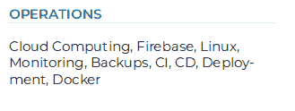
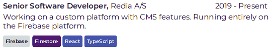

# 在 React-PDF 中创建 CV

> 原文：<https://dev.to/andrioid/creating-a-cv-in-react-1h2p>

## TLDR；

*   [看我的简历](https://andri.dk/cv.pdf)
*   [参见代码](https://github.com/andrioid/andri.dk/tree/master/src/cv)

## 但是为什么呢？

我从来不喜欢屏幕上的像素推进。它一直是一种必要的邪恶。但是，打印？喜欢那玩意。我用 LaTeX 做了我的大学报告，甚至是图形，尽管错误很可怕，它仍然是 TeX 的忠实粉丝。

因此，当我在工作中接到一个任务，要评估 [react-pdf](https://react-pdf.org/) vs CSS-printing 时，我知道我有了一个特别的玩法。

我想要以下功能:

*   使用 [JSON 简历](https://jsonresume.org/schema/)获取简历数据
*   工作经历、教育和部门的组成部分
*   用我的 Gatsby 站点自动构建成 PDF 文件

## 一个好的起点

react-pdf repo 中有一个[示例](https://github.com/diegomura/react-pdf/tree/master/examples/resume)，它的代码比我的漂亮得多。所以，如果你想自己做，我建议你从那里开始。

## 使用 JSON 简历，效果很好

如果你和我一样，你不喜欢更新你的简历或投资组合。或者你只是忘记了。我们可以使用一个 JSON 文件来完成所有这些事情。

规格是好的，但是我对我的做了一些小的改变。我向工作项添加了一个“技能”数组，向技能项添加了一个“颜色”字符串。

访问[jsonresume.org](https://jsonresume.org)，制作自己的 *resume.json* 文件。

他们甚至提供免费托管和渲染你的简历，如果你觉得懒，那就这么做吧。

## 组件

我在这里粘贴了一些代码，这样你就可以对它的构建有一点感觉了。但是，请记住，代码可能会发生变化，请参考 repo 中的代码示例。

### 框

一个简单的盒子，有一个标题。

[](///static/0050266b4782959d1c14752dd79c02ed/fb156/box-operations.png)T3】

```
export const Box = ({ children, title, color, style = {} }) => (
    <View wrap={false} style={{ marginBottom: 20 }}>
        <SectionHeader color={color}>{title}</SectionHeader>
        <View style={{ ...style }}>
            {children && typeof children === 'string' ? (
                <Text>{children}</Text>
            ) : (
                children
            )}
        </View>
    </View>
) 
```

Enter fullscreen mode Exit fullscreen mode

### 工作项

[](///static/907afe57865517988f38a789d1b443d3/ece02/experience-item.png)T3】

```
export const TimelineItem = ({
    title,
    period,
    children,
    employer,
    tags = [],
    location
}) => {
    tags = tags.sort()
    return (
        <View wrap={false} style={{ marginBottom: 10 }}>
            <View
                style={{
                    flexDirection: 'row',
                    justifyContent: 'space-between',
                    marginBottom: 2.5,
                    flexWrap: 'wrap'
                }}
            >
                <Text style={{ fontWeight: 'bold' }}>
                    {title}, <Text style={{ fontWeight: 'normal' }}>{employer}</Text>
                </Text>
                <Text>{period}</Text>
            </View>

            {children && <Text style={{ marginBottom: 2.5 }}>{children}</Text>}
            {tags && (
                <View style={{ flexDirection: 'row' }}>
                    {tags &&
                        tags.map(m => (
                            <Tag key={m} color={tagColors[m.toLowerCase()]}>
                                {m}
                            </Tag>
                        ))}
                </View>
            )}
        </View>
    )
} 
```

Enter fullscreen mode Exit fullscreen mode

## 与盖茨比一起建造

最初，我希望 Gatsby 将我的简历呈现为页面，在客户端使用 react-dom，在服务器端使用 pdf。事实证明这很难做到，收效甚微。所以现在我们只是单独生成 PDF 文件。

回想起来，我可能应该把这个移到 pkg/cv 而不是 src/cv。

### package.json

```
 "scripts": {
        "build-cv": "cd src/cv && babel-node build.js",
        "watch-cv": "cd src/cv && nodemon --exec babel-node build.js"
    }, 
```

Enter fullscreen mode Exit fullscreen mode

### 盖茨比-配置. js

```
exports.onPostBuild = () => {
    const cp = require('child_process')
    cp.execSync('yarn run build-cv')
} 
```

Enter fullscreen mode Exit fullscreen mode

### src/cv/。巴伯尔克

来自 react-pdf 报告。我也尝试过在这里改编盖茨比的巴别塔配置，但是没有运气。

```
{
    "presets": [
        [
            "@babel/preset-env",
            {
                "loose": true,
                "targets": {
                    "node": "current"
                }
            }
        ],
        "@babel/preset-react"
    ],
    "plugins": [
        "@babel/plugin-transform-runtime",
        "@babel/plugin-proposal-class-properties"
    ]
} 
```

Enter fullscreen mode Exit fullscreen mode

### 工作流程

然后边开发边运行`yarn run watch-cv`就行了。我在 Linux 上使用 evince 作为我的 PDF 浏览器，因为它可以在写入时自动重新加载文件。就像热重装一样。

## 结论

这对我来说是一个有趣的项目。我不是求职，所以此时没有动力进一步打磨。如果你也在考虑类似的事情，我希望这能给你一些启发。