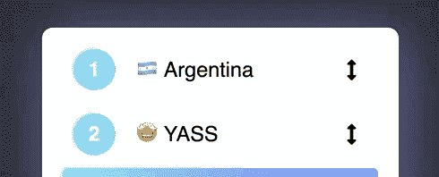

# 用 React 钩子创建一个拖放列表

> 原文：<https://dev.to/florantara/creating-a-drag-and-drop-list-with-react-hooks-4c0i>

我们将在 React 功能组件中使用 [HTML 拖放 API](https://developer.mozilla.org/en-US/docs/Web/API/HTML_Drag_and_Drop_API) ，并利用 [useState()钩子](https://reactjs.org/docs/hooks-state.html)来管理它的状态。

### 结果:

[https://codepen.io/florantara/embed/jjyJrZ?height=600&default-tab=result&embed-version=2](https://codepen.io/florantara/embed/jjyJrZ?height=600&default-tab=result&embed-version=2)

# 基础知识

我建议阅读完整的 API 文档，但以下是最重要的内容:

### 拖动什么

通过将属性 [`draggable`](https://developer.mozilla.org/en-US/docs/Web/HTML/Global_attributes/draggable) 设置为`true`并为其附加 [`onDragStart`](https://developer.mozilla.org/en-US/docs/Web/API/Document/dragstart_event) 事件处理程序，可以定义哪些 DOM 元素允许被拖动。

```
<div draggable="true" onDragStart={startDragging}>
 Drag Me 🍰
</div> 
```

Enter fullscreen mode Exit fullscreen mode

### 往哪里掉

为了定义一个**拖放区**，我们需要将 [`onDrop`](https://developer.mozilla.org/en-US/docs/Web/API/Document/drop_event) 和 [`onDragOver`](https://developer.mozilla.org/en-US/docs/Web/API/Document/dragover_event) 事件处理程序附加到它上面。

```
<section onDrop={updateDragAndDropState} onDragOver={receiveDraggedElements}>
 Drop here 🤲🏻
</section> 
```

Enter fullscreen mode Exit fullscreen mode

在我们的例子中，每个列表项都是可拖动的元素和拖放区，因为我们拖动来重新排序同一个列表，我们需要知道被拖动的项的位置，以及它希望被放入的位置。从那里，我们重新计算并更新正在呈现的列表项数组。

### 关于数据传输对象

API 为[提供了这个对象](https://developer.mozilla.org/en-US/docs/Web/API/DataTransfer)用于与拖动的数据交互，以及一些方便的方法，如`setData()`和`getData()`。我之所以提到它，是因为你可能会在许多 DnD 实现中看到它，但我们不打算使用它，因为我们有 React state，我们想玩钩子！

[点击此处](https://codepen.io/florantara/pen/VRadmv)查看使用不同可拖动元素和拖放区域，并使用 DataTransfer 对象的拖放示例。

# 让我们开始吧

注意:我们不打算把重点放在样式上，如果你正在复制这个例子，请随意从代码栏复制 SCSS。

## 准系统组件:

```
const items = [
  { number: "1", title: "🇦🇷 Argentina"},
  { number: "2", title: "🤩 YASS"},
  { number: "3", title: "👩🏼‍💻 Tech Girl"},
  { number: "4", title: "💋 Lipstick & Code"},
  { number: "5", title: "💃🏼 Latina"},
]

// The only component we'll have:
// It will loop through the items
// and display them.
// For now, this is a static array.
const DragToReorderList = () => {

  return(
    <section>
      <ul>
        {items.map( (item, index) => {
          return(
            <li key={index} >
              <span>{item.number}</span>
              <p>{item.title}</p>
              <i class="fas fa-arrows-alt-v"></i>
            </li>
          )
        })}
      </ul>
    </section>
  )
}

ReactDOM.render(
  <DragToReorderList />,
  document.getElementById("root")
); 
```

Enter fullscreen mode Exit fullscreen mode

## 使项目可拖动

我们需要两样东西:

*   `draggable`属性
*   `onDragStart`事件处理程序

```
const onDragStart = (event) => {
  // It receives a DragEvent
  // which inherits properties from
  // MouseEvent and Event
  // so we can access the element
  // through event.currentTarget

  // Later, we'll save
  // in a hook variable
  // the item being dragged
} 
```

Enter fullscreen mode Exit fullscreen mode

```
<li key={index} draggable="true" onDragStart={onDragStart}>
  <span>{item.number}</span>
  <p>{item.title}</p>
  <i class="fas fa-arrows-alt-v"></i>
</li> 
```

Enter fullscreen mode Exit fullscreen mode

<figure>

[](https://res.cloudinary.com/practicaldev/image/fetch/s--WKFQsioK--/c_limit%2Cf_auto%2Cfl_progressive%2Cq_66%2Cw_880/https://thepracticaldev.s3.amazonaws.com/i/6h6f5ntbw5m2n9y5sjke.gif)

<figcaption>Nice! They can be dragged now</figcaption>

</figure>

### 将它们转换成拖放区

我们需要两个事件处理程序:

*   `onDrop`
*   `onDragOver`

```
 const onDragOver = (event) => {
  // It also receives a DragEvent.
  // Later, we'll read the position
  // of the item from event.currentTarget
  // and store the updated list state

  // We need to prevent the default behavior
  // of this event, in order for the onDrop
  // event to fire.
  // It may sound weird, but the default is
  // to cancel out the drop.
  event.preventDefault();
}

const onDrop = () => {
  // Here, we will:
  // - update the rendered list
  // - and reset the DnD state
} 
```

Enter fullscreen mode Exit fullscreen mode

```
<li 
  key={index} 

  draggable="true" 
  onDragStart={onDragStart}

  onDragOver={onDragOver}
  onDrop={onDrop}
>
  <span>{item.number}</span>
  <p>{item.title}</p>
  <i class="fas fa-arrows-alt-v"></i>
</li> 
```

Enter fullscreen mode Exit fullscreen mode

点击阅读更多关于默认行为[的信息。我损失了几个小时的工作，直到我读了那部分文档。🤷🏼‍♀️](https://developer.mozilla.org/en-US/docs/Web/API/HTML_Drag_and_Drop_API/Drag_operations#droptargets)

此外，我们可以使用`onDragEnter`在当前悬停的拖放区设置一些样式。

> `onDragEnter`触发一次，而`onDragOver`每隔几百毫秒触发一次，所以最好添加一个 css 类。

也就是说，我发现`onDragEnter`不太可靠，所以我选择检查`onDragOver`上的一些状态/标志，并基于此而不是`onDragEnter`进行样式更新。

此外，要移除样式，我们可以使用`onDragLeave`，一旦拖放区被悬停，它就会触发。

## 使之充满活力

为了能够在功能组件中使用 React 状态，我们将使用`useState`钩子，它给我们一个变量和一个更新函数。💯

我们有两个:

*   1 跟踪拖放状态
*   1 存储呈现的列表状态

```
const initialDnDState = {
  draggedFrom: null,
  draggedTo: null,
  isDragging: false,
  originalOrder: [],
  updatedOrder: []
}

const items = [
  { number: "1", title: "🇦🇷 Argentina"},
  { number: "2", title: "🤩 YASS"},
  { number: "3", title: "👩🏼‍💻 Tech Girl"},
  { number: "4", title: "💋 Lipstick & Code"},
  { number: "5", title: "💃🏼 Latina"},
]

const DragToReorderList = () => {

  // We'll use the initialDndState created above

  const [dragAndDrop, setDragAndDrop] = React.useState( initialDnDState );

  // The initial state of "list"
  // is going to be the static "items" array
  const [list, setList] = React.useState( items );

  //...

  // So let's update our .map() to loop through
  // the "list" hook instead of the static "items"
  return(
   //...
   {list.map( (item, index) => {
     return(
       // ...
     )
   })}
   //...
   )
} 
```

Enter fullscreen mode Exit fullscreen mode

## 勾搭上了`onDragStart`

这个函数将负责开始拖动。

首先，添加一个`data-position`属性，存储每一项的`index`:

```
<li
  data-position={index}
  //...
> 
```

Enter fullscreen mode Exit fullscreen mode

然后:

```
const onDragStart = (event) => {

  // We'll access the "data-position" attribute
  // of the current element dragged
  const initialPosition = Number(event.currentTarget.dataset.position);

  setDragAndDrop({
    // we spread the previous content
    // of the hook variable
    // so we don't override the properties 
    // not being updated
    ...dragAndDrop, 

    draggedFrom: initialPosition, // set the draggedFrom position
    isDragging: true, 
    originalOrder: list // store the current state of "list"
  });

  // Note: this is only for Firefox.
  // Without it, the DnD won't work.
  // But we are not using it.
  event.dataTransfer.setData("text/html", '');
 } 
```

Enter fullscreen mode Exit fullscreen mode

## 勾搭上了`onDragOver`

```
 const onDragOver = (event) => {
  event.preventDefault();

  // Store the content of the original list
  // in this variable that we'll update
  let newList = dragAndDrop.originalOrder;

  // index of the item being dragged
  const draggedFrom = dragAndDrop.draggedFrom; 

  // index of the drop area being hovered
  const draggedTo = Number(event.currentTarget.dataset.position); 

  // get the element that's at the position of "draggedFrom"
  const itemDragged = newList[draggedFrom];

  // filter out the item being dragged
  const remainingItems = newList.filter((item, index) => index !== draggedFrom);

  // update the list 
  newList = [
    ...remainingItems.slice(0, draggedTo),
    itemDragged,
    ...remainingItems.slice(draggedTo)
  ];

   // since this event fires many times
   // we check if the targets are actually
   // different:
   if (draggedTo !== dragAndDrop.draggedTo){
     setDragAndDrop({
     ...dragAndDrop,

      // save the updated list state
      // we will render this onDrop
      updatedOrder: newList, 
      draggedTo: draggedTo
     })
  }

 } 
```

Enter fullscreen mode Exit fullscreen mode

## 最后，滴！🌟

```
const onDrop = () => {

  // we use the updater function
  // for the "list" hook
  setList(dragAndDrop.updatedOrder);

  // and reset the state of
  // the DnD
  setDragAndDrop({
   ...dragAndDrop,
   draggedFrom: null,
   draggedTo: null,
   isDragging: false
  });
 } 
```

Enter fullscreen mode Exit fullscreen mode

## 太棒了！

### 获取这支笔的完整代码示例:

[https://codepen.io/florantara/pen/jjyJrZ](https://codepen.io/florantara/pen/jjyJrZ)

## 关于这个 API 的缺点

*   它不能在移动设备上工作，所以需要用[鼠标事件](https://developer.mozilla.org/en-US/docs/Web/API/MouseEvent)实现。
*   浏览器兼容性已经变得更好，但是如果你正在创建一个面向公众的产品，请确保对它进行彻底的测试。

如果你喜欢它，请随意分享💓