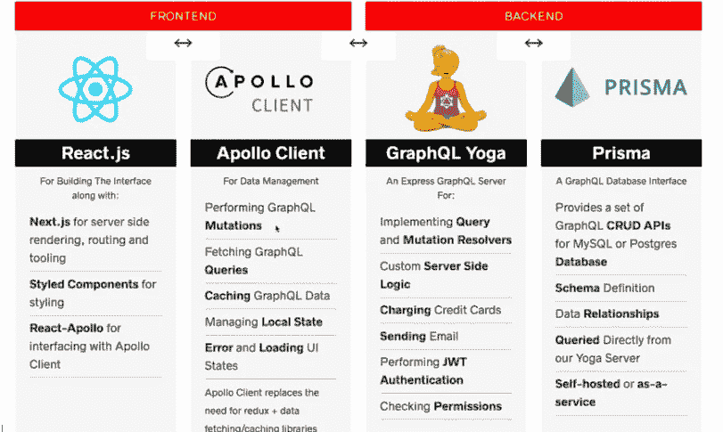
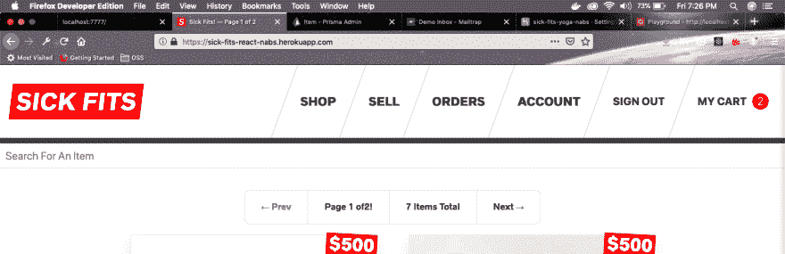
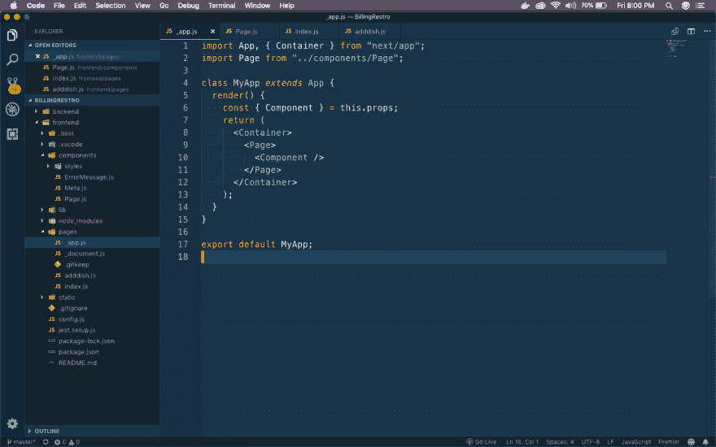
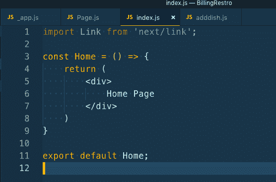
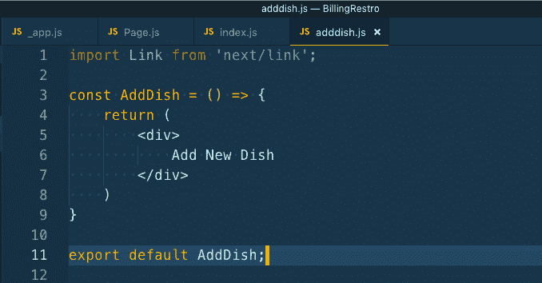
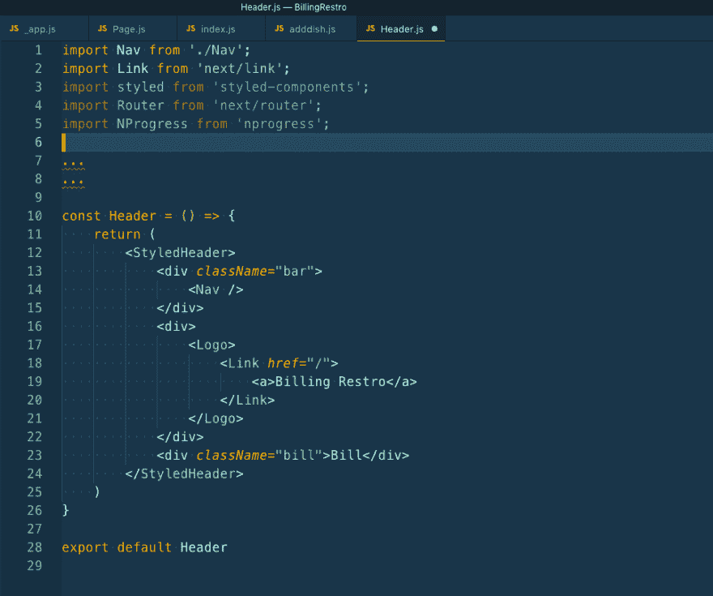
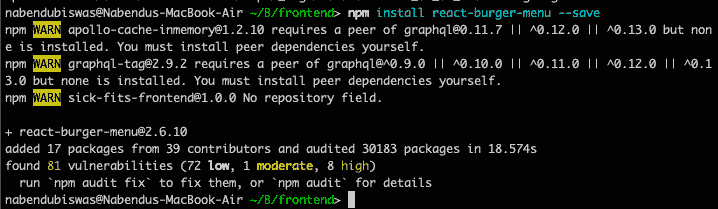
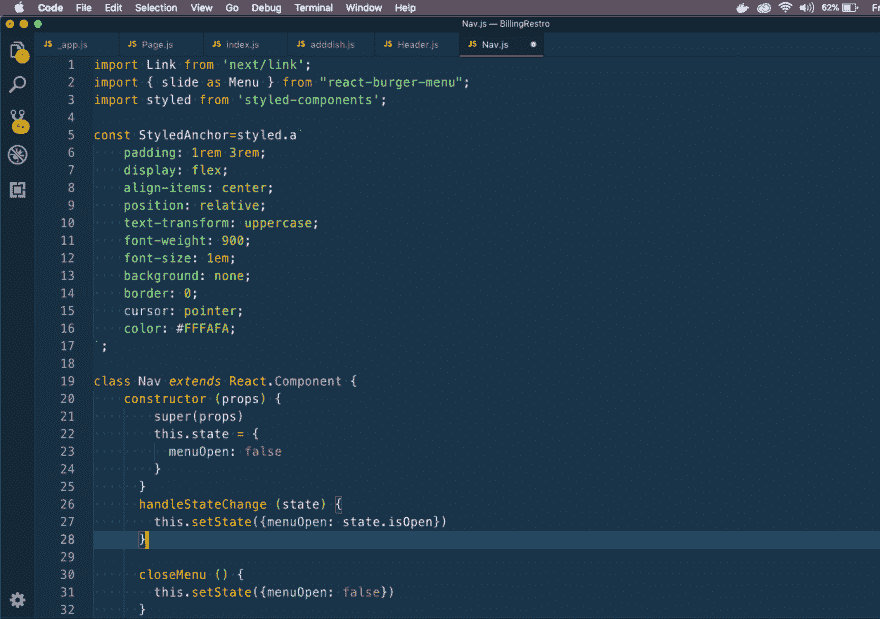
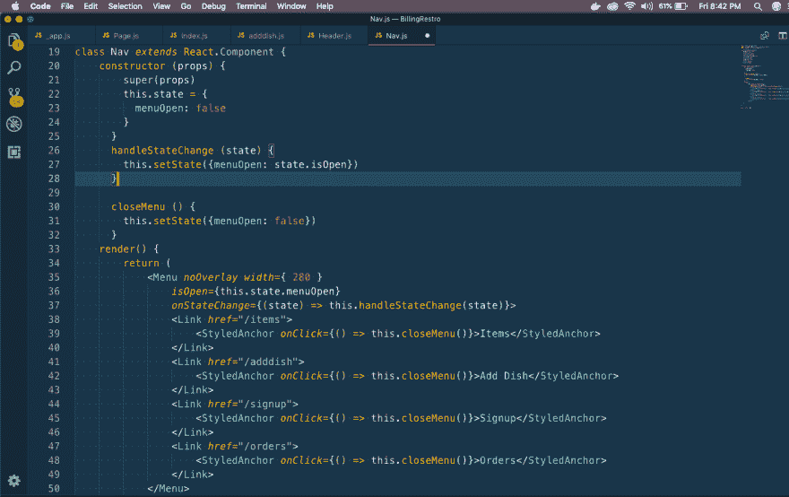
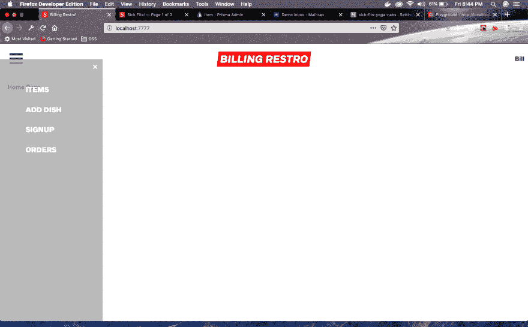

# 在 React NextJS 应用程序中创建汉堡菜单

> 原文：<https://dev.to/nabendu82/creating-a-hamburger-menu-in-react-nextjs-app-1hpb>

我最近完成了韦斯·博斯教授的令人惊叹的[高级反应](https://advancedreact.com/)课程。在他教授的课程中，他用下面列出的最新技术建立了一个在线商店。

[ ](https://res.cloudinary.com/practicaldev/image/fetch/s--WtcJe04v--/c_limit%2Cf_auto%2Cfl_progressive%2Cq_auto%2Cw_880/https://cdn-images-1.medium.com/max/2000/1%2ALz6LEo82B_i1iEVNRmHdyw.png) *最新技术*

大多数学生在学习之后，用他教的东西建造了其他东西。我将从我所学的知识中建立一个印度餐馆账单应用程序。

我会继续更新我的 github 上的应用程序，但不会在博客上给出完整的步骤。完整的步骤是复杂的，也是韦斯的版权，不想产生一个相同的课程。

我将发布我对 Wes 的电子商务应用程序所做的更改，使其成为一个餐厅计费应用程序。

现在，我不喜欢应用程序中使用的传统菜单如下。

[ ](https://res.cloudinary.com/practicaldev/image/fetch/s--MfBKWKqe--/c_limit%2Cf_auto%2Cfl_progressive%2Cq_auto%2Cw_880/https://cdn-images-1.medium.com/max/2880/1%2AXYTNRVyCMje8Yx79xxE9nA.png) *繁体菜单*

我想把它转换成一份汉堡菜单，这样它也可以很容易地在平板电脑上使用。

我们将了解一些前端流程，以制作这个汉堡菜单。NextJs 应用程序从一个文件 **_app.js** 开始，这个文件在下面的截图中。

[](https://res.cloudinary.com/practicaldev/image/fetch/s--k_h7dNRO--/c_limit%2Cf_auto%2Cfl_progressive%2Cq_auto%2Cw_880/https://cdn-images-1.medium.com/max/2880/1%2AE-pD75ZQA5LKTbsACfgPNQ.png)T3】_ app . js

接下来，我们将制作页面组件。我们有一些基本的样式组件在这里与主题一起使用，也有一个来自样式组件的 injectGlobal，用于将全局样式注入到所有组件中。

```
 import React, { Component } from "react";
    import Header from "./Header";
    import Meta from "./Meta";
    import styled, { ThemeProvider, injectGlobal } from "styled-components";

    const theme = {
    …
    …
    };

    const StyledPage = styled.div`
    background: white;
    color: ${props => props.theme.black};
    `;

    const Inner = styled.div`
    max-width: ${props => props.theme.maxWidth};
    margin: 0 auto;
    padding: 2rem;
    `;

    injectGlobal`
    @font-face {
    font-family: 'radnika_next';
    src: url('/static/radnikanext-medium-webfont.woff2') format('woff2');
    font-weight: normal;
    font-style: normal;
    }
    …
    …
    `;

    class Page extends Component {
    render() {
    return (
    <ThemeProvider theme={theme}>
    <StyledPage>
    <Meta />
    <Header />
    <Inner>{this.props.children}</Inner>
    </StyledPage>
    </ThemeProvider>
    );
    }
    }

    export default Page; 
```

我们的应用程序中也有两个页面。一个用于主页，另一个用于添加菜肴的页面。

[](https://res.cloudinary.com/practicaldev/image/fetch/s--GRJhi4V9--/c_limit%2Cf_auto%2Cfl_progressive%2Cq_auto%2Cw_880/https://cdn-images-1.medium.com/max/2000/1%2AJ6kwr960RZxbcCLFndb2yw.png)T3】index . js

[](https://res.cloudinary.com/practicaldev/image/fetch/s--qQOY6WzV--/c_limit%2Cf_auto%2Cfl_progressive%2Cq_auto%2Cw_880/https://cdn-images-1.medium.com/max/2000/1%2AuAASWE-yzlDNdGzL-afAIQ.png)T3】adddish . js

现在，我们将创建 Header 组件，它将包含我们的 Nave 菜单、标题和一个保存账单的 future 按钮。

[](https://res.cloudinary.com/practicaldev/image/fetch/s--iR7RYQhb--/c_limit%2Cf_auto%2Cfl_progressive%2Cq_auto%2Cw_880/https://cdn-images-1.medium.com/max/2000/1%2AwPHHinZotV3wwekQ72bOVA.png)T3】header . js

现在，我们将最终创建我们的汉堡菜单。为此，我们将使用**反应汉堡菜单**

[ ](https://res.cloudinary.com/practicaldev/image/fetch/s--U6E3nDgT--/c_limit%2Cf_auto%2Cfl_progressive%2Cq_auto%2Cw_880/https://cdn-images-1.medium.com/max/2000/1%2A36609e2XcEQpy0xSAAlgRg.png) *汉堡*

为了让汉堡菜单正常工作，我们必须在全局层面注入一些 css。

因此，在我们的样式化组件项目中，我们在 **injectGlobal**
中注入 **Page.js**

```
 /*Below Styles for the burger menu*/

    /* Position and sizing of burger button */

    .bm-burger-button {
    position: fixed;
    width: 36px;
    height: 30px;
    left: 26px;
    top: 26px;
    }

    /* Color/shape of burger icon bars */

    .bm-burger-bars {
    background: #373a47;
    }

    /* Color/shape of burger icon bars on hover*/

    .bm-burger-bars-hover {
    background: #a90000;
    }

    /* Position and sizing of clickable cross button */

    .bm-cross-button {
    height: 24px;
    width: 24px;
    }

    /* Color/shape of close button cross */

    .bm-cross {
    background: #FFFAFA;
    }

    /*

    Sidebar wrapper styles

    Note: Beware of modifying this element as it can break the animations - you should not need to touch it in most cases

    */

    .bm-menu-wrap {
    position: fixed;
    height: 100%;
    }

    /* General sidebar styles */

    .bm-menu {
    background: rgba(169,169,169,0.8);
    padding: 2.5em 1.5em 0;
    font-size: 1.15em;
    }

    /* Morph shape necessary with bubble or elastic */

    .bm-morph-shape {
    fill: #373a47;
    }

    /* Wrapper for item list */

    .bm-item-list {
    color: #b8b7ad;
    padding: 0.8em;
    display: flex;
    flex-direction: column;
    } 
```

现在，我们将在 **Nav.js** 中编写导航栏的代码

我们从导入链接和反应汉堡菜单开始。接下来，我们为锚标记编写一个样式组件，我们将在链接标记中使用它。

[](https://res.cloudinary.com/practicaldev/image/fetch/s--UrRxqWIP--/c_limit%2Cf_auto%2Cfl_progressive%2Cq_auto%2Cw_880/https://cdn-images-1.medium.com/max/2504/1%2AP8dxhOUnbkacdr4nK_yNtQ.png)

接下来，我们将编写菜单并给出一些自定义属性。这些都来自于反应汉堡菜单文件。请注意，每当用户单击菜单上的任何项目时，我们都使用 state 来关闭菜单。

[](https://res.cloudinary.com/practicaldev/image/fetch/s--I4rWf3E8--/c_limit%2Cf_auto%2Cfl_progressive%2Cq_auto%2Cw_880/https://cdn-images-1.medium.com/max/2802/1%2ASERRC3M4InBlDj1Y1aJiSA.png)

现在，转到 **localhost:7777** 并点击汉堡包，我们会看到右边的菜单。点击**添加菜肴**进入该页面。

[ ](https://res.cloudinary.com/practicaldev/image/fetch/s--oEZnB95l--/c_limit%2Cf_auto%2Cfl_progressive%2Cq_auto%2Cw_880/https://cdn-images-1.medium.com/max/2880/1%2Ac7Hn_d87pTbvCTqqRU2EJQ.png) *我们的 App 目前为止*

你可以在我的 github 库的[这个](https://github.com/nabendu82/BillingRestro)链接中找到相同的代码。