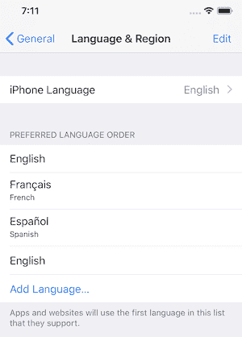

# 在 React Native 中创建多语言应用程序

> 原文：<https://dev.to/vikrantnegi/creating-a-multi-language-app-in-react-native-1joj>

语言一直是任何业务的重要组成部分。随着业务的增长，在不同的国家和地区扩展业务变得非常重要。为了在这些地区取得成功，提供本地化服务是非常重要的。

说到手机 app，条件也没什么区别。随着应用程序用户扩展到不同的国家，为用户提供以他们的母语使用应用程序的能力变得非常重要。

在本文中，我们将使用 [react-native-localize](https://github.com/react-native-community/react-native-localize) 包构建一个支持多语言的 React Native app。

## 先决条件

本教程需要 React Native 的基础知识。要设置您的开发机器，请遵循这里的官方指南。

为了确保我们在同一页上，以下是本教程中使用的版本-

*   节点 v10.15.0
*   国家预防机制 6.4.1
*   纱线 1.16.0
*   react-原生 0.59.9
*   反应-原生-本地化 1.1.3
*   i18n-js 3.3.0

## 入门

我们将建立一个 React 本地应用程序，它将支持**英语**、**法语**和**阿拉伯语**语言。

> 如果你想马上看看源代码，这里有 Github [链接](https://github.com/vikrantnegi/react-native-multi-language-app)。

要使用`react-native-cli`创建新项目，请在终端中键入以下内容:

```
$ react-native init multiLanguage 
```

```
$ cd multiLanguage 
```

#### 添加所需库

通过键入以下命令安装【T0:】T1

```
$ yarn add react-native-localize 
```

然后使用
链接它

```
$ react-native link react-native-localize 
```

> 如果您在安装过程中遇到任何错误，请查看此处的安装说明[。](https://github.com/react-native-community/react-native-localize#setup)

`react-native-localize` lib 让您可以访问许多与本地化相关的设备常量，但是没有 i18n lib。

我们将使用 [`I18n.js`](https://github.com/fnando/i18n-js) 来提供 JavaScript 上的 I18n 翻译。

```
$ yarn add i18n-js 
```

由于`i18n-js`似乎没有提供任何缓存/内存化，我们将使用`lodash.memoize`来实现同样的目的。

```
$ yarn add lodash.memoize 
```

## 添加翻译

在`src`中创建一个`translations`目录，然后为每种语言创建三个 JSON 文件，如下所示。

1.  `en.json`对于英语
2.  `fr.json`为法语
3.  `ar.json`为阿拉伯语

在这些文件中有 JSON 对象，带有键和值。

键对于每种语言都是相同的，并将在应用程序中用于显示文本。

该值将是我们想要向用户显示的实际翻译，并且对于每种语言都是不同的。

英语:

```
{
  "hello": "Hello World!"
} 
```

法语:

```
{
  "hello": "Salut le Monde!"
} 
```

对于阿拉伯语:

```
{
  "hello": "أهلاً بالعالم"
} 
```

同样，您可以为应用程序中使用的每个文本添加更多的键值对。

## 添加主代码

打开`App.js`文件并导入以下内容:

```
import React from "react";
import * as RNLocalize from "react-native-localize";
import i18n from "i18n-js";
import memoize from "lodash.memoize"; // Use for caching/memoize for better performance

import {
  I18nManager,
  SafeAreaView,
  ScrollView,
  StyleSheet,
  Text,
  View
} from "react-native"; 
```

之后，我们将添加一些稍后会用到的辅助函数和常量。

```
const translationGetters = {
  // lazy requires (metro bundler does not support symlinks)
  ar: () => require("./src/translations/ar.json"),
  en: () => require("./src/translations/en.json"),
  fr: () => require("./src/translations/fr.json")
};

const translate = memoize(
  (key, config) => i18n.t(key, config),
  (key, config) => (config ? key + JSON.stringify(config) : key)
);

const setI18nConfig = () => {
  // fallback if no available language fits
  const fallback = { languageTag: "en", isRTL: false };

  const { languageTag, isRTL } =
    RNLocalize.findBestAvailableLanguage(Object.keys(translationGetters)) ||
    fallback;

  // clear translation cache
  translate.cache.clear();
  // update layout direction
  I18nManager.forceRTL(isRTL);
  // set i18n-js config
  i18n.translations = { [languageTag]: translationGetters[languageTag]() };
  i18n.locale = languageTag;
}; 
```

现在，我们将创建我们的`App`类组件。

```
export default class App extends React.Component {
  constructor(props) {
    super(props);
    setI18nConfig(); // set initial config
  }

  componentDidMount() {
    RNLocalize.addEventListener("change", this.handleLocalizationChange);
  }

  componentWillUnmount() {
    RNLocalize.removeEventListener("change", this.handleLocalizationChange);
  }

  handleLocalizationChange = () => {
    setI18nConfig();
    this.forceUpdate();
  };

  render() {
    return (
      <SafeAreaView style={styles.safeArea}>
        <Text style={styles.value}>{translate("hello")}</Text>
      </SafeAreaView>
    );
  }
}

const styles = StyleSheet.create({
  safeArea: {
    backgroundColor: "white",
    flex: 1,
    alignItems: "center",
    justifyContent: "center"
  },
  value: {
    fontSize: 18
  }
}); 
```

在我们的构造函数方法中，我们调用了`setI18nConfig()`来设置初始配置。

然后在`componentDidMount()`中，我们将添加一个事件监听器，它将监听任何变化，如果发生任何变化，就调用`handleLocalizationChange()`。

`handleLocalizationChange()`方法做两件事，一是它触发`setI18nConfig()`和`forceUpdate()`。这对于 Android 设备来说是必要的，因为组件需要重新渲染才能看到变化。

我们将删除`componentWillUnmount()`生命周期方法中的监听器。

最后，在`render()`中，我们将使用`translate()`打印出`hello`，并将我们的`key`作为参数传递给它。然后，它会自动计算出语言和需要为该语言显示的文本。

## 运行 App

现在是时候看看我们的翻译是否有效了。

通过键入:
在模拟器或仿真器中运行您的应用程序

```
$ react-native run-ios 
```

```
$ react-native run-android 
```

应该是这样的:

[](https://res.cloudinary.com/practicaldev/image/fetch/s--gMyDmYLF--/c_limit%2Cf_auto%2Cfl_progressive%2Cq_auto%2Cw_880/https://thepracticaldev.s3.amazonaws.com/i/cdi7x7lta93kbzjo0t80.png)

现在，将设备语言设置更改为法语，然后再次打开应用程序。

[](https://res.cloudinary.com/practicaldev/image/fetch/s--Bhd_OcQS--/c_limit%2Cf_auto%2Cfl_progressive%2Cq_auto%2Cw_880/https://thepracticaldev.s3.amazonaws.com/i/smekwd55qpvnlgvewzzo.png)

同样，您可以将语言设置更改为阿拉伯语，然后看到阿拉伯语的 hello。

到目前为止非常好。

但是，如果我选择一些随机的语言，而这些语言的翻译没有添加到应用程序中，会发生什么呢？会回落到什么语言？

事实证明,`findBestAvailableLanguage`的目标是返回最佳翻译。因此，它会查看您的语言偏好设置，以确定备用语言。

如果你进入 iOS 模拟器中的**语言&地区**设置，你可以看到语言的优先顺序。

[](https://res.cloudinary.com/practicaldev/image/fetch/s--_kMTzGUN--/c_limit%2Cf_auto%2Cfl_progressive%2Cq_auto%2Cw_880/https://thepracticaldev.s3.amazonaws.com/i/jwd7qsj50g2rcff925r0.png)

如果选择的语言不是首选语言`findBestAvailableLanguage`返回`undefined`(因此保留的值将是您的[后备](https://github.com/vikrantnegi/react-native-multi-language-app/blob/master/App.js#L25))，因为您的翻译中没有用户首选的语言。

### 奖金

`react-native-localize`具有 API，可提供对批次本地化相关设备常量的访问。请务必查看[文档](https://github.com/react-native-community/react-native-localize#api)中提供的完整 API。

## 结论

添加多语言支持就是这么简单。您现在可以使用 react-native-localize 轻松地在您的应用程序中提供多语言支持，这有助于提高用户的应用程序使用率。

在 Github repo [这里](https://github.com/vikrantnegi/react-native-multi-language-app)找到源代码。

> 最初发表于[媒体](https://medium.com/better-programming/creating-a-multi-language-app-in-react-native-9828b138c274)

如果你喜欢这篇文章，就去表达你的爱和分享吧。