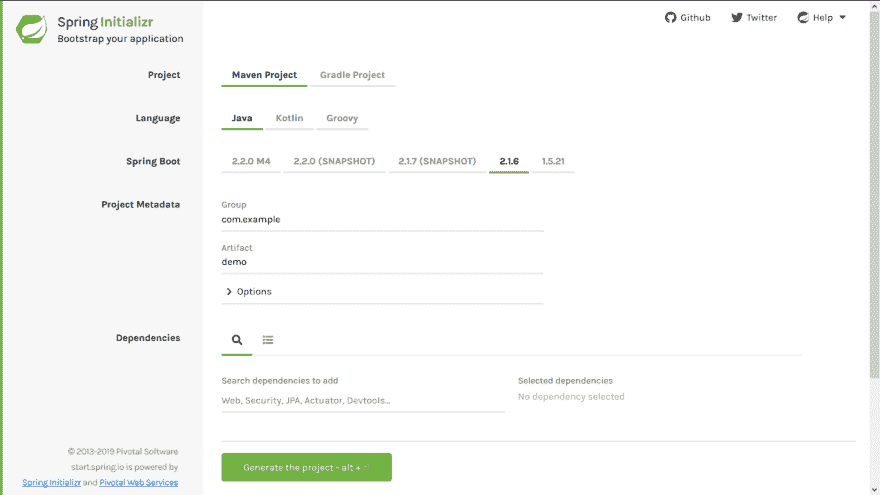
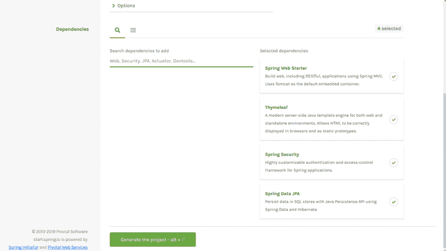
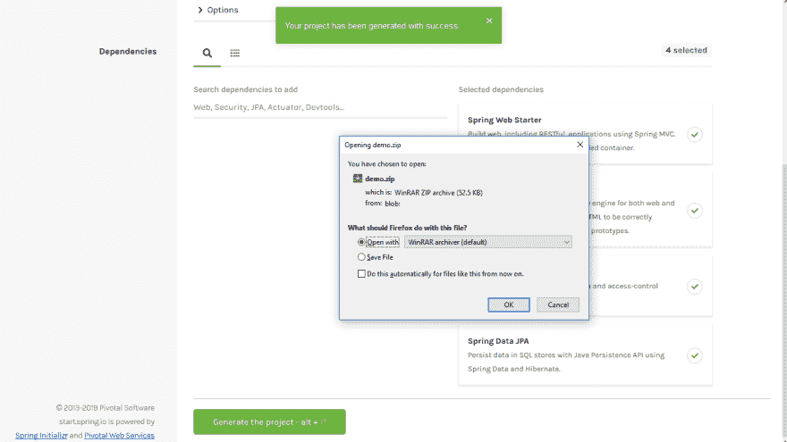
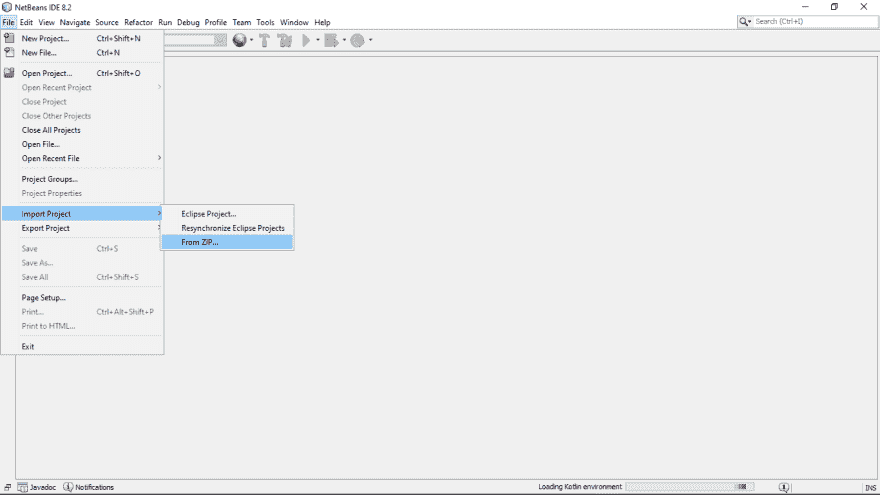
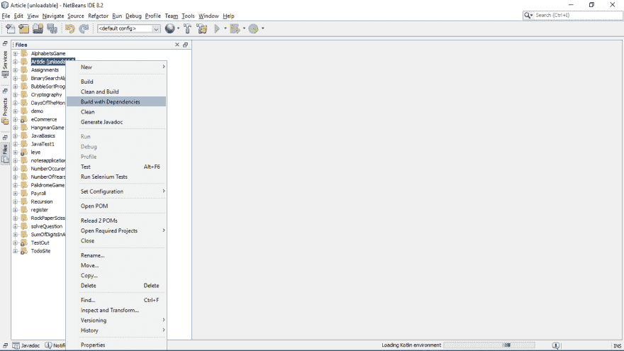
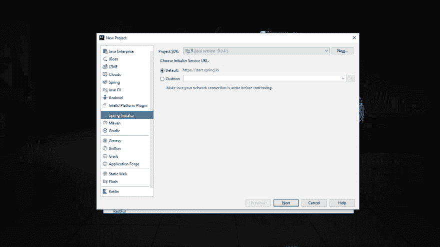
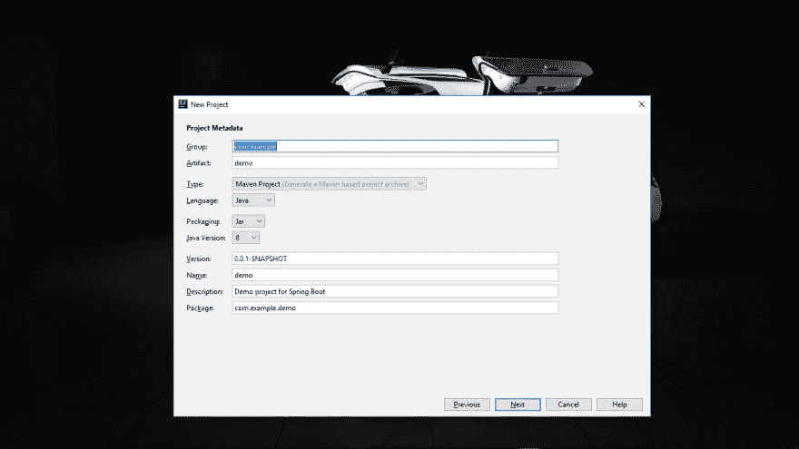
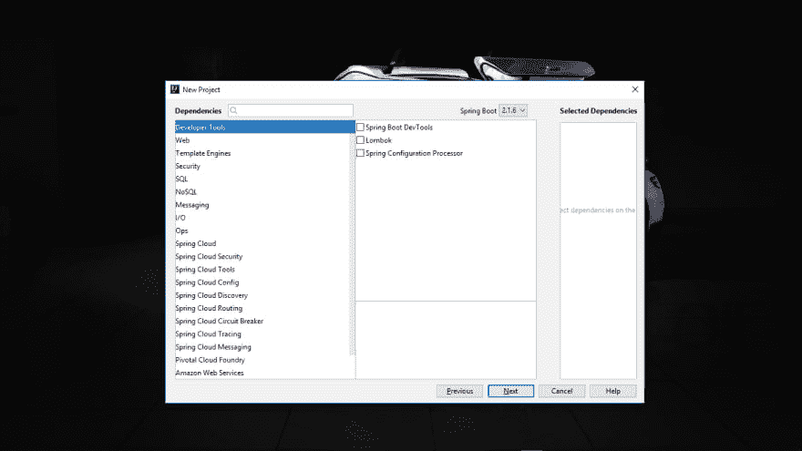
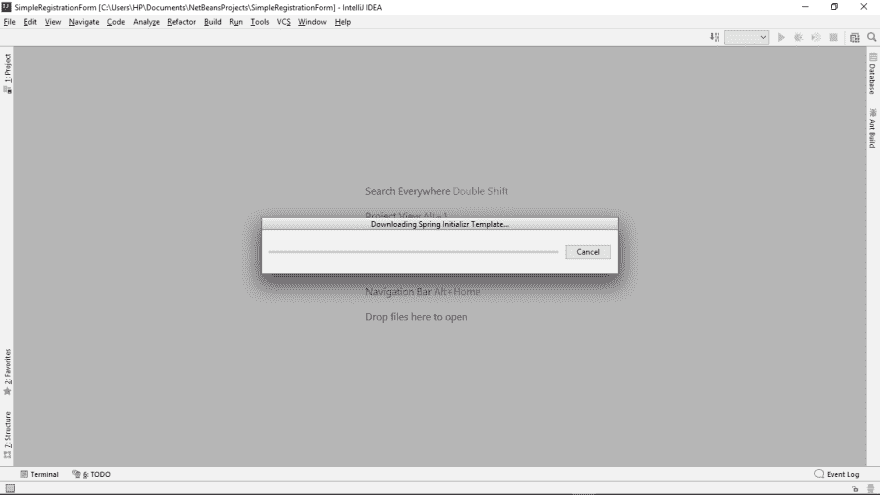

# 创建新的 Spring Boot 项目

> 原文：<https://dev.to/kvngston/creating-a-new-spring-boot-project-6l2>

## 要求

*   浏览器
*   IDE Intellij、Netbeans 或 Eclipse
*   稳定的互联网连接

对于本文，我们将只关注两个 IDEs Intellij 和 Netbeans。

## 用于 Netbeans IDE

### 第一步:打开浏览器，导航到[春初日](https://start.spring.io/)

### 第二步:选择你的语言

### 第三步:选择 Spring Boot 的版本

### 第四步:选择依赖关系

使用的依赖项取决于项目。根据项目选择。例如，带有 Html 和 CSS 的简单注册表单将需要以下主要依赖项

*   弹簧网启动器
*   百里香叶
*   春天安全
*   春季数据 JPA

### 第五步:点击页面底部的生成项目。

这将下载一个 ZIP 文件，其中包含刚刚选择的依赖项。

### 第六步:在 Netbeans 中导入 ZIP 文件

### 第 7 步:构建具有依赖项的项目

> 这需要一些时间。
> 
> 您必须有稳定的互联网连接

## 下载完成后，你就可以开始了！

* * *

* * *

## 为 IDEA 智能智能

### 第一步:在 Intellij 中创建新项目

### 第二步:创建一个新的 Spring Initializr 项目

### 第三步:选择语言和其他元数据

就像在 Spring Initializr 网站上，它是有要求的。

### 第四步:选择需要的依赖项

## 下载完成后，你就可以开始了

> 你需要一个稳定的互联网连接
> 
> 根据您的网速，这将需要几分钟时间

# 快乐编码！！