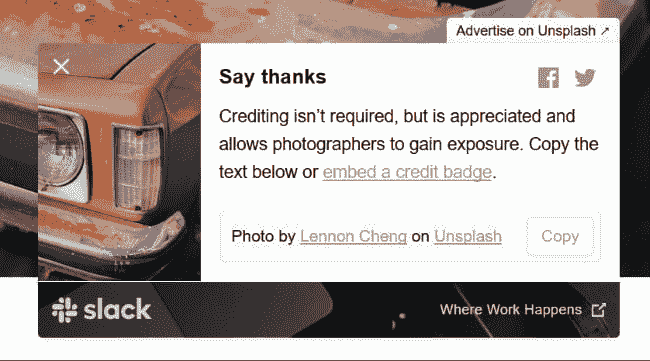
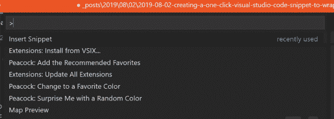

# 创建一个单击式 Visual Studio 代码段来包装内容

> 原文：<https://dev.to/raymondcamden/creating-a-one-click-visual-studio-code-snippet-to-wrap-content-416a>

这里有一个关于 Visual Studio 代码片段的快速提示。如果您不知道，代码片断可以让您定义关键字快捷方式，以便在代码中快速输入内容。我为我的博客定制了一堆。比如:

```
"uns":{
    "scope":"markdown",
    "prefix":"uns",
    "body":[
        "<i>Header photo by <a href=\"$1\">$2</a> on Unsplash</i>"
    ],
    "description": "Unsplash credit"
} 
```

这是我在大多数博客条目中使用的用于我的 [Unsplash](https://unsplash.com/) 信用文本的片段。Unsplash 有你可以免费使用的*神奇*艺术品。他们要求你给他们积分，我想这是我能做的最起码的事情，但是他们的“复制”按钮只复制积分的文本，而不是链接:

[](https://res.cloudinary.com/practicaldev/image/fetch/s--VyV4iqYz--/c_limit%2Cf_auto%2Cfl_progressive%2Cq_auto%2Cw_880/https://static.raymondcamden.cimg/2019/08/vs1.png)

我构建了一个片段，这样我可以快速插入适当的文本，然后手动复制 URL。然后我输入图片作者的名字。

另一个我用的是我的图像。我把我所有的照片都保存在亚马逊 S3 上。这个代码片段不仅输出正确的基本 URL，还输出一个动态的年份和月份，与我使用的组织规则相匹配。

```
"img": {
    "prefix": "img",
    "body": [
        ""
    ],
    "description": "Used for images"
} 
```

好了，记住这一点，我昨天意识到我需要一个非常具体的用例的新片段。我使用 Jekyll 作为我的静态站点生成器。我也写了很多关于 Vue.js 的文章。恰好 Jekyll 和 Vue 都使用相同的标记来引用变量——双括号。所以比如:`{{ name }}`。当我写一篇包含 Vue 代码的博客文章时，Jekyll 会选择变量并尝试呈现值，这通常只会导致空白。

幸运的是有一个简单的方法，用``和``包装内容。(而且要把*那*的文字给渲染得乱七八糟！)我想看看能不能构建一个 Visual Studio 代码片段，让我选择一些文本，按一个键，然后用上面的代码包装它。原来花了几个步骤。

首先，我定义了我的代码片段:

```
"raw": {
    "scope": "markdown",
    "prefix": "raw",
    "body": [
        "$TM_SELECTED_TEXT"
    ],
    "description": "Escape Vue"
} 
```

我使用特殊变量`$TM_SELECTED_TEXT`来表示当前选中的文本。这很有效，但是我通常通过输入前缀并点击空格键来激活代码片段。这不适用于选定的文本。

幸运的是，有一个 F1 命令可以让你选择并执行它:

[](https://res.cloudinary.com/practicaldev/image/fetch/s--vtNY1Em7--/c_limit%2Cf_auto%2Cfl_progressive%2Cq_auto%2Cw_880/https://static.raymondcamden.cimg/2019/08/vs2.png)

这是可行的，但是需要点击 3 次。我想做的只是有一个键盘快捷键来做同样的事情。幸运的是，[也支持](https://code.visualstudio.com/docs/getstarted/keybindings)。我打开我的`keybindings.json`加了:

```
{
  "key": "ctrl+r",
  "command": "editor.action.insertSnippet",
  "when": "editorHasSelection",
  "args": {
    "langId": "markdown",
    "name": "raw"
  }
} 
```

我指定了我的代码片段的语言和名称，还设置了它只在我有一个活动选择时才起作用。现在我只需选择一些 Vue 代码，点击`ctrl+r`，就可以开始了。

*标题图片由[安德鲁·尼尔](https://unsplash.com/@andrewtneel?utm_source=unsplash&utm_medium=referral&utm_content=creditCopyText)在 Unsplash 上*