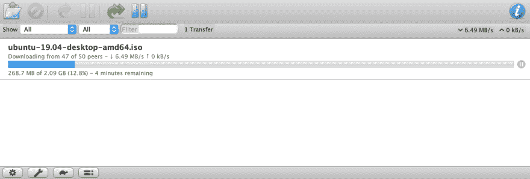
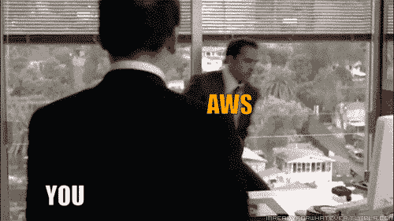

# 在 AWS 上使用 Terraform、Transmission 和 Docker 创建远程 BitTorrent 盒子

> 原文：<https://dev.to/willdady/creating-a-remote-bittorrent-box-with-terraform-transmission-and-docker-on-aws-2m40>

最近，随着我越来越多地接触 AWS，我的思绪一直在 DevOps 领域。我开始思考我不久前的一个想法...在 AWS 上运行一个短暂的 BitTorrent 客户端并自动将下载保存到 S3 会涉及到什么？

我的最终目标是能够从命令行启动和关闭远程 BitTorrent 客户端。我知道我想运行 [Transmission](https://transmissionbt.com/) ,因为它有一个添加和删除种子以及监控下载的网络界面。

## VPN

因为我在云中托管它，所以我真的希望 BitTorrent 流量通过 VPN 路由，而不是直接到主机实例。当我第一次尝试这个想法时，我首先通过 AWS 控制台启动 t2.micro 实例，通过 SSH 连接并直接在主机上安装 OpenVPN。我很快发现了比通过 SSH 连接到主机时启动 OpenVPN 更难的方法，因为我猜默认情况下它会接管主机的网络流量，立即断开我的 SSH 连接并阻塞服务器，直到它通过 AWS 控制台重新启动。

这让我找到了 Docker。将 OpenVPN 容器化似乎是一个更明智的解决方案，因为它允许我 SSH 到主机实例来修改设置。我想一定有人已经创建了一个 OpenVPN docker 映像，在谷歌搜索后，我发现 github 用户 [haugene](https://github.com/haugene) 已经创建了一个名副其实的映像，[docker-transmission-OpenVPN](https://github.com/haugene/docker-transmission-openvpn)，它将 OpenVPN 和 Transmission 捆绑在一起。奖金！

## 将完成的下载同步到 S3

一旦下载完成，传输拷贝文件到`/data/completed`目录。我需要找到一种方法来自动将下载完成的内容复制到 S3。为此，我决定在 Go 中编写自己的实用程序，它将简单地监视新文件目录的内容，并将它们上传到 S3 桶中。这个工具叫做 [go-watch-s3](https://github.com/willdady/go-watch-s3) ，我在这里有一篇关于这个[的专门博客。](https://willdady.com/uploading-new-files-to-s3-with-golang)

传输容器和运行 go-watch-s3 的容器共享一个绑定安装的目录，因此当传输将文件写入它的`/data/completed`目录时，go-watch-s3 会看到新文件并上传它们。相当整洁！

## 使用 Terraform 供应实例

供应由设置我们基础设施的 [Terraform](https://www.terraform.io/) 配置处理。它创建 EC2 实例、安全组，以便我们可以访问传输 UI，以及适当的 IAM 角色、策略和实例配置文件，以便实例能够将文件写入我们现有的 S3 存储桶。

在实例上安装软件是作为用户数据脚本的一部分来处理的，该脚本在实例首次启动时运行，并被定义为 Terraform 中的 **aws_instance** 资源类型的一部分。这个脚本实际上相对简单，因为它只是安装 Docker，拉上面提到的图像并运行它们。我曾考虑过使用 [Docker Compose](https://docs.docker.com/compose/) ，因为在编排多个容器时，这通常是一种更好的体验，但我还是选择了普通的 docker run 命令。

最后，剩下要做的就是应用带有`terraform apply`的配置在 AWS 上创建我们的资源。一旦应用了配置，传输 web UI 的 url 将被输出，但是您需要等待几分钟，以便启动脚本完成它的工作。一旦用户界面可用，种子可以添加完成下载自动神奇地复制到 S3！

一旦你完成了，摧毁你刚刚创建的基础设施可以用`terraform destroy`拆掉。

## 陈述明显的事实

总之，我觉得这是一个有趣的“玩具”项目，尽管我个人不觉得有必要进一步改进它。如果你愿意，痒已经被抓破了。要查看完整的 Terraform 配置，请查看 github 上的[terra form-transmission-AWS](https://github.com/willdady/terraform-transmission-aws)。

虽然从纯技术的角度来看，BitTorrent 没有什么不合法的，但盗版内容可能会让你很快受到 AWS 的谴责，或者更糟的是，你的帐户被关闭。

