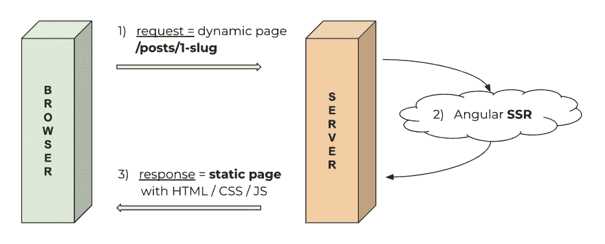
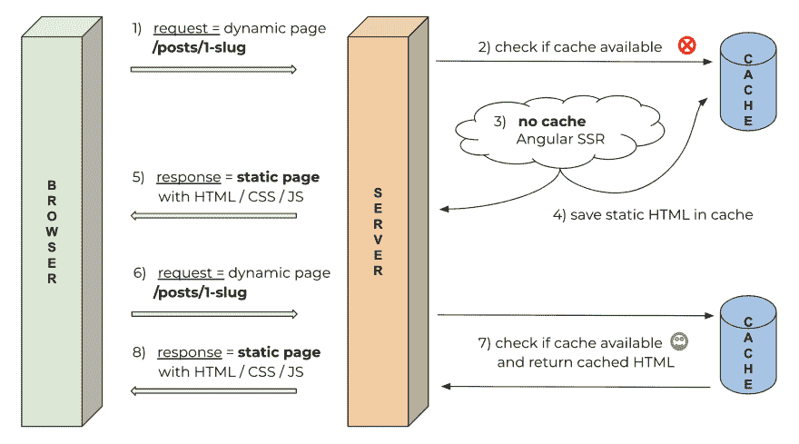

# 为 Angular Universal 网站或应用程序创建一个简单的内存缓存

> 原文：<https://dev.to/angular/creating-a-simple-memory-cache-for-your-angular-universal-website-or-application-kdc>

*最初发布于[https://samvloeberghs . be](https://samvloeberghs.be/posts/creating-a-simple-memory-cache-for-your-angular-universal-website-or-application)2019 年 6 月 14 日*

## 目标受众

这篇关于**为 Angular Universal 网站或应用程序**设置简单内存缓存的文章和指南面向那些优化服务器以获得更好性能的开发人员。目标是**避免在没有必要的情况下在服务器上重新呈现应用程序的页面**。相反，我们将缓存先前生成的内容，并在后续请求时从缓存中提供这些内容。

这个概念当然不局限于 Angular 应用程序或任何其他网络应用程序框架或技术。服务器优化广泛采用的**惯例是最小化处理器的负载。所解释的概念可以很容易地适用于您选择的框架或技术。**

## 我们的应用举例

为了解释基础知识并证明这个概念，我们必须考虑一个示例应用程序，比如我的简单博客。这个 Angular Universal 实现有一些包含组件内容的**静态页面**和**动态页面，将 blogposts 从 JSON 数据源**加载到组件中。

例如，我们有静态的[/关于](https://samvloeberghs.be/about)路线和动态的博客发布路线[/发布/滚动到顶端角度路由器导航](https://samvloeberghs.be/posts/scroll-to-top-on-angular-router-navigation)。Angular Universal 能够知道应用程序和 blogpost 何时完全生成。**一旦应用程序稳定下来，静态 HTML 就会被检索并作为请求的响应发送回来。**

### 用于基本渲染的简单示意图

[](https://res.cloudinary.com/practicaldev/image/fetch/s--F_Fs08H0--/c_limit%2Cf_auto%2Cfl_progressive%2Cq_auto%2Cw_880/https://thepracticaldev.s3.amazonaws.com/i/y3sfq5ye063ex1lhzncm.png)

上图显示了角度通用渲染流程的最基本的例子。让我们完成所示的步骤:

1.  浏览器向服务器请求特定的页面，例如动态页面[/posts/scroll-to-top-on-angular-router-navigation](https://samvloeberghs.be/posts/scroll-to-top-on-angular-router-navigation)。
2.  服务器接收请求，并通过从 JSON 数据源获取内容来呈现 Angular 应用程序。
3.  渲染器输出静态 HTML，服务器在对浏览器的响应中将其返回。

### 代码为基本渲染

这个基本渲染案例的代码可以通过 Angular CLI 获得。Angular 网站上的[官方文档会让你很快上手](https://angular.io/guide/universal)。为了这个教程，**下面的代码是我们用例**中最重要的代码:

```
// basic-angular-universal-server-setup.ts

// These are important and needed before anything else
import 'zone.js/dist/zone-node';
import 'reflect-metadata';

import { renderModuleFactory } from '@angular/platform-server';
import { enableProdMode } from '@angular/core';
import * as express from 'express';
import { join } from 'path';
import { readFileSync } from 'fs';

// * NOTE :: leave this as require() since this file is built Dynamically from webpack
const { AppServerModuleNgFactory, LAZY_MODULE_MAP } = require('../../../dist/samvloeberghs/server/main');
const { provideModuleMap } = require('@nguniversal/module-map-ngfactory-loader');

// Faster server renders w/ prod mode
enableProdMode();

// Express server
const app = express();
const PORT = 80;
const DIST_FOLDER = join(process.cwd(), 'server', 'samvloeberghs');

app.set('view engine', 'html');
app.set('views', join(DIST_FOLDER, 'browser'));

// serve static files from /browser
app.get('*.*', express.static(join(DIST_FOLDER, 'browser')));

// Our index.html we'll use as our template
const template = readFileSync(join(DIST_FOLDER, 'browser', 'index.html')).toString();

app.engine('html', (_, options, callback) => {
  renderModuleFactory(AppServerModuleNgFactory, {
    document: template,
    url: options.req.url,
    extraProviders: [
      provideModuleMap(LAZY_MODULE_MAP),
    ],
  }).then(html => {
    callback(null, html);
  });
});

const ngApp = (req, res) => {
  const config = {
    req,
    res,
    preboot: true,
    baseUrl: '/',
    requestUrl: req.originalUrl,
    originUrl: 'https://samvloeberghs.be',
  };

  res.render('index', config);
};

app.get('*', ngApp);

// Start up the Node server
app.listen(PORT, () => {
    console.log(`Node server listening on port ${PORT}`);
}); 
```

`res.render`将自动返回 200 响应，带有您的 Angular 应用程序的服务器端呈现页面的静态 HTML。稍后我们将学习如何连接到这个。

剩下的都是 Express 框架和通用配置。如果您想了解更多关于上面显示的代码和配置，请[按照任何教程在 NodeJS](https://www.google.com/search?q=angular+universal) 中设置您的第一个通用应用程序。你也可以在博文末尾的“进一步阅读”部分找到一些相关链接。

## 为什么缓存？

我们的示例路线或页面的内容不太可能经常改变，所以绝对没有必要在每次页面被请求时呈现 Angular 应用程序。我们可以简单地缓存第一次访问时生成的 HTML，将其存储在内存缓存中，并在下一个访问者访问您的网站时检索它。

一旦内容发生变化，我们需要清除缓存，让缓存重新生成。这可能发生在你更新的页面第一次被访问的时候，但是其他的策略也是可能的。

## 一个简单的内存缓存实现

[](https://res.cloudinary.com/practicaldev/image/fetch/s--u3ELfeOp--/c_limit%2Cf_auto%2Cfl_progressive%2Cq_auto%2Cw_880/https://thepracticaldev.s3.amazonaws.com/i/6wv0d7o5m06gp1u6ngts.png)

让我们用一个简单的缓存机制来扩展我们之前的通用基本渲染图。上图直观地向我们展示了我们需要做些什么，但让我们一步一步地来看:

1.  浏览器向服务器请求特定的页面，例如动态页面[/posts/scroll-to-top-on-angular-router-navigation](https://samvloeberghs.be/posts/scroll-to-top-on-angular-router-navigation)。
2.  服务器检查是否有可用的页面缓存版本。我们第一次访问页面时，没有缓存版本。
3.  服务器接收请求，并通过从 JSON 数据源获取内容来呈现 Angular 应用程序。
4.  服务器输出静态 HTML 并将其存储在缓存中。
5.  服务器返回相同的静态 HTML 作为对浏览器的响应。
6.  下一个访问者访问完全相同的页面。
7.  您可能已经看到它的到来，服务器再次检查是否有可用的缓存版本，并从缓存注册表中读取它。
8.  服务器将缓存的静态 HTML 作为响应返回给浏览器。

如你所见，这不是火箭科学。这只是一点额外的有趣工作，实现我们的简单缓存，并修改服务器端渲染的基本代码。在接下来的部分中，我们将了解到达到这个目标所需的额外代码是最少的，并且很容易设置。

### [T1】我们简单的内存缓存机制](#our-simple-inmemory-caching-mechanism)

首先，让我们看看**我们的缓存实现**会是什么样子。我们需要一个简单的 CRUD 接口来**更新、读取和删除我们的缓存条目**。通过使用包[内存缓存](https://www.npmjs.com/package/memory-cache)，我们获得了开箱所需的功能！API 非常清晰:

```
// memory-cache-interface.ts

const cache = require('memory-cache');

// set or overwrite a value in the cache
cache.put('foo', 'bar');

// retrieve value from the cache
const cachedValue = cache.get('foo');

// delete key from cache
cache.del('foo');

// clear cache completely
cache.clear(); 
```

### 代码用于缓存渲染

如前所述，`res.render`是渲染魔法发生的地方。默认情况下,`res.render('index', config)`在响应中返回静态 HTML。`res.render`也接受一个可选的回调，我们可以用我们的自定义行为来实现它。我们可以从我们的基本示例中扩展突出显示的`ngApp`函数，而不缓存:

```
// simple-cache-setup.ts

const ngApp = (req, res) => {
  const config = {
    req,
    res,
    preboot: true,
    baseUrl: '/',
    requestUrl: req.originalUrl,
    originUrl: 'http://localhost:80',
  };

  const allowedPages = ['/', '/about', '/contact'];

  if (allowedPages.includes(req.originalUrl)) {
    const entry = cache.get(req.originalUrl); // check if we have a cache entry
    if (entry) {
      res.send(entry);                        // send the cache entry
    } else {
      res.render('index', config, (err, html) => {
        cache.put(req.originalUrl, html);     // save the HTML in the cache
        res.send(html);
      });
    }
  } else {
    res.render('index', config);              // just render with no cache
  }
}; 
```

让我们浏览一下代码，解释一下发生了什么:

1.  第 13 行是第一次检查，通过检查请求的 URL 是否允许缓存，看我们是否应该为这个特定的请求利用缓存。
2.  接下来，我们检查这个请求是否有缓存条目。如果是这样，我们返回缓存的 HTML。
3.  如果这个请求没有缓存条目，我们继续使用普通的通用 SSR，在作为响应返回之前，我们将结果 HTML 保存在缓存中。

### 仅缓存现有页面

小心你缓存的东西！您应该只缓存应用程序或网站上实际存在的页面，或者缓存有意义的页面。所以**避免缓存不存在的页面**。这可能会导致服务器出现内存问题..

恶意访问者唯一要做的就是访问无限量的不存在的变体(`/about1`，`/about2`，...)的现有页面(`/about`)，你的(内存)缓存将会被 404 未找到的页面淹没。因此，你的服务器将变得非常慢，甚至可能最终崩溃。

减轻这种风险的一个简单方法是使用 sitemap.xml(的一种变体)将允许的页面列入白名单。这是在上面代码的第 11-13 行实现的。在这种情况下，我们只允许缓存`/`、`/about`和`/contact`页面。

## 可能的扩展和改进

上面解释的概念仅仅触及了实现缓存策略和基础设施的基础。有几种可能的改进，我将简单解释一下。

1.  在构建时生成静态版本
2.  为您的缓存创建一个接口
3.  使用单独的缓存层
4.  服务器端仅呈现特定页面
5.  使用基于文件的缓存，而不是内存缓存

### 在构建时生成你的静态版本

我们可以**在构建时生成应用程序所有页面的静态版本，而不是让网站的第一个访问者负责生成特定页面的第一个缓存版本。**

例如，我们可以在[生成我们的 sitemap.xml](https://support.google.com/webmasters/answer/183668?hl=en) 之后这样做。此时，我们知道我们的应用程序/网站的所有可用 URL，我们可以生成这些页面的静态版本，并将它们放在缓存中。

### 为你的缓存创建一个接口

维护这样一个小网站的缓存是很容易的。每次有新版本时，我都会完全清空缓存。特定页面的第一个访问者现在负责创建缓存版本。

在更大的应用**中，需要一个动态更新和清理缓存**的接口。例如，当使用 CMS 添加页面或 blogpost 时，您可以在保存内容后立即触发缓存请求。如果你删除了一个页面，你可以抛出缓存，以确保你的访问者不会看到一个已经被删除的页面。

确保在这个接口上实现一些安全措施。你不希望有人恶意破坏你的缓存。

### 使用单独的缓存层

在这个例子中，我们已经在服务应用程序级别实现了**缓存。**这将我们的服务器软件直接耦合到缓存基础设施。更高级的方法是在应用服务器之前安装一个缓存层。

这可以是一个完全不同的(虚拟)机器，也可以作为一个额外的服务在运行 Node.js Express 服务器的机器上运行。这样我们就可以**将我们的缓存基础设施与我们的服务应用**完全分离。

### 服务器端只渲染特定页面

在某些情况下，可能不需要对应用程序的所有页面进行 SSR 和缓存。您的应用程序可能有一个面向公众的部分和一个需要登录的私有部分。私有部分的内容可能非常不稳定，因此缓存可能不是最佳选择。

```
// selective-ssr-and-cache.ts

// Our index.html we'll use as our template
const template = readFileSync(join(DIST_FOLDER, 'browser', 'index.html')).toString();

app.engine('html', (_, options, callback) => {
  renderModuleFactory(AppServerModuleNgFactory, {
    document: template,
    // ...
  }).then(html => {
    callback(null, html);
  });
});

const cache = require('memory-cache');

const ngApp = (req, res) => {
  const config = {
    // ...
  };

  const allowedPages = ['/', '/about', '/contact'];

  if (allowedPages.includes(req.originalUrl)) {
    // ...
  } else {
    res.send(template); // just return the template
  }
}; 
```

与缓存示例相比，我们没有太大的变化。我们现在唯一要做的是直接返回第 2 行导入的原始模板，以防请求不应该被 SSRed 和缓存。这是您的原始`index.html`文件，因此将它作为对浏览器的响应返回只会让浏览器引导您的 Angular 应用程序。

### 使用基于文件的缓存，而不是内存缓存

使用内存中的缓存只是一种选择。如果由于某种原因，你没有太多可用的 RAM，但是你有足够的磁盘空间，你可以选择一个位于文件系统上的缓存。条目就像保存在磁盘上的静态 HTML 文件一样。我看到的唯一缺点是**潜在的额外 I/O 开销**读取和写入文件引入了。

## 结论

建立一个简单的内存缓存并不是火箭科学，只需要对我们的通用设置做最小的改动。使用内存缓存的基本思想很容易扩展到例如文件缓存。让它适应你的需要很容易，因为我们可以挂钩到渲染过程。

我们必须记住这是一个非常基本的设置，如果我们要在更大的应用程序和项目中使用它，就需要扩展和改进。

## 进一步阅读

*   服务器端渲染(SSR):Angular Universal 简介
*   [Angular Universal &服务器端渲染深潜](https://medium.com/@MarkPieszak/angular-universal-server-side-rendering-deep-dive-dc442a6be7b7)
*   [管理你的网站地图——创建并提交一个网站地图](https://support.google.com/webmasters/answer/183668?hl=en)

## 特别感谢

*   [弗雷德里克价格](https://twitter.com/frederikprijck)

感谢您审阅这篇文章并提供宝贵的反馈！

*最初发布于[https://samvloeberghs . be](https://samvloeberghs.be/posts/creating-a-simple-memory-cache-for-your-angular-universal-website-or-application)2019 年 6 月 14 日*