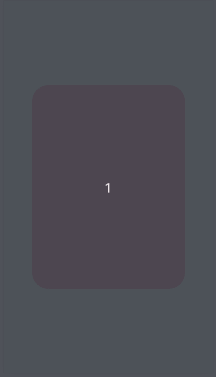
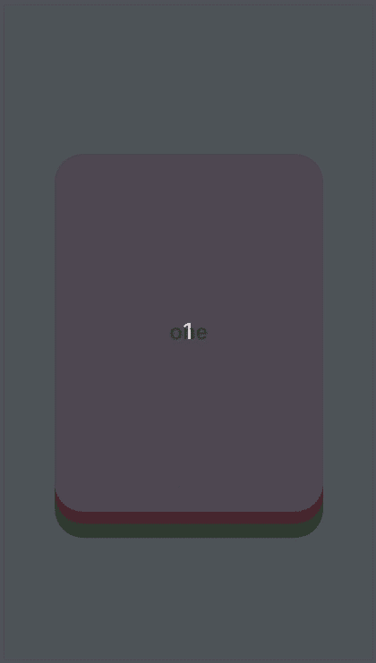
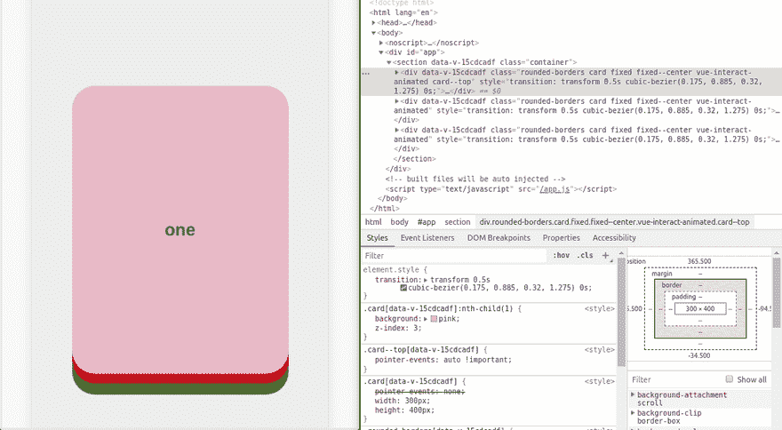
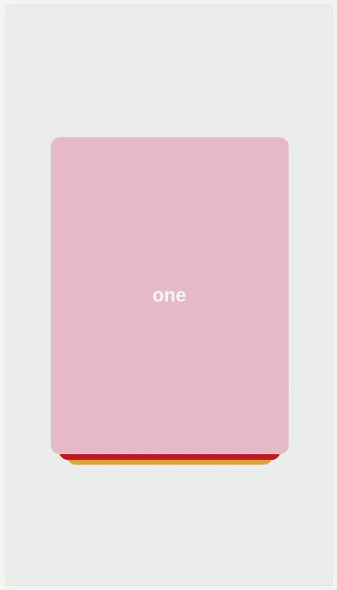
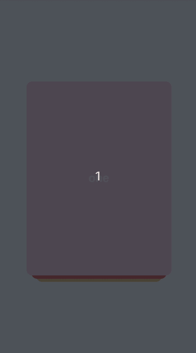
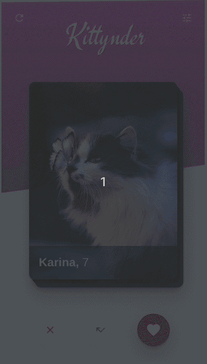

# 在 Vue 上创建类似 Tinder 的滑动用户界面

> 原文：<https://dev.to/vycoder/creating-a-tinder-like-swipe-ui-on-vue-4aa4>

你有没有想过这种左右滑动、类似 tinder 的用户体验是如何建立起来的？是的，几天前。我来自后台，对于我的外行来说，我发现这种事情真的很神奇。

我很好奇，对于像我这样的普通开发人员来说，开发这样酷的东西有多难？

### 侦察

当我着手新项目时，收集信息总是我的第一步。我不会尝试任何代码，我会先用谷歌搜索。我的意思是，肯定有人比我聪明之前已经想到了这一点。

果然不出所料，在搜索了*“vue 可刷卡”*之后，谷歌给我的第一件东西就是那个(*幸运的我*)。

这是由 [Mateusz Rybczonek](https://css-tricks.com/author/mateuszrybczonek/) 撰写的来自 css-tricks 的一篇关于使用`interact.js`构建可刷卡的文章。

这篇文章将解释一个可切换组件本身是如何被构建得比我好得多的。更重要的是，他提取了功能，并以 [vue2-interact](https://www.npmjs.com/package/vue2-interact) ( *yay 开源！*)。

虽然这篇文章解释了一切是如何工作的，但对我们来说，它本质上只是样板代码。我们需要的是实际使用提取的功能本身。这就是为什么`Vue2InteractDraggable`是一个祝福，所有的重担已经为我们完成了，只是要弄清楚我们将如何在我们自己的项目中使用它。

### 实验

在这一点上，我需要做的就是玩它。这些文件非常清楚。让我们从我们能与之交互的最简单的代码开始:

```
<template>
  <section class="container">
    <div class="fixed-center">
      <Vue2InteractDraggable
        :interact-out-of-sight-x-coordinate="500"
        :interact-max-rotation="15"
        :interact-x-threshold="200"
        :interact-y-threshold="200"
        class="rounded-borders shadow-10 card">
        <div class="card__main">    
        </div>
      </Vue2InteractDraggable>
    </div>
  </section>
</template>

<script>
import { Vue2InteractDraggable } from 'vue2-interact'

export default {
  name: 'SwipeableCards',
  components: { Vue2InteractDraggable }
}
</script> 
```

没什么特别的，这只是在屏幕中央显示了一个粉红色的框，我可以拖动它。

[](https://res.cloudinary.com/practicaldev/image/fetch/s--AUpEEKFK--/c_limit%2Cf_auto%2Cfl_progressive%2Cq_66%2Cw_880/https://thepracticaldev.s3.amazonaws.com/i/xz3cuxkrx3p3mzouez1q.gif)

*爽，爽，爽，爽*。它工作正常。现在我们已经验证了这一点，是时候考虑我想要完成的其他事情了。

为了演示我所希望的那种用户交互，我将事情归结为以下需求。

1.  检测卡是否被拖出视野并将其隐藏。
2.  将可拖动的卡片叠放在一起。
3.  能够控制滑动手势的滑动动作(通过按钮编程触发)。

#### 问题#1:检测和隐藏

问题#1 非常简单，当超过`interact-out-of-sight-*-coordinate`时，`Vue2InteractDraggable`组件发出`drag*`事件，它也自动隐藏组件。
[T6】](https://res.cloudinary.com/practicaldev/image/fetch/s--_34ge45q--/c_limit%2Cf_auto%2Cfl_progressive%2Cq_66%2Cw_880/https://thepracticaldev.s3.amazonaws.com/i/kt347s53q8bdb1c049j0.gif)

#### 问题二:叠牌

问题#2 相当棘手。从技术上讲，`Vue2InteractDraggable`只是一个可拖动的组件。就 UI 而言，堆叠它们可以简单到使用 css 实现`z-index`、`width`和`box-shadow`的组合来模拟深度。但是刷卡组件还能工作吗？嗯，我可以在最下面的牌上停止`pointer-events`，以避免任何副作用。

让我们试一试。我将使用一个数组，在每次向右滑动时弹出第一个元素。似乎很合理，对吧？

以下是目前为止的代码:

```
<template>
  <section class="container">
    <div>
        <Vue2InteractDraggable
          v-for="(card, index) in cards"
          :key="index"
          :interact-out-of-sight-x-coordinate="500"
          :interact-max-rotation="15"
          :interact-x-threshold="200"
          :interact-y-threshold="200"
          @draggedRight="right"
          class="rounded-borders card fixed fixed--center"
          :class="{
            'card--top': index === 0
          }">
          <div class="flex flex--center" style="height: 100%">
            <h1>{{card.text}}</h1>
          </div>
      </Vue2InteractDraggable>
    </div>
  </section>
</template>
<script>
import { Vue2InteractDraggable } from 'vue2-interact'

export default {
  name: 'SwipeableCards',
  components: { Vue2InteractDraggable },
  data() {
    return {
      cards: [
        { text: 'one' },
        { text: 'two' },
        { text: 'three' },
      ]
    }
  },
  methods: {
    right() {
      setTimeout(() => this.cards.shift(), 300);
    }
  }
}
</script>

<style lang="scss" scoped>
.container {
  background: #eceff1;
  width: 100%;
  height: 100vh;
}

.flex {
  display: flex;
  &--center {
    align-items: center;
    justify-content: center;
  }
}

.fixed {
  position: fixed;
  &--center {
    left: 50%;
    top: 50%;
    transform: translate(-50%, -50%);
  }
}
.rounded-borders {
  border-radius: 2rem
}
.card {
  pointer-events: none;
  width: 300px;
  height: 400px;
  &:nth-child(1) {
    background: pink;
    z-index: 3;
  }
  &:nth-child(2) {
    z-index: 2;
    background: red;
    top: 52%;
  }
  &:nth-child(3) {
    z-index: 1;
    background: green;
    top: 54%;
  }
  &--top {
    pointer-events: auto !important;
  }
}
</style> 
```

现在这是我所拥有的:
[](https://res.cloudinary.com/practicaldev/image/fetch/s--YZEhUilJ--/c_limit%2Cf_auto%2Cfl_progressive%2Cq_66%2Cw_880/https://thepracticaldev.s3.amazonaws.com/i/or0229tegpbcgcctvz0p.gif) 
嗯，那是彻底的失败。由于某种原因，当事件为第一张卡触发时，它也为第二张卡触发。你可以在下面看到，在我第一次刷卡后，DOM 上只剩下 2 张卡，但我们看不到第二张卡，因为它被旋转到视图之外。在 dev 工具上，我们可以看到，在刷完第一张卡后，第二张卡上正在设置转换动画样式(你可以看到，当我通过 dev tool 禁用该样式时，它会弹出来)。

[](https://res.cloudinary.com/practicaldev/image/fetch/s--cCz4iyBu--/c_limit%2Cf_auto%2Cfl_progressive%2Cq_66%2Cw_880/https://thepracticaldev.s3.amazonaws.com/i/0t8gvmlw2qtyjm132uxt.gif)

即使我试着简单地把卡片排成一排，这个问题仍然存在。我不确定为什么会这样。我一定是遗漏了什么，或者是`Vue2InteractDraggable`组件本身的问题。

在这一点上，我有两个选择:我可以继续调试，挖掘实际的实现，可能回溯原作者如何提取功能以找出不同之处，检查 github repo 中的类似问题并尝试从那里找到答案；或者想一个不同的方法来完成同样的事情，只是在其他时间再回来。

我选择后者。一种不同的方法可能会和第一种一样好。在这个时候，不要贪多嚼不烂。我也可以改天再去看看。

我们继续吧。

之前的结果让我思考..如果每次我使用多个`Vue2InteractDraggable`组件时都出现问题，为什么不干脆避免使用一个组件呢？毕竟我一次只拖一张牌。为什么不直接用同一张卡，相应地更换内容呢？再加上其他的 css 乱七八糟的东西，我想这可能行得通。

让我们想出最简单的代码来验证我的假设:

```
<template>
  <section class="container">
    <div class="fixed fixed--center" style="z-index: 3">
      <Vue2InteractDraggable
        v-if="isVisible"
        :interact-out-of-sight-x-coordinate="500"
        :interact-max-rotation="15"
        :interact-x-threshold="200"
        :interact-y-threshold="200"
        @draggedRight="right"
        class="rounded-borders card card--one">
        <div class="flex flex--center" style="height: 100%">
          <h1>{{current.text}}</h1>
        </div>
      </Vue2InteractDraggable>
    </div>
    <div
      class="rounded-borders card card--two fixed fixed--center"
      style="z-index: 2">
      <div class="flex flex--center" style="height: 100%">
        <h1>test</h1>
      </div>
    </div>
    <div
      class="rounded-borders card card--three fixed fixed--center"
      style="z-index: 1">
      <div class="flex flex--center" style="height: 100%">
        <h1>test</h1>
      </div>
    </div>
  </section>
</template>
<script>
import { Vue2InteractDraggable } from 'vue2-interact'

export default {
  name: 'SwipeableCards',
  components: { Vue2InteractDraggable },
  data() {
    return {
      isVisible: true,
      index: 0,
      cards: [
        { text: 'one' },
        { text: 'two' },
        { text: 'three' },
      ]
    }
  },
  computed: {
    current() {
      return this.cards[this.index]
    }
  },
  methods: {
    right() {
      setTimeout(() => this.isVisible = false, 200)
      setTimeout(() => {
        this.index++
        this.isVisible = true
      }, 300)
    }
  }
}
</script>

<style lang="scss" scoped>
.container {
  background: #eceff1;
  width: 100%;
  height: 100vh;
}

.flex {
  display: flex;
  &--center {
    align-items: center;
    justify-items: center;
    justify-content: center;
  }
}

.fixed {
  position: fixed;
  &--center {
    left: 50%;
    top: 50%;
    transform: translate(-50%, -50%);
  }
}
.rounded-borders {
  border-radius: 12px;
}
.card {
  width: 300px;
  height: 400px;
  color: white;
  &--one {
    background-color: pink;
  }
  &--two {
    background-color: red;
    width: 280px;
    top: 51%;
  }
  &--three {
    background-color: orange;
    width: 260px;
    top: 51.8%;
  }
}
</style> 
```

成功了！
[T3】](https://res.cloudinary.com/practicaldev/image/fetch/s--UgjCl8kp--/c_limit%2Cf_auto%2Cfl_progressive%2Cq_66%2Cw_880/https://thepracticaldev.s3.amazonaws.com/i/3z1s08i18a7cz2o3jsmq.gif)

与我的第一种方法相比，这似乎更简单。我重用同一个`Vue2InteractDraggable`实例，而不是为数组中的每个元素实例化一个。我们甚至不需要堆叠所有的牌，我们只需要保持这种错觉。

也就是说，我可能应该在第一个元素后面的卡片上显示下一个元素的内容，以进一步改善错觉，就像这样:

```
<template>
  <section class="container">
    <div class="fixed fixed--center" style="z-index: 3">
      <Vue2InteractDraggable
        v-if="isVisible"
        :interact-out-of-sight-x-coordinate="500"
        :interact-max-rotation="15"
        :interact-x-threshold="200"
        :interact-y-threshold="200"
        @draggedRight="right"
        class="rounded-borders card card--one">
        <div class="flex flex--center" style="height: 100%">
          <h1>{{current.text}}</h1>
        </div>
      </Vue2InteractDraggable>
    </div>
    <div
      v-if="next"
      class="rounded-borders card card--two fixed fixed--center"
      style="z-index: 2">
      <div class="flex flex--center" style="height: 100%">
        <h1>{{next.text}}</h1>
      </div>
    </div>
    <div
      v-if="index + 2 < cards.length"
      class="rounded-borders card card--three fixed fixed--center"
      style="z-index: 1">
      <div class="flex flex--center" style="height: 100%">
        <h1>test</h1>
      </div>
    </div>
  </section>
</template>
<script>
import { Vue2InteractDraggable } from 'vue2-interact'

export default {
  name: 'SwipeableCards',
  components: { Vue2InteractDraggable },
  data() {
    return {
      isVisible: true,
      index: 0,
      cards: [
        { text: 'one' },
        { text: 'two' },
        { text: 'three' },
      ]
    }
  },
  computed: {
    current() {
      return this.cards[this.index]
    },
    next() {
      return this.cards[this.index + 1]
    }
  },
  methods: {
    right() {
      setTimeout(() => this.isVisible = false, 200)
      setTimeout(() => {
        this.index++
        this.isVisible = true
      }, 300)
    }
  }
}
</script> 
```

当我更换最上面的牌时，我也相应地隐藏了最下面的伪牌。

[](https://res.cloudinary.com/practicaldev/image/fetch/s--Rd03iX3w--/c_limit%2Cf_auto%2Cfl_progressive%2Cq_66%2Cw_880/https://thepracticaldev.s3.amazonaws.com/i/l8f9cvu30giwywtbnys4.gif)

这招很管用。当我们向上移动`index`时，隐藏虚拟卡片也很有效。当我们开始使用图像而不是`text`和彩色`div`时，这可能会看起来更好。我们甚至可以通过将一些微妙的过渡动画放在最下面的卡片变成最上面的卡片来进一步增强这种错觉。但是我以后会担心这些，让我们继续最后一块拼图。

#### 问题 3:通过点击按钮触发滑动动作

幸运的是，这也是相当琐碎的。`vue2-interact`公开了一个`EventBus`，我们可以用它来触发拖动/滑动动作。根据[文档](https://vue2-interact.netlify.com/docs/vue2InteractDraggable/#event-bus-usage)，它就像给`interact-event-bus-events`道具提供一个包含你需要的事件的对象，然后使用`InteractEventBus`来触发想要的动作一样简单。

```
<template>
 <Vue2InteractDraggable
  @draggedLeft="draggedLeft"
  :interact-event-bus-events="interactEventBusEvents"
  v-if="isShowing"
  class="card">
  <div>
    <h3 class="cardTitle">Drag me!</h3>
  </div>
 </Vue2InteractDraggable>

 <BaseButton @click="dragLeft" label="⇦" />
</template>
<script>
import { Vue2InteractDraggable, InteractEventBus } from 'vue2-interact'
const INTERACT_DRAGGED_LEFT = 'INTERACT_DRAGGED_LEFT';

export default {
  components: { Vue2InteractDraggable },
  data() {
    return {
      isShowing: true,
      interactEventBusEvents: {
        draggedLeft: INTERACT_DRAGGED_LEFT,
      },
    };
  },

  methods: {
    dragLeft() {
      InteractEventBus.$emit(INTERACT_DRAGGED_LEFT);
    },
  }
};
</script> 
```

本质上，我们只是告诉组件在每次我们在`InteractEventBus`处`$emit`一个`INTERACT_DRAGGED_LEFT`时触发`draggedLeft`事件。

至此，我认为我们已经具备了开始整合的所有条件。

### 把所有的东西放在一起

我从 unsplash 下载了一些图片，并根据我的需要进行了缩小。我使用这些图像作为数组的值，这样我就可以替换文本并移除背景颜色。我还意识到，如果我改变牌堆的方向，会更容易增强幻觉。我没有向上叠，而是斜着叠。这样，我的转换动画就可以简单到在切换发生时，将第二张卡片的 x 和 y 平移放在第一张卡片上。我不会通过展示我所采取的所有步骤来使你厌烦，我想你已经得到了这个想法，我将把它留给你的想象力。

在加入更多的 css 魔法、渐变、阴影等等之后。一个谷歌字体和一些材质图标。我最后得到了这样的东西:
[](https://res.cloudinary.com/practicaldev/image/fetch/s--zztzMX2K--/c_limit%2Cf_auto%2Cfl_progressive%2Cq_66%2Cw_880/https://thepracticaldev.s3.amazonaws.com/i/mo2y24ub7fbyhr1700aa.gif) 
看哪，基廷德！猫的火种。有意义吗？我不知道。但这是一个*双关语*的机会。如果这是一个真正的应用程序，我的猫可能会在 Katrina 上挠右挠，他们年龄差不多，我想他们会很合得来。

您可以在这个 github 存储库上查看完整的代码: [kittynder](https://github.com/vycoder/kittynder) 。我在 netlify 发布了一个演示:【kittynder.netlify.com[。我强烈建议在移动视窗中观看。](https://kittynder.netlify.com)

### 后记

在这个简单的活动中，我意识到今天构建这个可切换的、类似 tinder 的 UI 是多么容易。我花了不到两个小时就完成了。现在，互联网上的工具和资源比以往任何时候都多，足以让你构建许多东西，这些东西似乎远远超出了你以前的能力范围。这就是̶u̶l̶t̶r̶a̶ ̶i̶n̶s̶t̶i̶n̶c̶t̶开源社区的力量。这也是我开始这样写教程的原因之一。这是我回报社区的方式。我可能只是一个卑微平庸的开发人员，但我的思维过程和解决问题的方法对刚刚起步的人可能是有价值的(对未来的我也是如此，因为一年后我会完全忘记一切)。
[T3】](https://res.cloudinary.com/practicaldev/image/fetch/s--zgWAm_Ri--/c_limit%2Cf_auto%2Cfl_progressive%2Cq_auto%2Cw_880/https://thepracticaldev.s3.amazonaws.com/i/jy5rsxi6hdchqfud6tsf.jpg)

#### 下一步？

当然，这绝不是生产就绪。我的 css 游戏相当糟糕，你可能应该考虑使用类似于 [tailwind.css](https://tailwindcss.com/) 的东西，并且预先缓存图像，检查浏览器兼容性等等..但是，嘿，这是一个很好的锻炼。一步一步来，你最终会到达那里。只需*搜索、阅读和构建。*

实际上，我正在使用 [Quasar 框架](https://quasar-framework.org/)在一个稍大的个人项目中实现类似的东西，但那是另一个时代的故事了。

### 有用的链接

*   [基特里奇演示](https://kittynder.netlify.com)
*   [Kittynder 项目库](https://github.com/vycoder/kittynder)
*   [使用 Vue 的可刷卡卡叠](https://css-tricks.com/swipeable-card-stack-using-vue-js-and-interact-js/)
*   vista 2-互动
*   [vue 2-交互文档](https://vue2-interact.netlify.com/)

本文原载于我的个人[网站](https://www.josephharveyangeles.com/blog/2019/kittynder)。