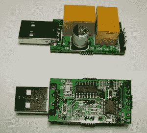
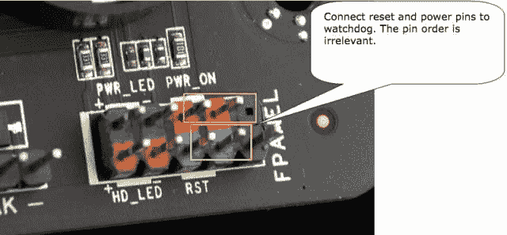
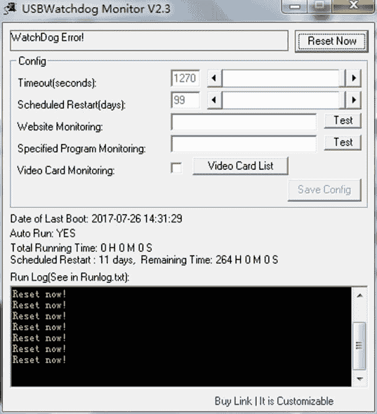
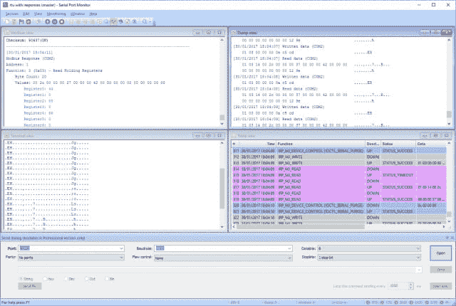
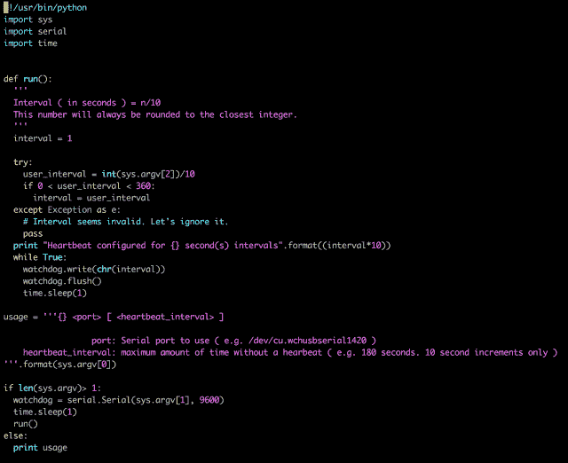

# 创建 USB 看门狗脚本

> 原文：<https://dev.to/oscar37921395/creating-a-usb-watchdog-script-1hgl>

在过去的几个月里，我对加密货币的兴趣一直在增长。为了解决这个兴趣，我终于得到了一个加密采矿钻机。熟悉采矿钻机的人都接触过 USB 看门狗。这些是连接到 USB 端口的小型设备，目的是监控您的计算机，并在系统死机的情况下重新启动计算机。

USB 看门狗的操作很简单:

1.  将设备插入空闲的 USB 端口。有四个引脚需要连接。使用跳线将两个针脚连接到复位按钮，另两个针脚连接到电源开关。

2.  打开设备电源后，它会等待一段预先确定的时间，以接收指示计算机仍正常工作的消息。如果在指定的时间范围内没有收到该消息，计算机将被重置。

3.  无限重复步骤 2。
    [T3】](https://res.cloudinary.com/practicaldev/image/fetch/s--SPhhlHib--/c_limit%2Cf_auto%2Cfl_progressive%2Cq_auto%2Cw_880/https://i.ibb.co/2dfBY9X/watchdog-pinouts.jpg)

专门的软件负责向看门狗发送消息。如果您的计算机崩溃或死机，该软件将无法转发消息。如果在接收到消息之前超过了时间间隔，看门狗会收到系统有问题的警报。然后，它启动硬件重置，这相当于按下计算机的重置按钮。USB 看门狗附带了这个专用软件，尽管对我来说这个程序基本上没什么用。它是为在 Windows 机器上使用而设计的，我在我的采矿设备上使用的是 Linux 计算机。这提出了一个需要解决的问题。

看了看 Windows 软件，它似乎相当简单，所以我决定尝试对应用程序进行逆向工程。

很容易做到:
首先，我需要一个程序来监控连接和传递给看门狗的数据。快速的谷歌搜索引导我找到了一个有价值的工具， [com 端口监控](https://www.com-port-monitoring.com/)。
[T8】](https://res.cloudinary.com/practicaldev/image/fetch/s--cXzhwA78--/c_limit%2Cf_auto%2Cfl_progressive%2Cq_auto%2Cw_880/https://i.ibb.co/hRWKFs2/SPM-interface.png)

使用串行端口嗅探器很容易破译必要的模式。您需要验证串行端口设置，应该是:

*   波特率:9600
*   奇偶校验位:无
*   停止位:1

这就是开始向 USB 看门狗发送消息所需的全部内容。
**协议:**
下一个要考虑的方面是正在使用的协议。同样，嗅探器让您进行调查。
首先要注意的是，当看门狗软件启动时，它发送一个数据包(0x80)，看门狗设备用(0x81)回复该数据包。尽管不知道数据被编码的确切方式，但是很明显这个初始连接消息包含固件版本。
然后我发现一个字节序列(0x10)正在以每秒一个的速度发送。超时值为 160 秒。将超时值更改为 10 秒会导致程序发送不同的字节(0x01)。一些推论表明，如果一个字节值 1 等于 10 秒，那么 160 秒应该用 16 来表示。而 16 用十六进制记数法 0x10 表示。
按下复位按钮时，继电器被触发，发送一个字节 0xff。
据我所知，唯一可用的操作是这三种:

*   发送包含当前超时值的心跳消息。
*   检查固件版本。
*   重置。

**剧本**
 
完成的剧本比较基础。您可以在([https://github.com/zatarra/usb-watchdog](https://github.com/zatarra/usb-watchdog))使用源代码。毫无疑问，脚本的功能还有很大的扩展空间，这完全取决于你的想象力。一些建议是远程启动采矿钻机或测试视频系统的视频卡。
警告:将心跳间隔设置得太低可能会适得其反。如果你把它设置为一分钟，那就是当你的电脑崩溃时你必须做出反应的时间。您需要在这段时间内启动机器并启动脚本。如果不这样做，你的电脑将陷入无限循环，如果你使用的是远程采矿设备，这将是非常麻烦的。

查看这个代码仓库，获取该脚本的最新版本。如果你觉得这很有教育意义，我们很感激地接受成人饮料形式的捐赠。