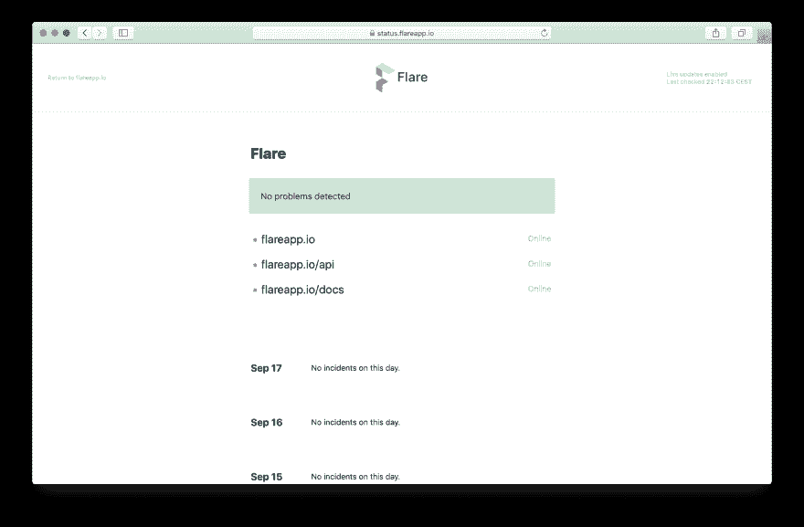
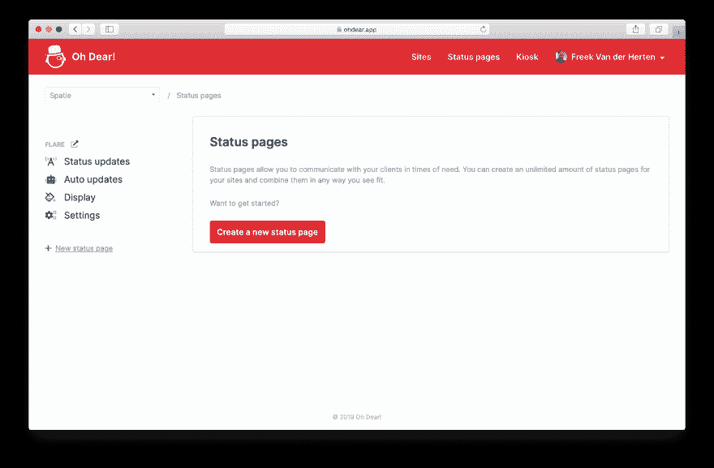
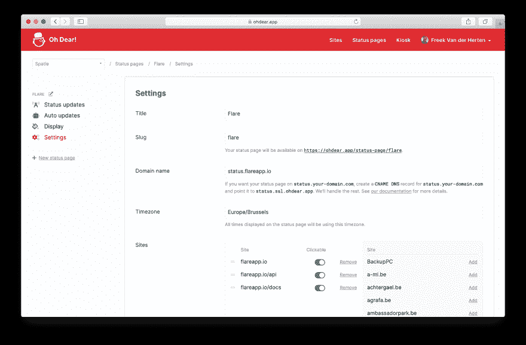
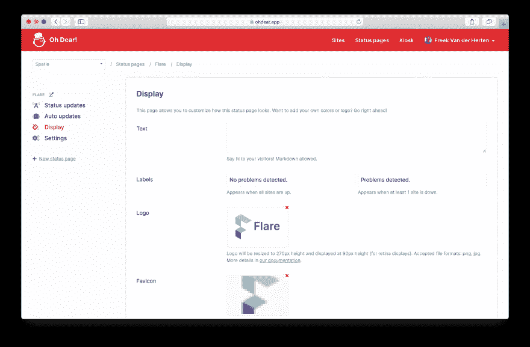
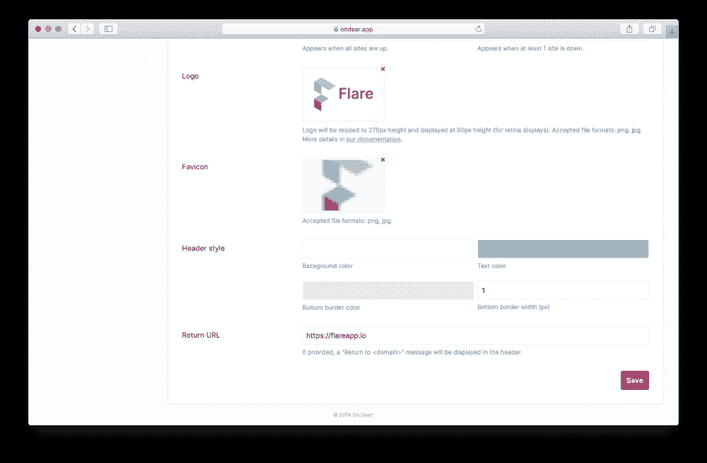
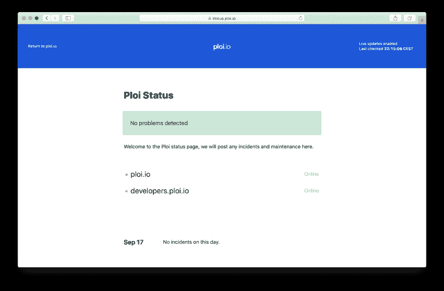
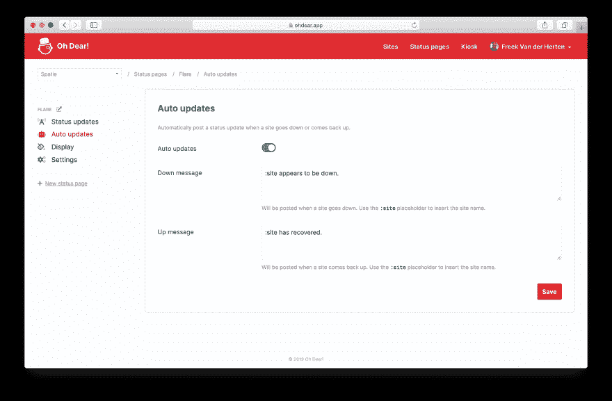
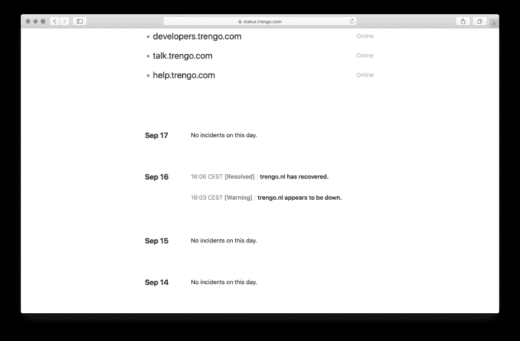
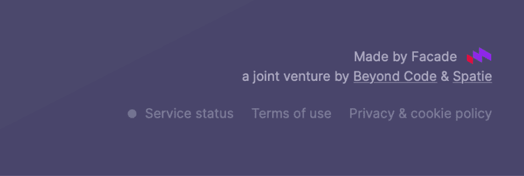
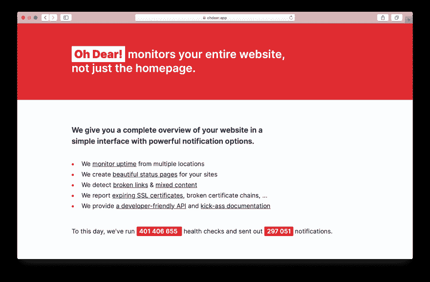

# ★使用 Oh Dear 创建漂亮的状态页面！

> 原文：<https://dev.to/freekmurze/creating-beautiful-status-pages-using-oh-dear-1l95>

我的好友马蒂亚斯和我正在运行一项名为[的运行时间检查服务。本周早些时候，我们推出了一个新的主要功能:](https://ohdear.app)[状态页面](https://ohdear.app/feature/status-pages)。

在这篇博客文章中，我想带你看看状态页面提供了什么。我们还将深入探究底层 Laravel 应用程序的一些技术细节。

## 介绍状态页面

让我们先来看看状态页面。我们已经将它用于 [Flare](https://flareapp.io) (这是我与[马塞尔](https://twitter.com/marcelpocitor)和[我们的](https://beyondco.de) [团队](https://spatie.be)一起构建的 Laravel 应用程序的异常跟踪器)。这是怎么了[哎呀！通电状态页面](https://status.flareapp.io)看起来像。

[](https://res.cloudinary.com/practicaldev/image/fetch/s--BnyktkS6--/c_limit%2Cf_auto%2Cfl_progressive%2Cq_auto%2Cw_880/https://freek.dev/uploads/media/status-pages/status-flare.png)

那看起来不漂亮吗？我的同事塞巴斯蒂安在设计网页方面做得非常出色。

不要让网址欺骗了你，尽管它是 flareapp.io 上的一个子域，但底层页面是由 Oh Dear 渲染的。

## 设置状态页面

让我们通过查看屏幕来设置状态页面所提供的一切。这是设置状态页面时看到的第一个屏幕。

[](https://res.cloudinary.com/practicaldev/image/fetch/s--Q9r3dfRd--/c_limit%2Cf_auto%2Cfl_progressive%2Cq_auto%2Cw_880/https://freek.dev/uploads/media/status-pages/create-status-page.png)

您可以创建任意数量的状态页面。点击创建按钮后。你将被带到这个设置屏幕。

[](https://res.cloudinary.com/practicaldev/image/fetch/s--AqjJFPwa--/c_limit%2Cf_auto%2Cfl_progressive%2Cq_auto%2Cw_880/https://freek.dev/uploads/media/status-pages/status-page-settings.png)

您可以设置状态页面的名称和标签，还可以将您正在监控的任何站点添加到状态板上。

默认情况下，您的状态页面将显示“哦，亲爱的！类似`https://ohdear.app/status-page/<slug-of-your-status-page`的网址。然而，我怀疑大多数用户会希望状态页面位于他们自己的子域上，例如`status.your-cool-service.com`。

当您指定了域名并设置了正确的`CNAME` DNS 记录后，我们的 web 服务器将允许所选子域的传入流量。我们有一个正在运行的[Caddy](https://caddyserver.com/)web 服务器，它会自动提供一个证书，这样我们就可以在`https`提供您的状态页面。如果你想知道更多关于引擎盖下是如何工作的，看看我的同事马蒂亚斯写的[这篇博客。](https://ohdear.app/blog/how-we-used-caddy-and-laravels-subdomain-routing-to-serve-our-status-pages)

## 定制状态页面的外观

让我们转到下一个屏幕，标题为“显示”。尽管我们的标准布局看起来很不错，但您可能需要对其进行一些定制，以符合您的品牌。

在这个屏幕上，你可以上传一个标识和图标，用于状态页面。

[](https://res.cloudinary.com/practicaldev/image/fetch/s--_SZ5ywBe--/c_limit%2Cf_auto%2Cfl_progressive%2Cq_auto%2Cw_880/https://freek.dev/uploads/media/status-pages/display-settings.png)

如果你向下滚动一点，你会看到一些自定义页眉颜色的设置。

[](https://res.cloudinary.com/practicaldev/image/fetch/s--Ul66aoqj--/c_limit%2Cf_auto%2Cfl_progressive%2Cq_auto%2Cw_880/https://freek.dev/uploads/media/status-pages/display-settings-bottom.png)

这是我们的一个用户定制的状态页面的截图。

[](https://res.cloudinary.com/practicaldev/image/fetch/s--GTXtlFF7--/c_limit%2Cf_auto%2Cfl_progressive%2Cq_auto%2Cw_880/https://freek.dev/uploads/media/status-pages/status-ploi.png)

在后台，logo 和 favicon 的上传由媒体库包处理。如果你不熟悉它，媒体库可以把文件和雄辩的模型联系起来。它可以创建缩略图，上传到外部文件系统(如 S3)。

让我们来看看我们如何在 Oh Dear 中使用媒体库(这是一个 [Laravel](https://laravel.com) 应用程序)。如果您对代码不感兴趣，请跳到下一节。

下面是处理显示设置更新的控制器的样子。我已经删除了一些与上传处理无关的代码。

```
namespace App\Http\Controllers\App\StatusPages;

use App\Domain\StatusPage\Models\StatusPage;
use Illuminate\Http\Request;

class StatusPageDisplayController
{
    public function index(StatusPage $statusPage)
    {
        // ...
    }

    public function update(Request $request, StatusPage $statusPage)
    {
        $validated = $request->validate([
            // ... other validation rules removed for brevity
            'logo' => 'file|mimes:jpeg,png|max:1024',
            'remove_logo' => 'bool',
            'favicon' => 'file|mimes:jpeg,png|max:512',
            'remove_favicon' => 'bool',
        ]);

        $this
            ->handleUpload($validated, 'logo', $statusPage)
            ->handleUpload($validated, 'favicon', $statusPage);

        flash()->success('The display settings have been updated.');

        return redirect()->action([static::class, 'index'], $statusPage);
    }

    protected function handleUpload(
        array $attributes,
        string $uploadName,
        StatusPage $statusPage
    ) {

        if (isset($attributes[$uploadName])) {
            $statusPage->addMediaFromRequest($uploadName)->toMediaCollection($uploadName);
        }

        if ($attributes['remove_' . $uploadName] ?? false) {
            $statusPage->clearMediaCollection($uploadName);

            return $this;
        }

        return $this;
    }
} 
```

如果有上传，那么`addMediaFromRequest`和`toMediaCollection`函数将被调用。媒体库将文件组织成集合。如果存在，`favicon`图像将进入`favicon`集合，`logo`图像将进入`image`集合。

在`StatusPage`模型中，这些集合及其行为在`registerMediaCollections`方法中定义。

```
public function registerMediaCollections()
{
    $this
        ->addMediaCollection('logo')
        ->singleFile()
        ->registerMediaConversions(function () {
            $this
                ->addMediaConversion('logo')
                ->nonQueued()
                ->height(270)
                ->format('png');
        });

    $this
        ->addMediaCollection('favicon')
        ->singleFile()
        ->registerMediaConversions(function () {
            $this
                ->addMediaConversion('admin')
                ->nonQueued()
                ->height(270)
                ->format('png');

            foreach ([16, 32, 96, 180, 192] as $size) {
                $this
                    ->addMediaConversion("favicon-{$size}")
                    ->fit(Manipulations::FIT_CONTAIN, $size, $size)
                    ->format('png');
            }
        });
} 
```

让我们解开这段代码。在上面的代码中，我们使用了一些很酷的[媒体收集选项](https://docs.spatie.be/laravel-medialibrary/v7/working-with-media-collections/defining-media-collections/)。`singleFile`表示集合只能容纳一个项目。如果添加要添加的文件，先前的文件将被删除。这非常方便，因为当用户上传一个新的 favicon/logo 时，我们不想保留旧的。`singleFile`会处理好的。

在给`registerMediaConversions`的 callable 中，您可以指定应该执行哪些转换。我们希望使用转换，因为用户可能会上传太大的文件。我们希望在我们的状态页面上显示一个大小正好合适的图像。

因此，只需向集合中添加一些内容，就可以执行转换。为了方便显示转换后的图像，我们在我们的`StatusPage`模型上添加了两个[访问器](https://laravel.com/docs/master/eloquent-mutators#defining-an-accessor)。

```
public function getLogoUrl(): ?string
{
    return $this->getFirstMediaUrl('logo', 'logo');
} 
```

这允许我们使用`$statusPage->logo_url`在呈现状态页面的刀片视图中显示徽标。

所有的上传和转换将存储在 S3。你在这里的代码中看不到这一点。媒体库在幕后处理这些事情。我们添加了一个使用`S3`驱动程序的`media`磁盘，并将媒体库配置为默认使用该磁盘。

```
// config/filesystems.php

'disks' => [
    'media' => [
        'driver' => 's3',
        'key' => env('AWS_ACCESS_KEY_ID'),
        'secret' => env('AWS_SECRET_ACCESS_KEY'),
        'region' => env('AWS_DEFAULT_REGION'),
        'bucket' => env('AWS_BUCKET'),
        'url' => env('AWS_URL'),
    ],

    // ...
]; 
```

如果你还在这里，你可能喜欢阅读技术资料。让我们来解决一个小细节。为了获得更快的响应时间，所有转换都在队列中执行。你注意到`favicon`集合的`registerMediaConversions`中的`nonQueued`方法了吗？我们不在队列中进行转换，因为这是我们将在“显示”设置页面上使用的转换。它应该在当前请求完成后立即可用(否则用户不会立即看到他们的上传)。

## 自动更新

让我们来看看“自动更新”屏幕

[](https://res.cloudinary.com/practicaldev/image/fetch/s--0HjptXwQ--/c_limit%2Cf_auto%2Cfl_progressive%2Cq_auto%2Cw_880/https://freek.dev/uploads/media/status-pages/auto-updates.png)

默认情况下，自动更新处于启用状态。哦，亲爱的！检测到您的站点关闭(并备份)，它会在状态页面上写一条消息。这就是它看起来的样子。

[](https://res.cloudinary.com/practicaldev/image/fetch/s--FLbujPgH--/c_limit%2Cf_auto%2Cfl_progressive%2Cq_auto%2Cw_880/https://freek.dev/uploads/media/status-pages/auto-updates-example.png)

让我们来看看它在屏幕后面是如何工作的。当网站关闭时，我们会向用户发送通知。该通知可以通过备用 SMS、邮件，...有几个选项可以确定应该在何时发送通知。

我们认为写在状态页面上的更新也遵循这些选项是非常合理的。这就是为什么我们将状态更新的创建与通知发送的时间挂钩。

无论何时发送通知，我们的应用程序都会发送一个`CheckerNotificationEvent`。我们创建了一个[事件订阅者](https://laravel.com/docs/master/events#writing-event-subscribers)来监听该事件。

事件中的通知类型决定了将要写入的消息。通知中的站点决定了应该更新哪些状态页面。

下面是事件订阅者的代码:

```
namespace App\Domain\StatusPage\EventSubscribers;

use App\Domain\Check\Support\Checkers\Uptime\Notifications\UptimeCheckFailed;
use App\Domain\Check\Support\Checkers\Uptime\Notifications\UptimeCheckRecovered;
use App\Domain\Notification\Events\CheckerNotificationSentEvent;
use App\Domain\Site\Models\Site;
use App\Domain\StatusPage\Enums\StatusPageUpdateSeverity;
use App\Domain\StatusPage\Models\StatusPage;
use App\Domain\StatusPage\Models\StatusPageUpdate;
use Illuminate\Contracts\Events\Dispatcher;

class StatusPageEventSubscriber
{
    public function subscribe(Dispatcher $events): void
    {
        $events->listen(
            CheckerNotificationSentEvent::class,
            function (CheckerNotificationSentEvent $notificationSentEvent) {
                $sentNotification = $notificationSentEvent->notification;

                if (!$site = $sentNotification->concerningSite()) {
                    return;
                };

                if ($sentNotification instanceof UptimeCheckFailed) {
                    $this->handleUptimeCheckFailed($site);
                }

                if ($sentNotification instanceof UptimeCheckRecovered) {
                    $this->handleUptimeCheckRecovered($site);
                }
            }
        );
    }

    private function handleUptimeCheckFailed(Site $site)
    {
        $site->statusPages()->autoUpdatesEnabled()->each(function (StatusPage $statusPage) use ($site) {
            $this->createMessage($statusPage, $site, $statusPage->down_message, StatusPageUpdateSeverity::WARNING);
        });
    }

    private function handleUptimeCheckRecovered(Site $site)
    {
        $site->statusPages()->autoUpdatesEnabled()->each(function (StatusPage $statusPage) use ($site) {
            $this->createMessage($statusPage, $site, $statusPage->up_message, StatusPageUpdateSeverity::RESOLVED);
        });
    }

    private function createMessage(StatusPage $statusPage, Site $site, string $title, string $severity): void
    {
        $title = str_replace(':site', $site->label, $title);

        StatusPageUpdate::create([
            'status_page_id' => $statusPage->id,
            'site_id' => optional($site)->id,
            'title' => $title,
            'severity' => $severity,
            'time' => now(),
        ]);
    }
} 
```

## 自动刷新

我怀疑我的员工会在浏览器中打开一个状态页。如果你必须刷新页面才能看到最近的日期，那就太糟糕了。这就是我们自动刷新页面的原因。

我们不会通过重新加载整个页面来自动刷新。如果我们这样做，你会看到页面不时重建。相反，我们使用一点 JavaScript 来获取页面内容并替换`.content`节点。这样浏览器不需要重新加载 CSS 或者 JavaScript，也不会出现“闪烁”。

这是代码:

```
function autorefresh() {
    fetch('')
        .then(response => response.text())
        .then(content => {
            const parser = new DOMParser();
            const html = parser.parseFromString(content, 'text/html');

            document.title = html.title;
            document.querySelector('.content').innerHTML = html.querySelector('.content').innerHTML;
        });
}

window.setInterval(autorefresh, 30 * 1000); 
```

你可以把这看作是穷人的[惯性](https://inertiajs.com/)。这段 JavaScript 代码是由 [Seb](https://twitter.com/sebdedeyne) 编写的，他也对惯性做出了很大贡献。

还有另一个好消息。如果你离线，我们显然不能更新页面，所以我们添加一点警告。

[](https://res.cloudinary.com/practicaldev/image/fetch/s--doBz1RUd--/c_limit%2Cf_auto%2Cfl_progressive%2Cq_auto%2Cw_880/https://freek.dev/uploads/media/status-pages/offline.png)

下面是实现这一点的 JavaScript:

```
window.addEventListener('offline', () => {
    document.getElementById('autorefresh-online').classList.add('hidden');
    document.getElementById('autorefresh-offline').classList.remove('hidden');
}); 
```

当您重新上线时，我们将立即移除“离线”通知，并通过调用上面显示的`autorefresh`函数来更新页面。

```
window.addEventListener('online', autorefresh); 
```

## 整合成耀斑

在 [Flare](https://flareapp.io) 上，我最近和一些好朋友一起构建的异常跟踪器，我们已经在使用 [an 哦天哪！通电状态页面](https://status.flareapp.io)。

[](https://res.cloudinary.com/practicaldev/image/fetch/s--BnyktkS6--/c_limit%2Cf_auto%2Cfl_progressive%2Cq_auto%2Cw_880/https://freek.dev/uploads/media/status-pages/status-flare.png)

在 Flare 主页上，我想强调一个小小的细节。在所有 Flare 页面的页脚都链接了状态页面。在那个链接之前，如果有任何问题，会有一个指示器。

[](https://res.cloudinary.com/practicaldev/image/fetch/s--OJYHoqx9--/c_limit%2Cf_auto%2Cfl_progressive%2Cq_auto%2Cw_880/https://freek.dev/uploads/media/status-pages/flare-footer.png)

这个指标确实有效。如果是绿色，所有系统都工作正常。如果有问题，它会是红色的。

我们使用[来确定指示器的颜色。s 状态页面 API](https://ohdear.app/docs/api/status-pages) 。使用该 API，您可以获得状态页面汇总状态、页面上每个站点的状态、读取和写入更新消息，...挺厉害的。理论上，您可以用它来构建一个完整的定制版本的状态页面。

哦亲爱的！有一个 [PHP SDK 包](https://github.com/ohdearapp/ohdear-php-sdk)，可以让你非常容易地使用 API。在 Flare 中，我们在该命令中使用计划每分钟运行的 SDK。

```
namespace App\Support\OhDear;

use Exception;
use Illuminate\Console\Command;
use OhDear\PhpSdk\OhDear;

class FetchSummarizedStatusCommand extends Command
{
    protected $name = 'flare:fetch-summarized-status';

    public function handle()
    {
        $token = config('services.oh_dear.api_token');
        $statusPageId = config('services.oh_dear.status_page_id');

        $status = (new OhDear($token))->statusPage($statusPageId)->summarizedStatus;

        SummarizedStatus::put($status);
    }
} 
```

这个`SummarizedStatus`类是一个简单的会话密钥包装器。

```
namespace App\Support\OhDear;

use Illuminate\Support\Facades\Cache;

class SummarizedStatus
{
    const STATUS_UP = 'up';
    const STATUS_DOWN = 'down';
    const STATUS_UNKNOWN = 'unknown';

    public static $key = 'summarized-status';

    public static function isUp(): bool
    {
        return Cache::get(self::$key, self::STATUS_UP) !== self::STATUS_DOWN;
    }

    public static function put(string $status): void
    {
        Cache::put(self::$key, $status);
    }
} 
```

在呈现页脚的视图中，我们可以使用`SummarizedStatus`。

```
<li><a href="https://status.flareapp.io" class="flex items-center">
    <span class="w-2 h-2 mr-2 rounded {{ \App\Support\OhDear\SummarizedStatus::isUp() ? 'bg-green-400' : 'bg-red-400' }} border border-tint-200"></span>
    Service status
</a></li> 
```

## 关闭思绪

我希望你喜欢这个状态页面之旅。还有一些我们没有涉及到的东西:RSS 提要、时区支持、自定义消息，...

我们喜欢保持哦亲爱的！非常简单。我们只添加对 90%的观众有用的功能。我相信状态页面就是这样一个功能。我们花了很多时间来获得状态页面的细节。

我在构建这个特性的过程中获得了很多乐趣。幸运的是，我不必独自面对。Seb 负责外观和一些 JavaScript 魔法。[马蒂亚斯](https://twitter.com/mattiasgeniar)想出了所有[那些很酷的定制领域的东西](https://ohdear.app/blog/how-we-used-caddy-and-laravels-subdomain-routing-to-serve-our-status-pages)。

我叫了哦，亲爱的！一个正常运行时间监视器，但不像大多数其他服务，哦亲爱的威尔！不要只看主页。它会[抓取你的整个网站](https://ohdear.app/feature/broken-links-checking)并且[会通知](https://ohdear.app/feature/notifications)你任何一个页面是否有问题。它还可以检查你的 [SSL 证书](https://ohdear.app/feature/certificate-monitoring)和[混合内容](https://ohdear.app/feature/mixed-content-checking)。

可以在 [https://ohdear.app](https://ohdear.app) 免费试用。

[](https://res.cloudinary.com/practicaldev/image/fetch/s--JBZ-Agrd--/c_limit%2Cf_auto%2Cfl_progressive%2Cq_auto%2Cw_880/https://freek.dev/uploads/media/status-pages/ohdear.png)