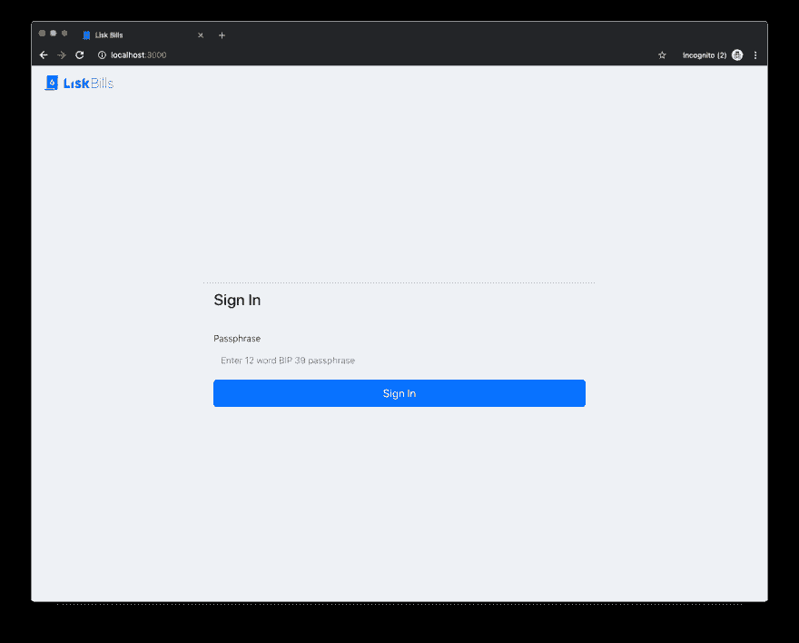
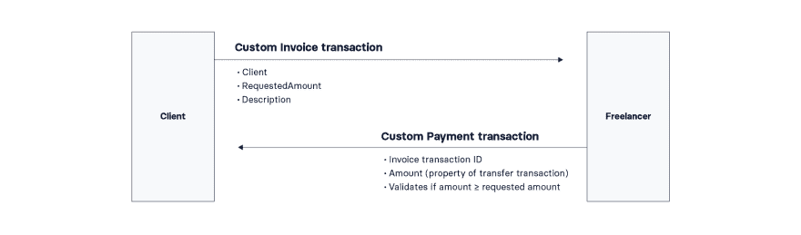
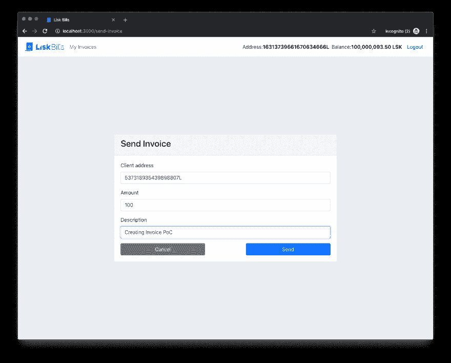
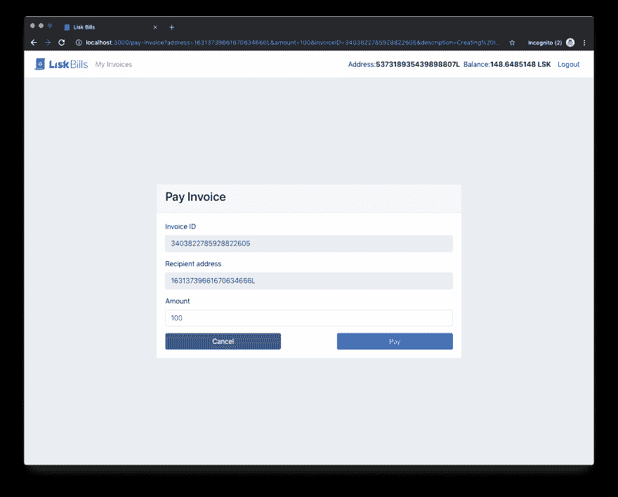

# 使用 SDK 创建自定义区块链交易——介绍 Lisk 账单

> 原文：<https://dev.to/michielmulders/creating-custom-blockchain-transactions-with-the-sdk-introducing-lisk-bills-bf1>

Lisk Bills 网上研讨会现在在我们的 [YouTube 频道](https://www.youtube.com/channel/UCuqpGfg_bOQ8Ja4pj811PWg)上直播。订阅更多教育开发者内容。

随着 SDK 2.1.0 的发布，Lisk 的 Alpha SDK 阶段于 7 月下旬正式开始。我们决定，除了创建我们自己的概念验证(PoC)区块链应用程序，还有什么更好的方式来展示定制交易的潜力。为了探索自定义交易的最佳可能性，我们决定构建一个发票应用程序，并通过它在我们的区块链上注册两个新的自定义交易。

# 自定义交易介绍

Lisk SDK 允许您定义自己的定制事务类型，您可以在其中实现区块链用例所需的逻辑。自定义事务类型是对已经是 Lisk 协议一部分的默认事务集的扩展。你可以在这里阅读更多关于预定义类型[的信息](https://lisk.io/documentation/lisk-sdk/customize)。

我们的[路线图](https://lisk.io/roadmap)的 Alpha SDK 阶段的开始允许您创建自己的符合我们架构的概念验证区块链应用。我们路线图的这一阶段还允许我们通过在[我们的社区频道](https://discordapp.com/channels/405002561775599619/405002561779793921)上的讨论获得关于如何改进开发体验的反馈。

# 定制交易以壮大 Lisk 生态系统

定制交易为 Lisk 生态系统提供了巨大的商业价值，因为它们允许大量的创造力。我们相信定制交易是 Lisk 生态系统的“创造性火花”,可以看到一大堆创新项目正在被创建。**我们已经看到社区成员提出了自己的解决方案，包括利用硬件的租赁自行车跟踪系统、 [Lisk。自行车](https://sites.google.com/view/liskbike)，使用我们的模块化 JavaScript 库对经典策略游戏 [Lisk Tic-Tac-Toe](https://sidechainsolutions.io/articles/lisk-tictactoe) 进行创新。**现在是你发挥创造力的时候了！

# 自定义交易的好处

每个 account 对象都能够在其`asset`字段中存储数据。自定义事务巧妙地利用了这一点。使用`asset`字段允许将任何类型的字符串化数据传递给事务。这允许在定义定制逻辑时有更大的灵活性和创造性。

除此之外，每个自定义交易都可以访问和修改所有与帐户相关的数据，并且只能从数据库中读取与交易相关的数据。这允许数据之间甚至不同的定制事务之间进行更高级的交互。例如，我们的 PoC 使用来自*发票*交易的数据来验证*付款*交易的有效性。

您还可以使用一些基本的转移和验证逻辑在资产字段中创建令牌。最终，这只是另一种聪明的契约逻辑。

让我们继续探索 Lisk Bills PoC 的技术细节。

# Lisk 账单——基于区块链的开票

[](https://res.cloudinary.com/practicaldev/image/fetch/s--PkGU5NTa--/c_limit%2Cf_auto%2Cfl_progressive%2Cq_auto%2Cw_880/https://thepracticaldev.s3.amazonaws.com/i/hu90nxfydpqno4nhrxhr.png)

由于我们喜欢*保持简单和愚蠢(KISS)* 的方法，我们用 React 构建了一个最小的前端，它使用 Lisk Alpha SDK 直接与您的区块链应用程序交互。PoC 包括两个参与者，客户和自由职业者。

想象一下爱丽丝(自由职业者)和鲍勃(客户)。鲍勃正在为他的网站寻找一个新的标志，并决定咨询一名自由职业者。在寻找优秀的设计师时，他遇到了爱丽丝，她在自己的作品集里提供了一些令人惊叹的设计。Bob 非常兴奋，他决定立即使用 Alice 的技能。

几天后，Alice 将承诺的徽标和发票一起返还给了我们。**然而，Bob 非常喜欢区块链技术，因为它有助于简化结算过程。经常发生的情况是，双方对商定的价格、产品、甚至运输条款有不同意见。因此，鲍勃认为区块链可以从一开始就帮助记录所有这些信息，这样就不会发生纠纷，也可以消除人为错误。区块链应作为发票的证明。**

出于上述原因，Bob 要求 Alice 通过 Lisk 自定义交易创建发票。

为此，Alice 首先必须使用她的密码登录 Lisk Bills 应用程序。

[](https://res.cloudinary.com/practicaldev/image/fetch/s--tFSe449_--/c_limit%2Cf_auto%2Cfl_progressive%2Cq_auto%2Cw_880/https://thepracticaldev.s3.amazonaws.com/i/4l7z55w4zoz87xy52217.png)

# 自定义交易 1:发票

现在 Alice 已经登录，她可以创建发票了。为了创建自定义发票交易，Alice 必须输入以下详细信息:

*   保存 Bob 的 Lisk 地址或业务名称。
*   保存 Bob 应付给 Alice 的金额。
*   `Description`描述交付的设计服务。

[](https://res.cloudinary.com/practicaldev/image/fetch/s--fLnAbi6y--/c_limit%2Cf_auto%2Cfl_progressive%2Cq_auto%2Cw_880/https://thepracticaldev.s3.amazonaws.com/i/oqy6jv1kaffzcq4yip2j.png)

以下数据存储在事务的资产字段中。由于这是一个普通的 *BaseTransaction* ，我们可以简单地指定 Bob 的 Lisk 地址作为事务的接收者。

[](https://res.cloudinary.com/practicaldev/image/fetch/s--H-0QOhDk--/c_limit%2Cf_auto%2Cfl_progressive%2Cq_auto%2Cw_880/https://thepracticaldev.s3.amazonaws.com/i/9etww6aha74oyurji1r0.png)

在我们深入技术细节之前，确保**打开或克隆 [lisk-sdk-examples 库](https://github.com/LiskHQ/lisk-sdk-examples/tree/development/invoice)** 。两个自定义交易的代码都可以在*[invoice/transactions/invoice _ transaction . js](https://github.com/LiskHQ/lisk-sdk-examples/blob/development/invoice/transactions/invoice_transaction.js)*和*[invoice/transactions/payment _ transaction . js](https://github.com/LiskHQ/lisk-sdk-examples/blob/development/invoice/transactions/payment_transaction.js)*中找到。

# 技术层面

首先，我们来看看类的定义。`InvoiceTransaction`扩展了`BaseTransaction`,这意味着它继承了它的属性。顾名思义，`BaseTransaction`是创建新交易类型最基本的接口。系统中还存在其他交易类型，稍后我们将展示一个扩展`TransferTransaction`类型的示例。

在扩展`BaseTransaction`时，我们可以为以下方法提供额外的业务逻辑:*准备、验证资产、应用资产和撤销资产*。你可以在我们的文档中找到更多关于这些[方法的信息。](https://github.com/LiskHQ/lisk-docs/blob/master/lisk-sdk/customize.md#prepare)

此外，还要注意用于检索事务类型的静态 getter 函数。例如，我们选择了`13`作为该事务的类型号。除此之外，您可以设置您希望用户使用此交易类型支付的费用。现在，我们把它设置为 1 LSK (10 的 8 次方次方)。

```
class InvoiceTransaction extends BaseTransaction {
  static get TYPE () {
    return 13;
  }

  static get FEE () {
    return `${10 ** 8}`;
  }

  ...
} 
```

Enter fullscreen mode Exit fullscreen mode

## 准备

prepare 函数负责加载在`applyAsset()`和`undoAsset()`函数中使用的所需数据。这里，我们试图加载发送者的账户数据，因为我们想在`applyAsset()`函数中将数据添加到他的资产字段中。这些数据将从提供数据库数据访问的 *StateStore* 对象中加载。

我们可以像这样通过传递一个带有过滤器的数组来缓存发件人帐户。

```
await store.account.cache([
    {
        address: this.senderId,
    },
]); 
```

Enter fullscreen mode Exit fullscreen mode

然而，我们实际上不必手动缓存数据。我们可以简单地调用[抽象`BaseTransaction`类](https://github.com/LiskHQ/lisk-sdk/blob/development/elements/lisk-transactions/src/base_transaction.ts)中`prepare`函数的父方法，默认情况下，该方法会将发送者账户缓存到[中，在应用步骤](https://github.com/LiskHQ/lisk-sdk/blob/development/elements/lisk-transactions/src/base_transaction.ts#L348)中扣除费用。

```
async prepare(store) {
    await super.prepare(store);
} 
```

Enter fullscreen mode Exit fullscreen mode

## 验证资产

在事务到达应用步骤之前，它会得到验证。从模式的角度检查事务的资产正确性(此处无法访问`StateStore`)。您可以通过将错误推入结果数组来使事务无效。

```
validateAsset() {
    const errors = [];
    if (!this.asset.client || typeof this.asset.client !== 'string') {
        errors.push(
            new TransactionError(
                'Invalid "asset.client" defined on transaction',
                this.id,
                '.asset.client',
                this.asset.client,
                'A string value',
            )
        );
    }
    if (!this.asset.requestedAmount || typeof this.asset.requestedAmount !== 'string') {
        errors.push(
            new TransactionError(
                'Invalid "asset.requestedAmount" defined on transaction',
                this.id,
                '.asset.requestedAmount',
                this.asset.requestedAmount,
                'A string value',
            )
        );
    }
    if (!this.asset.description || typeof this.asset.description !== 'string') {
        errors.push(
            new TransactionError(
                'Invalid "asset.description" defined on transaction',
                this.id,
                '.asset.description',
                this.asset.description,
                'A string value',
            )
        );
    }
    return errors;
} 
```

Enter fullscreen mode Exit fullscreen mode

## 应用资产

如您所见，我们最终使用了在`prepare`步骤中存储的已加载账户。接下来，我们更新发票计数，并在一个包含已发送发票的数组中记录发票的 ID。我们将在我们的前端使用这些数据来显示所有发票。

```
applyAsset(store) {
    const sender = store.account.get(this.senderId);

    // Save invoice count and IDs
    sender.asset.invoiceCount = sender.asset.invoiceCount === undefined ? 1 : sender.asset.invoiceCount++;
    sender.asset.invoicesSent = sender.asset.invoicesSent === undefined ? [this.id] : [...sender.asset.invoicesSent, this.id];
    store.account.set(sender.address, sender);
    return [];
} 
```

Enter fullscreen mode Exit fullscreen mode

## 撤销资产

不要低估`undoAsset()`功能的重要性。*撤销*功能允许我们回滚到之前的区块链状态。因此，我们应该确切地告诉我们的区块链应用程序应该如何回滚更改。

*撤销*功能对于货叉回收机构最为重要。如果一个叉子出现在一个有尖端 B 的链上，我们想要回滚到一个共同的高度，以便重新应用块到链 A 的尖端，我们需要*撤销*功能来实际回滚到这个共同的高度。

对于发票概念证明，代码减少了`invoiceCount`并从`invoicesSent`数组中删除了发票 ID。

```
undoAsset(store) {
    const sender = store.account.get(this.senderId);

    // Rollback invoice count and IDs
    sender.asset.invoiceCount = sender.asset.invoiceCount === 1 ? undefined : sender.asset.invoiceCount--;
    sender.asset.invoicesSent = sender.asset.invoicesSent.length === 1 
        ? undefined 
        : sender.asset.invoicesSent.splice(
            sender.asset.invoicesSent.indexOf(this.id),
            1,
        );
    );
    store.account.set(sender.address, sender);
    return [];
} 
```

Enter fullscreen mode Exit fullscreen mode

好了，我们已经探索了发票交易的功能。让我们转到支付交易。

# 自定义交易 2:付款

现在 Bob 在他的钱包中收到了发票交易，他决定为发票付款。为了完成交易，我们通常会发送一个由 Lisk SDK 本地支持的`TransferTransaction`。

然而，这样做会使这成为一个非常无聊的教程。因此，Bob 决定使用另一个自定义事务来展示 Lisk 的可能性。该自定义支付交易包含验证转账金额至少等于`RequestedAmount`的逻辑。此外，该事务要求 Bob 指定他想要履行的发票的 ID。

如果转账金额太低或者发票 ID 不存在，则交易失败。Bob 履行了自己的协议，并将请求的金额发送到 Alice 的发票 ID。鲍勃甚至为爱丽丝的伟大作品添加了一个提示。

[](https://res.cloudinary.com/practicaldev/image/fetch/s--fLnAbi6y--/c_limit%2Cf_auto%2Cfl_progressive%2Cq_auto%2Cw_880/https://thepracticaldev.s3.amazonaws.com/i/oqy6jv1kaffzcq4yip2j.png)

这是用我们的 Lisk Bills 应用程序支付发票的 UI 实现的样子。

[](https://res.cloudinary.com/practicaldev/image/fetch/s--CzeMrM14--/c_limit%2Cf_auto%2Cfl_progressive%2Cq_auto%2Cw_880/https://thepracticaldev.s3.amazonaws.com/i/5xgbuk2jfdv2z60gc5vu.png)

# 技术层面

同样，让我们看看类的定义。`PaymentTransaction`扩展了`TransferTransaction`,这意味着它继承了它的属性，比如不同的费用和与转账相关的验证检查。此外，还要注意用于检索事务类型的静态 getter 函数。由于我们不能有相同的交易类型，`PaymentTransaction`已接收类型`14`。

```
class PaymentTransaction extends TransferTransaction {

    static get TYPE () {
        return 14;
    }

    ...
} 
```

Enter fullscreen mode Exit fullscreen mode

另外，注意我们没有为`FEE`定义静态 getter 函数。我们没有在这里实现它，因为我们不想覆盖在`TransferTransaction`中定义的`FEE`。简而言之，我们想要使用在`TransferTransaction`中定义的`0.1`费用。

## 准备

prepare 函数负责将所需的数据加载到存储器中，以便在`applyAsset()`和`undoAsset()`函数中使用。对于`PaymentTransaction`，我们使用与`this.asset.data`一起发送的`ID`加载持有发票的交易。

```
async prepare(store) {
    await super.prepare(store);
    await store.transaction.cache([
        {
            id: this.asset.data,
        },
    ]);
} 
```

Enter fullscreen mode Exit fullscreen mode

## 验证资产

您可能已经注意到，我们没有为支付交易实现`validateAsset()`函数。我们必须执行的唯一检查是验证发送的令牌数是否至少等于请求的令牌数。

为了验证这一点，我们需要访问`StateStore`，因为我们需要缓存发票交易。因为我们只能在不使用`StateStore`的`validateAsset()`函数中执行静态检查，所以这个检查被[移动到应用步骤](https://github.com/LiskHQ/lisk-sdk-examples/blob/development/invoice/transactions/payment_transaction.js#L20)。

## 应用资产

`applyAsset()`函数首先试图找到相应的发票交易。如果此交易存在，我们将进一步检查转移的代币数量是否至少等于发票中要求的金额。如果检查成功，交易将被应用。

```
applyAsset(store) {
    const errors = super.applyAsset(store);

    const transaction = store.transaction.find(
        transaction => transaction.id === this.asset.data
    ); // Find related invoice in transactions for invoiceID

    if (transaction) {
        if (this.amount.lt(transaction.asset.requestedAmount)) {
            errors.push(
                new TransactionError(
                    'Paid amount is lower than amount stated on invoice',
                    this.id,
                    '.amount',
                    transaction.requestedAmount,
                    'Expected amount to be equal or greated than `requestedAmount`',
                )
            );
        }
    } else {
        errors.push(
            new TransactionError(
                'Invoice does not exist for ID',
                this.id,
                '.asset.invoiceID',
                this.asset.data,
                'Existing invoiceID registered as invoice transaction',
            )
        );
    }

    return errors;
} 
```

Enter fullscreen mode Exit fullscreen mode

## 撤销资产

支付交易的撤销步骤不需要回滚逻辑。我们不使用`set`方法修改存储中的任何数据，因此不需要定义撤销步骤来恢复数据更改。

然而，不要忘记调用`super.undoAsset(store)`，因为*撤销*步骤将确保爱丽丝已经支付的费用返回到她的账户余额中。

# 如何注册自定义交易？

好了，我们已经准备好了我们的两个定制交易。Bob 和 Alice 非常乐意使用这两笔交易来完成交易。然而，我们还不知道如何在我们的区块链应用程序中注册这些新交易。

[invoice/index.js](https://github.com/LiskHQ/lisk-sdk-examples/blob/development/invoice/index.js) 文件保存了运行您的自定义区块链的启动代码，并注册了两个交易。就这么简单！

```
const { Application, genesisBlockDevnet, configDevnet } = require('lisk-sdk');
const { InvoiceTransaction, PaymentTransaction } = require('./transactions/index');

const app = new Application(genesisBlockDevnet, configDevnet);

app.registerTransaction(InvoiceTransaction);
app.registerTransaction(PaymentTransaction);

app
    .run()
    .then(() => app.logger.info('App started...'))
    .catch(error => {
        console.error('Faced error in application', error);
        process.exit(1);
    }); 
```

Enter fullscreen mode Exit fullscreen mode

好了，我们都做完了！最后，让我们简单看一下关于使用自定义事务的注意事项。

# 使用自定义交易的注意事项

目前，我们希望用户运行他们自己的区块链实例，注册他们新创建的自定义事务。

我们花了几周时间建造这个原型。我们有意让它变得简单，作为学习资源和社区的灵感。它还不能用于生产。

# 结论

Lisk 旨在通过提供用自定义业务逻辑处理数据的能力，允许区块链行业内的创造性。这个概念与智能合约非常相似，因为它们也包含自定义的业务逻辑。我们很高兴向您介绍 Lisk Bills，这是我们的 SDK 能够实现的第一个例子。

我们希望这种自由将激发一大堆新的创新的区块链应用程序，这些应用程序使用最新发布的 Lisk Alpha SDK 构建在 Lisk 之上。目前，我们不打算在 Lisk mainnet 上支持自定义事务，但它们将用于您自己的区块链应用程序中。

Lisk 致力于帮助您创建分散、高效、透明的区块链应用程序。加入我们:

*   [语言上的不和](https://discord.gg/GA9DZmt)
*   [SDK 页面和简讯](http://lisk.io/sdk)
*   [Lisk 研究](https://research.lisk.io/)
*   [推特](https://twitter.com/LiskHQ)