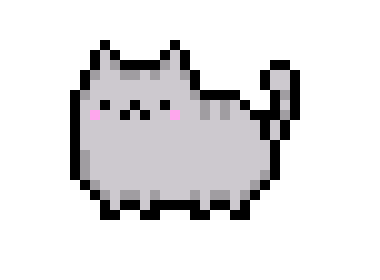
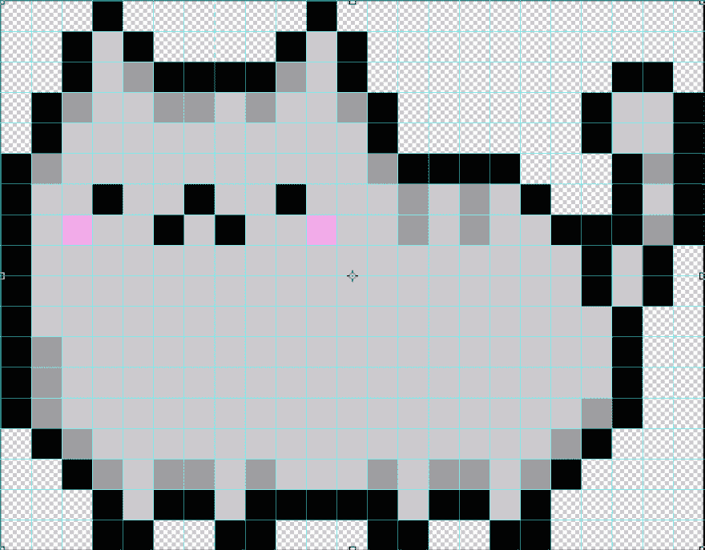

# 用 CSS 创建像素艺术

> 原文：<https://dev.to/jnschrag/creating-pixel-art-with-css-3451>

我一直喜欢观看和创作像素艺术。在网上像素制作工具出现之前，我曾花数小时在 Photoshop 中用铅笔工具制作自己的像素艺术。本文将向您展示如何使用 CSS(和一点点 HTML)，您可以使用代码来制作自己的像素艺术作品。

## `box-shadow`的力量

虽然通过创建一堆`<div>`并改变它们的背景颜色来创建像素艺术是 100%可能的，但是如果你想在多个地方重复使用你的像素，就需要跟踪和复制大量的`<div>`。我更喜欢用单个`<div>`来创建像素艺术，这要感谢`box-shadow`属性。

`box-shadow`通常用于在元素后面创建投影效果，如下例所示。

[https://codepen.io/jschrag/embed/OYKPrM?height=600&default-tab=result&embed-version=2](https://codepen.io/jschrag/embed/OYKPrM?height=600&default-tab=result&embed-version=2)

这对我们创造直边像素艺术有什么帮助？通过从`box-shadow`定义中移除模糊和扩散参数，我们可以拉直阴影的边缘。

[https://codepen.io/jschrag/embed/byXNOw?height=600&default-tab=result&embed-version=2](https://codepen.io/jschrag/embed/byXNOw?height=600&default-tab=result&embed-version=2)

接下来，我们要移动阴影，使它在块的旁边，而不是在块的后面。我们可以根据下面的规则调整 X 和 Y 偏移参数。

**X 轴偏移:**

*   正值将**向右移动**
*   负值将**向左移动**

**Y 轴偏移:**

*   正值将**向下移动**
*   负值将**上移**

阴影从应用它们的元素继承其尺寸。要将阴影移动到块的右边，我们需要将 X 偏移设置为与块的宽度相同:`20px`。如果我们将 Y 轴偏移量更改为`0`，结果看起来就像我们并排放置了两个模块。

[https://codepen.io/jschrag/embed/byXNzw?height=600&default-tab=result&embed-version=2](https://codepen.io/jschrag/embed/byXNzw?height=600&default-tab=result&embed-version=2)

开始像像素艺术了！但是这仅仅给了我们两个“像素”，我们需要更多的像素。幸运的是，`box-shadow`属性不仅限于一种效果。通过用逗号分隔我们的效果，我们可以创建多个像素的阴影。

[https://codepen.io/jschrag/embed/wbVaNy?height=600&default-tab=result&embed-version=2](https://codepen.io/jschrag/embed/wbVaNy?height=600&default-tab=result&embed-version=2)

现在我们知道了如何使用`box-shadow`，是时候开始制作一件真正的像素艺术品了。

## 创建像素猫

我们将创建一个像素版本的 Pusheen。如果你是制作像素艺术的新手，我建议你搜索现有的艺术作品，这样你就有了放置像素的参考。我要重新制作这个版本的 pixel Pusheen。

[](https://res.cloudinary.com/practicaldev/image/fetch/s--poEcgs-b--/c_limit%2Cf_auto%2Cfl_progressive%2Cq_auto%2Cw_880/https://thepracticaldev.s3.amazonaws.com/i/64f3j9evqdoitxo9otol.png)

它由 414 个像素(23 列 x 18 行)组成。为了帮助我容易地识别单个像素，我用 Photoshop 在参考图像上叠加了一个网格。

[](https://res.cloudinary.com/practicaldev/image/fetch/s--JJnKg24y--/c_limit%2Cf_auto%2Cfl_progressive%2Cq_auto%2Cw_880/https://thepracticaldev.s3.amazonaws.com/i/w7abxzf9exyg0iultylq.png)

尽管你可以从任何地方开始画你的像素，我将从左上角开始，这样我就不用担心我的`box-shadow`效果中的任何负偏移。

我还将使用 SASS 而不是普通的 CSS 来避免手工编写 414 `box-shadow`声明。通过使用定制的 SASS 函数和列表，我们可以自动计算偏移位置，使我们的代码更加简洁。

首先，我将对我们的`#cat`块做一些修改。我没有将`box-shadow`应用于块本身，而是将它应用于相对于块绝对定位的伪元素。为什么？因为`box-shadow`不占空间，这意味着如果我把另一个元素放在我的猫模块旁边，它会在我的阴影上面。如果我们将 cat 块的大小作为我们的像素艺术的最终大小，我们可以避免这个问题，但是我们需要 pseudo 元素来单独定义我们的像素的宽度/高度(记住，阴影的大小是从应用了 box-shadow 的元素继承的)。这些变化看起来是这样的:

```
#cat {
  position: relative;
  width: calc(23 * #{$size}); // Pixel size * # of columns
  height: calc(18 * #{$size}); // Pixel size * # of rows
  margin: 1rem;

  &::after {
    content: '';
    position: absolute;
    top: 0;
    left: 0;
    width: $size;
    height: $size;
    // box-shadow will be applied here
  }
} 
```

接下来，我们来设置一些变量。

```
// The width/height of each of our "pixels".
$size: 20px;

// Colors
$t: transparent;
$black: #000;
$gray: #cdc9cf;
$dkgray: #a09da1;
$pink: #ffa6ed; 
```

现在我们要创建一个列表来跟踪每个像素应该是什么颜色。从左边开始，让我们为第一行创建一个列表。

```
$first: ($t, $t, $t, $black, $t, $t, $t, $t, $black); 
```

我们可以为后续的每一行创建新的变量(`$second`、`$third`等等)。)，但是更好的方法是创建一个嵌套列表，就像这样:

```
$cat: (
  ($t, $t, $t, $black, $t, $t, $t, $t, $black),// 1st Row
  ($t, $t, $black, $gray, $black, $t, $t, $t, $t, $black, $gray, $black)// 2nd Row
  // Additional rows
); 
```

嵌套列表方法的好处是为我们提供了为每个单元格生成`box-shadow`效果所需的所有信息:计算偏移量的 X/Y 位置和阴影的颜色。我们将使用自定义的“像素化”功能来访问这些信息。

### 编写一个 SASS 函数来绘制一个像素

我们的“像素化”函数将完成将我们的颜色列表转换成可用的`box-shadow`定义的繁重工作。我在下面提供了这个函数的逐行解释。

```
@function pixelize($colors, $size) {
  $result: '';
  $numRows: length($colors);

  @for $rowIndex from 1 through $numRows {
    $y: ($rowIndex - 1);
    $row: nth($colors, $rowIndex);
    $numCols: length($row);

    @for $cellIndex from 1 through $numCols {
      $x: ($cellIndex - 1);
      $color: nth($row, $cellIndex);

      $sep: ', ';
      @if $x == 0 and $y == 0 {
        $sep: '';
      }

      $result: $result + '#{$sep}#{$x * $size}  #{$y * $size}  #{$color}'
    }
  }

  $result: unquote($result);
  @return $result;
} 
```

*   第 1 行:该函数有两个参数:像素应该是什么样的列表`$colors`和`$size`
*   第 2 行:将我们的`$result`变量初始化为一个字符串。这是函数将修改并返回的变量。
*   第 3 行:使用内置的`length`函数返回列表中的行数
*   第 5 行:开始一个迭代 X 次的循环，其中 X 是列表中的行数。每循环一次，`$rowIndex`将增加 1。
*   第 6 行:计算该行中所有单元格的 Y 轴偏移量。SASS 列表的索引是 1(不是 0)，所以我们从当前索引中减去 1，这样第一行的 Y 偏移量为 0，第二行的 Y 偏移量为 1，依此类推。
*   第 7 & 8 行:返回当前列表项的值(该行的颜色列表)，并计算其长度以确定该行的列数
*   第 10 行:开始一个循环，遍历行中的每一列
*   第 11 & 12 行:计算该单元格的 X 偏移量并返回相应的颜色
*   第 14-17 行:为`box-shadow`效果设置分隔符，但是为第一个单元格移除分隔符以确保有效的属性值。
*   第 19 行:将`$result`值更新为其现有值加上新单元格:
    *   分离器
    *   X 位置* `$size` = X 偏移
    *   Y 位置* `$size` = Y 偏移
    *   颜色
*   第 23 & 24 行:`$result`是一个字符串，所以我们使用`unquote`函数删除包含的引号。最后，返回结果。

## 最终结果

把这些放在一起，这就是我们最终的 Pusheen 像素！

[https://codepen.io/jschrag/embed/eaqpJO?height=600&default-tab=result&embed-version=2](https://codepen.io/jschrag/embed/eaqpJO?height=600&default-tab=result&embed-version=2)

相当整洁！通过一点点重构，CSS 变量的使用，以及少量的 JavaScript，我们甚至可以允许用户为他们的猫选择他们自己的颜色。

[https://codepen.io/jschrag/embed/ydyVjb?height=600&default-tab=result&embed-version=2](https://codepen.io/jschrag/embed/ydyVjb?height=600&default-tab=result&embed-version=2)

我希望这篇文章激发了你制作自己的像素艺术。即使没有，我也希望你已经学会了如何使用`box-shadow`属性在你的项目中创建一些简洁的效果。如果你有兴趣看到更多的像素艺术，包括如何制作动画的例子，请查看 Geoff Graham 关于 CSS-Tricks 的“[CSS 像素艺术的有趣时光](https://css-tricks.com/fun-times-css-pixel-art/)”。