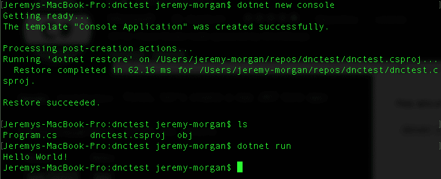
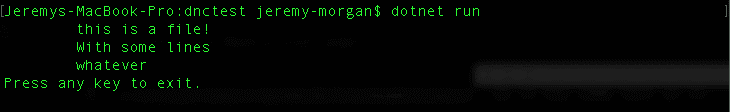
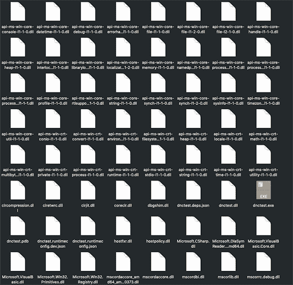
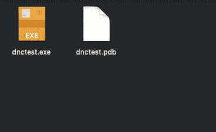
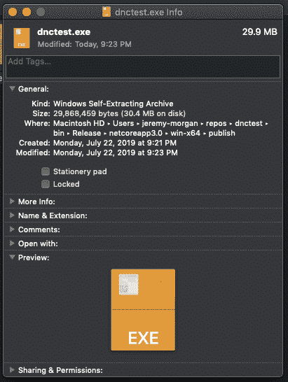
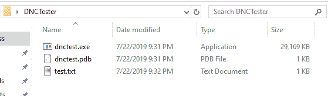
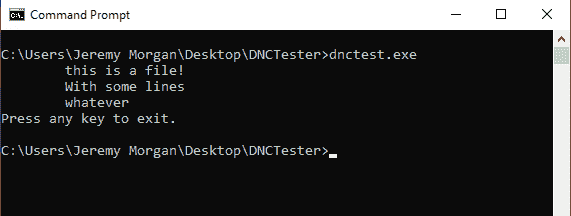
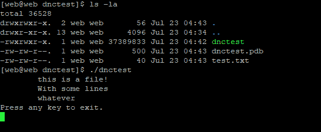

# 在中创建剪裁的自包含可执行文件。网络核心

> 原文：<https://dev.to/pluralsight/creating-trimmed-self-contained-executables-in-net-core-4m08>

我将在[中向大家展示一个很酷的新功能。网芯 3.0](https://docs.microsoft.com/en-us/dotnet/core/whats-new/dotnet-core-3-0) 。

假设您想要创建一个简单、精简的可执行文件，您可以构建它并将其放到服务器上。

例如，我们将创建一个控制台应用程序，它打开一行文本，读取它并显示输出。

首先，让我们创建一个新的。NET 核心应用程序:

```
dotnet new console 
```

Enter fullscreen mode Exit fullscreen mode

这将搭建一个新的控制台应用程序。

现在运行它:

```
dotnet run 
```

Enter fullscreen mode Exit fullscreen mode

它应该是这样的:

[](https://res.cloudinary.com/practicaldev/image/fetch/s--TWrFDh6a--/c_limit%2Cf_auto%2Cfl_progressive%2Cq_auto%2Cw_880/https://thepracticaldev.s3.amazonaws.com/i/u0qd94cn03d8sk5ycxtr.png)

我现在用的是 Mac，但只要你的开发盒有。已安装 NET Core CLI。

这将在控制台上显示“Hello World”。

现在，让我们创建一个名为 test.txt:
的文件

```
this is a file!
With some lines
whatever 
```

Enter fullscreen mode Exit fullscreen mode

不管你在这里放什么，只要里面有文字就行。

接下来，我们将创建一个可以读取并显示这些行的东西。去掉“Hello World！”编码并替换为:

```
string[] lines = System.IO.File.ReadAllLines(@"test.txt");

        foreach (string line in lines)
        {
            Console.WriteLine("\t" + line);
        }

Console.WriteLine("Press any key to exit.");
System.Console.ReadKey(); 
```

Enter fullscreen mode Exit fullscreen mode

这基本上是你的基本代码:

*   打开文件
*   将它读入字符串数组
*   逐行遍历数组
*   打印每行
*   出口

很简单的东西。当我在我的机器上运行它时，它看起来像这样:

[](https://res.cloudinary.com/practicaldev/image/fetch/s--VCnhMlkp--/c_limit%2Cf_auto%2Cfl_progressive%2Cq_auto%2Cw_880/https://thepracticaldev.s3.amazonaws.com/i/6cedelzdo0mwuzafp6mq.png)

这很好。但是我在苹果电脑上，如果我想让它在 Windows 电脑上运行呢？Linux？没问题，这是。网芯对吧？我们将向多个目标发布它。

但是如果。机器上没有安装 NET Core？

如果我只想运行一个简单的可执行文件来读取这个文件，而不需要一堆文件或者。网芯装了？

### 出版中。网络核心

让我们后退一点。。Net Core 很早就有了发布概要文件。“目标”出版背后的理念是该平台最大的卖点之一。构建您的应用程序，然后针对特定目标(Windows、OSX 或 Linux)发布它。

你可以用几种不同的方式发布它

*   **框架依赖部署**——这意味着依赖于的共享版本。安装在计算机/服务器上的. NET Core。
*   **自包含部署** -这不依赖于。Net Core 安装在服务器上。所有组件都包含在软件包中(通常有大量文件)。
*   **框架依赖的可执行文件**——这与框架依赖的部署非常相似，但是它创建了特定于平台的可执行文件，但是需要。NET 核心库。

好，那么我要展示的这个很酷的新功能是什么？

嗯，当您进行自包含部署时，这很酷，因为您不需要安装运行时，但它最终看起来像这样:

[](https://res.cloudinary.com/practicaldev/image/fetch/s--vdIptEVs--/c_limit%2Cf_auto%2Cfl_progressive%2Cq_auto%2Cw_880/https://thepracticaldev.s3.amazonaws.com/i/gj26daq7x2ro8ozpyuse.png)

这是我们刚刚构建的应用程序，作为 Windows 的自包含部署发布。呀。

假设您想要共享这个文件阅读器应用程序，并要求某人将所有这些文件复制到一个文件夹中，以运行某个程序来读取文本文件。太傻了。

### 新特性:自包含可执行文件

因此，为了构建这个自包含的可执行文件，我运行了以下命令:

```
dotnet publish -c release -r win10-x64 
```

Enter fullscreen mode Exit fullscreen mode

如果你以前做过，你应该会觉得很熟悉。酪网芯 3.0 有一个很酷的新特性:

```
dotnet publish -r win-x64 -c Release /p:PublishSingleFile=true 
```

Enter fullscreen mode Exit fullscreen mode

使用这个标志，它将构建一些稍微不同的东西:

[](https://res.cloudinary.com/practicaldev/image/fetch/s--OHla_Bpf--/c_limit%2Cf_auto%2Cfl_progressive%2Cq_auto%2Cw_880/https://thepracticaldev.s3.amazonaws.com/i/3jft97xof4uoxfcubb68.png)

那好多了。它现在是一个单一的 exe 和. pdb。如果我们看看信息，它不是超级小:

[](https://res.cloudinary.com/practicaldev/image/fetch/s--B1S3z1J3--/c_limit%2Cf_auto%2Cfl_progressive%2Cq_auto%2Cw_880/https://thepracticaldev.s3.amazonaws.com/i/unl7heb67jv5oajh9m22.png)

但是它包括了。NET 核心运行时。这是另一个很酷的功能。

```
dotnet publish -r win-x64 -c Release /p:PublishSingleFile=true /p:PublishTrimmed=true 
```

Enter fullscreen mode Exit fullscreen mode

因此，在我们的例子中，它不会改变大小，但如果您有一个大型复杂的应用程序，有很多库，如果您只是将它发布到一个文件，它会变得很大。通过添加 PublishTrimmed 标志，它将只提取运行应用程序所需的库。

因此，当我们将文件复制到 Windows 10 机器上时，我们有一个漂亮的小软件包:

[](https://res.cloudinary.com/practicaldev/image/fetch/s--FPZ16chy--/c_limit%2Cf_auto%2Cfl_progressive%2Cq_auto%2Cw_880/https://thepracticaldev.s3.amazonaws.com/i/rdeeg878qx6kb6vufpxc.png)

我们运行它，它的工作！没有。网芯！

[](https://res.cloudinary.com/practicaldev/image/fetch/s--8zOO5tDi--/c_limit%2Cf_auto%2Cfl_progressive%2Cq_auto%2Cw_880/https://thepracticaldev.s3.amazonaws.com/i/zzjrrx6wkhlvharn1od0.png)

如果我改变我的目标:

```
dotnet publish -r linux-x64 -c Release /p:PublishSingleFile=true /p:PublishTrimmed=true 
```

Enter fullscreen mode Exit fullscreen mode

我可以在 Linux 服务器上运行它。NET Core 一样容易:

[](https://res.cloudinary.com/practicaldev/image/fetch/s--nbBpapYd--/c_limit%2Cf_auto%2Cfl_progressive%2Cq_auto%2Cw_880/https://thepracticaldev.s3.amazonaws.com/i/sj2wuc4zjj9kelqq2x3j.png)

请记住，在 Linux 机器上，您不需要。NET 核心运行时，但是您将需要。安装了 Linux 上的 NET Core。

### 结论

这是的一个很酷的特性。网芯 3.0。如果您想为任何平台构建精简的自包含可执行文件，您可以使用几个标志轻松完成。

这对于那些愚蠢的简单的东西来说是很棒的:控制台应用程序、数据阅读器、微服务，或者任何你想构建的东西，只要轻松地放在一台机器上就可以了。我认为这是一个很酷的节目。

*   杰里米

### 你叫什么。网芯智商？？

[](https://res.cloudinary.com/practicaldev/image/fetch/s--fxXFrxDu--/c_limit%2Cf_auto%2Cfl_progressive%2Cq_auto%2Cw_880/https://thepracticaldev.s3.amazonaws.com/i/pv5cvzxdg7qjyxzsfe71.png)

我的 ASP.NET 核心技能智商是 200。不错，你能打败它吗？点击这里试试