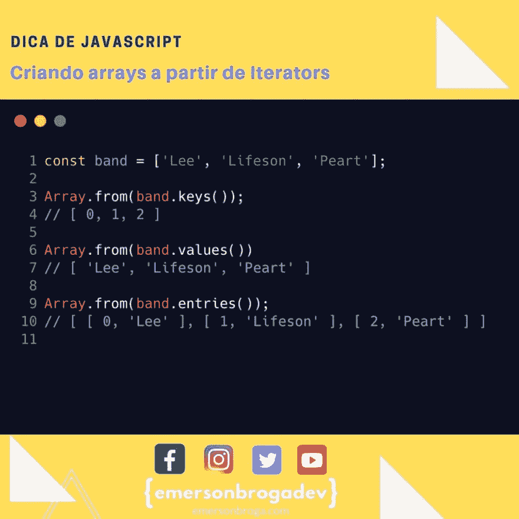

# 从迭代器创建数组

> 原文：<https://dev.to/emersonbroga/criando-arrays-a-partir-de-iterators-5dol>

数组中的方法包括. keys() .values()和. entries()方法，每个方法都返回一个迭代器。

使用 Array.from()可以从这些迭代器创建数组。

[参加我们的开发者名单](https://emersonbroga.com/e/participe/)
[【学习 es 6】](https://amzn.to/2J4XnLg)[【查看 instagram 上的提示](https://www.instagram.com/emersonbrogadev/)

=)