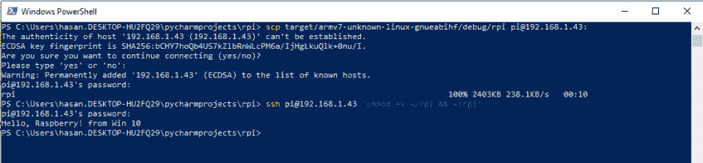
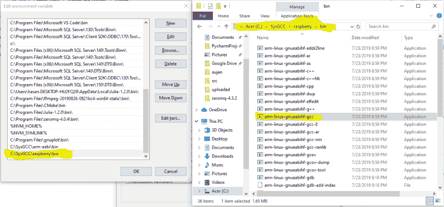

# 树莓皮交叉编译锈病

> 原文：<https://dev.to/h_ajsf/cross-compiling-rust-for-raspberry-pi-4iai>

在之前的[帖子](https://dev.to/h_ajsf/prepare-raspberry-pi-5cpa)中，我提到了如何在 RPi 上安装 Rust，这可能不被接受为了节省 RPi 中的空间并更快地完成工作，解决方案是做`cross compiler`，即在给定的操作系统中编译，并在不同的操作系统中运行，Rust 平滑地支持它，你需要的是一个链接器。

为了编译成 RPi，需要的链接器是`arm-linux-gnueabihf-gcc`，它可以很容易地在 Linux 中安装`sudo apt-get install gcc-arm-linux-gnueabi make git-core ncurses-dev`你可以检查[这个](http://ozzmaker.com/how-to-cross-compile-the-kernel-for-the-raspberry-pi/)，但是我花了半天时间才找到如何在 MacOS 和 Win 10 中完成，在这里我与你分享最后的步骤:

对于 MacOS，最好使用:`musleabihf`作为目标，对于 Windows，您可以使用如下的`gnueabihf`:

**Mac**T2】

```
$ brew install arm-linux-gnueabihf-binutils
$ rustup target add armv7-unknown-linux-musleabihf 
```

在`.cargo/config`中

```
[build]
target = "armv7-unknown-linux-musleabihf"
[target.armv7-unknown-linux-c]
linker = "arm-linux-gnueabihf-ld" 
```

用简单的`src/main.rs`

```
fn main() {
    println!("Hello, Raspberry!");
} 
```

然后事情就好了:

```
Hasans-Air:rpi hasan$ cargo build
   Compiling rpi v0.1.0 (/Users/hasan/PycharmProjects/rpi)
    Finished dev [unoptimized + debuginfo] target(s) in 0.41s
Hasans-Air:rpi hasan$ scp target/armv7-unknown-linux-musleabihf/debug/rpi pi@192.168.1.43:
pi@192.168.1.43's password: 
rpi                                                                                         100% 2702KB   2.6MB/s   00:01    
Hasans-Air:rpi hasan$ ssh pi@192.168.1.43 'chmod +x ~/rpi && ~/rpi'
pi@192.168.1.43's password: 
Hello, Raspberry! 
```

**Win 10**
从[这里](https://gnutoolchains.com/raspberry/)获取链接器，运行:

```
rustup target add armv7-unknown-linux-gnueabihf 
```

正在创建内容为
的文件`.cargo/config`

```
[build]
target = "armv7-unknown-linux-gnueabihf"

[target.armv7-unknown-linux-gnueabihf]
linker = "arm-linux-gnueabihf-gcc" 
```

并且用简单的`src/main.rs` :

```
fn main() {
    println!("Hello, Raspberry! from Win 10");
} 
```

我能够把事情做好

[](https://i.stack.imgur.com/QoeDt.png)

[](https://i.stack.imgur.com/epv7A.png)