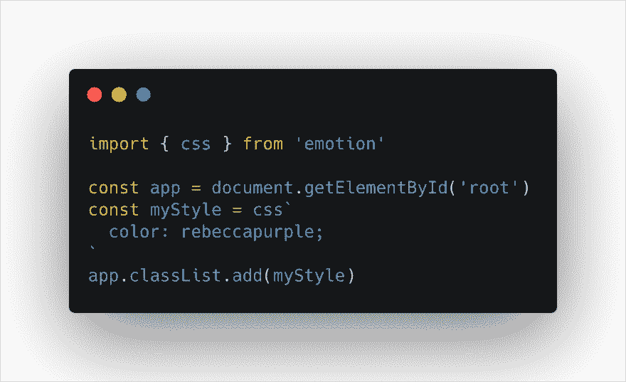
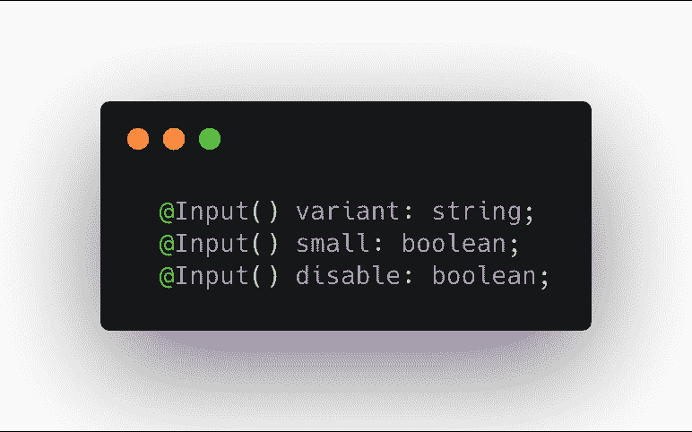
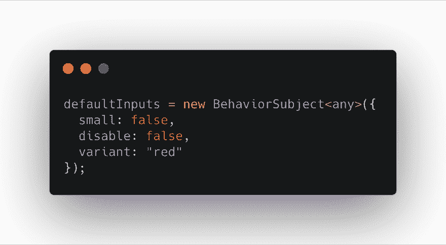
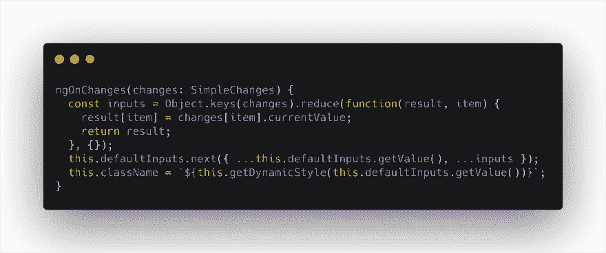
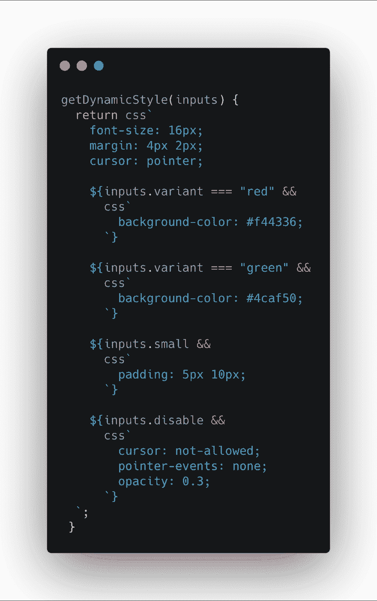

# 用于角度的 CSS-in-JS

> 原文：<https://dev.to/aziziyazit/css-in-js-for-angular-1no4>

## 为什么是 CSS-in-JS？

> 首先，CSS-in-JS 增强了我的信心。我可以添加、更改和删除 CSS，而不会产生任何意想不到的后果。我对组件样式的更改不会影响其他任何东西。如果我删除一个组件，我也会删除它的 CSS。不再有附加样式表了！
> ~麦克斯·斯托伊伯

我是强烈推荐的开发者，他计划使用 CSS-in-JS 来阅读 Max 斯托伊伯的文章。文章中陈述的观点适用于所有框架(不仅仅是 React)。

### 我和 CSS-in-JS

老实说，我并不擅长 CSS，在为我的 CSS 设计架构或组织方面面临着很多挑战。我是如何在我的作品中生存下来的，就是把作品分成脚本和样式。我主要负责编写脚本，让我的同事负责 CSS/SaSS 部分。

当我听说 CSS 模块时，“我在黑暗中发现了一盏灯”。然而，我正在努力将这个工具与 Angular environment 集成在一起，我放弃了 CSS 模块。

当我今年转到新公司时，公司的堆栈是 React 和 Styled-Components。这才是我真正“在黑暗中发现了一丝光明”的时候。

### 样式化-组件

[styled-components](//https://%20styled-components.com) 允许你编写实际的 CSS 代码来设计你的组件。它还删除了组件和样式之间的映射。然而，样式组件不支持角度。但是不要担心，我们可以使用其他 CSS-in-JS 工具，名为 **emotionJS** 。

### 情绪

emotionJS 是一个为用 JavaScript 编写 css 样式而设计的库。除了使用诸如源地图、标签和测试实用程序等功能提供出色的开发人员体验之外，它还提供了强大且可预测的样式组合。字符串和对象样式都受支持。emotionJS 是框架不可知的。

### 在我们的角度项目中加入情感

不需要 babel 和 webpack 配置，它只是一个简单的命令

```
npm i emotion 
```

Enter fullscreen mode Exit fullscreen mode

并通过导入其核心函数 **css** 在 JavaScript/TypeScript 中使用它

```
import { css } from "emotion" 
```

Enter fullscreen mode Exit fullscreen mode

以下是普通 javascript 中的情感样本

[](https://res.cloudinary.com/practicaldev/image/fetch/s--MogyurbA--/c_limit%2Cf_auto%2Cfl_progressive%2Cq_auto%2Cw_880/https://thepracticaldev.s3.amazonaws.com/i/k7r0s1euiu4n19aruucw.png)

### 感情用角

> 只有当你和一个人押韵时，你才是他们的绝配，只有当你对彼此的特点感到满意时，你才能在他们的漏洞中找到珠宝。迈克尔·贝西·约翰逊

CSS-in-JS 在 Angular 社区中并不流行，这可能是因为 Angular 已经有了可靠样式机制，且 shadow DOM 封装了您的样式以避免影响其他人，同时阻止来自外部的副作用。可以参考[阿什妮塔巴厘](https://ultimatecourses.com/blog/using-ngstyle-in-angular-for-dynamic-styling?fbclid=IwAR3nZH-_CSazBMOprkeXD7uUVtkNpusr0OU7CeJFPWjUzBurwlqDdQs4eJM)的这篇文章。然而，对于那些更熟悉 JavaScript 领域的人来说，可能会喜欢尝试 CSS-in-JS 这样的替代样式。

在本文中，我们将一步一步地应用基于@Input 属性的样式

### 步骤 1 -定义组件变量(@Input())

[](https://res.cloudinary.com/practicaldev/image/fetch/s--bhB3wyLQ--/c_limit%2Cf_auto%2Cfl_progressive%2Cq_auto%2Cw_880/https://thepracticaldev.s3.amazonaws.com/i/njj0iphgd246uh7ntaji.png)

### 步骤 2 -为所有变量提供默认值

[](https://res.cloudinary.com/practicaldev/image/fetch/s--Wb23n6Xd--/c_limit%2Cf_auto%2Cfl_progressive%2Cq_auto%2Cw_880/https://thepracticaldev.s3.amazonaws.com/i/o9aabvoznkthhfmrc3vt.png)

### 步骤 3 -倾听变量的变化，动态应用样式

[](https://res.cloudinary.com/practicaldev/image/fetch/s--bBd6JY-C--/c_limit%2Cf_auto%2Cfl_progressive%2Cq_auto%2Cw_880/https://thepracticaldev.s3.amazonaws.com/i/211jele5qvcerh8a87yr.png)

[](https://res.cloudinary.com/practicaldev/image/fetch/s--J0Fx2gqU--/c_limit%2Cf_auto%2Cfl_progressive%2Cq_auto%2Cw_880/https://thepracticaldev.s3.amazonaws.com/i/okp1iownqu6vv3mlm0d4.png)

*   getDynamicStyle 方法检查变量，并根据变量的状态分配样式
*   使用组件状态来设计组件的样式很容易

以下是完整脚本的要点。