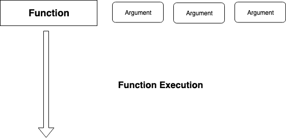
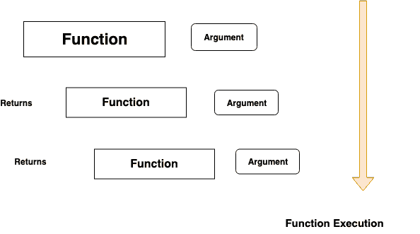

# Javascript 中的 curry——Javascript 周刊

> 原文：<https://dev.to/ganeshmani/currying-in-javascript-javascript-weekly-55i8>

在这篇文章中，我们将看到什么是 currying 以及我们为什么需要它。Javascript 中的 curry-Javascript 周刊

### Javascript 中的 Currying 是什么？

Javascript 中的 Currying 只不过是把一个有多个参数的函数变成一个只有一个参数的函数。

你可以问我，这怎么可能呢？。让我们试着用一个例子来理解这个概念。

```
let getUser = (firstname,lastname,age) => {

   console.log("Hi, My Name is "+firstname+" "+lastname+" and Age is "+age);
}

getUser("John","Sonmez",25);
```

考虑上面的函数，它接受多个参数并在输出中打印这些值

[](https://res.cloudinary.com/practicaldev/image/fetch/s--RiaQEyNK--/c_limit%2Cf_auto%2Cfl_progressive%2Cq_auto%2Cw_880/https://cloudnweb.dev/wp-content/uploads/2019/07/normal_function.png)

我们可以修改函数，一个接一个地接受参数，而不是那样做。

举个例子，

```
function getuserCurry(firstname) {

  return function(lastname) {
    return function(age) {
      console.log("Hi, My Name is "+firstname+" "+lastname+" and Age is "+age);
    }
  }
}

getuserCurry("Curry")("Function")(22);
```

在上面的函数中，我们一次接受一个参数，然后返回一个接受另一个参数的函数。它会一直进行下去，直到没有需要传递的参数。

curry 函数在其中保留变量的状态。它在 javascript 中被称为[闭包](https://cloudnweb.dev/2019/07/understanding-closures-in-javascript-javascript-weekly/)。

[](https://res.cloudinary.com/practicaldev/image/fetch/s--dtCY0YGu--/c_limit%2Cf_auto%2Cfl_progressive%2Cq_auto%2Cw_880/https://cloudnweb.dev/wp-content/uploads/2019/07/function_curry.png)

太酷了。但是，如果我们可以在多个参数中使用 curryinging，为什么我们还需要在 Javascript 中使用 curry 呢？

让我们通过一个实时用例来理解这一点。

### 实时用例

比方说，你获取一个类似这样的数据

```
let users = [
  {
    "id" : 1,
    "name" : "John",
    "age" : 22
  },
  {
    "id" : 2,
    "name" : "Peters",
    "age" : 23
  },
  {
    "id" : 3,
    "name" : "Smith",
    "age" : 24
  },
  {
    "id" : 4,
    "name" : "Woakes",
    "age" : 25
  }
]
```

在上面的数据中，需要从对象数组中取出 **id** 。您可以简单地使用 **map** 函数简单地对其进行交互并从中获取 id

```
users = users.map(item => item.id)
```

它将返回一个 id 为的**数组。如果我们需要对另一个对象数组再次执行相同的功能，会发生什么**

```
let names = [
  {
    "id" : 5,
    "name" : "dfdsfds",
    "age" : 22
  },
  {
    "id" : 6,
    "name" : "ewrwer",
    "age" : 23
  },
  {
    "id" : 7,
    "name" : "retretret",
    "age" : 24
  },
  {
    "id" : 8,
    "name" : "tyryt",
    "age" : 25
  }
]
```

你需要做同样的**循环**并从中获得唯一的**id**。你可以用**咖喱**来简化这种方式

```
const get = function(property) {
  return function(object) {
      return object[property];
  }
}
```

定义一个**函数**，它一次接受一个参数，并返回一个包含另一个参数的函数。(这基本上是一个**关闭**)。

现在，您需要调用函数 get()，它将返回一个函数。

```
const getId = get('id');
```

之后，你需要在 **map** 循环中传递函数，这个函数将为你获取所有的**id**

```
let userids = users.map(getId);

console.log("userids",userids);
```

它将输出如下所示的内容

[](https://res.cloudinary.com/practicaldev/image/fetch/s--1cB-hN_T--/c_limit%2Cf_auto%2Cfl_progressive%2Cq_auto%2Cw_880/https://cloudnweb.dev/wp-content/uploads/2019/07/Screenshot-2019-07-12-at-10.20.38-PM.png)

现在，您可以对第二个对象数组运行下面的函数。不用再重写了。

```
 const namelist = names.map(getId);

console.log("namelist",namelist); 
```

输出将是

[](https://res.cloudinary.com/practicaldev/image/fetch/s--dUVTlHMM--/c_limit%2Cf_auto%2Cfl_progressive%2Cq_auto%2Cw_880/https://cloudnweb.dev/wp-content/uploads/2019/07/Screenshot-2019-07-12-at-10.22.58-PM.png)

这是一个可以在 javascript 中应用**咖喱**的实时用例。

[https://repl.it/@ganeshmani/CurryingJavascript?lite=true](https://repl.it/@ganeshmani/CurryingJavascript?lite=true)

### 携带用例

*   **函数组合** -函数组合是 javascript 中的一个重要概念，需要一个完整的帖子。简单来说，它是一种将两个或多个函数组合起来返回结果的方法。对于 Ex，result = a( b(x))，其中 b(x)是返回结果的函数。此外，结果将作为参数传递给函数。
*   **一级函数** -你可以创建一个一级函数。第一类函数只是一个可以作为参数传递的函数。

currying 是函数式编程范例中的一个重要概念。与**部分应用**和**功能组合**一起使用。

我们将在接下来的文章中看到什么是部分应用程序和功能组合。

在那之前，快乐编码:-)

如果你想学习 JavaScript 的函数式编程。

你可以读凯尔·辛普森的函数式编程书，这是一本很棒的书。还有，

[你不知道 JS–作用域和闭包](https://www.amazon.in/gp/product/1449335586/ref=as_li_tl?ie=UTF8&camp=3638&creative=24630&creativeASIN=1449335586&linkCode=as2&tag=cloudnwebdev1-21&linkId=39bb809928ccce6bb687a1f86be88d49) [](//ir-in.amazon-adsystem.com/e/ir?t=cloudnwebdev1-21&l=am2&o=31&a=1449335586)