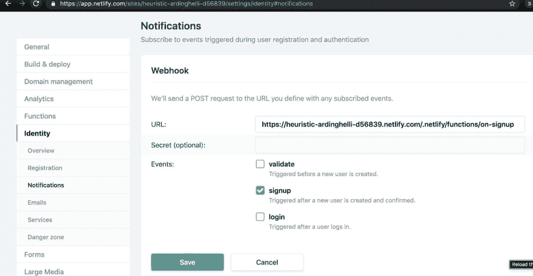

# 使用 Netlify 为 Hasura 自定义身份验证

> 原文：<https://dev.to/vladimirnovick/custom-auth-for-hasura-with-netlify-205>

在过去的几个月里，我发表了几篇关于不同提供商的认证的博文，比如 Auth0 或 AWS Cognito。我还在 [**Hasura 认证解释**](https://blog.hasura.io/ghost/#/editor/5ca70d81101753262e33970a) 博文中总结了这些提供商的不同认证选项

我一直缺少的一个认证解决方案是 Netlify。在本教程中，我们将使用 [Netlify](https://netlify.com) 为 [hasura.io](https://hasura.io) 创建一个身份验证解决方案，与之前的方式略有不同。主要区别是 Netlify Identity(Netlify auth solution)虽然支持 JWT，但它仍然不支持自定义声明，而这对于 Hasura 使用 JWT 令牌是至关重要的。我们将在这里讨论不同的方法——使用自定义 Auth webhook 来验证 Netlify Identity 提供的 JWT 令牌，从中提取数据，并以 Hasura 可以解析并在权限系统中使用的格式发送这些数据。

## 入门

#### 设置我们的 Hasura

首先，我们将在赫罗库建立我们的哈苏拉。如果你是第一次接触 Hasura，你可以在下面的[博客文章](https://t.co/qr5UNZTGYJ)中了解更多

我们将创建两个表:`posts`和`users`，用户表将具有`Text`类型 id，因为我们将从 Netlify identity 中获得该 id。

## 让用户进入 Hasura

在这一部分，我们将确保在注册时，用户将被写入用户表。

#### 创建网络生活网站

我们将从创建我们的网络生活网站开始:

```
mkdir hasura-netlify-identity-auth
npm init
netlify init 
```

Enter fullscreen mode Exit fullscreen mode

对于这个自定义身份验证解决方案，我们需要两样东西:

*   Netlify 函数，将在注册时运行，并将用户添加到 Hasura
*   我们将使用 Netlify 函数作为 auth webhook 来验证我们的令牌，提取数据并将这些数据发送给 Hasura

#### 前端

在这篇博文中，我不会创建前端，但会使用[react-netlify-identity-widget](https://github.com/sw-yx/react-netlify-identity)示例。你可以在这里查看前端代码

#### 创建注册挂钩

我们将使用 netlify cli 来创建注册挂钩。

```
netlify functions:create 
```

Enter fullscreen mode Exit fullscreen mode

选择`identity signup`。这将创建 functions 文件夹并自动生成带有样板代码的`identity-signup.js`文件。每当用户确认他的电子邮件时，网络身份将自动呼叫`identity-signup.js`。

我们将安装`node-fetch`,因为我们需要它来执行我们的`insertUser`突变

```
npm install node-fetch 
```

Enter fullscreen mode Exit fullscreen mode

在注册函数钩子上，我们将执行`insertUser`突变，将新用户插入 Hasura

```
const fetch = require("node-fetch");

exports.handler = async function(event, context) {
  const { user } = JSON.parse(event.body);

  const responseBodyString = JSON.stringify({
    query: `
    mutation insertUser($id: String, $email:String, $name:String){
      insert_users(objects: {id: $id, email: $email, name: $name}) {
        affected_rows
      }
    }    
  `,
    variables: {
      id: user.id,
      email: user.email,
      name: user.user_metadata.full_name
    }
  });

  console.log(responseBodyString);

  const result = await fetch(
    "https://netlify-stream.herokuapp.com/v1/graphql",
    {
      method: "POST",
      body: responseBodyString,
      headers: {
        "Content-Type": "application/json",
        "x-hasura-admin-secret":
          process.env.HASURA_SECRET
      }
    }
  );
  const { errors, data } = await result.json();

  if (errors) {
    console.log(errors);
    return {
      statusCode: 500,
      body: "Something is wrong"
    };
  } else {
    return {
      statusCode: 200,
      body: JSON.stringify(responseBody)
    };
  }
}; 
```

Enter fullscreen mode Exit fullscreen mode

让我们在 Netlify 的环境变量中添加 hasura secret 来为 hasura 设置 admin secret。

如果你想看这部分，我们在 https://twitch.tv/hasurahq[和](https://twitch.tv/hasurahq) [swyx](https://twitter.com/swyx) 一起直播

可从以下网址获得:

## 创建自定义认证 webhook

在本节中，我们将通过创建一个新函数来创建一个自定义的 auth webhook，以便在注册时验证自动生成的 jwt 令牌。

我们首先要做的是使用
创建一个新函数

```
netlify fuctions:create 
```

Enter fullscreen mode Exit fullscreen mode

我们将称之为`validate-user`

在函数内部，我们将从`context.clientContext`获取`identity`和`user`对象

Netlify 自动解码 JWT 令牌，如果令牌提供正确，那么我们将能够获得一个用户对象。如果不是，那么我们将设置一个匿名角色

```
const fetch = require("node-fetch");

exports.handler = async (event, context) => {
  const {
    identity,
    user
  } = context.clientContext;
  if (user) {
    const userID = user.sub;
    return {
      statusCode: 200,
      body: JSON.stringify({
        "X-Hasura-User-Id": userID,
        "X-Hasura-Role": "user"
      })
    };
  }
  return {
    statusCode: 200,
    body: JSON.stringify({
      "X-Hasura-role": "anonymous"
    })
  };
}; 
```

Enter fullscreen mode Exit fullscreen mode

你可以注意到我们返回了`x-hasura-role`和`x-hasura-user-id`，所以我们将能够在 Hasura 内部的权限系统中使用它们。

现在剩下要做的最后一件事是将`HASURA_GRAPHQL_AUTH_HOOK`环境变量添加到 Heroku 或任何其他运行 hasura 的环境中。无论何时执行此操作，都将使用 netlify 身份验证令牌，并将正确的值发送到权限系统。

在这里和 [swyx](https://twitter.com/swyx) 一起观看我们 [Twitch](https://twitch.tv/hasurahq) stream 的第二部分:

## 登录谷歌

一些我们还没有涉及到的东西，但是你可能想做的是和 Google 或者其他提供商签约。为此，您不能依赖于`identity-signup`命名约定，而是需要手动创建一个钩子。因此，该过程将是重命名`identity-signup`函数，然后在身份的通知设置中，添加注册事件触发的注册挂钩 url。

[](https://res.cloudinary.com/practicaldev/image/fetch/s--LZJA2NXB--/c_limit%2Cf_auto%2Cfl_progressive%2Cq_auto%2Cw_880/https://thepracticaldev.s3.amazonaws.com/i/5ntchflu6qy51fwazyyv.jpg)

## 总结

这篇博客文章粗略地解释了我们在 twitch stream 期间所做的事情，所以如果你还没有订阅我们的 [twitch streams](https://twitch.tv/hasurahq) 或 [Youtube 频道](https://youtube.com/c/hasurahq)，我强烈建议你订阅，因为我们每周都会播放这类内容，有来自不同公司的嘉宾指导我通过实时编码解决现实世界的问题。所有这些都是在一个有趣、友好的环境中完成的。

如果你想向我展示一些与 Hasura 相关的非常酷的技术、产品或解决方案，我很乐意抽出时间与你分享，所以请在 [Twitter](https://twitter.com/vnovick) 上告诉我