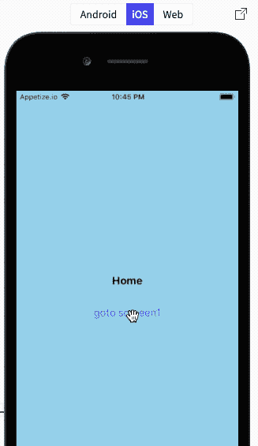
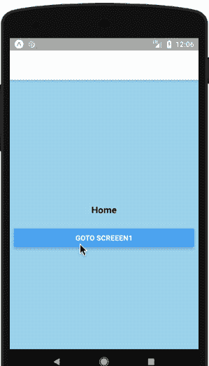
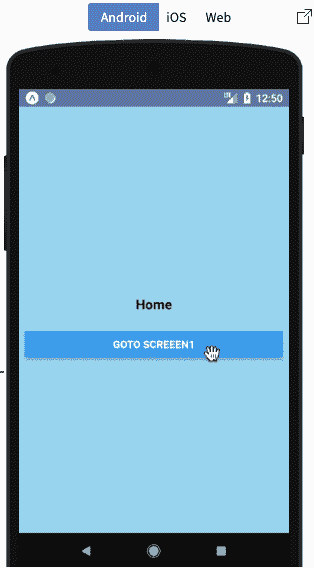
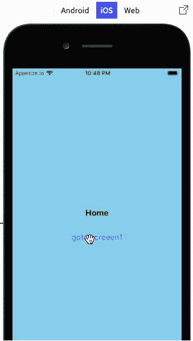
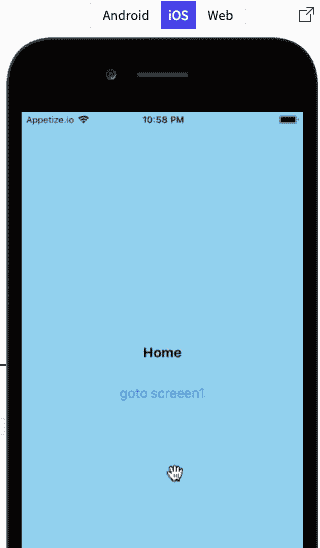

# 自定义 React 导航过渡|实施和演示

> 原文：<https://dev.to/kris/custom-react-navigation-transition-implementation-and-demo-d1m>

在本教程中，我们将学习如何自定义 React 导航转换。如果你正准备学习 React 本地导航，你可能应该先浏览一下 [React 导航](https://facebook.github.io/react-native/docs/navigation#react-navigation)。这将使你在本教程中更容易。

这里，为了举例说明 React 本机导航和自定义过渡的使用，我们将在 React 本机应用程序中更改屏幕时添加过渡效果。

首先，我在 expo 中准备了一个[种子项目](https://snack.expo.io/@krissnawat/8a3193),这样您就可以获得实现定制导航转换的样板文件。然后，您可以遵循本教程中的逐步说明，以便在导航到不同屏幕时创建您自己的自定义过渡。

下面给出的模拟显示了从一个屏幕到另一个屏幕的过渡，没有动画:

[](https://res.cloudinary.com/practicaldev/image/fetch/s--JOmUYMhb--/c_limit%2Cf_auto%2Cfl_progressive%2Cq_66%2Cw_880/https://cdn-images-1.medium.com/proxy/1%2AMaXY1tecRsnozOlb9-OOKA.gif)

[](https://res.cloudinary.com/practicaldev/image/fetch/s--38VGFXUG--/c_limit%2Cf_auto%2Cfl_progressive%2Cq_66%2Cw_880/https://cdn-images-1.medium.com/max/299/1%2AOpXPcbv6NfZFwiKv8G66eA.gif)

### 1。用于反应导航转换引导动画

在这一步，我们将使用不同的道具开始制作我们的动画。这里，我们需要创建一个新变量来处理我们的 **App.js** 文件中的动画属性。下面的代码片段提供了处理这个问题的代码:

```
const NavigationOptions = () =>{
  return {
    screenInterpolator:(sceneProps)=>{
      const { layout, position, scene } = sceneProps;
      const { index } = scene;
      return FadeTransition(position,index);
    }
  }
} 
```

在上面的代码中，我们使用 **screenInterpolator** 方法拦截导航数据。

*   **位置**指屏幕位置。
*   **索引**指当前屏幕索引。

然后，我们需要将数据传递给动画函数，即上面代码中的 **FadeTransition** 函数。

### 2。创建动画功能

在这一步，我们将创建我们上面提到的动画功能。我们要创建的动画函数是 **FadeTransition** ，它将接受两个参数**位置**和**索引**。下面的代码片段提供了实现动画功能的代码:

```
const FadeTransition = (position,index) =>{
  const sceneRange = [index-1,index]
  const outputOpacity = [0,1]
  const transition = position.interpolate({
    inputRange:sceneRange,
    outputRange:outputOpacity
  })
  return {
    opacity:transition
  }
} 
```

这里，我们创建了两个变量。**场景**到定义的开始屏幕和上一个屏幕，然后**输出范围**控制不透明度范围。然后，最后，我们需要将这两个变量添加到用于初始化动画的**插值**函数中。

### 3。添加到主导航

我们需要做的最后一件事是将所有选项添加到初始化为 **createStackNavigator** 方法的 **AppNavigator** 变量中。将所有选项添加到我们的主导航常量 AppNavigator 的代码在下面的代码片段中提供:

```
const AppNavigator = createStackNavigator(
  {
    Home: {
      screen: Home
    },
     Screen1: {
      screen: Screen1
    },Screen2: {
      screen: Screen2
    }
  },
  {
    headerMode:'none',
 **transitionConfig:NavigationOptions**
  }); 
```

在这里，我们可以看到我们已经将**导航选项**添加到**过渡配置**中，以便将我们的动画整合到过渡中。

现在，我们需要测试一切是否如预期的那样工作。测试的模拟显示在下面的模拟器模拟中:

[](https://res.cloudinary.com/practicaldev/image/fetch/s--1SOgMKZr--/c_limit%2Cf_auto%2Cfl_progressive%2Cq_66%2Cw_880/https://cdn-images-1.medium.com/proxy/1%2Aw2CW7n-3OeOq5m5w50PbeQ.gif)

[](https://res.cloudinary.com/practicaldev/image/fetch/s--FdOjztyk--/c_limit%2Cf_auto%2Cfl_progressive%2Cq_66%2Cw_880/https://cdn-images-1.medium.com/proxy/1%2AlIUXblelDlCmuj5jKNgaDA.gif)

因此，我们得到了实施的结果。定制的导航转换按照上述模拟的预期工作。

### 4。添加其他动画

在这一步，我们尝试进一步定制我们的动画。在这里，我们要去其他动画风格，如 **translateY。为了做到这一点，我们需要创建一个名为**的新动画函数，如下面的代码片段所示。**** 

```
const BottomTransition = (position,index,height)=>{
  let sceneRange = [index-1,index]
  let outputHeight = [height,0]
  let transition = position.interpolate({
    inputRange:sceneRange,
    outputRange:outputOpacity
  })
  return {
   transform:[{translateY:transition}]
  }
} 
```

这里，我们需要像第二步一样做，但是我们需要用 **translateY 替换**不透明度**。**然后，动画功能也接收一个新参数，即**高度**。

然后，我们还需要将 **NavigationOptions** 中的函数从 **FadeTransition** 更改为 **BottomTransition** ，如下面的代码片段所示:

```
const NavigationOptions = () =>{
  return {
    screenInterpolator:(sceneProps)=>{
      const { layout, position, scene } = sceneProps;
      const { index } = scene;
      const height = layout.initHeight;
       return BottomTransition(position,index,height);
      // return FadeTransition(position,index);
    }
  }
} 
```

在这里，可以看到 FadeTransition 方法被注释掉了。

现在，让我们尝试在我们的仿真器上运行我们新定制的导航转换动画:

[](https://res.cloudinary.com/practicaldev/image/fetch/s--diB1xJUQ--/c_limit%2Cf_auto%2Cfl_progressive%2Cq_66%2Cw_880/https://cdn-images-1.medium.com/proxy/1%2A2ZlYJC75HWfkX2DlJzzMzQ.gif)

因此，我们从一个屏幕到另一个屏幕的导航转换现在是垂直动画。这就成功地完成了我们创建定制导航过渡的教程。

***希望你喜欢这个教程！*T3】**

### 结论

在本教程中，我们学习了如何在 React 本机导航中使用自定义过渡。我们还学习了以简单和基本的方式实现 react-native 动画。通过本教程，您将能够创建自己的 React 本地动画，并添加自定义的导航过渡。教程的完整演示可以在[小吃](https://snack.expo.io/@krissnawat/8a3193)中找到。

*原载于 2019 年 8 月 24 日*[*https://kriss . io*](https://kriss.io/custom-react-navigation-transition-implementation-and-demo/)*。*

* * *