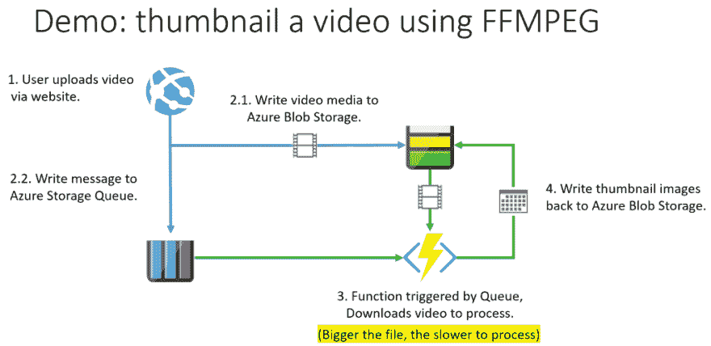
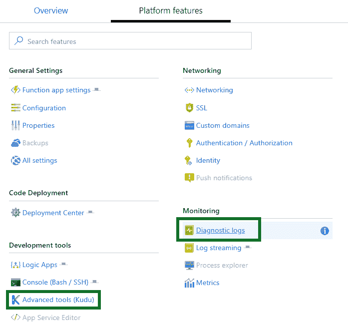

# 使用 Azure 函数、Docker 和 Kubernetes 事件驱动架构(KEDA)定制无服务器

> 原文：<https://dev.to/simonwaight/customised-serverless-using-azure-functions-docker-and-kubernetes-event-driven-architecture-keda-1d90>

随着 Azure 功能的成熟，构建和运行它们的方式越来越多，执行长时间运行、计算密集型或复杂作业的需求变得越来越普遍。这些新兴工作类型的一些例子包括运行机器学习模型或批量处理视频以对其进行代码转换。

此外，随着无服务器技术渗透到开发人员的业务结构中，我发现越来越多的人要求更好地控制如何部署和操作无服务器解决方案。

在这篇文章中，我将展示你如何做到:

*   使用 Azure 函数作为您的事件驱动主机，无论环境如何
*   以安全且符合行业标准的方式定制函数执行沙箱
*   使用 KEDA 在 Azure 和 Kubernetes 上的容器中部署 Azure 功能。

### 场景

在这篇博客中，我将向你展示如何使用 [FFMPEG](https://ffmpeg.org/about.html) 从视频文件中创建缩略图。如果你曾经上传过视频到 YouTube，这将是你作为用户所经历的事情。

[](https://res.cloudinary.com/practicaldev/image/fetch/s---_kFJ79D--/c_limit%2Cf_auto%2Cfl_progressive%2Cq_auto%2Cw_880/https://siliconvalve.files.wordpress.com/2019/06/2019-06-21_15-37-43.png%3Fw%3D1024%26h%3D498)

在这种情况下，最大的挑战是一些视频文件的大小(和运行时间)将非常大，这意味着每个功能工作者将在相当长的时间内忙于创建缩略图。

这个长的处理时间是由于下载文件，使用 FFMPEG 处理它，然后将结果 thumnbnail 上传回 Blob 存储。我们必须在本地下载视频文件，因为我们用来创建 thumnbnail 的 FFMPEG 过程不能在流上工作——它需要本地文件访问。

### 我们的样本项目

我为这篇文章写了一个简单的基于节点的 Azure 函数，你可以在 [GitHub](https://github.com/sjwaight/CustomisedAzureFunctionsContainers/) 上找到。我正在使用一个伟大的[节点库](https://github.com/transitive-bullshit/ffmpeg-generate-video-preview)来包装 FFMPEG，并提供一个简单的方法来生成一条缩略图(见下面的样本)。

该函数使用 Azure 存储队列触发器，并假设队列消息包含要创建缩略图的视频文件的名称。

如果你想自己尝试这个功能，你需要 [Visual Studio 代码](https://code.visualstudio.com/Download)和 [Azure Functions 核心工具](https://www.npmjs.com/package/azure-functions-core-tools)的 v2 版本，你可以在本地调试。我使用 [VS 代码远程开发工具](https://code.visualstudio.com/docs/remote/wsl)进行开发，这些工具允许我在 Linux (WSL)的 Windows 子系统上运行函数主机。GitHub 上列出了完整的工具规格。

我在演示中使用了 Pixabay 的开放许可视频——下面的视频可以从他们那里下载。

[https://player.vimeo.com/video/144566598](https://player.vimeo.com/video/144566598)

当您执行该功能并提供上述视频时，会生成下面的缩略图。

[](https://res.cloudinary.com/practicaldev/image/fetch/s---g68Xfsf--/c_limit%2Cf_auto%2Cfl_progressive%2Cq_auto%2Cw_880/https://siliconvalve.files.wordpress.com/2019/06/c39adcc0-93e9-11e9-96ec-37d997ef4ee6-baking.mp4_preview.jpg%3Fw%3D1024%26h%3D288)

### 让乐趣开始吧！

如果您在一台新造的机器上运行上面的函数示例，并且安装了默认的操作系统，您可能会收到一个类似于“ffmpeg: command not found”的错误。

这是因为 FFMPEG 不是操作系统的标准部分，但是你可以安装它。在我的 WSL Ubuntu 主机上，我使用了以下命令来安装它。

```
sudo apt-get install ffmpeg 
```

根据我上面写的内容，你大概可以猜到，FFMPEG 不在 Azure App Service 中 Azure 函数使用的 Linux 主机上！🙂

我们可以通过将我们的功能(及其配置)上传到一个 Linux 消费计划来确认这一点([参见如何在文档](https://docs.microsoft.com/en-us/azure/azure-functions/functions-create-first-azure-function-azure-cli-linux#create-a-linux-function-app-in-azure)中创建一个)并试用它。

结果是…

```
2019-06-21T07:52:29.312 [Information] { Error: spawn ffprobe ENOENT at Process.ChildProcess._handle.onexit (internal/child_process.js:190:19) at
onErrorNT (internal/child_process.js:362:16) at _combinedTickCallback (internal/process/next_tick.js:139:11) at process._tickCallback
(internal/process/next_tick.js:181:9) errno: 'ENOENT', code: 'ENOENT', 
syscall: 'spawn ffprobe', path: 'ffprobe', spawnargs: ['-print_format', 'json', '-show_error', '-show_format', '-show_streams', 
'/tmp/838fcd10-93f9-11e9-b2ab-59607ad195b6-baking.mp4'], stdout: '', stderr: '',
 failed: true, signal: null, cmd: 'ffprobe -print_format json -show_error -show_format -show_streams /tmp/838fcd10-93f9-11e9-b2ab-59607ad195b6-baking.mp4',
 timedOut: false, killed: false } 
```

嗯..电脑说没有！😐

现在，在这个阶段，你可能认为你可以在你的函数应用程序中包含必要的 FFMPEG 二进制文件，并以这种方式部署它们…不幸的是没有！

第一次遇到这种情况时，我很恼火，但我逐渐意识到，你不能只是上传任意的二进制文件或系统库作为函数代码的一部分，这其实是件好事。这有四个原因:

1.  您应该只发布您的源代码，因为它是您已经测试和验证过的
2.  如果您上传二进制文件或库，它们可能与主机操作系统不兼容，从而导致意外行为或崩溃。
3.  大多数可执行文件依赖于其他库或二进制文件(你安装 FFMPEG 时有没有注意安装了什么？).这意味着你也需要安装所有这些！
4.  您是否对您的解决方案捆绑的二进制文件进行了安全扫描？

那么我们如何用函数来解决这个挑战呢？

### 向我的小朋友问好

Functions 团队有一个可靠的方法来支持需求，比如运行外部二进制文件——你可以[构建自己的 Docker 映像](https://docs.microsoft.com/en-us/azure/azure-functions/functions-create-function-linux-custom-image)并在 Azure 中使用它。

如果你在 GitHub 上查看示例项目，你会注意到已经有一个 [Dockerfile](https://github.com/sjwaight/CustomisedAzureFunctionsContainers/blob/master/Dockerfile) 使用这个命令添加到根文件夹
中的现有项目中

```
func init --docker-only 
```

该命令将忽略任何现有的配置文件，并简单地添加一个标准的 Docker 文件，该文件将根据函数运行时主机 Docker 映像将您的代码和扩展捆绑到一个容器中(参见 GitHub 上节点[的 Docker 文件)。](https://github.com/Azure/azure-functions-docker/blob/master/host/2.0/stretch/amd64/node.Dockerfile)

现在来看看最精彩的部分——docker 文件是可编辑的🙂如果你看看 GitHub 上的 docker 文件，你会发现我已经对它进行了定制:

```
# Install FFMPEG 
RUN apt-get update && \ 
    apt-get install -y ffmpeg 
```

如果我们构建容器映像，我们将最终用正确的执行设置安装 FFMPEG(及其依赖项)。

### 部署到 App 服务

当你第一次在 Azure 中创建一个 Linux Azure 函数主机时，你必须指定它是一个“代码”部署(只是将你自己的代码推到现有的运行时上)还是一个“容器”部署(推送一个包含你的代码的 Docker 映像)。这意味着我们不能使用与上面相同的函数计划，因为缺少 FFMPEG 二进制文件。

职能团队记录了如何在 docs.microsoft.com 上部署[映像。](https://docs.microsoft.com/en-us/azure/azure-functions/functions-create-function-linux-custom-image#create-a-linux-app-service-plan)

我使用了[Azure Container Registry(ACR)](https://docs.microsoft.com/en-us/azure/container-registry/)来保存我的图片，这些图片是我使用以下命令在 WSL 上本地构建并发布的(这些命令假设你已经使用 az login '和 ACR log in '登录 Azure):

```
docker build -t my_acr_instance.azurecr.io/custom-func-node:1.0 . 
docker push my_acr_instance.azurecr.io/custom-func-node:1.0 
```

现在我们已经将我们的功能代码推送到 ACR，我们可以受益于[内容信任](https://docs.microsoft.com/en-us/azure/container-registry/container-registry-content-trust)和来自 [Aqua](https://blog.aquasec.com/image-vulnerability-scanning-in-azure-container-registry) 或 [Twistlock](https://www.twistlock.com/2016/11/07/azure-container-registry/) 的安全扫描，这将让安全人员感到满意！

您可以创建新的 Linux Azure 函数，并将 ACR 引用作为源映像传递:

```
az functionapp create --name <app_name> \
 --storage-account <storage_name> \ 
 --resource-group myResourceGroup \ 
 --plan myAppServicePlan \ 
 --deployment-container-image-name my_acr_instance.azurecr.io/custom-func-node:1.0 
```

当您将映像部署到应用服务计划时，您还需要使用 Azure CLI ( [参见文档](https://docs.microsoft.com/en-us/azure/azure-functions/functions-create-function-linux-custom-image#configure-the-function-app))或通过 Azure 门户部署您的功能设置。

如果您在部署后遇到问题，那么在撰写本文时，调试体验是相当不错的——您需要启用诊断日志记录(在“平台特性”下找到它),然后使用高级工具(Kudu)下载 zip 文件格式的日志。

[](https://res.cloudinary.com/practicaldev/image/fetch/s--AZdkZIxF--/c_limit%2Cf_auto%2Cfl_progressive%2Cq_auto%2Cw_880/https://siliconvalve.files.wordpress.com/2019/06/2019-06-24_14-48-16.png%3Fw%3D1100)

既然我们已经征服了在 Azure 应用服务计划上运行定制功能环境，让我们继续最后一个目标环境。

### Kubernetes 上的 Azure 函数

你为什么会选择 Kubernetes(和 KEDA)而不是带有 Docker 图片的 Azure 应用服务计划？以下是一些原因:

1.  您已经在使用 Kubernetes 处理其他工作负载，因此您希望获得一致的管理体验。
2.  你想使用 Azure 功能，但希望它们只连接到一个专用网络，并且不想运行一个[应用服务环境](https://docs.microsoft.com/en-us/azure/app-service/environment/intro) (ASE)来实现这一点。
3.  您希望通过使用 Azure Kubernetes service(AKS)上的[虚拟节点](https://docs.microsoft.com/en-us/azure/aks/virtual-kubelet)从快速扩展和每秒计费中获益。

因为我们已经把 Azure 函数容器化了，所以我们已经基本上可以使用 KEDA 了！

在这篇博客中，我构建了一个只有一个节点的 Azure Kubernetes 服务集群，并确保在创建时启用了虚拟节点功能。由于 AKS 和 ACR 使用相同的 Azure 订阅，它们已经共享一个公共身份连接，因此我们可以轻松地将图像更新从 ACR 推送到 AKS。

在部署我们的容器化函数之前，我们需要通过运行以下命令将 KEDA 部署到 AKS:

```
func kubernetes install --namespace keda 
```

这个命令假设您的本地 Kubernetes 上下文已经选择了正确的集群。

现在，我们可以基于现有的容器映像和本地功能工具
非常容易地创建我们的 Kubernetes 部署

```
func kubernetes deploy --name video-thumbnailer \ 
 --registry my_acr_instance.azurecr.io \ 
 --javascript --dry-run > deploy.yaml 
```

这将生成一个我们可以重用的部署 YAML 文件。我想做一些编辑，在下面的要点和解释。