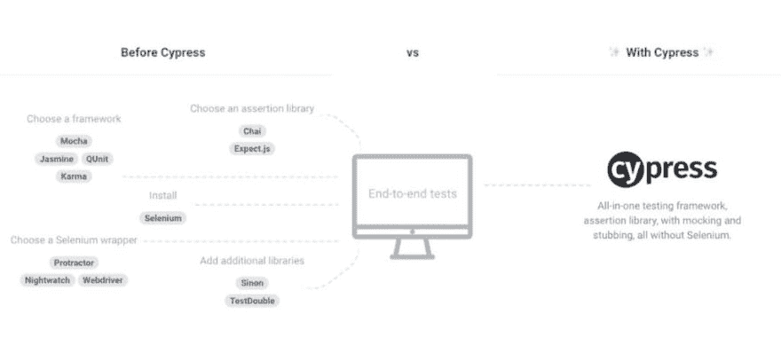
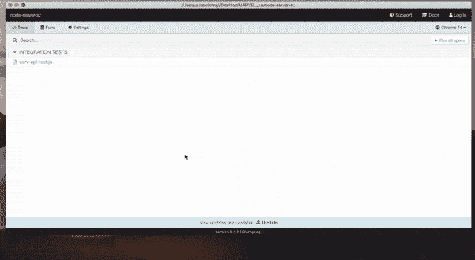

# Cypress 框架:测试的瑞士军刀

> 原文：<https://dev.to/apium_hub/cypress-framework-the-swiss-army-knife-for-your-tests-57hl>

今天我想谈一谈最近很受欢迎的测试框架。我说的是 **Cypress** ，一个我们甚至可以称之为瑞士军刀的工具。因为我已经使用它有一段时间了，我想给它一些见解。

但在此之前，我想先谈谈不同类型的微服务测试。

### 什么是微服务测试？

**微服务架构**是一些小服务的集合，这些小服务彼此独立，但合在一起代表一个完成的应用，解决一个全局任务。应用中的每个微服务负责一些特定的功能。主要的好处是它们可以独立部署和测试。[微服务](https://apiumhub.com/tech-blog-barcelona/microservices/)可以驻留在不同的服务器和操作系统上，可以用不同的编程语言编写。事实上，特定微服务的开发人员可能不知道其他微服务在做什么，对他们来说，最终完成的应用程序最终会做什么并不重要。

微服务测试的类型:

*   **单元测试**。[单元测试](https://apiumhub.com/tech-blog-barcelona/top-benefits-of-unit-testing/)是所有测试中使用最多的。原则和方法与传统应用程序的单元测试没有什么不同。使用的技术组合取决于编写微服务的语言。
*   **合同测试**。契约测试意味着将微服务视为黑盒。服务相互独立地被调用，并检查它们的响应。任何依赖都应该有助于服务运行，但不应该与其他服务交互。这将避免任何可能由于另一个服务的影响而导致的复杂行为，并且只专注于测试。契约测试是一种由编写测试组成的技术，它将确保服务提供者和消费者都履行契约所说的内容。每个消费者应该从服务中获得相同的结果，即使其内部实现发生了变化。每个服务应该能够灵活地改变功能，但是之前实现的功能不应该改变和拉动调用服务的改变。
*   **集成测试**。以前，我们独立测试每个微服务。在集成测试中，检查各种微服务之间交互的正确性。这是对整个架构最重要的测试之一。有了肯定的测试结果，我们就可以确定整个架构的设计是正确的，所有独立的微服务作为一个整体运行，并且符合预期。
*   **UI 测试**。测试被测应用程序的系统图形用户界面。GUI 测试包括检查屏幕上的控件，如菜单、按钮、图标和所有类型的栏——工具栏、菜单栏、对话框和窗口等。
*   **端到端测试**。这种测试可以让你验证微服务和其他服务交互的正确性。例如，数据库。使用端到端测试，测试整个应用程序满足所有最终用户请求的能力。

既然我们正在讨论端到端测试，你可以澄清这方面的理想框架是 Cypress。

## 柏树是什么？

**Cypress 是一个一体化的测试框架**，它包括实体模型、库和自动化 E2E 测试，而不使用 Selenium。它还可以用来编写 E2E API 测试。

如果你不知道的话，Selenium 是最流行的自动化产品测试工具之一。它的架构由两个组件组成:1–我们用来编写测试的不同编程语言的库，和 2–web driver。由于这种结构，Selenium 通过某些服务器工作，在某些情况下，当使用它时，可能会出现延迟。

[](https://res.cloudinary.com/practicaldev/image/fetch/s--heaF0hrk--/c_limit%2Cf_auto%2Cfl_progressive%2Cq_auto%2Cw_880/https://apiumhub.com/wp-content/uploads/2019/06/cypress-framework-1024x442.jpg) 图片来源:[https://www.cypress.io/](https://www.cypress.io/)

### Cypress 可以与哪些接口协同工作？

这个工具是专门为现代 JavaScript 框架设计的，比如:React、Angular、Vue 等。

### 如何安装柏树:

Cypress 有两种安装方式:使用 npm 或者从网站下载。

导航到您的项目路径并使用 npm 安装 Cypress:

```
 npm install cypress --save-dev 
```

**开柏**。如果您使用了下载方法，只需双击可执行文件。如果改为使用 npm 方法，只需在控制台上编写以下命令:

```
./node_modules/.bin/cypress open 
```

当您运行该命令时，将在项目内部打开一个窗口。在这里我们可以找到两个文件:“*example _ spec . js”*和“ *poc_cypress.js* ”，这是在项目中创建的测试文件。当你点击“ *example_specs.js* ”时，Cypress 将启动浏览器，并开始运行我们从包装盒中获得的所有演示测试。

### 柏树运行试验

“ *cypress run* 命令用于从项目内部的命令行运行。

API 测试示例:

```
it('returns JSON', () => {
  cy.request('api/todos')
    .its('headers')
    .its('content-type')
    .should('include', 'application/json')
 })

 it('Validate the status', () => {
   cy.request('api/todos')
  .its('status')
        .should('equal',200);
 }) 
```

作为 UI e2e 测试的例子:

```
describe(' Test', function() {
  it('Visits the Apiumhub Site', function() {
    cy.visit('https://apiumhub.com')
    cy.get('.dropdown-toggle').contains('ABOUT US')
  })
 }) 
```

执行示例:

[](https://res.cloudinary.com/practicaldev/image/fetch/s--pQlQuTyg--/c_limit%2Cf_auto%2Cfl_progressive%2Cq_66%2Cw_880/https://apiumhub.com/wp-content/uploads/2019/06/cypress-run.gif)

让我们将记者整合到 Cypress。我选了摩卡牛逼-记者。

```
npm i mocha
 npm i mocha-junit-reporters
 npm i cypress-multi-reporters 
```

我们还应该在 cypress.json 文件中配置 cypress config:

```
 {
    "baseUrl": "http://apiumhub.com:5000",
    "reporter": "cypress-multi-reporters",
    "reporterOptions": {
        "configFile": "reporter.json"
    }
 } 
```

这里我在一个单独的 reporterConfig.json 文件中有一个报告器配置:

```
{
  "reporterEnabled": "mochawesome",
  "mochawesomeReporterOptions": {
    "reportDir": "mochawesome-report/",
    "quiet": true,
    "overwrite": false,
    "html": false,
    "json": true
  }
 } 
```

由于 mochawesome reporter 的一部分是为每个执行的文件创建一个报告，我们需要合并所有的报告，然后生成一个 html 文件。我们可以在主项目的配置中将其设置为 package.json:
中的执行脚本

```
"cy:open": "./node_modules/.bin/cypress open",
 "cy:run": "npm run cy:clean && ./node_modules/.bin/cypress run --config video=false",
 "cy:clean": "rm -fr mochawesome-report",
 "cy:merge-reports": "mochawesome-merge --reportDir mochawesome-report > mochawesome-report/output.json",
 "cy:generate-report": "marge mochawesome-report/mochawesome.json",
 "cy:run-with-report": "npm run cy:run && npm run cy:generate-report", 
```

报告示例:

## T2】

## 柏树 vs .硒

我们在上面谈到了 Cypress 的主要架构，因此我们可以说它是用自己独特的技术从零开始制作的。

现在我们可以比较这两个工具。Selenium 在很大程度上主要是一个库。如果你想自动化用户界面，你需要使用另一个框架或者创建你自己的框架。从某种意义上说，它是方便的，并且允许你使用所有的可能性。使用 Sеlenium 主要意味着大量的准备工作，这并不节省时间。柏树是同样的结构，你只需安装并开始使用它。作为结论，我们可以说硒在工作上更加灵活，但是需要大量的准备和时间。Cypress 在安装后可以立即工作，这使得它在某些条件下具有一定的优势。

**总之**:这完全取决于你目前的项目需求。柏树是一种新工具，最近变得非常流行。它是 JS 友好的，快速，易于使用，设置和集成到您的项目。当与 Jenkins 这样的工具集成时，它允许我们在不安装浏览器的情况下运行 e2e 测试。是的，和其他工具一样，它也有一些限制，但是总的来说，它是一个非常有用的测试框架，我强烈建议您至少尝试一下。

赛普拉斯框架:用于测试的瑞士军刀第一次出现在 [Apiumhub](https://apiumhub.com) 上。