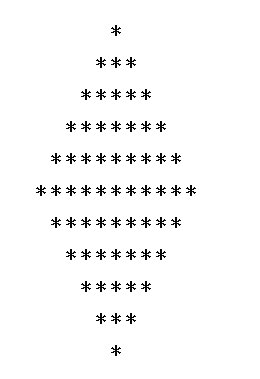

# 每日挑战#2 -钻石串

> 原文：<https://dev.to/thepracticaldev/daily-challenge-2-string-diamond-21n2>

欢迎来到挑战系列的第二天。今天，你将使用一些干净的代码来创建一个干净的钻石。

我们的挑战来自 CodeWars 上的用户 [*@jayeshcp* 。](https://www.codewars.com/kata/5503013e34137eeeaa001648)

> 您的任务是返回一个字符串，该字符串使用星号(“*”)字符在屏幕上显示一个菱形。

> print 方法返回的形状应该类似于菱形。作为输入提供的数字将代表打印在中间行的星号数。上面和下面的线将居中，比中间的线少两个星号。每一行都将继续减少，直到在图的顶部和底部打印出一个带星号的行。
> 
> 如果输入是偶数或负数，返回`null`。
> 
> 注意:JS 和 Python 的学生必须实现`diamond()`方法，对无效输入返回`None` (Py)或`null` (JS)。

尝试任何额外功能可获得奖励积分。

祝你好运！

* * *

*感谢 [CodeWars](https://codewars.com/) ，他已经在 [2 条款 BSD 许可](https://opensource.org/licenses/BSD-2-Clause)下许可了这个挑战的再分发！*

想要对未来的帖子提出挑战吗？发送电子邮件给**[yo+challenge @ dev . to](mailto:yo+challenge@dev.to)**提出您的建议！