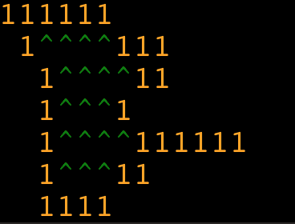
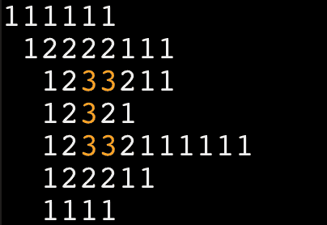
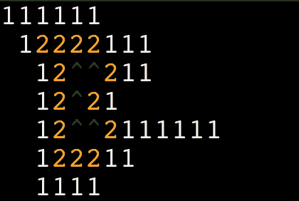

# 每日挑战#77 -鸟山

> 原文：<https://dev.to/thepracticaldev/daily-challenge-77-bird-mountain-58pm>

一只在山脉上空高高飞翔的鸟能够估计出最高峰的高度。

可以吗？

*例题*
鸟瞰

`Height=3`

* * *

这个挑战来自 [CodeWars](https://codewars.com/) 的丁格鼠，他已经在[双条款 BSD 许可](https://opensource.org/licenses/BSD-2-Clause)下许可了这个挑战的再分发！

想为未来的帖子提出一个挑战性的想法吗？发送电子邮件给**[yo+challenge @ dev . to](mailto:yo+challenge@dev.to)**提出您的建议！