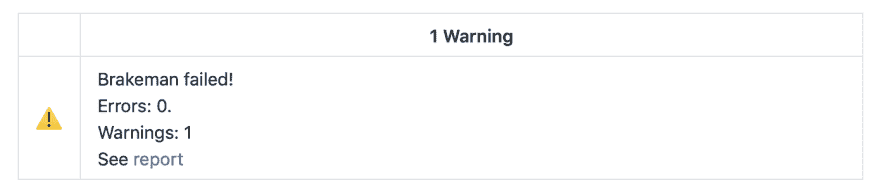

# Rails 上的危险:让机器人为你做一些代码审查！

> 原文：<https://dev.to/evilmartians/danger-on-rails-make-robots-do-some-code-review-for-you-5a3h>

*本文是我最近的 RailsConf 演讲“改造传统 Rails 应用程序”([视频](https://www.youtube.com/watch?v=-NKpMn6XSjU)，[幻灯片](https://speakerdeck.com/palkan/railsconf-2019-terraforming-legacy-rails-applications))的 b 面。*

我们，开发人员，花了我们工作时间的重要部分来做代码审查。有时候比写代码花的时间还多。即使花费几个小时也不能避免你错过拉请求中的一些潜在问题。

我们只是人，我们会犯错误，尤其是在处理日常事务时。

谁爱做无聊的事情，(几乎)不犯错？机器人！🤖

在这篇文章中，我想介绍一个可以帮助你进行代码审查的机器人。它的名字叫[虞](https://danger.systems/ruby/)(或者更准确地说，*T3】姬 T5】名)。*

> 危险在您的 CI 过程中运行，并给团队机会自动化常见的代码审查杂务。

将危险添加到项目中就像将`danger`添加到您的 Gemfile 并运行交互式`bundle exec danger init`命令一样简单，它:

*   生成一个示例`Dangerfile`——这是您使用 Ruby DSL 定义*审查规则*的地方；
*   引导您完成 GitHub 集成设置；
*   最后，帮助您将危险任务添加到 CI。

`danger`宝石本身只提供了一个[【小核心】](https://github.com/danger/danger/blob/v6.0.9/VISION.md#general-aim):

*   Git 集成允许访问回购信息(提交、差异等。).
*   Git 托管服务集成(GitHub、BitBucket、Gitlab)来访问 PRs 数据并添加评论。
*   (*)内部* ) CI 服务[集成](https://github.com/danger/danger/tree/master/lib/danger/ci_source)将 CI 构建与 PRs 正确匹配。

所有特定的功能(例如，linters 集成)都是通过插件实现的(查看 [awesome-danger](https://github.com/danger/awesome-danger) )。

这可能就是这篇文章的结尾:安装 Danger，选择插件，添加 Dangerfile，就大功告成了。如果这就是我想分享的全部，我可能只会在推特上发关于这件事的消息。给 Rails 项目增加危险变得更加棘手，也更加有趣...

## GitHub 重新整合

危险假设以下 [GitHub 工作流程](https://danger.systems/guides/getting_started.html#creating-a-bot-account-for-danger-to-use):

*   你创建一个新的 GitHub 用户；
*   将其作为合作者添加到 repo 中(针对闭源项目)；
*   为该用户生成一个访问令牌，并将其作为`DANGER_GITHUB_API_TOKEN`添加到 CI。

等等，创建新的 GitHub 用户？用邮箱和密码？没有更好的方法来添加*bot*吗？是的，有——[GitHub Apps](https://developer.github.com/apps/)。

GitHub 应用程序可以做我们需要的一切:读取 repos/PRs 数据，添加评论，更重要的是，拥有**更细粒度的权限** *。

*最近， [GitHub 为协作者、分流和维护引入了](https://github.blog/changelog/2019-05-23-triage-and-maintain-roles-beta)新的权限级别。第一个非常适合危险用户。

主要区别是 GitHub 应用程序访问令牌的工作方式:它们的生命周期非常短(最多 10 分钟)。因此，每当我们想要运行 Danger 时，我们都需要生成一个访问令牌。

尽管如此，其他一切都保持不变:我们将这个令牌作为`DANGER_GITHUB_API_TOKEN`传递，而 Danger 就像用户的访问令牌一样使用。

> 继续阅读，了解如何创建 GitHub 应用程序，并使其在 CircleCI 上充当危险机器人。

### 第一步。创建新的 GitHub 应用程序。

您可以创建个人 GitHub 应用程序或组织级别的应用程序。如果您有组织，我们建议您使用后一种方法。

按照这些说明创建一个新的应用程序。我们只关心“权限”部分:

*   为“存储库内容”选择“读取”。
*   为“问题”选择“只读”(问题和 PRs 是[“密切相关”](https://developer.github.com/v3/apps/permissions/#permission-on-issues))。
*   为“拉取请求”选择“读写”。

在新创建的应用程序中，转到“安装应用程序”部分，并将其安装到您的帐户。在那里，您将能够选择要与此应用程序一起使用的存储库列表。

别忘了[为你的机器人选择一个头像](https://google.com/search?q=danger+logo&tbm=isch)

### 第二步。添加令牌生成器。

为了解决令牌过期问题，我们编写了一个简单的 Ruby 脚本(`github-token`)，它使用[“作为安装的身份验证”](https://developer.github.com/apps/building-github-apps/authenticating-with-github-apps/#authenticating-as-an-installation)流程请求一个新的令牌。这是我们在 CircleCI 配置中使用它的方式:

```
danger:
  executor: ruby
  steps:
    - attach_workspace:
        at: .
    - run:
        name: Add github.com to known_hosts
        command: mkdir -p ~/.ssh && ssh-keyscan -H github.com > ~/.ssh/known_hosts
    - run:
        name: Danger review
        command: |
          DANGER_GITHUB_API_TOKEN=$(bundle exec .circleci/github-token) bundle exec danger
    - store_artifacts:
        path: tmp/brakeman 
```

> `github-token`脚本的源代码可以在[邪恶火星人/地球化轨道](https://github.com/evilmartians/terraforming-rails/blob/master/examples/danger)报告中找到。

脚本本身需要以下信息:

*   私钥—转到应用程序的个人资料并生成一个；
*   您的应用 ID—您也可以在应用的页面上找到它；
*   你的安装 ID——进入[https://github . com/organizations/MY-ORG/settings/installations](https://github.com/organizations/MY-ORG/settings/installations)(或者[https://github.com/settings/installations](https://github.com/settings/installations)个人安装)，点击应用的“配置”，检查 URL:它应该有一个`.../installations/ID`的形式。

分别使用以下名称将上述信息放到 CircleCI 环境中:`GITHUB_APP_PRIVATE_KEY` *、`GITHUB_APP_ID`、`GITHUB_INSTALLATION_ID`。

*CircleCI 不支持多行环境值，所以你可以做，例如，下面的操作来复制*展平的*值:

```
$ cat private-key.pem | perl -p -e 's/\n/\\n/g' | pbcopy 
```

`github-token`脚本将负责*多线*密钥的恢复。

## 模块化`Dangerfile`

默认情况下，`Dangerfile`是您所有审阅检查的唯一入口点。将所有内容保存在一个文件中效果很好，直到它变得太大，这通常很快就会发生。

另一方面，大多数检查互不依赖。那么，为什么不把它们分别保存在一个单独的文件中呢？

这正是我们所做的:

*   所有检查都存储在`.danger/`目录下的 Ruby 文件中。
*   负责执行所有的检查，还包含一些共享逻辑。

这是我们的[危险文件](https://github.com/evilmartians/terraforming-rails/blob/master/examples/danger/Dangerfile) :

```
# Shared consts
CHANGED_FILES = (git.added_files + git.modified_files).freeze
ADDED_FILES = git.added_files.freeze

Dir[File.join(__dir__, ".danger/*.rb")].each do |danger_rule_file|
  danger_rule = danger_rule_file.gsub(%r{(^./.danger/|.rb)}, "")
  $stdout.print "- #{danger_rule} "
  # execute each check using `eval`
  eval File.read(danger_rule_file), binding, File.expand_path(danger_rule_file)
  $stdout.puts "✅"
# allow a single check to fail without breaking others
rescue Exception => e
  $stdout.puts "💥"

  # make sure the result is a failure if some check failed to execute
  fail "Danger rule :#{danger_rule} failed with exception: #{e.message}\n" \
       "Backtrace: \n#{e.backtrace.join("\n")}"
end 
```

输出如下所示:

```
$ bundle exec danger

- rails_credentials ✅
- missing_labels ✅
- brakeman ✅
- ruby_deps_inconsistency ✅
- updated_deps ✅
- missing_tests ✅
- merge_commits ✅
- db_schema_inconsistency ✅
- outdated_seeds ✅

Warnings:
- [ ] Are you sure we don't need to add/update tests for the main app? 
```

## 加成:危险遇上布雷克曼

我开始尝试危险的原因之一是一个用 [Brakeman](https://brakemanscanner.org) 自动化安全检查的想法。简单地在 CI 上运行它不符合我的要求:

*   我需要一种更好的方式来查看扫描仪运行的结果，最好是在 Github 上
*   我不希望 Brakeman 的失败使我的构建变得“红色”(它不是 100%准确，可能会产生假阴性，尤其是当您使用大量元编程时)。

危险似乎是这项工作的合适工具。它只是没有现成的 Brakeman 集成(或插件)。

所以，我自己写的，你可以在这里抓取[。](https://github.com/evilmartians/terraforming-rails/blob/master/examples/danger/.danger/brakeman.rb)

该检查以编程方式运行 Brakeman(即，不使用 CLI)，生成 HTML 报告，并在报告摘要中添加指向最终危险结果的链接*:

[](https://res.cloudinary.com/practicaldev/image/fetch/s--ORX9HoF8--/c_limit%2Cf_auto%2Cfl_progressive%2Cq_auto%2Cw_880/https://thepracticaldev.s3.amazonaws.com/i/61sm73gox3tb91sg5rfl.png)

*我们生成一个到 circle ci build“Artifacts”选项卡的链接，在那里可以找到报告。 [`Dangerfile`](https://github.com/evilmartians/terraforming-rails/blob/master/examples/danger/Dangerfile) 中的代码可用。

## 总之

事实证明，Danger 是一个很好的代码审查伙伴。从现在开始我要在每个项目中使用。

> 你对危险有什么看法？你有什么建议吗？欢迎在评论中分享！

**附言**虽然我们已经在 [`terraforming-rails`](https://github.com/evilmartians/terraforming-rails) 回购中开源了上述代码，但更好的共享方式是给 Danger 本身和/或其插件添加 PRs。所以，如果你想为 OSS 做贡献，你知道该怎么做😉。

* * *

阅读更多关于 https://evilmartians.com/chronicles 的文章！