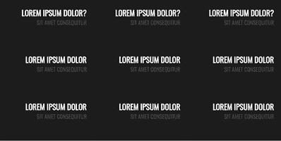
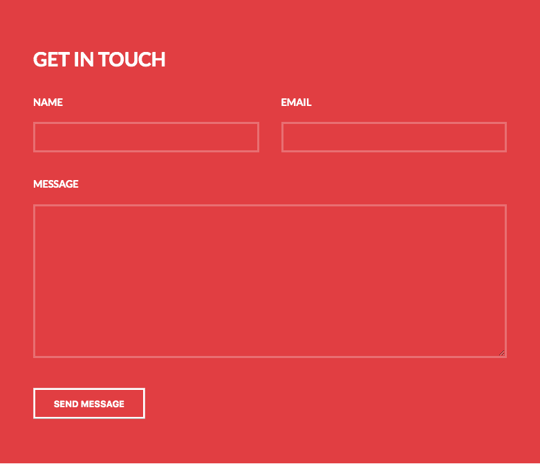
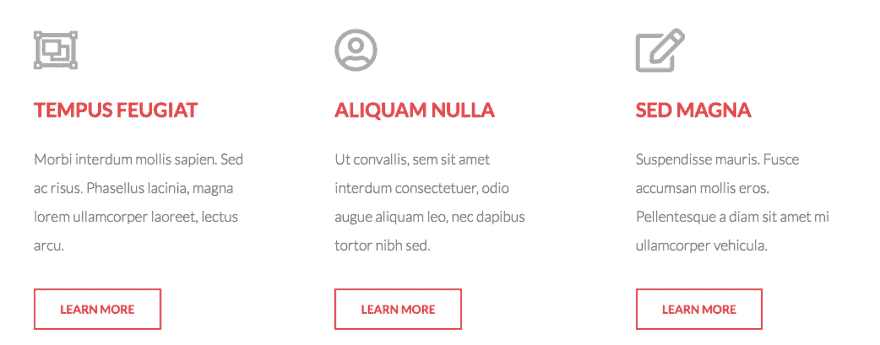
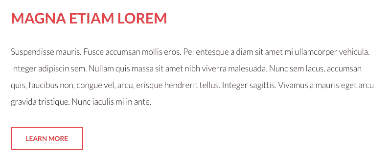

# 翻转链接，粗体形式，英雄单元|模块星期一

> 原文：<https://dev.to/tyrw/dark-links-bold-form-hero-module-monday-14bg>

## 为您的下一个项目开发开源 web 模块

以下所有内容都是开源的，可以在任何网站、web 应用程序或其他任何地方免费使用。在 Anymod 上还有数百个这样的网站。

单击一个 mod 来查看它及其源代码。

## 暗翻链接

悬停时翻转每张卡片，创建一组引人入胜的链接。
[查看 mod](https://anymod.com/mod/flip-links-mlaaab)
  

## 粗体联系人表格

一个充满活力的板块，让你的联系方式脱颖而出。
[查看 mod](https://anymod.com/mod/bold-contact-form-alrran)
  

## 英雄单位

经典好看的英雄单位给人留下很好的第一印象。
[查看 mod](https://anymod.com/mod/hero-unit-introspect-raoomk)
  

## 图标链接部分

简单、时尚、信息丰富。
[查看 mod](https://anymod.com/mod/icon-links-introspect-orddak)
  

## 了解更多区块

创造一些阴谋，让游客知道什么是什么。
[查看 mod](https://anymod.com/mod/learn-more-section-dkddrm)
  

* * *

我每周一从社区[这里](https://dev.to/tyrw)贴出新的 mods 我希望你觉得它们有用！

快乐编码✌️