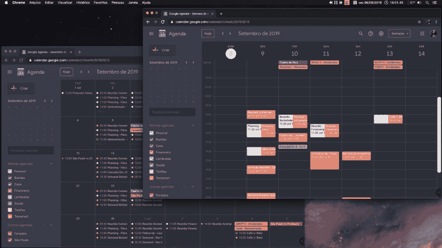
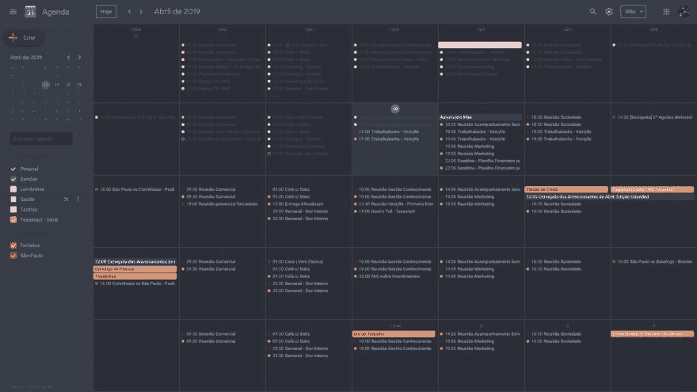
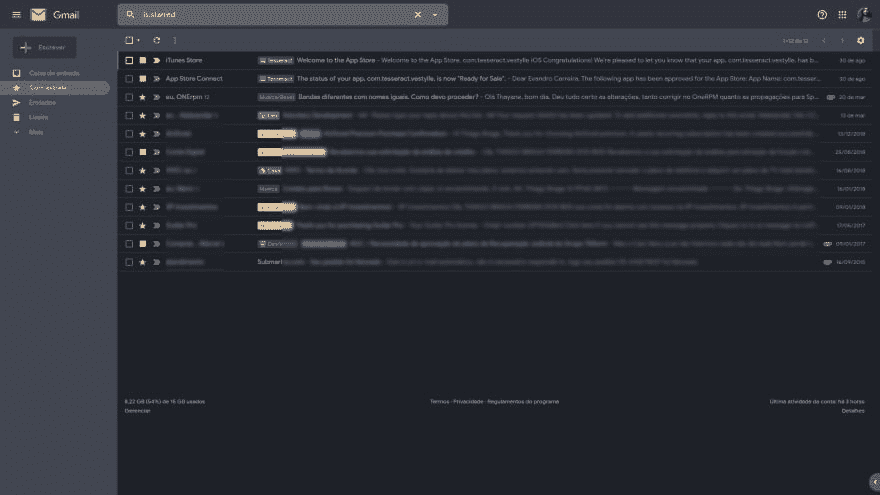
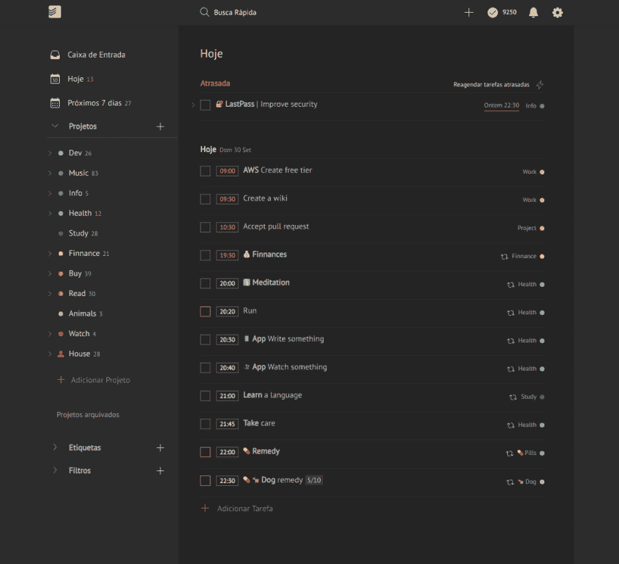
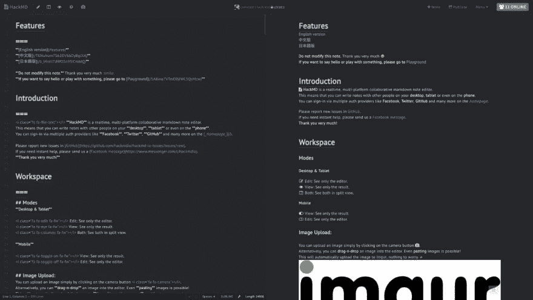

# (几乎)所有事物的黑暗主题

> 原文：<https://dev.to/thiagobraga/dark-theme-for-almost-everything-1ace>

大家好。这是我在 Dev.to 上的第一个帖子，我为此感到非常高兴。我已经推迟这个任务很久了，可能是因为完美主义或者害羞(或者两者都有)。😅

在过去的四年里，我爱上了在 [Stylus](https://add0n.com/stylus.html) Chrome 扩展的帮助下为我使用的应用程序使用和创建黑暗主题，现在我想分享和传播这个词。来到黑暗面！😎

 

<figure>

<figcaption>谷歌日历黑暗主题- v0.0.10 -周视图前台</figcaption>

</figure>

在这个故事中，我意识到通过直接编辑扩展接口来为网站开发主题是很复杂的。它没有我在 [VS 代码](https://code.visualstudio.com/)中习惯的快捷键，还有其他限制。当时我用的是 Stylebot 扩展，而不是手写笔。

所以我开始寻找一种方法在本地编辑样式，并以某种方式将更改注入到网站中，例如 [BrowserSync](https://browsersync.io/) 。BrowserSync 是我的第一次尝试，但我不能走得很远，我遇到了很多困难，比如运行服务器只是服务一个 CSS 文件并将其注入浏览器。

很久以后，我发现了这个来自[兰迪·w·西姆斯](https://github.com/simsrw73)的精彩样板(如果你正在看这个，非常感谢！！！).我非常高兴，非常感激，并开始开发自己的主题。过了一段时间，我对样板文件进行了[修改，以满足我的需求，比如用](https://github.com/thiagobraga/boilerplate-userstyles)[手写笔编写](http://stylus-lang.com)代码，用 [Make](https://dev.to/deciduously/how-to-make-a-makefile-1dep) 运行任务。这一直是一种疗法，让我开心，有益于我的视力和注意力。

你可以在带有后缀`-userstyles`的 [my Github](https://github.com/thiagobraga) 上查看我的主题。这些黑暗的主题在不断发展。其他人不太喜欢...

* * *

##  [蒂亚戈布拉加](https://github.com/thiagobraga) / [谷歌-日历-用户风格](https://github.com/thiagobraga/google-calendar-userstyles)

### 🗓谷歌日历的一个黑暗主题

* * *

##  [蒂亚戈布拉加](https://github.com/thiagobraga) / [ gmail-userstyles](https://github.com/thiagobraga/gmail-userstyles)

### 📬Gmail One 黑暗主题

*注意:要使这个主题生效，你需要将 Gmail 主题改为黑暗主题。*

* * *

## [【thiagobagha】](https://github.com/thiagobraga)/[【todoist-user styles】](https://github.com/thiagobraga/todoist-userstyles)

### ✔对 Todoist 的改进

*注: [Todoist](http://todoist.com) 有其固有的黑暗主题。我的主题只是改进了一些东西。*

* * *

##  [蒂亚戈布拉加](https://github.com/thiagobraga) / [ hackmd-userstyles](https://github.com/thiagobraga/hackmd-userstyles)

### 🖌黑暗黑客带实时预览

* * *

##  [蒂亚戈布拉加](https://github.com/thiagobraga) / [ lastpass-userstyles](https://github.com/thiagobraga/lastpass-userstyles)

### lastpass 密码管理器的蓝黑主题

* * *

希望对喜欢黑暗题材的人有用。很高兴能够以某种方式为开源社区做贡献。

谢谢😊