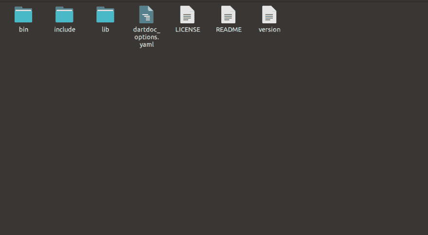

# Dart SDK:里面是什么？

> 原文：<https://dev.to/jay_tillu/dart-sdk-what-s-inside-it-421e>

## 什么是 SDK？

* * *

**SDK 是软件开发工具包的意思。** SDK 是一个包，里面打包了各种工具，为特定平台开发软件。每个平台的 SDK 都为您提供了不同的工具、库和软件，可以帮助您为该平台创建软件。

例如，Java 的 JDK (Java Development Kit)为您提供了各种工具、库和虚拟机，用于开发 Java 平台的应用程序。Same Android SDK 提供了各种工具和库，用于在 Android 中开发应用程序。

## Dart SDK

* * *

Dart SDK 拥有开发应用程序所需的库和工具。这是 Dart 的 SDK 文件夹的大致结构。

*   **lib 目录** —包括 Dart 标准库。

*   **bin 目录** —包括开发 dart2js 编译器、dartfmt、dartanalyzer 等应用所需的工具。

*   **包含目录** —包含一些必要的头文件。

*   **版本文件** —显示系统上安装的当前 dart 版本。

*   **许可证文件** —标准 SDK 许可证。

*   **自述文件** —显示 SDK 附带的目录和文件的信息。

## Dart SDK 工具

* * *

Dart SDK 包含开发 Dart 应用程序所需的七种工具。

1.  **Dart VM**—Dart 虚拟机

2.  **dart2js** — Dart 到 JavaScript transpiler(仅用于 web)(用于可部署的 JavaScript)

3.  **dartdevc** — Dart 到 JavaScript transpiler(仅用于 web)(用于测试目的)

4.  **Dart fmt**—Dart 代码格式化程序

5.  **dartanalyzer** —分析代码中 dart 语言规范中指定的错误和警告。DartPad、代码编辑器和 ide(如 Android Studio、IntelliJ IDEA 和 VS Code)使用与 dartanalyzer 相同的分析引擎。

6.  **Dartdoc**—API 文档生成器。

7.  **酒馆** —镖包经理。您可以使用`pub`工具来管理 Dart 包。*Flutter SDK 有自己的管理和更新软件包的命令。*

## 关于发布渠道和版本字符串

* * *

Dart SDK 有两个发布渠道:

*   **稳定频道** —每 6 周更新一次。
*   **开发频道** —通常每周更新 1 次。

**Dart SDK 的稳定渠道**版本有`1.24.3`和`2.1.0`这样的版本字符串。它们由点分隔的整数组成，没有连字符或字母。

**开发频道**Dart SDK 的发行版(预发行版)有额外的字符，以连字符(`-`)开头。例如，Dart 2 预发布版本的版本号以`2.0.0-dev`开头，比如`2.0.0-dev.69.5`。

所以这就是作为一个 dart 程序员你需要知道的关于 Dart SDK 的全部内容。如果我错过了什么，请随时告诉我。我很想知道。

直到那时，继续爱，继续编码。

记住没有老师，没有书，没有视频教程，也没有博客能教会你一切。有人说，学习是一个旅程，旅程永无止境。只是从这里那里收集一些数据，读一读，学一学，练一练，试着去应用。不要因为做不到或者不知道这个概念或者那个概念而犹豫。记住，每个程序员都是从你现在走的这条路上走过的。记住每个大师都曾经是初学者。努力工作，全力以赴。

### 欲了解更多信息，请访问以下链接

*   [Fuchsia OS 官方网站](https://fuchsia.dev/)
*   [Dart 官方网站](https://dart.dev/)
*   [颤振官方网站](https://flutter.dev/)

> 想和我联系吗？以下是链接。我很乐意成为你的朋友。😊
> 
> *   [推特](https://twitter.com/jay_tillu)
> *   [脸书](https://www.facebook.com/jaytillu.1314/)
> *   [Instagram](https://www.instagram.com/jay.tillu/)
> *   [中号](https://medium.com/jay-tillu)或者在 jayviveki13@gmail.com[给我发邮件](mailto:jayviveki13@gmail.com)