# 数据驱动的在旧金山哪里停车的决策

> 原文：<https://dev.to/rocksetcloud/data-driven-decisions-for-where-to-park-in-sf-2549>

你有没有觉得在阴凉的地方停车不确定？特别是，您是否曾经在旧金山停车，并想知道，如果我测量 SFPD 去年记录的每起车辆事故的平均平方反比距离，我当前的位置会落在哪个百分点？

如果是这样，我们为那个开发了一个应用[。在本帖中，我们将解释我们的方法及其实现。](https://rockset.com/sf-parking)

## 在旧金山停车

众所周知，在旧金山，与车辆相关的入室盗窃和盗窃非常普遍。就在上周，价值 50 万美元的物品在 T2 一起高调的汽车盗窃案中被盗。甚至还有一个[推特账户](https://twitter.com/sfcarbreakins)追踪事件。

旧金山警察局维护着自 2018 年 1 月 1 日以来所有事件的持续[数据集(还有](https://data.sfgov.org/Public-Safety/Police-Department-Incident-Reports-2018-to-Present/wg3w-h783)[2003-2018 年的另一个](https://data.sfgov.org/Public-Safety/Police-Department-Incident-Reports-Historical-2003/tmnf-yvry))。《旧金山纪事报》由此创建了一个[大地图可视化](https://projects.sfchronicle.com/trackers/sf-car-breakins/)来追踪非法闯入。我们希望让这些数据更具可操作性，以帮助实时评估特定位置的停车安全性。

因此，激励性的问题是:如果我想在旧金山停车，我怎么能感觉到我现在的位置有多安全？

## 定义风险分值

当然，停车位的风险可以用许多不同的定性和定量方法来衡量。我们选择了一个量化指标，无可否认是相当武断的，作为过去一年中停车地点和每个闯入地点之间距离的平均平方反比。

[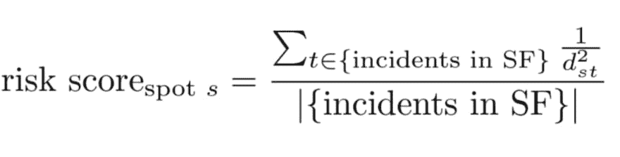](https://res.cloudinary.com/practicaldev/image/fetch/s--ygihcVVg--/c_limit%2Cf_auto%2Cfl_progressive%2Cq_auto%2Cw_880/https://images.ctfassets.net/1d31s1aajogl/14z48ECo5RdF3LyTAQEwGp/16cfc8376d86c9b662f00d8447c7cea1/image__1_.png)

这只是给出一个数字分数。然后，我们评估整个旧金山停车点代表性样本的得分，并将当前停车点置于该样本中的百分位数。分数越高，地点离历史事件越近(距离的倒数)，风险就越高。

我们将把这一切都包装在一个简单的移动网络应用程序中，这样你就可以从你的车上打开它，按下一个按钮，就可以得到你的停车位有多安全的百分比。

[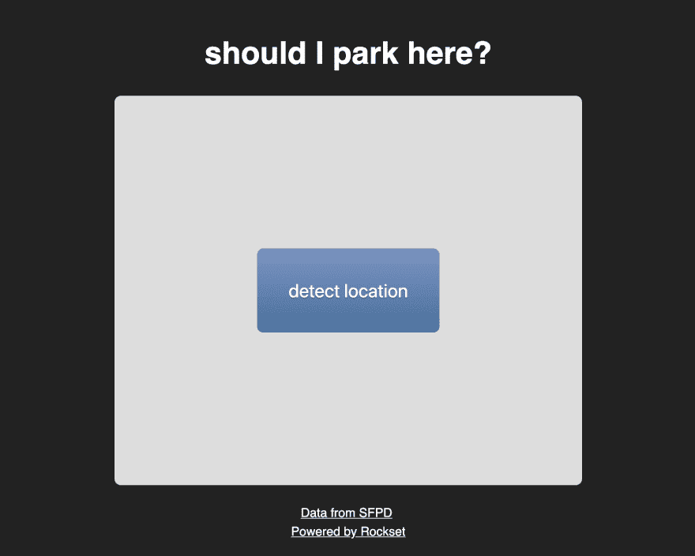](https://res.cloudinary.com/practicaldev/image/fetch/s--reob9go---/c_limit%2Cf_auto%2Cfl_progressive%2Cq_auto%2Cw_880/https://images.ctfassets.net/1d31s1aajogl/4pyylPmgECB4tuLmN7F4TR/c5aef2c4c61066159aae6789b16cc57f/image__2_.png)

现在，我们只需使用数据来计算风险分值百分比。对于此任务，我们将把 SFPD 数据加载到 Rockset 集合中，并在用户单击按钮时查询它。

## 加载数据

为了快速开始，我们将简单地下载 CSV 格式的数据，并将文件上传到一个新的集合中。

[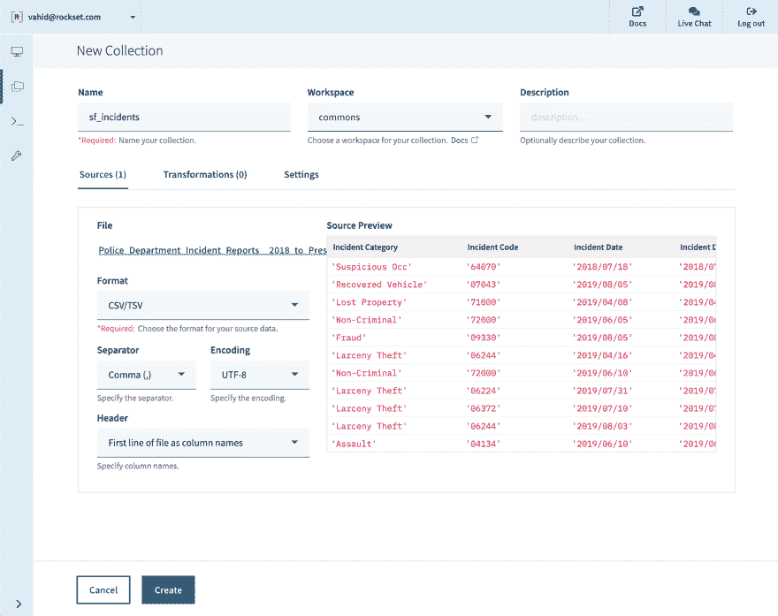](https://res.cloudinary.com/practicaldev/image/fetch/s--IcPHLE04--/c_limit%2Cf_auto%2Cfl_progressive%2Cq_auto%2Cw_880/https://images.ctfassets.net/1d31s1aajogl/6eQ5jGFJl65exKhbi3KV5O/98e2be05a8c7da7cc85e1a392489458c/image__3_.png)

稍后，我们可以设置一个定期作业，通过 API 将数据集转发到集合中，以便它总是保持最新。

## 过滤数据

让我们切换到 query 选项卡，尝试编写一个查询来过滤我们关心的事件。我们要检查几个条件:

**车辆相关事故。**每个事件都有一个由警察局犯罪分析股指定的“事件子类别”。我们在这个字段上做一个`SELECT DISTINCT`查询，扫描结果，挑选出我们认为与车辆相关的。

*   机动车辆盗窃
*   机动车辆盗窃(未遂)
*   车内盗窃
*   盗窃罪-汽车零件
*   盗窃-从车内

[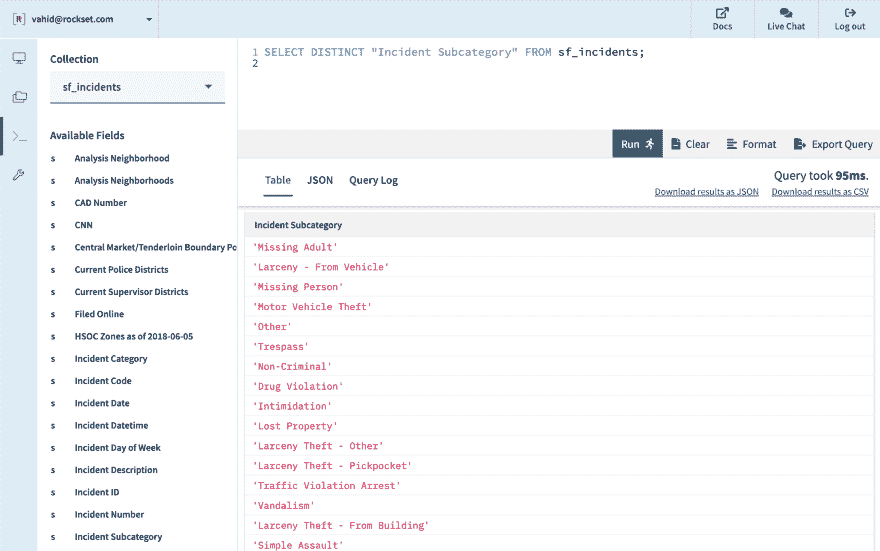](https://res.cloudinary.com/practicaldev/image/fetch/s--yWW7oHoB--/c_limit%2Cf_auto%2Cfl_progressive%2Cq_auto%2Cw_880/https://images.ctfassets.net/1d31s1aajogl/4Onw198CgowVVE8SCt16Z6/b92dbd2a9da78a98fb066f3a72c676f5/image__4_.png)

*   **初次报告。**根据[数据文档](https://data.sfgov.org/Public-Safety/Police-Department-Incident-Reports-2018-to-Present/wg3w-h783)，记录一旦归档就无法编辑，因此一些记录作为现有事件的“补充”归档。我们可以通过在报告类型描述中查找单词“Initial”来过滤掉它们。

[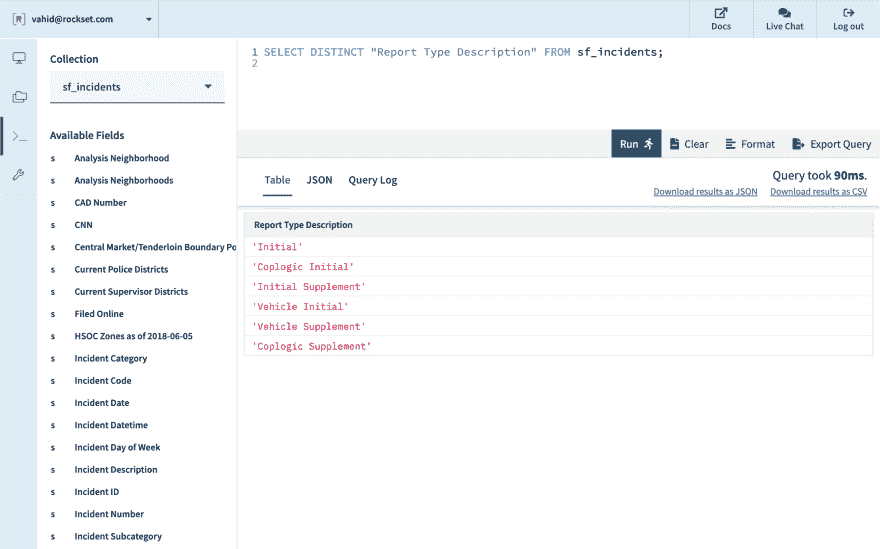](https://res.cloudinary.com/practicaldev/image/fetch/s--waJvJAq5--/c_limit%2Cf_auto%2Cfl_progressive%2Cq_auto%2Cw_880/https://images.ctfassets.net/1d31s1aajogl/3Fj8GSCVvQNPIthVKs3M67/85588b3eccb299bd8934aa06385aa6be/image__5_.png)

*   **SF 内。**文件还规定一些事件发生在旧金山以外，这些事件在警区字段中的值为“旧金山以外”。

[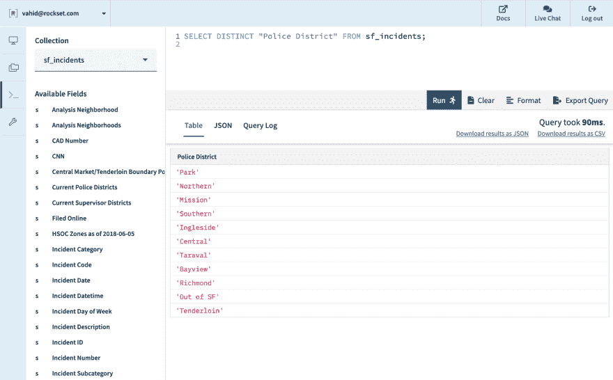](https://res.cloudinary.com/practicaldev/image/fetch/s--bQ2FIXzD--/c_limit%2Cf_auto%2Cfl_progressive%2Cq_auto%2Cw_880/https://images.ctfassets.net/1d31s1aajogl/2DKfo7TasT6zfxyNJE5gZw/8ccfcc1b38471d2cee5897f5d09fd9bf/image__6_.png)

*   去年。数据集提供了一个日期时间字段，我们可以解析它并确保它在最近 12 个月内。

[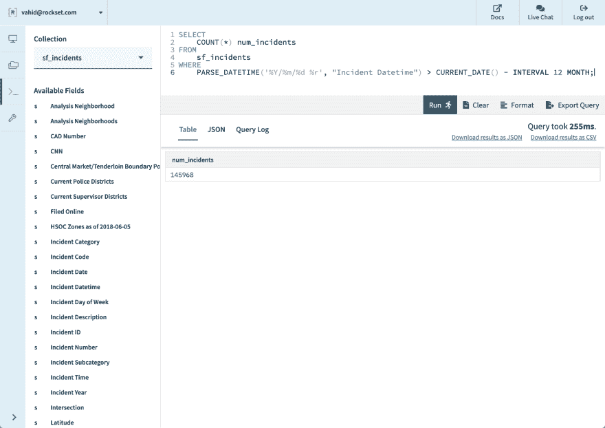](https://res.cloudinary.com/practicaldev/image/fetch/s--0CIbACm5--/c_limit%2Cf_auto%2Cfl_progressive%2Cq_auto%2Cw_880/https://images.ctfassets.net/1d31s1aajogl/6cwl9kjufwQrCzPAgtX4ho/f5c2e23d66cb9716fc94e84229d0774b/image__7_.png)

*   **地理定位可用。**我们注意到一些行缺少纬度和经度字段，取而代之的是一个空字符串。我们将通过过滤掉这些记录来忽略它们。

将所有这些条件放在一起，我们可以从该数据集中的 242，012 条记录中筛选出 28，224 个相关的车辆事故，打包成一个`WITH`查询。

[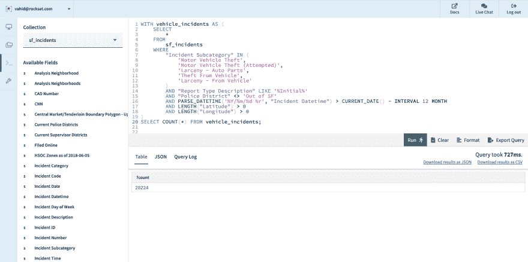](https://res.cloudinary.com/practicaldev/image/fetch/s--XhcKEqH5--/c_limit%2Cf_auto%2Cfl_progressive%2Cq_auto%2Cw_880/https://images.ctfassets.net/1d31s1aajogl/2447gpZL6dJp2zLNnm6L1v/76036b14c84c2733f632be114837101d/image__8_.png)

## 计算风险分值，一分

现在我们有了去年的所有车辆事故，让我们看看是否可以计算旧金山市政厅的安全分数，该市政厅的纬度为 37.7793 N，经度为 122.4193 W。

使用一些古老的数学技巧(半径乘以弧度角度得到弧长，将弧长近似为直线距离，以及毕达哥拉斯定理)，我们可以计算到每个过去事件的英里距离:

[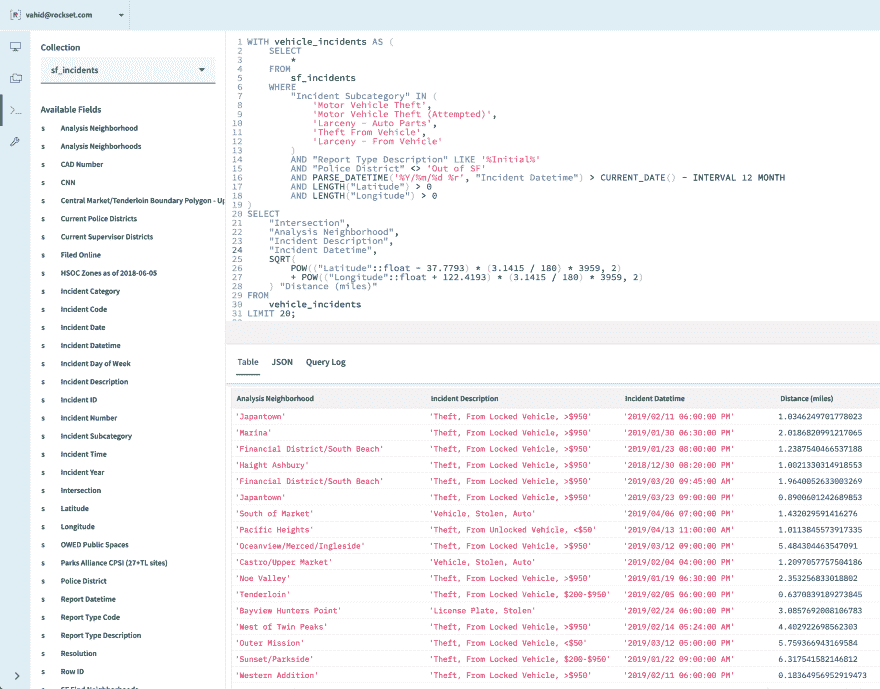](https://res.cloudinary.com/practicaldev/image/fetch/s--aCpA3FIR--/c_limit%2Cf_auto%2Cfl_progressive%2Cq_auto%2Cw_880/https://images.ctfassets.net/1d31s1aajogl/jIkNDW8IF2YY1uKffoJAi/f716733301f39cd878f56c74745531f9/image__9_.png)

我们用上面的公式计算这些距离，瞧！

[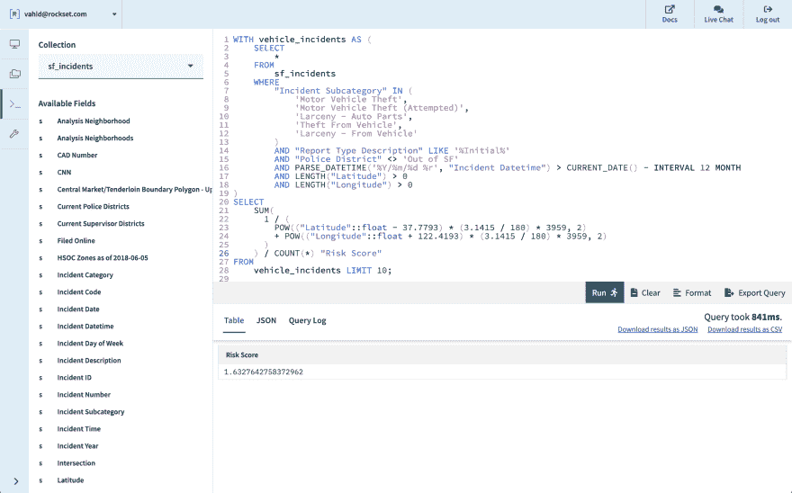](https://res.cloudinary.com/practicaldev/image/fetch/s--jldBOD67--/c_limit%2Cf_auto%2Cfl_progressive%2Cq_auto%2Cw_880/https://images.ctfassets.net/1d31s1aajogl/4ztemVlqRHW2Ve5RbsHREZ/822daa21e732b866525a74961b02bdee/image__10_.png)

对于我们的应用程序，我们将用来自用户浏览器位置的参数替换市政厅的纬度/经度。

## SF 内停车点样本

因此，我们可以计算出一个风险分数——市政厅为 1.63——但这毫无意义，除非我们可以将其与旧金山的其他停车点进行比较。我们需要在旧金山找到一组有代表性的所有可能的停车点，并计算每个停车点的风险分数，以获得风险分数的分布。

事实证明，SFMTA 正是我们所需要的——进行实地调查以统计路边停车位的数量，其结果作为开放数据集发布[。我们也会把这个上传到 Rockset！](https://data.sfgov.org/Transportation/On-street-Parking-based-on-Parking-Census/9ivs-nf5y)

[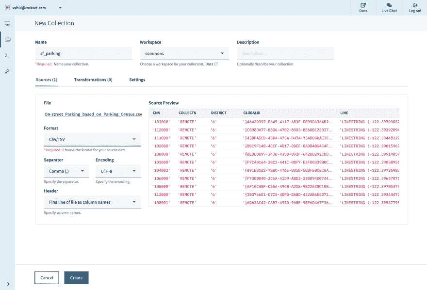](https://res.cloudinary.com/practicaldev/image/fetch/s--hJpg7USE--/c_limit%2Cf_auto%2Cfl_progressive%2Cq_auto%2Cw_880/https://images.ctfassets.net/1d31s1aajogl/3LmqUAp8f6sSaC0DT88fEW/7356cfe587a64c25adc0f5daac32e261/image__11_.png)

让我们看看这个数据集包含什么:

[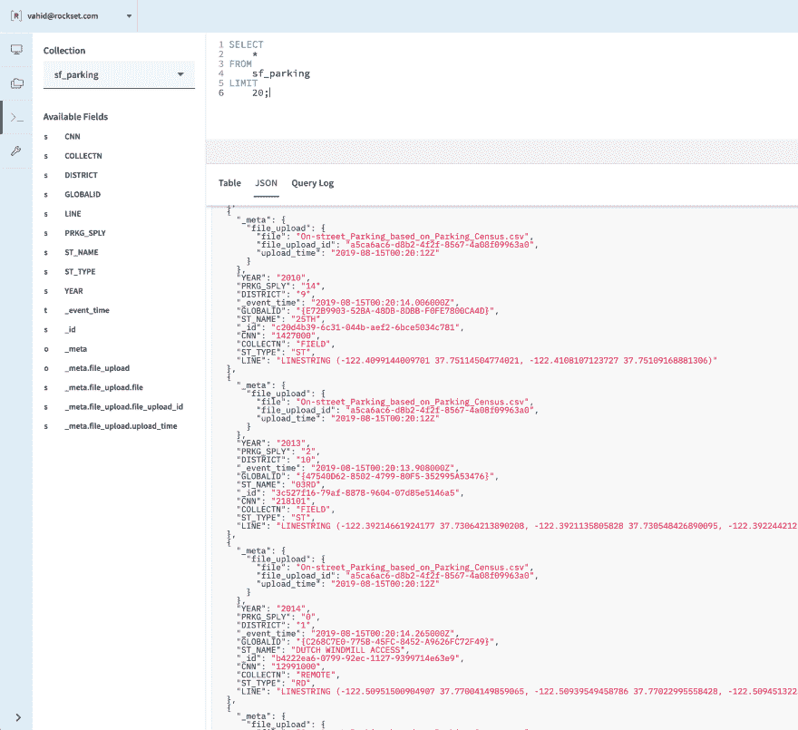](https://res.cloudinary.com/practicaldev/image/fetch/s--nt-f_2G2--/c_limit%2Cf_auto%2Cfl_progressive%2Cq_auto%2Cw_880/https://images.ctfassets.net/1d31s1aajogl/2SGnNv7s1NvEgk1hetZwNw/ab678ba8b0bff6396a1e4bbb1cfa4fbc/image__12_.png)

对于每条街道，让我们提取纬度/经度值(只是第一个点，足够接近的近似值)、点的计数和唯一标识符(根据需要转换类型):

[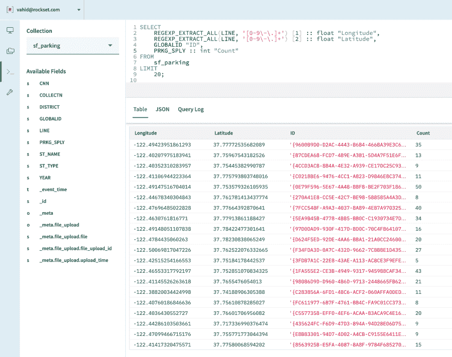](https://res.cloudinary.com/practicaldev/image/fetch/s--9PG_Q9pE--/c_limit%2Cf_auto%2Cfl_progressive%2Cq_auto%2Cw_880/https://images.ctfassets.net/1d31s1aajogl/2HcHZaoaWn2IofkjLdyc4E/729c9df35de62fc8146f37e8a5a108b7/image__13_.png)

## 计算 SF 中每个点的风险分值

现在，让我们试着计算每个点的分数，就像我们在上面对市政厅所做的一样:

[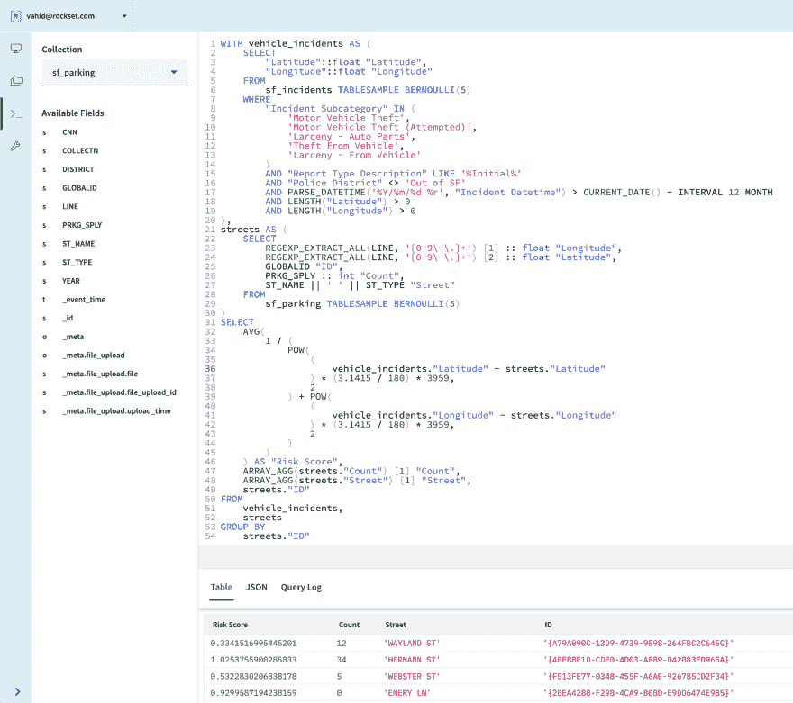](https://res.cloudinary.com/practicaldev/image/fetch/s--aF68xCZr--/c_limit%2Cf_auto%2Cfl_progressive%2Cq_auto%2Cw_880/https://images.ctfassets.net/1d31s1aajogl/24f9gHCNt1B3gb4ks16gKs/7ed9901ffc9fce657322e86287d35726/image__14_.png)

我们做到了！旧金山每个街道段的停车风险分数。这是一个繁重的查询，所以为了减轻负担，我们实际上对每个街道和事件抽取了 5%的样本。

(即将推出 Rockset:geo-indexing——在接下来的几周内，请留意关于这方面的博客帖子！)

让我们将这个查询的结果存储在另一个集合中，这样我们就可以用它来计算百分位数。我们首先创建一个新的空集合:

[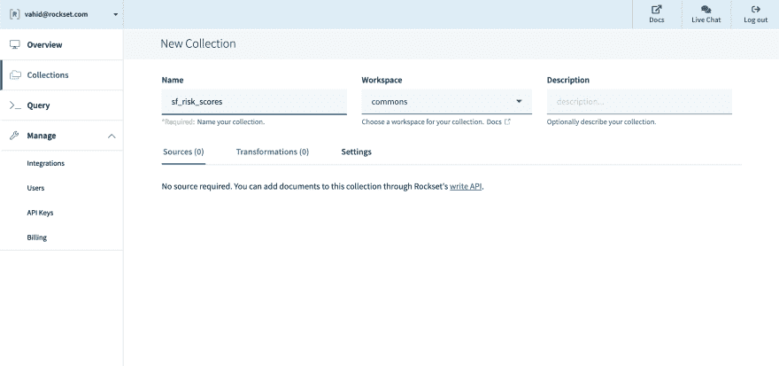](https://res.cloudinary.com/practicaldev/image/fetch/s--IRkR-cSu--/c_limit%2Cf_auto%2Cfl_progressive%2Cq_auto%2Cw_880/https://images.ctfassets.net/1d31s1aajogl/2hh1DMQefrR7cnLxsnuRs6/43598f6aa8953109a78901178503a7a9/image__15_.png)

现在我们运行一个`INSERT INTO sf_risk_scores SELECT ...`查询，对事件和街道进行高达 10%的采样:

[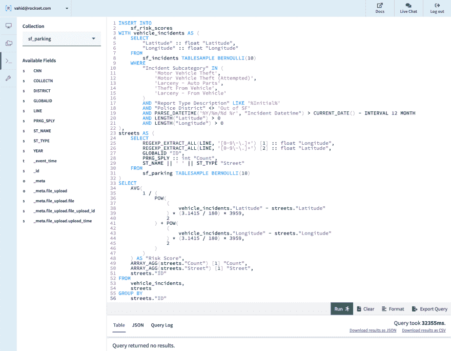](https://res.cloudinary.com/practicaldev/image/fetch/s--xuwVpmoC--/c_limit%2Cf_auto%2Cfl_progressive%2Cq_auto%2Cw_880/https://images.ctfassets.net/1d31s1aajogl/30cftaWgbKF8cOJc9Gdjru/fbeb23885fe41d921197d19ce192d92d/image__17_.png)

## 以百分位数为单位排列风险分值

现在，让我们根据插入到`sf_risk_scores`中的样本来获取市政厅的百分比。我们保留了最初的停车位分数计算方法，但现在也计算了比当前停车位更安全的采样停车位的百分比。

[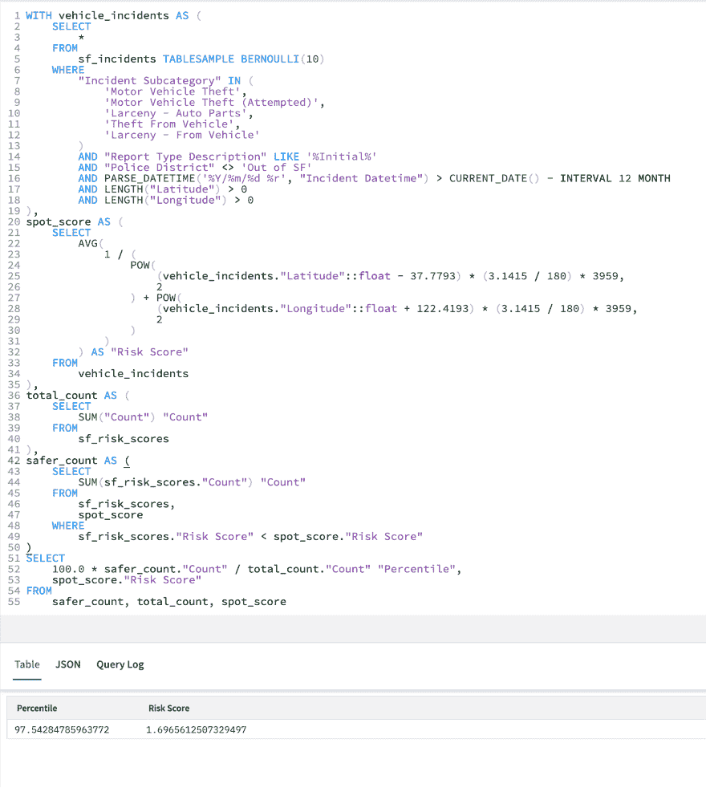](https://res.cloudinary.com/practicaldev/image/fetch/s--0Am1F8cr--/c_limit%2Cf_auto%2Cfl_progressive%2Cq_auto%2Cw_880/https://images.ctfassets.net/1d31s1aajogl/4u9R298T4GXo1WykVwPWgw/70702ed7259413311a3b935e5e676908/image__16_.png)

## 停车点风险评分即服务

现在我们有了一个可以说是有用的查询，让我们把它变成一个应用程序吧！

我们将保持简单——我们将创建一个 AWS Lambda 函数来服务两种类型的请求。对于`GET`请求，它将提供一个本地`index.html`文件，作为 UI。对于`POST`请求，它将解析`lat`和`lon`的查询参数，并将它们作为上面最后一个查询中的参数传递。lambda 代码如下所示: