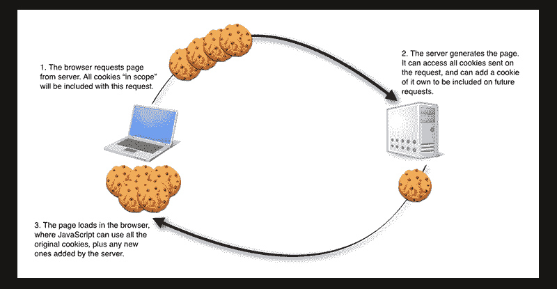

# 数据持久性

> 原文：<https://dev.to/wtschmidt/data-persistence-n12>

所以，想象一下，如果脸书仍然把你的信息存储在网页上，每次你想看你朋友的网页，你都必须重新登录。这将是非常令人沮丧的！那么，什么是数据持久性呢？这是一种从一页到另一页存储用户数据的方式，基本上是一种无论你何时移动页面，网站都知道你仍然是你的方式。在数据持久化之前，信息存储在网站的 URL 上，这意味着每次加载新的 URL 时，所有的数据都会丢失，这导致了很多麻烦。

它是怎么做到的？嗯，有一些方法，但网站通常会使用 cookies 在客户端本地存储这些信息。这可以被认为是一个 id 徽章，服务器可以快速查看以确定您的状态，从而知道您仍然是“您”。另一方面，网页也将使用保存在数据库中的会话在服务器上存储用户信息。这使得网站可以逐页动态存储数据。你可以这样想:

客户端会将您的请求发送到服务器，服务器会验证您的 ID，然后将该请求作为会话存储在其数据库中。这已经成为设计网站时的一个主要元素，在今天的每个主要网站上都可以看到。例如，每当你登录 YouTube 时，服务器都可以跟踪你观看了哪些视频，你是否喜欢或不喜欢这些视频，以及你订阅了哪些视频。它可以获取这些信息，并开始将其与网站上的其他内容联系起来，为您可能喜欢的其他内容提供建议。另一种方式是通过亚马逊，能够跟踪你通过购买对哪些商品感兴趣，并在你继续浏览其他商品时，让你的商品留在购物车中。通过 cookies 和会话的结合，Spotify 等网站允许用户将他们喜爱的音乐下载到他们的本地系统，允许离线使用。为什么这很酷？因为，作为一个流媒体网站，大多数时候它需要在线连接才能听音乐，但因为你电脑上的 cookies，Spotify 能够确认你的许可，而不必检查你的连接。

这种实用性带来了一个问题，即数据泄露。通过发送有价值的信息，如社会安全号码或信用卡信息，您可以让任何希望查找这些信息的人公开这些信息。当您的本地客户端试图向服务器发送信息时，他们通常会这样做。这是可能的，因为客户端与服务器之间存在间接关联。通常，你的电脑并不直接连接到服务器，大多数时候它必须通过节点传递这些信息，就像一个继电器，有人会监听并窃取你的身份。

这可以通过使用加密来解决，加密会通过一个称为哈希的过程将客户端发送给服务器的请求混在一起。哈希是一种有损加密，这意味着它永久地取出信息，使其对于其他用户可能输入的相同信息是唯一的。salt 随机地向提交的数据中添加信息，与 Hashing 一起使用，使得窃取您的宝贵信息变得非常非常困难。