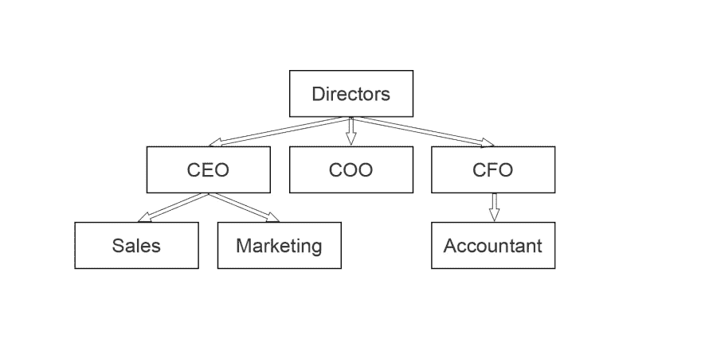
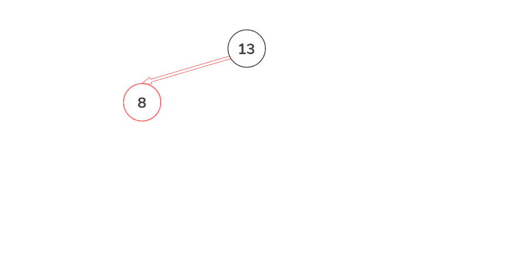
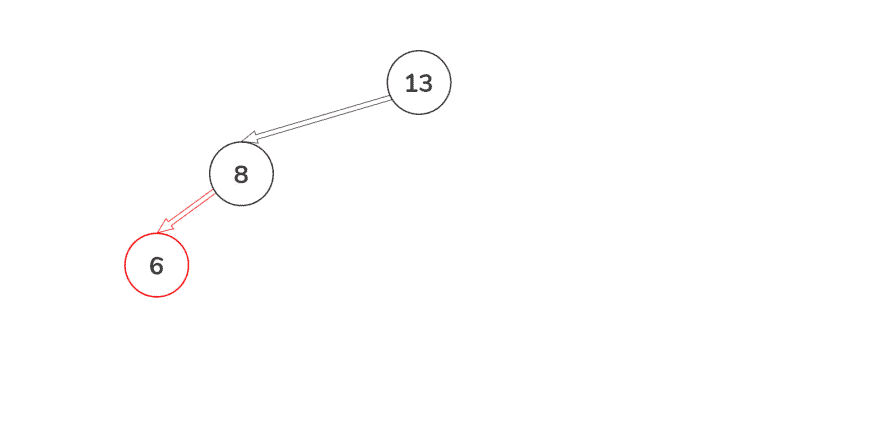
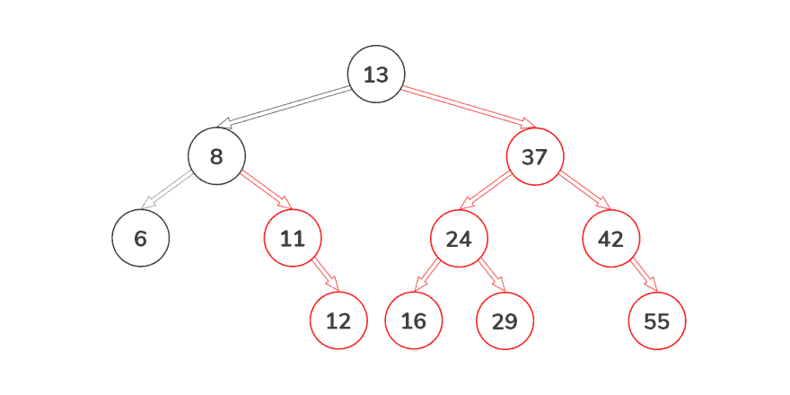
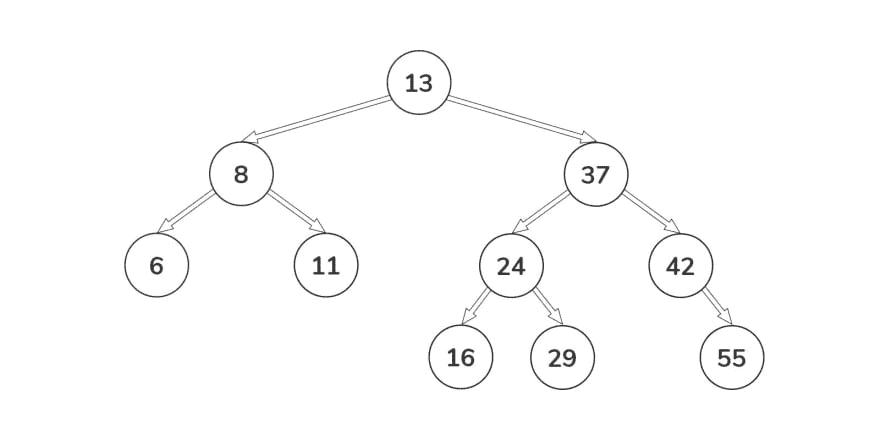
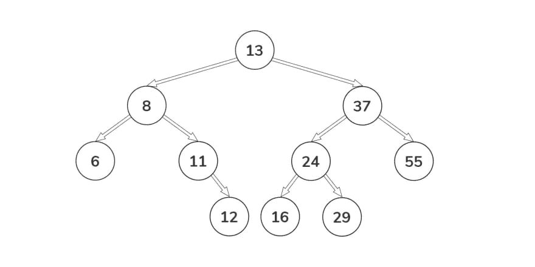
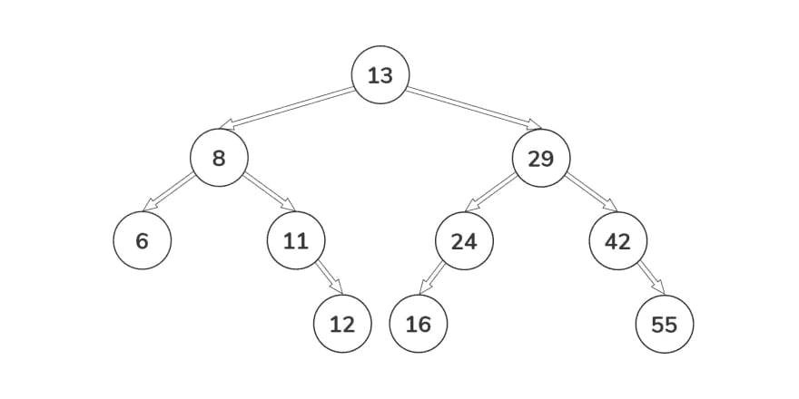
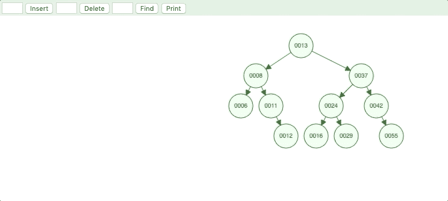

# 数据结构。JavaScript 中的二叉查找树

> 原文：<https://dev.to/alexandrshy/data-structures-binary-search-tree-in-javascript-3om9>

在发表一系列文章的同时，我决定触及一个更实际的话题——算法和数据结构。在这些文章中，我们将尝试分析二分搜索法树并用 JavaScript 编写我们的实现。

## 树

树是一种结构，其中每个节点可以有零个或多个子节点——“孩子”。例如，一棵树可能看起来像这样

[](https://res.cloudinary.com/practicaldev/image/fetch/s--MuSFkTcU--/c_limit%2Cf_auto%2Cfl_progressive%2Cq_auto%2Cw_880/https://thepracticaldev.s3.amazonaws.com/i/ui5uw8s48gd8rxgzg2xt.jpg)

这棵树显示了公司的结构。节点代表人或部门，线代表联系和关系。树是表示和存储这些信息的最有效的方式。

## 二叉查找树

二叉查找树与上例中的树相似，但它有许多特征:

*   每个节点不超过两个子节点
*   这两个子节点通常被称为*左子节点*和*右子节点*，其中*左子节点*的值总是小于父节点的值，而*右子节点*的值总是大于父节点的值

这种树的一个例子

[](https://res.cloudinary.com/practicaldev/image/fetch/s--pxTMlkZJ--/c_limit%2Cf_auto%2Cfl_progressive%2Cq_auto%2Cw_880/https://thepracticaldev.s3.amazonaws.com/i/gsg7awvtcomi61g31g1g.jpg)

好了，现在我们有了二叉查找树和建造它的规则的可视化表示。我们用 JavaScript 实现吧！

让我们从描述二叉查找树的一个节点开始。

```
class Node {
  constructor(data, left = null, right = null) {
    this.data = data;
    this.left = left;
    this.right = right;
  }
} 
```

这里我们用三个参数`data`、`left`和`right`创建一个新的节点实例。

*   `data` -该节点存储的值
*   `left` -指向节点树中左侧节点的指针
*   `right` -指向节点树中右边节点的指针

我们只是描述了二叉查找树的节点，现在让我们考虑一下基本接口。基本接口必须由三个方法组成:

1.  添加树的新值
2.  在树中查找值
3.  从树中删除值

让我们分别分析每种方法。

### 添加树的新值

假设我们有一棵只有一个节点的树，根节点是 13。我们添加了一个值为 8 的新节点。

[](https://res.cloudinary.com/practicaldev/image/fetch/s--8YGJrHzB--/c_limit%2Cf_auto%2Cfl_progressive%2Cq_auto%2Cw_880/https://thepracticaldev.s3.amazonaws.com/i/yjzo83jxcs2237m6ps5m.jpg)

因为 8 的值小于 13，所以成为左孩子。然后我们添加一个值为 6 的节点。当加 6 时，它成为 8 的左孩子，因为 6 小于 13(所以我们去左边)并且小于 8。

[](https://res.cloudinary.com/practicaldev/image/fetch/s--J4XTVT3t--/c_limit%2Cf_auto%2Cfl_progressive%2Cq_auto%2Cw_880/https://thepracticaldev.s3.amazonaws.com/i/8mlp39b66ccs13ih0c4x.jpg)

当我们添加一个值为 37 的节点时，它将成为 8 的正确子节点，因为 37 大于 8。对 11，12，24，42，16，29，55 重复同样的算法，我们会得到这样的二叉查找树。

[](https://res.cloudinary.com/practicaldev/image/fetch/s--XX_iu9S8--/c_limit%2Cf_auto%2Cfl_progressive%2Cq_auto%2Cw_880/https://thepracticaldev.s3.amazonaws.com/i/vu0wbln6c08co49d77nn.jpg)

我们得到了一个根节点为 8、深度为 3 的树(这意味着离根节点最远的节点在三个节点处)。

让我们继续看代码:

```
class BST {
  constructor() {
    /**
     * Pointer to the root node in the tree
     */
    this.root = null;
  }

  /**
   * Adds some value to the tree
   * @param {number} data The value to add into the tree
   */
  add(data) {}

  /**
   * Determines if a given value exists in the tree
   * @param {number} data The value to find
   */
  search(data) {}

  /**
   * Remove the value from the tree
   * @param {number} data The node to be removeed
   */
  remove(data) {}
} 
```

方法`add`必须遍历树以找到正确的位置来将新元素插入到树中。不应将重复的元素添加到树中。实现方法`add` :

```
add(data) {
  const node = new Node(data);
  /**
   * Check if there're nodes in the tree
   */
  if (this.root === null) {
    this.root = node;
  } else {
    /**
     * Recursively traverse
     * @param {Object} current Current node
     */
    const searchNode = function(current) {
      if (data < current.data) {
        if (current.left === null) {
          current.left = node;
          return;
        } else {
          return searchNode(current.left);
        }
      } else if (data > current.data) {
        if (current.right === null) {
          current.right = node;
          return;
        } else {
          return searchNode(current.right);
        }
      } else {
        return null;
      }
    };
    return searchNode(this.root);
  }
}; 
```

首先，我们创建了一个节点来插入到树中，并将其命名为`node`。然后我们检查当前树中是否有节点，如果没有，我们将变量`node`的值保存在`root`中。现在我们到了最重要的部分，但是不要担心，这并不难。我们创建一个变量`current`，在其中写入父节点。之后，我们开始检查新元素的值和`current`的值。如果新元素的值小于`current`，我们将使用左边的节点，如果大于这个值，我们将使用右边的节点。如果左(右)节点中没有值，我们就把它写在那里，但是如果有，我们就更新`current`。这个循环将会再次重复。

恭喜你！我们为我们的树编写了第一个方法😀

在我们继续之前，让我们确保我们的解决方案能够正确工作，为此，我们将编写一个新的简单方法。

```
toString() {
  return JSON.stringify(this.root);
}; 
```

现在让我们“创建”我们的树

```
const tree = new BST();
tree.add(13);
tree.add(3);
tree.add(37); 
```

打印结果

```
console.log(tree.toString());

// {"data":13,"left":{"data":3,"left":null,"right":null},"right":{"data":37,"left":null,"right":null}} 
```

一切正常！🙂但是我们不能停下来，让我们现在实现搜索方法。

### 在树中搜索值

搜索算法类似于我们之前讨论的算法。从根元素开始，检查节点的值。如果小于，则当前节点向左移动，如果大于则向右移动。如果没有更多的节点要检查，那么您要寻找的项目不在树中。

```
search(data) {
  /**
   * Recursively traverse
   * @param {Object} current Current node
   * @returns {boolean} True if the value is found in the tree, false if not
   */
  const searchNode = function(current) {
    if (current === null) return false;
    if (data < current.data) return searchNode(current.left);
    if (data > current.data) return searchNode(current.right);
    return true;
  };
  return searchNode(this.root);
}; 
```

搜索功能准备好了。我们只需要检查一下。

```
const tree = new BST();
tree.add(13);
tree.add(3);
tree.add(37);
tree.search(13); // true
tree.search(37); // true
tree.search(42); // false 
```

一切正常，☺️，我们必须实现移除方法。

### 从树中删除一个值

也许这是我们界面中最复杂的方法。删除节点的逻辑可以分为三种情况:

1.  移除没有子节点的节点
2.  移除只有一个子节点的节点
3.  移除有两个子节点的节点

为了弄清每一种情况，让我们回到我们先前考虑过的树

[](https://res.cloudinary.com/practicaldev/image/fetch/s--pxTMlkZJ--/c_limit%2Cf_auto%2Cfl_progressive%2Cq_auto%2Cw_880/https://thepracticaldev.s3.amazonaws.com/i/gsg7awvtcomi61g31g1g.jpg)

#### 删除没有子节点的节点

假设我们想删除一个值为 12 的节点。很简单，我们需要在树中找到这个节点，用`null`替换它就行了。结果，我们得到了一个更新的树。

[](https://res.cloudinary.com/practicaldev/image/fetch/s--eHRkyUB7--/c_limit%2Cf_auto%2Cfl_progressive%2Cq_auto%2Cw_880/https://thepracticaldev.s3.amazonaws.com/i/4cocxru186v3djdwivvm.jpg)

#### 删除只有一个子节点的节点

假设我们想要删除一个值为 42 的节点。这里的算法和上一个相似，我们需要在树中找到这个节点，但是在找到它之后，我们需要将子节点移动到被移除节点的位置。在我们的例子中，我们写的不是 42，而是 55。

[](https://res.cloudinary.com/practicaldev/image/fetch/s--N1vq3dXH--/c_limit%2Cf_auto%2Cfl_progressive%2Cq_auto%2Cw_880/https://thepracticaldev.s3.amazonaws.com/i/qgk492djacn0u0enjvjl.jpg)

#### 删除有两个子节点的节点

假设我们想要删除一个值为 37 的节点。这可能是删除节点最困难的情况。我们需要通过遍历子树来找到被删除节点的最佳替换。寻找最佳替换节点的方法可能有所不同，重要的是不违反左子节点和右子节点的规则。我们将使用这个算法:我们在要删除的节点处找到左边的子节点，然后找到这个子树的最大值(它总是右边子节点的值)。然后用新的 onde 替换移除的节点。在我们的例子中，我们写的不是 37，而是 29。

[](https://res.cloudinary.com/practicaldev/image/fetch/s--C3de92yr--/c_limit%2Cf_auto%2Cfl_progressive%2Cq_auto%2Cw_880/https://thepracticaldev.s3.amazonaws.com/i/qfbraav9kvuhnfui40tn.jpg)

现在让我们实现`remove`方法

```
remove(data) {
  /**
   * Recursively traverse
   * @param {Object} current Current node
   * @param {number} data Node to remove
   */
  const removeNode = function(current, data) {
    /**
     * If the tree is empty just exit
     */
    if (current === null) return null;
    /**
     * Determine which node to traverse
     */
    if (data < current.data) {
      current.left = removeNode(current.left, data);
    } else if (data > current.data) {
      current.right = removeNode(current.right, data);
    } else {
      if (current.left === null && current.right === null) return null;
      if (current.left === null) return current.right;
      if (current.right === null) return current.left;
      let replacement = current.left;
      let replacementParent = current;
      /**
       * Find the best replacement
       */
      while (replacementParent.right !== null) {
        replacementParent = replacement;
        replacement = replacement.right;
      }
      current.data = replacementParent.data;
      current.left = removeNode(current.left, replacementParent.data);
    }
    return current;
  };
  this.root = removeNode(this.root, data);
}; 
```

方法准备好了。我们只需要检查一下。

```
const tree = new BST();
tree.add(13);
tree.add(8);
tree.add(6);
tree.add(11);
tree.add(12);
tree.add(37);
tree.add(24);
tree.add(42);
tree.add(16);
tree.add(29);
tree.add(55);
tree.remove(90);
tree.remove(12);
tree.remove(42);
tree.remove(37); 
```

打印结果

```
console.log(tree.toString());

// {"data":13,"left":{"data":8,"left":{"data":6,"left":null,"right":null},"right":{"data":11,"left":null,"right":null}},"right":{"data":29,"left":{"data":24,"left":{"data":16,"left":null,"right":null},"right":null},"right":{"data":55,"left":null,"right":null}}} 
```

一切都很好😌我知道这个方法看起来有点复杂，所以让我们再一次想象节点的移除。为此，我们将使用[二叉查找树可视化工具](https://www.cs.usfca.edu/~galles/visualization/BST.html)。

[](https://res.cloudinary.com/practicaldev/image/fetch/s--jlsmWzCJ--/c_limit%2Cf_auto%2Cfl_progressive%2Cq_66%2Cw_880/https://thepracticaldev.s3.amazonaws.com/i/5rns0v7b2r5vc68yp9bh.gif)

你可以建立自己的二叉查找树并进行实验，这会让你更好地理解这个主题。

## 结论

我们已经考虑过如何建设一个二叉查找树。我们已经用方法回顾了二叉查找树的基本接口:添加、搜索和删除。我们用 JavaScript 编写了自己的实现(源代码在 [GitHub](https://github.com/Alexandrshy/articles/blob/master/algorithms/binary-search-tree/binary-search-tree.js) 和 [Jsfiddle](https://jsfiddle.net/cvLs9qd3/) 上)。这就是现在的全部，在下一部分我们将讨论我们实现的新方法，并看看实际的任务 [Leetcode](https://leetcode.com/) 和 [Hackerrank](https://www.hackerrank.com/) 。

感谢您的关注，祝您愉快👋