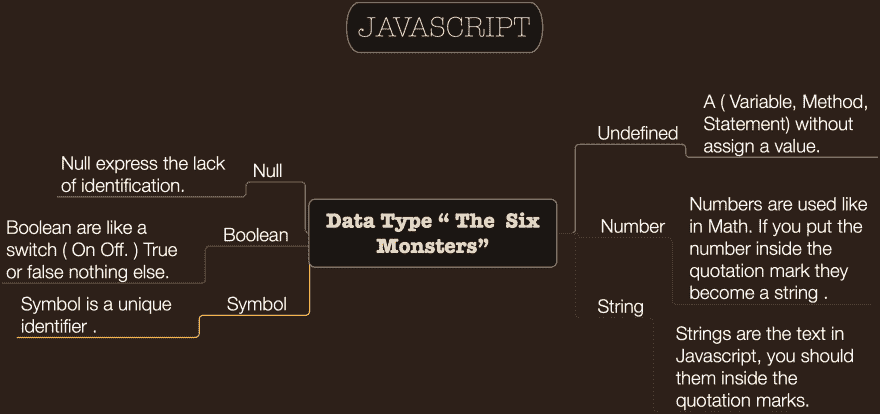

# 数据类型“六个怪物”

> 原文：<https://dev.to/giandodev/data-type-the-six-monsters-660>

## 越简单越好。

> 我一生中犯的最大错误之一就是不理解简单的价值。我一直认为复杂性是值得追求的，但事实恰恰相反。编程教会了我生活。解决问题的能力，意识到解决问题的方法不止一种。把一个问题分解开来，一次解决一个问题。在困难面前找到动力，尊重自己的水平，通过规划具有挑战性但现实可行的任务，一步一步地前进。

这些都是有价值的教导。

* * *

这是第一张图片，我的第一个帖子，肯定不完美，许多地方都在改进，但对我来说，这是我成为前端开发人员的旅程中重要的一步。

