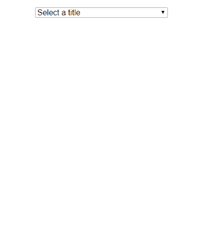
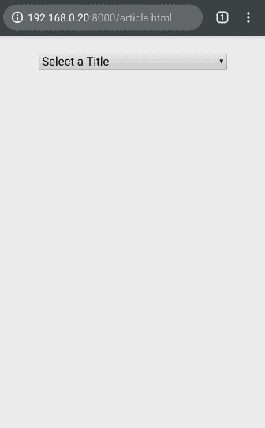
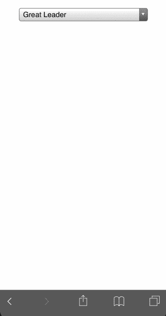
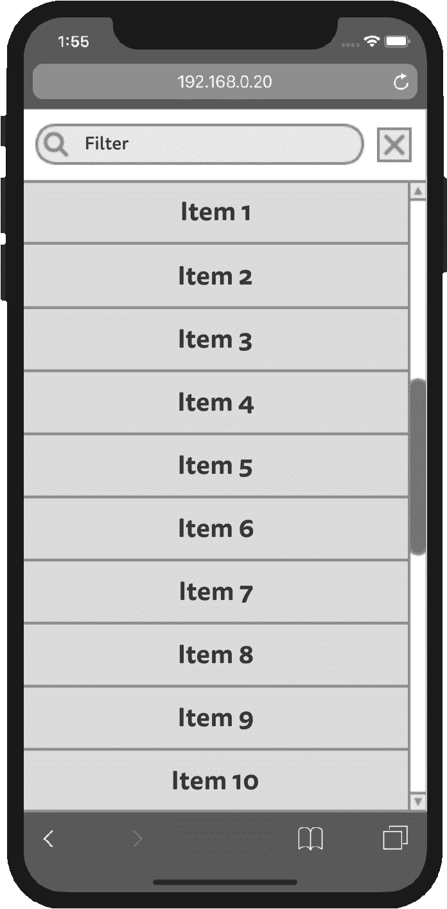
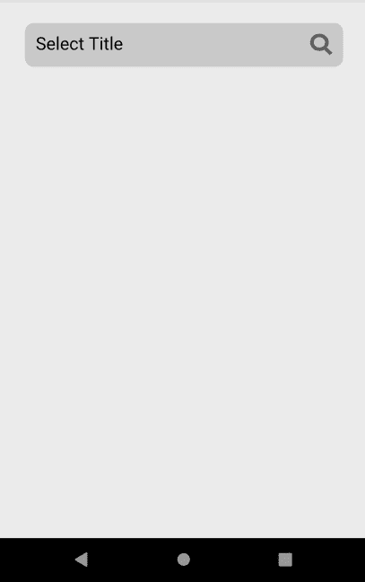
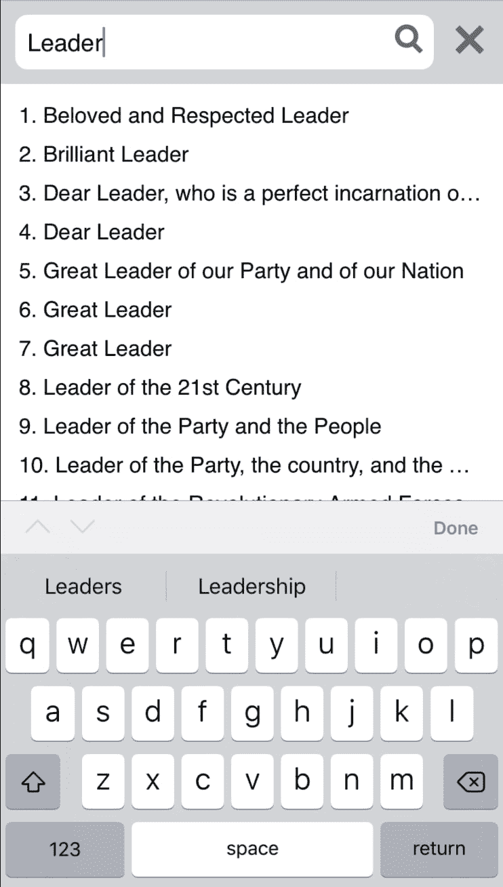
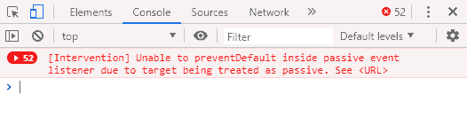

# 作为朝鲜前端开发人员处理平台不一致性

> 原文：<https://dev.to/raicuparta/dealing-with-platform-inconsistencies-as-a-north-korean-front-end-developer-3158>

你是一名朝鲜工程师，被选中开发一个新的政府项目。这是一个 HTML 表格，朝鲜政治领导人将填写该表格用于`[REDACTED]`目的。

其中一个字段要求用户选择他们喜欢被称呼的头衔。[由于清单可能会变得很长](https://en.wikipedia.org/wiki/List_of_Kim_Jong-il's_titles)，你决定去寻找你的好的旧`<select>`元素。看起来是这样的:

| 视窗(铬合金) | 苹果电脑(Safari) |
| --- | --- |
|  |  |

没什么不寻常的，在大多数情况下完全可以接受。

你知道 **`<select>`有那种“搜索”功能，当你键入**时，它会跳转到条目。但是你不确定*伟大领袖*是否意识到这一点。你会觉得这没什么大不了的，只要列表是按字母顺序排列的。

移动呢？

| 安卓(Chrome) | iOS (Safari) |
| --- | --- |
|  |  |

Android 试图尽可能多地使用屏幕，覆盖地址栏。在 iOS 上，可见项目的数量很少，这对于更大的列表来说是一种糟糕的体验。它们都缺乏搜索或过滤列表项的方法。

这位国父会看向另一边吗？不想冒任何风险，你把这件事掌握在自己手中。你想要可以在移动设备上过滤的东西，并且更好地利用屏幕空间。

在桌面平台上，这并不难实现:只需要一个带有文本输入的自定义下拉菜单来过滤。对于移动设备，您需要一些不同的东西。让我们把重点放在移动版本上，并假设您有办法根据平台选择正确的实现。

这是你的移动计划:

[](https://res.cloudinary.com/practicaldev/image/fetch/s--BO6-4D2o--/c_limit%2Cf_auto%2Cfl_progressive%2Cq_auto%2Cw_880/https://i.imgur.com/xmPAh3U.png)

全屏模式，顶部有一个用于过滤的固定文本输入，下面有一个可滚动的项目列表。您的第一直觉告诉您实现应该是这样的:

```
<button onclick="openModal()">Select a title</button>
<div class="modal" id="modal">
  <div class="modal-header">
    <input type="text" id="filter-input">
    <button onclick="closeModal()">X</button>
  </div>
  <div class="modal-body">
    <button>Item 1</button>
    <button>Item 2</button>
    <!-- remaining items... -->
  </div>
</div> 
```

Enter fullscreen mode Exit fullscreen mode

```
.modal {
  display: none;
  position: fixed;
  top: 0;
  left: 0;
  height: 100vh;
  flex-direction: column;
}

.modal.show {
  display: flex;
}

.modal-body {
  flex: 1;
  overflow-y: auto;
} 
```

Enter fullscreen mode Exit fullscreen mode

```
const modal = document.getElementById('modal')
const filterInput = document.getElementById('filter-input')

function openModal() {
  modal.classList.add('show')
  filterInput.focus()
}

function closeModal() {
  modal.classList.remove('show')
} 
```

Enter fullscreen mode Exit fullscreen mode

重要的是:

*   `position: fixed`将模态固定到屏幕上；
*   `height: 100vh`使高度为视口的 100%;
*   模态分为两部分:标题和正文；
*   表头的高度由其子项定义，不需要显式设置；
*   Body 用`flex: 1`填充剩余高度；
*   当列表不合适时，使其可滚动。

看起来是这样的:

| 安卓(Chrome) | iOS (Safari) |
| --- | --- |
|  |  |

在 iOS 上看起来不错，但在 Android 上最后几项被删除了。为什么？

一些移动浏览器在用户向下滚动时隐藏地址栏。这改变了可视视口的高度，但不改变`100vh`的含义。所以`100vh`实际上比最初看到的要高一点。

你的模态有`position: fixed`，所以不需要用`vh`单位。`height: 100%`将正确填充可用高度:

[](https://res.cloudinary.com/practicaldev/image/fetch/s--r6PXt_zh--/c_limit%2Cf_auto%2Cfl_progressive%2Cq_66%2Cw_880/https://i.imgur.com/LBH8Mq6.gif)

整洁！这已经是对手机上原生版本`<select>`的改进。现在您需要实现过滤器行为。

你很确定你的*引导太阳光线*不想经历每次打开模态后都必须触摸滤波器输入的麻烦。所以你应该在模态一打开就`focus()`过滤输入。这样，键盘弹出，用户可以马上开始输入。让我们看看它是什么样子的:

| 安卓(Chrome) | iOS (Safari) |
| --- | --- |
|  |  |

这次在 Android 上一切看起来都很好。在 iOS 上，当你试图滚动列表时，模态标题会滚出边界。这是怎么回事？

| 不带键盘的 iOS | 带键盘的 iOS |
| --- | --- |
|  |  |

当您按“Leader”过滤时，列表会变得足够小，无需滚动即可适应屏幕，但前提是键盘不可见。在 Android 上，打开键盘会将视口缩小到可见区域。但是**在 iOS 上，视口大小保持不变；它只是被键盘**盖住了。iOS 允许您在键盘打开的情况下滚动页面，显示页面中丢失的部分。这种行为会破坏像您这样的`position: fixed`元素。

更糟糕的是，没有办法知道键盘会有多高，或者它是否在那里(用户可以使用硬件键盘)。这次没有任何聪明的 CSS 技巧可以救你。

所以你需要一个可滚动的列表，所有的条目都可以被访问，而不需要知道屏幕下方的任意部分是否可见。这是您的解决方法:

[](https://res.cloudinary.com/practicaldev/image/fetch/s--AoBkBuEy--/c_limit%2Cf_auto%2Cfl_progressive%2Cq_66%2Cw_880/https://i.imgur.com/VZPJge6.gif)

您可以在列表底部添加一个间隔符(以绿色突出显示，便于查看)。此间隔的高度是列表区域的高度减去一个元素。这样，总是可以一直滚动到底部，将最后一个元素带到列表的顶部。

仍然有方法使模态滚动到视口之外，您需要修补它们。

一种方法是在任何当前可见的不可滚动元素上滑动。在您的例子中，这是模态头。你不能仅仅通过 CSS 禁用所有的指针事件，因为你需要内部元素(过滤输入和关闭按钮)仍然可用。解决方案是禁用`touchmove`事件上的滚动:

```
const header = document.getElementById('modal-header')

header.addEventListener('touchmove', event => {
  event.preventDefault()
}) 
```

Enter fullscreen mode Exit fullscreen mode

对`touchmove`的默认反应是滚动，所以用`preventDefault()`阻止它会使它不可滚动。

* * *

现在让我们绕个小弯。我一直在用 HTML + JavaScript 编写这些例子，以使文章更具通用性。但是我在 React 中开发时遇到了这种螺旋式的变通方法。这就是我如何在 React 中定义我的事件处理程序:

```
function handleTouchMove(event) {
  event.preventDefault()
}

// …

<Element onTouchMove={handleTouchMove} /> 
```

Enter fullscreen mode Exit fullscreen mode

在普通的 JavaScript 中，这可能会被翻译成这样:

```
const element = document.getElementById('element')

element.addEventListener('touchmove', event => {
  // call the callback for this element
}) 
```

Enter fullscreen mode Exit fullscreen mode

但是发生的事情更接近于这个(不是真正的代码):

```
document.addEventListener('touchmove', event => {
  const element = React.getElementFromEvent(event)

  // call the callback for this element
}) 
```

Enter fullscreen mode Exit fullscreen mode

React 在文档级别绑定事件，而不是在每个单独的节点级别绑定它们。以下是我在 React 中尝试`preventDefault()`触摸事件时发生的情况:

[](https://res.cloudinary.com/practicaldev/image/fetch/s--bAERF3Ms--/c_limit%2Cf_auto%2Cfl_progressive%2Cq_auto%2Cw_880/https://i.imgur.com/LJvSU1c.png)

浏览器会阻止它。[这是随着 Chrome 更新引入的，默认情况下事件是“被动的”](https://github.com/facebook/react/issues/9809#issuecomment-414072263)，在文档级别不能用`preventDefault`阻止。解决方案是在节点级别手动绑定事件，而不是通过 React 的事件系统:

```
ref = React.createRef();

componentDidMount() {
  ref.addEventListener('touchmove', handleTouchMove)
}

function handleTouchMove (event) {
  event.preventDefault()
}

// …

<Element ref={ref} onTouchMove={handleTouchMove} /> 
```

Enter fullscreen mode Exit fullscreen mode

所以是的，特别是在 React 中，这个变通方法需要一个变通方法。

在我写这篇文章的时候， [React 的事件系统正在被重写](https://github.com/facebook/react/issues/15257)，所以当你读到这篇文章的时候，这个问题可能已经不存在了。

现在回到*你的*问题。

* * *

还有一种方法可以赶走你的希望和梦想。如果用户在没有更多项目要显示时坚持滚动，则可以向上滚动视口。这些都不会再困扰你了，你只需要在那里插入另一个工作区:

```
const modalBody = document.getElementById('modal-body')

menuScroll = () => {
  if (modalBody.scrollHeight - modalBody.scrollTop === modalBody.clientHeight) {
    modalBody.scrollTop -= 1
  }
}

modalBody.addEventListener('scroll', menuScroll) 
```

Enter fullscreen mode Exit fullscreen mode

当滚动到底部时，您将列表的滚动位置推离边缘一个像素。这样，外部卷轴永远不会被触发。

这个解决方案已经相当可靠了，但是还有一点需要改进。模态突然覆盖屏幕可能会有点不和谐。如果*阁下*没有注意到并受到惊吓怎么办？谁来照顾你的孩子？

一个简单的过渡动画可以使它更容易跟随。也许你可以从屏幕底部滑动模态？用 CSS 转场很容易实现:

```
.modal {
  /* ... */

  display: flex;
  top: 100vh;
  transition: top 500ms;
}

.modal.show {
  top: 0;
} 
```

Enter fullscreen mode Exit fullscreen mode

现在，不是用`display: none`和`top: 0`初始化你的模态，你已经用`display: flex`启动了它，但是用`top: 100vh`把它推出了视窗。当模态设置为可见时，它将平滑滚动到屏幕顶部。让我们看看结果:

| 安卓(Chrome) | iOS (Safari) |
| --- | --- |
|  |  |

如此接近！Android 再次表现良好，而 iOS 一看到模态就把它轰到外太空。在模态被激活时切换键盘似乎不是一个好主意。你很有信心在动画完成后才显示键盘应该可以修复它:

```
function openModal() {
  modal.classList.add('show')

  // new
  setTimeout(() => {
    filterInput.focus()
  }, 500)
} 
```

Enter fullscreen mode Exit fullscreen mode

很简单。你等待 500 毫秒，与过渡持续时间相同，然后你才`focus()`输入使键盘弹出。你告诉自己以后会清理这个问题，可能会使用事件或一些奇特的库，而不是依赖于 JS 和 CSS 之间的一致值。但你知道这不会发生。结果是:

| 机器人 | ios |
| --- | --- |
|  |  |

iOS 似乎根本没有把重点放在输入上。当然，不可能那么容易。 **iOS 只允许`focus`事件作为用户交互**的直接结果而发生，而`setTimeout`不是这样。您的解决方法是将“选择标题”按钮变成文本输入:

```
<input onfocus="openModal()" readonly=true placeholder="Select a title"> 
```

Enter fullscreen mode Exit fullscreen mode

`readonly`隐藏插入符号，确保用户在转换过程中不能在这个新输入中键入任何内容。这样，iOS 将基于第一个`focus`事件显示键盘，允许您在转换完成后将焦点更改为第二个输入。

[](https://res.cloudinary.com/practicaldev/image/fetch/s--gMvFg8In--/c_limit%2Cf_auto%2Cfl_progressive%2Cq_66%2Cw_880/https://i.imgur.com/ZXElGGp.gif)

而且很管用！你终于完成了。你为你的工作感到自豪，知道你的家人至少还能再活几个月。

* * *

[点击此处查看模态的完整代码](https://github.com/Raicuparta/frontend-platform-inconsistencies/tree/master/page)