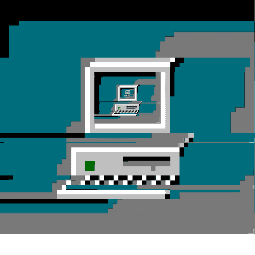
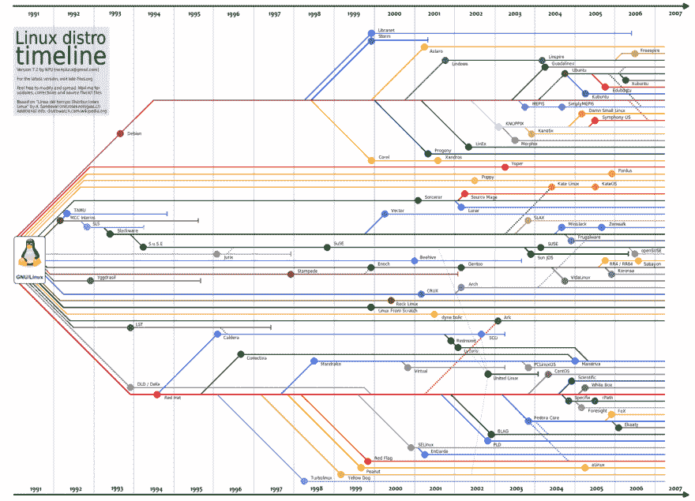
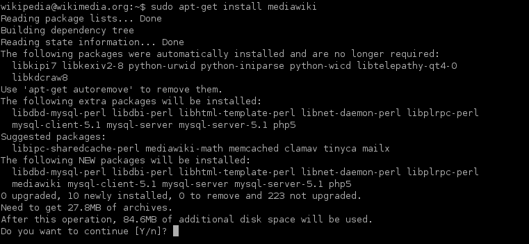

# Debian 和 Ubuntu 简介

> 原文：<https://dev.to/sebsanzdesant/debian-ubuntu-a-beginners-intro-1h40>

简单看一下两个流行的 linux 操作系统，Debian 和 Ubuntu。

作为一个新手，窥视一下 linux 操作系统世界的现状可能会引起一定程度的眩晕。

一般来说，在选择电脑操作系统时，世界很简单，大多数人都会选择 Mac OS 和 Windows，然后是 Linux。

苹果和微软集中资源，一次只更新一个版本的操作系统(Windows XP、98、7 或 Mac OS 9、Snow Leopard、Mojave 等)..)，Linux 发行版是操作系统的无数实例、风格和变化的巨大鸿沟；每一个都被设计成做不同的事情..或者更多的时候，以不同的方式做同样的事情。

Linux 发行版是如此丰富多样，它类似于在版本控制服务(如 Github)上发现的巨大的代码库。事实上，毫不奇怪 Git 版本系统是由 Linux 内核的创造者 Linus Torvalds 创建的。

有无数的 linux 发行版可供使用。Actaully 898:

今天我们来比较一下两个最流行的发行版，Ubuntu 和它最初的母操作系统 Debian。

Debian 是 1993 年开发的第一批原始 Linux 发行版之一，Debian 的分支 [Ubuntu](https://ubuntu.com/) 于 11 年后的 2004 年问世。

# 发布

这些版本的发布明显不同。虽然 Debian 存在的时间更长，但它的最新版本停留在 10，而 Ubuntu 的数量几乎是它的两倍。这是因为 Debian 是由一个严格遵守开源精神的志愿者社区支持的。Ubuntu 也是开源驱动的，由 Canonical 积极维护，Canonical 是一家私营公司，也出售企业风格的服务。

Debian 总是至少有三个版本处于有效维护中:稳定(目前是巴斯特)、测试(牛眼)和(Sid)不稳定。

 
Debian Unstable 是以《玩具总动员 1》中喜欢破坏玩具的邻家男孩希德的名字永久命名的。使用风险自担！

Ubuntu 遵守严格的发布时间表，但更频繁地每六个月发布一次，每两年发布一次 LTS 长期支持版本。

# 兼容性和管理

两种风格都使用相同的软件打包系统，称为“apt”，但区别在于专有软件的交付和包含(或不包含)。Debian 明确提倡免费开源的软硬件驱动，默认不包含专有软件。

这意味着 Debian 在某些情况下可以限制你想使用的硬件或应用程序的类型，虽然有变通办法，但这个过程并不适合胆小的人。

另一方面，Ubuntu 捆绑了各种开放的、封闭的、自由的或者许可的软件，提供了更多的灵活性。

# 表现

对我来说，Linux 发行版的一个吸引人的因素是对资源的有效利用，以及通常比 Windows 或 Mac 快得多的性能。

Ubuntu 明显比 Windows 或 Mac 快，但比 Debian 慢。这是因为 Ubuntu 的桌面环境和特定项目，如帐户功能和 GUI，确实会影响性能。另一方面，Debian 只是一个框架，因此速度非常快，重量也很轻，但代价是用户体验更好/更温和。

# 哪个比较好？

像所有开发/编程/代码的事情一样，这取决于你试图解决的问题。

Ubuntu 提供了坚实的桌面体验，可以与 Windows 或 Mac 竞争，但牺牲了 Linux 作为一个概念所坚持的开源精神。Canonical 是一家私人拥有的公司，事实上它是按成本提供服务的。

Debian 以易用性为代价，提供严格的安全性和低资源使用，同时由开源社区坚持和维护..

总的来说，后者是希望更多控制和配置的更有经验的用户的理想环境，而前者是希望尝试的消费者/初学者的理想解决方案。