# 调试与松露和以太坊混音在汤汀 DApp 游戏

> 原文：<https://dev.to/weg2g/debugging-with-truffle-and-ethereum-remix-in-tontine-dapp-game-20mi>

以太坊是一个通用的区块链，更适合通过高级脚本描述业务逻辑，也称为智能合约。以太坊被设计为一个更广阔的视野，作为一个试图结合区块链力量的分散式或世界计算机，作为一个信任机器，具有图灵完全契约引擎。虽然以太坊借用了许多最初由比特币引入的思想，但两者之间存在许多分歧。
以太坊虚拟机和智能合约是以太坊的关键元素，并构成其主要吸引力。在以太坊中，智能合约代表一段用高级语言(Solidity，LLL，Viper)编写的代码，并作为字节码存储在区块链中，以便在每个节点中基于堆栈的虚拟机(以太坊虚拟机)中可靠地运行，一旦被调用。与智能合约功能的交互通过区块链网络上的事务发生，它们的有效负载在以太坊虚拟机中执行，共享的区块链状态相应地更新。

对于不熟悉区块链技术的人阅读[从比特币看区块链技术的历史和演变](https://myhsts.org/tutorial-history-and-evolution-of-blockchain-technology-from-bitcoin.php)文章强烈推荐。此外，如果您希望学习和练习 Hyperledger 区块链开发，请访问[全面的 Hyperledger 培训教程](https://myhsts.org/tutorial-comprehensive-blockchain-hyperledger-developer-guide-for-all-professional-programmers.php)页面以获得我们的 Hyperledger 教程文章的概要。
我们写了两套教程，深入探讨以太坊和 Solidity 编程。第一套包括以下九种食谱:

*   [用 DApps 和以太坊 VM 开发以太坊区块链简介](https://myhsts.org/tutorial-learn-about-ethereum-blockchain-development-with-dapps-and-ethereum-vm.php)
*   [用以太坊和 Solidity 编程语言构建拍卖 DApp](https://myhsts.org/tutorial-learn-how-to-build-auction-dapp-with-ethereum-and-solidity-programming-language.php)
*   [通过 Remix IDE 使用以太坊区块链应用](https://myhsts.org/tutorial-learn-how-to-work-with-ethereum-blockchain-applications-through-remix-ide.php)
*   [为以太坊拍卖 DApp](https://myhsts.org/tutorial-learn-how-to-build-bidding-form-in-web3js-for-ethereum-auction-dapp.php) 在 Web3js 中建立投标表格
*   [与 web3js API 和 JSON 合作构建以太坊区块链应用](https://developer.ibm.com/recipes/tutorials/working-with-web3js-api-and-json-to-build-ethereum-blockchain-applications/)
*   [管理以太坊智能合约的部署环境](https://dev.to/weg2g/deployment-environments-for-managing-ethereum-smart-contracts-16ha)
*   [通过 Golang 与 Geth 一起使用以太坊专用网络](https://myhsts.org/tutorial-learn-how-to-work-with-ethereum-private-network-with-golang-with-geth.php)
*   [使用 Solidity 编译器编译和部署以太坊契约](https://myhsts.org/tutorial-learn-how-to-compile-and-deploy-ethereum-contracts-using-solidity-compiler.php)
*   [运行以太坊拍卖 DApp 和坚固性提示](https://myhsts.org/tutorial-learn-how-to-run-ethereum-auction-dapp-with-some-solidity-tips.php)

简而言之，您学习了如何设置和配置以太坊，以及如何使用 Solidity 编程语言开发区块链应用程序。我们探索了它的关键组件，包括智能合约和 Web3。JS API 通过拍卖分散应用程序(DApp)一步一步。在第二集中，我们讨论了以太坊区块链的发展和稳定性中更高级的主题，同时一步一步地构建了一个托尼·DApp 游戏。具体来说，我们包括松露和毛毛雨。例如，我们向您展示了像 Truffle 这样的工具如何成为构建、测试、调试和部署 DApps 的助手。总之，我们将涵盖四个主要主题:

*   探索松露套房
*   学习 Solidity 的高级特性
*   合同测试和调试
*   使用毛毛雨构建用户界面

第二套包括如下 8 种配方:

*   [安装 Truffle 并设置 Ganache，为 Tontine DApp 游戏编译以太坊智能合约](https://myhsts.org/tutorial-learn-how-to-install-truffle-and-setup-ganache-for-compiling-ethereum-smart-contracts-for-tontine-dapp-game.php)
*   [运行 Tontine 以太坊 DApp 游戏合同](https://myhsts.org/tutorial-learn-how-to-run-tontine-ethereum-dapp-game-contract.php)
*   [设计 Tontine 以太坊 DApp 游戏界面](https://myhsts.org/tutorial-learn-how-to-design-tontine-ethereum-dapp-game-interfaces.php)
*   [通过托尼·DApp 游戏契约以太坊和实体之间的互动](https://myhsts.org/tutorial-learn-about-blockchain-contract-interactions-between-ethereum-and-solidity-via-tontine-dapp-game.php)
*   [在托尼·DApp 游戏中进行块菌单元测试](https://developer.ibm.com/recipes/tutorials/work-with-ethereum-solidity-and-truffle-unit-testing-in-tontine-dapp-game/)
*   调试与松露和以太坊混音在汤汀 DApp 游戏
*   [用毛毛雨为 Tontine DApp 游戏构建前端应用](https://myhsts.org/tutorial-learn-how-to-build-frontend-blockchain-application-for-Ethereum-dapp-game-with-drizzle.php)
*   [跑步和玩 Tontine 以太坊 DApp 游戏](https://myhsts.org/tutorial-learn-how-to-run-and-play-tontine-ethereum-dapp-game.php)

***<u>重要提示:在制作第二套配方之前，需要理解并完成第一套配方。</u>***
在我们的第一轮配方中，我们学到了很多关于以太坊生态系统的知识，但是我们还没有意识到它不同组成部分的全部潜力。更准确地说，我们探索了以太坊是如何工作的，什么是**去中心化应用** ( **DApp** )以及如何构建一个去中心化应用，还介绍了 Solidity 和 web3.js 的关键概念。然后，我们介绍了一些最常见的智能合同设计模式(退出合同、限制访问、状态机)，最后讨论了合同的成本优化。为了复习你的知识和技能，在第二轮食谱中，我们将制作一个汤汀·DApp 游戏。我们将利用这个例子来探索新的工具，这些工具将改变你构建 DApps 的方式，并引入新的 Solidity 特性。

在本演练中，我们将发现 Truffle 这样的工具如何帮助构建、测试、调试和部署我们的 DApp。

熟悉调试的开发人员会发现这是一种受欢迎的解脱。Truffle 和 Remix 提供了内置的调试功能，帮助我们理解代码失败的地方。本节概述了在 Truffle 和 Remix 中的调试。如果您熟悉使用其他 ide(如 Eclipse 或 NetBeans)进行调试，您会发现 Truffle 和 Remix 同样有用，尽管它们功能不那么强大。

#### 用松露调试

Truffle 包括一个内置的调试器，用于调试根据合同进行的交易。它支持基本的调试操作，如代码单步执行(over、into、out、next 和 instruction)、断点和观察表达式。

为了尝试调试特性，让我们故意在 Ctontine 契约中引入一个 bug，并将其重新部署到 Ganache 中。之后，我们将运行测试，并使用 Truffle 的调试器来检测错误的来源。
首先，在 Ctontine 契约代码中，将 join()
方法中的第一个 require()语句更改如下:

要求(！TP player . exist(msg . sender))；

如您所见，我们通过添加感叹号“！”颠倒了所需的条件，表示该球员不应该在 Cplayer 合同中注册。这违背了我们之前测试的逻辑，因为我们在调用每个单元测试之前添加了测试播放器，包括 join()方法的测试。
现在，如果你运行松露测试 test/test.js - network my_ganache 测试，你会看到如下错误:
[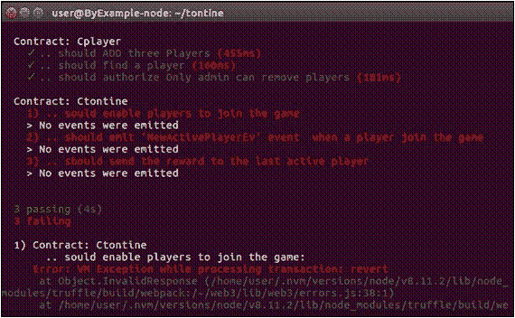](https://res.cloudinary.com/practicaldev/image/fetch/s--j9ggGz13--/c_limit%2Cf_auto%2Cfl_progressive%2Cq_66%2Cw_880/https://coding-bootcamps.com/img/external/16/debugging-with-truffle-and-ethereum-remix-1.gif) 

输出显示，我们在 Ctontine 测试和 VM 异常方面存在严重问题，而处理事务错误消息对检测背后的原因没有太大帮助。我们去追虫子吧。

##### 发现错误

为了调试前面的错误，从 ganache-cli 复制事务 ID:

[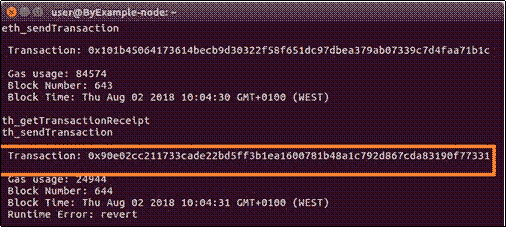](https://res.cloudinary.com/practicaldev/image/fetch/s--oP8T-g6d--/c_limit%2Cf_auto%2Cfl_progressive%2Cq_66%2Cw_880/https://coding-bootcamps.com/img/external/16/debugging-with-truffle-and-ethereum-remix-2.gif)

然后把它作为参数输入到 truffle debug<tx id="">-network my _ ganache

debug 命令中。</tx>

在这种情况下，我们运行:

**松露调试 0x 90 e 02 cc 211733 cade 22 BD 5 ff 3 B1 ea 1600781 b 48 a1 c 792d 867 CDA 83190 f 773319-网络 my_ganache**

一旦执行，你将进入松露的调试模式，如下截图所示:

[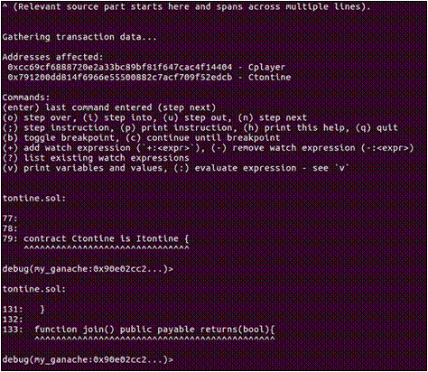](https://res.cloudinary.com/practicaldev/image/fetch/s--vn2T4duf--/c_limit%2Cf_auto%2Cfl_progressive%2Cq_66%2Cw_880/https://coding-bootcamps.com/img/external/16/debugging-with-truffle-and-ethereum-remix-3.gif) 

持续按下 *Enter* 按钮，以单步执行代码并跟踪执行步骤。最后，调试器将停止，并显示一条错误消息:

[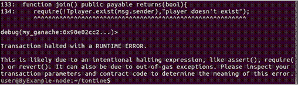](https://res.cloudinary.com/practicaldev/image/fetch/s--Z6hNRXdt--/c_limit%2Cf_auto%2Cfl_progressive%2Cq_66%2Cw_880/https://coding-bootcamps.com/img/external/16/debugging-with-truffle-and-ethereum-remix-4.gif) 

因此，Truffle 的调试器指示异常(错误)是由于 require()语句失败而引发的。TP player . exist(msg . sender))将始终为假。如果您还记得的话，这是因为在 join()测试中，我们首先添加了玩家，因此 exist()函数将始终为真，因此我们的错误 require()将会失败。重要的一点是，Truffle 用一条有趣的消息向我们指出了代码失败的地方，而不是之前由 VM 生成的错误消息。

##### 断点和监视值

更重要的是，Truffle 的调试器控制台使您能够通过按 b 键切换断点，然后按 c 键进行调试，直到到达断点。此外，您可以使用+:variable_name 或在任何调试步骤中按 v 键来选择要监视的变量(state 或 local)。

例如，如果我们调试由第一个(成功的)Cplayer 测试(addPlayer()测试)发起的事务，我们可以使用 v 选项可视化每个变量的值，如下:

[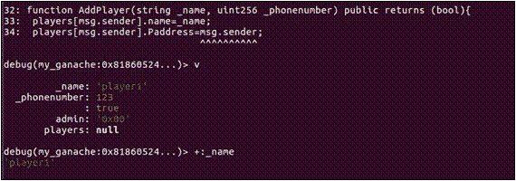](https://res.cloudinary.com/practicaldev/image/fetch/s--SUdXyylp--/c_limit%2Cf_auto%2Cfl_progressive%2Cq_66%2Cw_880/https://coding-bootcamps.com/img/external/16/debugging-with-truffle-and-ethereum-remix-5.gif) 

请确保尝试前面介绍的所有调试器功能。阅读 Truffle 的文档是一个很好的起点。

现在，回滚修改，保存契约用 Remix 试调试。

#### 使用 Remix 调试

如果你不是 CLI 工具的粉丝，Remix 对你来说是一个不错的调试选择。事实上，Remix 提供了一个有更多选项的图形界面。

启动并连接 Remix 到 Ganache，就像我们在之前的菜谱中所做的那样。一旦连接上，您将能够调试我们使用 Truffle 调试的上一个事务。首先，我们需要激活调试模式。有几种方法可以实现这一点，最简单的方法是浏览到右侧面板中的 debugger 选项卡，然后在调试输入中提供事务哈希(事务索引)或块号:

[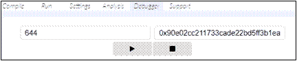](https://res.cloudinary.com/practicaldev/image/fetch/s--FjHP1ITr--/c_limit%2Cf_auto%2Cfl_progressive%2Cq_66%2Cw_880/https://coding-bootcamps.com/img/external/16/debugging-with-truffle-and-ethereum-remix-6.gif)
T4】

在 Remix 的右侧窗格中，在有几个控件的调试窗体上，按下 play 按钮开始调试。您将看到一个调试菜单，其中显示了以下视图:

[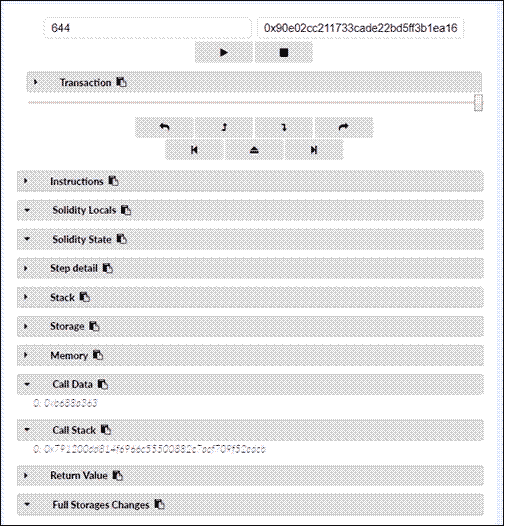](https://res.cloudinary.com/practicaldev/image/fetch/s--3e2cD_nu--/c_limit%2Cf_auto%2Cfl_progressive%2Cq_66%2Cw_880/https://coding-bootcamps.com/img/external/16/debugging-with-truffle-and-ethereum-remix-7.gif)

这些视图如下所示:

*   **指令**:列出执行的操作码
*   **实度** L **ocals** :显示当前范围内局部变量的内容
*   **固化状态**:显示当前执行合同的状态变量
*   **步骤详情**:显示当前步骤的执行详情(剩余气体和 VM 跟踪步骤)

```
 <li><strong>Stack</strong>:  Displays the local variables values stored in the stack</li>
      <li><strong>Storage</strong>:  Displays the contract storage entries(key, value) as shown here:</li>
    </ul>
  </ul>
</ul> 
```

[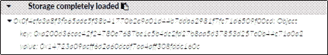](https://res.cloudinary.com/practicaldev/image/fetch/s--ax3NGjB3--/c_limit%2Cf_auto%2Cfl_progressive%2Cq_66%2Cw_880/https://coding-bootcamps.com/img/external/16/debugging-with-truffle-and-ethereum-remix-8.gif)
T4】

*   **内存**:提供一个查看合同使用的内存空间的视图
*   **调用数据**:通常包含一个 4 字节的方法签名，后跟序列化的参数

顶部的滑动条(事务部分)帮助您轻松地前进或回退事务的执行(调试),以可视化可用调试信息的演变。

在滑块下方，Remix 在工具栏顶部提供了一组按钮，用于控制正在调试的事务的执行:

*      **使用调试按钮**单步执行一个事务的有效负载:单步返回、单步返回、单步进入和单步跳过
*    您可以使用各自的调试按钮随时停止调试和恢复运行:和

使用 Remix debugger 的事务 ID 来调试之前的错误事务归结为处理原始信息，包括执行的操作码列表。在第一种情况下，调试器向我们展示了执行以一条 REVERT 指令结束:

[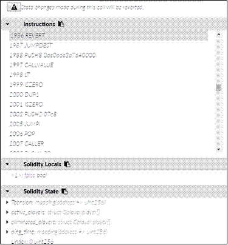](https://res.cloudinary.com/practicaldev/image/fetch/s--HSnQOx7l--/c_limit%2Cf_auto%2Cfl_progressive%2Cq_66%2Cw_880/https://coding-bootcamps.com/img/external/16/debugging-with-truffle-and-ethereum-remix-15.gif)

如果您遵循跳转指令和加载到堆栈中的值，您将能够跟踪异常的来源。然而，我高度怀疑你不能(或不想)处理这个困难的任务，这就是为什么我们在本节的剩余部分提出一个更简单的替代方案。

##### 将调试器附加到代码

对于初学者来说，在没有将调试器附加到代码上的情况下，仅使用事务 ID 来使用 Remix 的调试器可能会有点麻烦。要制作附件，我们需要加载契约代码，并将 Remix 连接到您在 Ganache 中迁移的新实例。

首先，从松露的文件夹中导入合同文件，如下:

[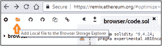](https://res.cloudinary.com/practicaldev/image/fetch/s--QX9zejBy--/c_limit%2Cf_auto%2Cfl_progressive%2Cq_66%2Cw_880/https://coding-bootcamps.com/img/external/16/debugging-with-truffle-and-ethereum-remix-16.gif) 

使用 truffle migrate–reset–network my _ Ganache 将合同部署到 Ganache 中，然后检索合同的地址:

[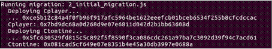](https://res.cloudinary.com/practicaldev/image/fetch/s--tKwkufpz--/c_limit%2Cf_auto%2Cfl_progressive%2Cq_66%2Cw_880/https://coding-bootcamps.com/img/external/16/debugging-with-truffle-and-ethereum-remix-17.gif) 

在 **Run** 选项卡下，使用 **At Address** 按钮(不是 **Deploy** )将 Remix 连接到已部署的 Ctontine 契约。然后我们对 Cplayer 做同样的事情。你最终会得到两个合同加载到 Remix 中。

然后，我们使用 addPlayer()添加三个虚构的玩家。要添加不同的玩家，请每次更改右侧面板顶部交易参数中指示的帐户，并执行 addPlayer()函数(按 addPlayer()按钮):

[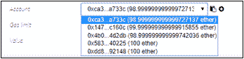](https://res.cloudinary.com/practicaldev/image/fetch/s--p-pMmpzQ--/c_limit%2Cf_auto%2Cfl_progressive%2Cq_66%2Cw_880/https://coding-bootcamps.com/img/external/16/debugging-with-truffle-and-ethereum-remix-18.gif) 

现在我们有三个注册的玩家，我们可以开始与 Ctontine

合同进行交互。

##### 观察价值观

Remix 为我们提供了一个观察和检查合约变量的观察窗口。要使用此功能，在右侧面板中，左起第二个选项卡，用 1 和**乙醚**填写**值**:

[](https://res.cloudinary.com/practicaldev/image/fetch/s--fyvW1720--/c_limit%2Cf_auto%2Cfl_progressive%2Cq_66%2Cw_880/https://coding-bootcamps.com/img/external/16/debugging-with-truffle-and-ethereum-remix-19.gif)

然后，通过按下“加入”按钮，让第一个玩家加入 Tontine 游戏。当它成功完成时，更改帐户并用 zero ether 调用 join 方法，您将在消息输出中得到以下错误:

[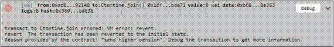](https://res.cloudinary.com/practicaldev/image/fetch/s--bFL8DSUY--/c_limit%2Cf_auto%2Cfl_progressive%2Cq_66%2Cw_880/https://coding-bootcamps.com/img/external/16/debugging-with-truffle-and-ethereum-remix-20.gif) 

您是否注意到输出控制台中的**发送更高退休金**消息？如果您还记得，这条消息是在 require 函数中定义的，目的是向我们展示异常背后的原因:require(msg . value>= 1 ether&&t pension[msg . sender]= = 0，" send higher pension ")；。

按下控制台中的**调试**按钮，或者进入**调试器配置**选项卡，浏览各个步骤！

**部分会显示，与第一个玩家不同，第二个玩家没有添加成功，如下图:

[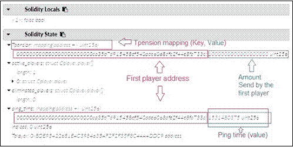](https://res.cloudinary.com/practicaldev/image/fetch/s--R5RbN8ka--/c_limit%2Cf_auto%2Cfl_progressive%2Cq_66%2Cw_880/https://coding-bootcamps.com/img/external/16/debugging-with-truffle-and-ethereum-remix-21.gif)** 

 **此外，当调试面板加载时，您会看到一个蓝色的高亮显示，它标记了随着调试的进行正在执行的代码部分，这提供了宝贵的帮助。

注意调试按钮下面有一个警告按钮。一旦按下，它将再次抛出异常，并直接跳转到异常发生前的最后一个操作码:

[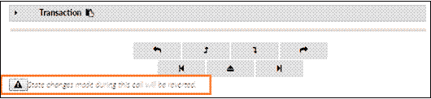](https://res.cloudinary.com/practicaldev/image/fetch/s--SnEVp_uk--/c_limit%2Cf_auto%2Cfl_progressive%2Cq_66%2Cw_880/https://coding-bootcamps.com/img/external/16/debugging-with-truffle-and-ethereum-remix-22.gif)

##### 设置断点

众所周知，断点是可靠调试的最基本和最重要的特性。它们是一种方便的工具，可以帮助您详细检查特定代码段的执行情况。和其他流行的 ide 一样，在 Remix 中可以通过点击一行代码的左边来添加和删除断点:

[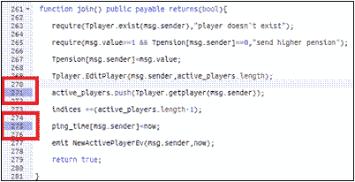](https://res.cloudinary.com/practicaldev/image/fetch/s--4lFt1Qf7--/c_limit%2Cf_auto%2Cfl_progressive%2Cq_66%2Cw_880/https://coding-bootcamps.com/img/external/16/debugging-with-truffle-and-ethereum-remix-23.gif)

例如，让我们定义两个调试断点。将第一个设置在玩家被添加到活动玩家数组的那一行，将第二个设置在记录当前时间戳的那一行。
现在用一个以太让第二个玩家正常加入游戏，然后调试交易。一旦调试器启动，您可以使用**跳到上一个断点**、**跳到下一个断点**或**跳出调试器**按钮:
[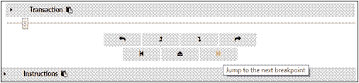](https://res.cloudinary.com/practicaldev/image/fetch/s--eO2tjvAm--/c_limit%2Cf_auto%2Cfl_progressive%2Cq_66%2Cw_880/https://coding-bootcamps.com/img/external/16/debugging-with-truffle-and-ethereum-remix-24.gif) 
直接跳到您的固定断点

在断点处，Remix 的调试器会挂起您正在运行的代码，以便您可以查看契约状态的值，并在当前执行级别探索内存或存储。

为了简洁起见，断点将是我们讨论的最后一个调试特性。可以参考 Remix 的文档(https://Remix . readthe docs . io/en/latest/tutorial _ debug . html)了解更多关于调试器高级特性的信息。

这是一个关于编写、测试和调试我们的合同的长时间讨论。有了这些，我们就可以安全地转移到前端，在下一个菜谱中开始构建 UI 组件。

这份食谱是与 Brian Wu 合作编写的，他是 DC 华盛顿州[编码训练营](https://coding-bootcamps.com/)学校的高级区块链讲师。**