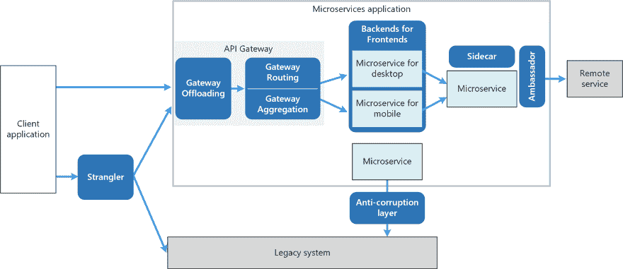
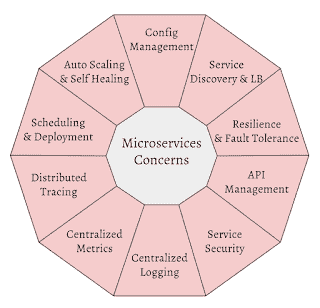

# 所以你想学微服务？

> 原文：<https://dev.to/kgoralski/deep-dive-into-microservices-architecture-h54>

振作起来，文字墙来了。微服务架构是一个永无止境的故事。我花了几年时间收集了这么多关于微服务的资源。现在与你分享学习资源。这里也有:[https://kgoralski.gitbook.io/wiki/microservices](https://kgoralski.gitbook.io/wiki/microservices)

我与这样的架构打交道越多，就越觉得它们更多的是关于人，而不是技术。其实[“微服务解决组织问题，引发技术问题”](https://youtu.be/NX0sHF8ZZgw)。可以肯定的是他们[不是免费的午餐](http://highscalability.com/blog/2014/4/8/microservices-not-a-free-lunch.html)。

“我在大型组织中看到的不是一种局部现象，而是人们互动的一种模式。因此系统如何相互作用。人类交流的边界就是系统边界。

所有的荣誉都归于参考文献的作者。

# 目录

*   [定义](#definition)
*   [单片 vs 微服务](#monoliths-vs-microservices)
*   [打破巨石](#breaking-the-monolith)
*   [图案](#patterns)
*   [分布式计算的谬误](#fallacies-of-distributed-computing)
*   [微服务关注点](#microservices-concerns)
*   [微服务的十大戒律](#the-10-commandments-of-microservices)
*   [微服务和团队](#microservices-and-teams)
*   [微服务应该围绕业务能力和领域进行组织](#microservices-should-be-organized-around-business-capabilities-and-domain)
*   [反应式编程和微服务](#reactive-programming-and-microservices)
*   [微服务解决组织问题，引发技术问题](#microservices-solve-organizational-problems-and-cause-technical-problems)
*   [内部沟通和休息 vs 消息传递](#internal-communication-and-rest-vs-messaging)
*   [微服务反模式&陷阱](#microservices-antipatterns-and-pitfalls)
*   [微服务故事](#microservices-stories)
*   [参考文献](#references)

## 定义

“面向服务的架构由松散耦合的元素组成，这些元素具有有界的上下文”，阿德里安·科克罗夫特(亚马逊)

“康威定律指出，设计系统的组织必须复制这些组织的通信结构[...]组织结构图将最初反映第一个系统设计，这几乎肯定不是正确的设计[...当一个人学习时，他改变了设计...].随着系统的变化，管理结构也需要改变."

必读:

*   [https://Martin fowler . com/bliki/microservice prerequisites . html](https://martinfowler.com/bliki/MicroservicePrerequisites.html)
*   [https://martinfowler.com/articles/microservices.html](https://martinfowler.com/articles/microservices.html)
*   [https://martinfowler.com/microservices/](https://martinfowler.com/microservices/)
*   [https://Martin fowler . com/articles/microservice-trade-offers . html](https://martinfowler.com/articles/microservice-trade-offs.html)
*   [https://Martin fowler . com/articles/break-monolith-into-micro services . html](https://martinfowler.com/articles/break-monolith-into-microservices.html)
*   [https://martinfowler.com/bliki/MonolithFirst.html](https://martinfowler.com/bliki/MonolithFirst.html)
*   [http://www . never letdown . net/2015/05/introduction-to-micro services . html](http://www.neverletdown.net/2015/05/introduction-to-microservices.html)
*   [https://www . slide share . net/adriancockcroft/docker con-最先进的微服务](https://www.slideshare.net/adriancockcroft/dockercon-state-of-the-art-in-microservices)
*   [https://github.com/mfornos/awesome-microservices#theory](https://github.com/mfornos/awesome-microservices#theory)
*   [https://github.com/theanalyst/awesome-distributed-systems](https://github.com/theanalyst/awesome-distributed-systems)
*   [https://www.infoq.com/presentations/google-microservices](https://www.infoq.com/presentations/google-microservices)
*   书:Martin Kleppmann,《设计数据密集型应用程序:可靠、可伸缩和可维护系统背后的重要思想》

## 单片 vs 微服务

基于[https://www . slide share . net/aahoogendoorn/design-and-build-a-microservice-architecture-stairway-to-heaven 或-a-highway-to-hell](https://www.slideshare.net/aahoogendoorn/designing-and-building-a-microservices-architecture-stairway-to-heaven-or-a-highway-to-hell)

### 独石优势

*   单一(分层)架构
*   单一技术堆栈
*   由多个团队维护的单一代码库

为巨石辩护[https://docs . Google . com/spreadsheets/d/1 vjnjaii _ 8 tzbv 2 xhfhra 7 keqzqpophszpfiwdjynyyf 0/edit # GID = 0](https://docs.google.com/spreadsheets/d/1vjnjAII_8TZBv2XhFHra7kEQzQpOHSZpFIWDjynYYf0/edit#gid=0)

### 独石弊

*   所有部分都是相互连接的
*   许多其他系统连接到您的系统
*   难以改变，难以维护
*   释放间隔时间长，从而增加了风险
*   缓慢创新
*   很难转向更新的技术
*   扩展性不是很好

### 微服务承诺

通过“设计和构建微服务架构”。通往天堂的阶梯还是通往地狱的高速公路？”-桑德·胡根多恩

*   [产品不是项目](https://martinfowler.com/articles/microservices.html#ProductsNotProjects)和[这里](https://www.infoq.com/presentations/project-product-solution-model)
*   可攀登的
*   分权治理
*   可更换零件
*   高性能(一直？)
*   技术独立
*   多语种持久性
*   易于构建
*   容易测试(是吗？)
*   比 monoliths 产品更容易部署客户订单客户

### 微服务。但是…

*   微服务到底是什么？
*   微服务有多小？[https://youtu.be/YQp85GzoxqA?t=2m48s](https://youtu.be/YQp85GzoxqA?t=2m48s)
*   微服务世界的要求
*   组件或服务
*   谁拥有微服务？
*   你使用什么技术？
*   你应用什么协议？
*   如何定义消息
*   如何测试微服务
*   业务服务跨组件运行时如何协调？
*   如何构建部署管道？

参考资料:

*   https://www . slide share . net/aahoogendoorn/designing-and-building-a-micro service-architecture-stair-to-heaven-or-a-highway-to-hell
*   [https://www.martinfowler.com/microservices/#when](https://www.martinfowler.com/microservices/#when)
*   https://www . slide share . net/aahoogendoorn/designing-and-building-a-micro service-architecture-stair-to-heaven-or-a-highway-to-hell
*   [https://Martin fowler . com/articles/microservice-trade-offers . html](https://martinfowler.com/articles/microservice-trade-offs.html)
*   [https://Martin fowler . com/bliki/microservice prerequisites . html](https://martinfowler.com/bliki/MicroservicePrerequisites.html)
*   [https://martinfowler.com/bliki/MonolithFirst.html](https://martinfowler.com/bliki/MonolithFirst.html)
*   [https://thenewstack.io/ten-commandments-microservices/](https://thenewstack.io/ten-commandments-microservices/)
*   [https://three dots . tech/post/micro services-or-monolith-its-detail/](https://threedots.tech/post/microservices-or-monolith-its-detail/)

## 打破巨石

模式(查看下一节)可以帮助你做到这一点:API 网关，前端后端，扼杀者，反腐败层，边车，大使

*   [https://Martin fowler . com/articles/break-monolith-into-micro services . html](https://martinfowler.com/articles/break-monolith-into-microservices.html)
*   [https://www . nginx . com/blog/refactoring-a-monolith-into-micro services/](https://www.nginx.com/blog/refactoring-a-monolith-into-microservices/)
*   [https://www . dyna trace . com/news/blog/breaking-the-monolith-an-8-step-recipe/](https://www.dynatrace.com/news/blog/breaking-the-monolith-an-8-step-recipe/)
*   [https://www . dyna trace . com/news/blog/fearless-monolith-to-micro services-migration-a-guided-journey/](https://www.dynatrace.com/news/blog/fearless-monolith-to-microservices-migration-a-guided-journey/)
*   [https://techbeacon . com/how-break-apart-monolith-without destroy-your-team](https://techbeacon.com/how-break-apart-monolith-without-destroying-your-team)
*   [https://medium . com/weebly-engineering/how-to-organize-your-monolith-before-breaking-it-into-services-69 cbdb 9248 b 0](https://medium.com/weebly-engineering/how-to-organize-your-monolith-before-breaking-it-into-services-69cbdb9248b0)
*   [https://www . appcelerator . com/blog/2018/01/5-实现从整体服务向微服务转变的策略/](https://www.appcelerator.com/blog/2018/01/5-strategies-for-making-the-switch-from-monolith-to-microservices/)
*   [http://Enos . it college . ee/~ jpoial/allalaadimised/reading/microservice guide-2017 . pdf](http://enos.itcollege.ee/~jpoial/allalaadimised/reading/microservicesguide-2017.pdf)

## 图案

*   [https://docs . Microsoft . com/en-us/azure/architecture/micro services/design/patterns](https://docs.microsoft.com/en-us/azure/architecture/microservices/design/patterns)
*   [https://microservices.io/patterns/index.html](https://microservices.io/patterns/index.html)
*   [https://hacker noon . com/learning-this-5-microservice-patterns-will-make-you-a-better-engineer-52fc 779 c470a](https://hackernoon.com/learning-these-5-microservice-patterns-will-make-you-a-better-engineer-52fc779c470a)
*   [https://medium . com/@ madhukaudantha/microservice-architecture-and-design-patterns-for-microservice-e0e 5013 FD 58 a](https://medium.com/@madhukaudantha/microservice-architecture-and-design-patterns-for-microservices-e0e5013fd58a)
*   [https://docs . Microsoft . com/en-us/dot net/architecture/micro services/architect-micro service-container-applications/direct-client-to-micro service-communication-vs . the-API-gateway-pattern](https://docs.microsoft.com/en-us/dotnet/architecture/microservices/architect-microservice-container-applications/direct-client-to-microservice-communication-versus-the-api-gateway-pattern)

## 分布式计算的谬误

分布式计算的谬误是 Sun Microsystems 的 L Peter Deutsch 等人提出的一组断言，描述了新接触分布式应用程序的程序员总是做出的错误假设。

### 谬误

“基本上，每个人在第一次构建分布式应用程序时，都会做出以下八个假设。从长远来看，所有这些都被证明是错误的，都会带来大麻烦和痛苦的学习经历。”彼得·多伊奇

1.  网络是可靠的。
2.  延迟为零。
3.  带宽是无限的。
4.  网络很安全。
5.  拓扑不会改变。
6.  有一个管理员。
7.  运输成本为零。
8.  网络是同构的。因此，如果忽略其中一个方面，设计就是糟糕的。

### 谬误的影响

*   编写的软件应用程序很少对网络错误进行错误处理。在网络中断期间，此类应用程序可能会停止或无限期等待应答包，从而永久消耗内存或其他资源。当故障网络变得可用时，这些应用程序也可能无法重试任何停止的操作，或者需要(手动)重启。
*   对网络延迟及其可能导致的数据包丢失的无知，诱使应用层和传输层开发人员允许无限制的流量，从而大大增加了数据包丢失和带宽浪费。
*   流量发送者对带宽限制的忽视会导致瓶颈。
*   对网络安全的自满导致不断适应安全措施的恶意用户和程序猝不及防。
*   网络拓扑的变化会对带宽和延迟问题产生影响，因此可能会有类似的问题。
*   与竞争公司的子网一样，多个管理员可能会制定相互冲突的策略，即网络流量的发送者必须了解哪些策略，才能完成他们想要的路径。
*   构建和维护网络或子网的“隐藏”成本是不可忽略的，因此必须在预算中注明，以避免巨大的短缺。
*   如果一个系统假设一个同质的网络，那么它会导致与前三个谬误相同的问题。

参考资料:

*   [https://en . Wikipedia . org/wiki/Fallacies _ of _ distributed _ computing](https://en.wikipedia.org/wiki/Fallacies_of_distributed_computing)
*   [http://principles-wiki . net/principles:fallacies _ of _ distributed _ computing](http://principles-wiki.net/principles:fallacies_of_distributed_computing)
*   [https://www.youtube.com/watch?v=yxZm0Fhn9Tk](https://www.youtube.com/watch?v=yxZm0Fhn9Tk)

## 微服务关注

*   配置管理
*   服务发现和 LB
*   弹性和容错
*   Api 管理
*   服务安全性
*   集中记录
*   分布式跟踪
*   调度和部署
*   自动扩展和自我修复
*   服务网格

参考资料:

*   [https://developers . red hat . com/blog/2016/12/09/spring-cloud-for-micro services-comparated-to-kubernetes/](https://developers.redhat.com/blog/2016/12/09/spring-cloud-for-microservices-compared-to-kubernetes/)
*   [https://12factor.net](https://12factor.net)
*   [https://dzone . com/articles/what-is-concerns-about-micro services](https://dzone.com/articles/what-are-concerns-about-microservices)
*   [https://Martin fowler . com/articles/microservice-trade-offers . html](https://martinfowler.com/articles/microservice-trade-offs.html)
*   [https://www.martinfowler.com/microservices/#when](https://www.martinfowler.com/microservices/#when)
*   https://www . slide share . net/aahoogendoorn/designing-and-building-a-micro service-architecture-stair-to-heaven-or-a-highway-to-hell
*   [https://Martin fowler . com/articles/microservice-trade-offers . html](https://martinfowler.com/articles/microservice-trade-offs.html)
*   [https://Martin fowler . com/bliki/microservice prerequisites . html](https://martinfowler.com/bliki/MicroservicePrerequisites.html)
*   [https://martinfowler.com/bliki/MonolithFirst.html](https://martinfowler.com/bliki/MonolithFirst.html)
*   [https://dwmkerr . com/the-death-of-microservice-madness-in-2018/](https://dwmkerr.com/the-death-of-microservice-madness-in-2018/)
*   [https://www.infoq.com/articles/seven-uservices-antipatterns](https://www.infoq.com/articles/seven-uservices-antipatterns)
*   [https://stack ify . com/communication-micro services-avoid-common-problems/](https://stackify.com/communication-microservices-avoid-common-problems/)
*   [https://www . oreilly . com/library/view/micro services-anti patterns-and/9781492042716/](https://www.oreilly.com/library/view/microservices-antipatterns-and/9781492042716/)
*   [使用 Kubernetes 和 Istio (Google I/O '18)在云中提供微服务](https://youtu.be/gauOI0O9fRM)
*   [https://docs . Microsoft . com/en-us/azure/architecture/guide/architecture-styles/微服务](https://docs.microsoft.com/en-us/azure/architecture/guide/architecture-styles/microservices)

## 微服务的十大戒律

1.  无状态和有状态服务的清晰分离
2.  不要共享库或 SDK(依赖性会杀了你)
3.  避免宿主亲缘关系
4.  专注于服务，心中只有一个任务
5.  使用轻量级消息协议进行通信
6.  设计一个定义明确的入口点和出口点
7.  实施自我注册和发现机制
8.  显式检查规则和约束
9.  比起单一堆栈，更喜欢多语种的(我们真的需要吗？)
10.  维护独立的修订和构建环境

[https://thenewstack.io/ten-commandments-microservices/](https://thenewstack.io/ten-commandments-microservices/)

## 微服务和团队

(再一次)“康威定律指出，设计系统的组织被限制生产这些组织的通信结构的副本[...]组织结构图将最初反映第一个系统设计，这几乎肯定不是正确的设计[...当一个人学习时，他改变了设计...].随着系统的变化，管理结构也需要改变."

“逆康威策略”建议发展你的团队和组织结构，以促进你想要的架构。理想情况下，您的技术架构将显示出与您的业务架构的同构。[https://www . thoughtworks . com/radar/techniques/inverse-Conway-manipulate](https://www.thoughtworks.com/radar/techniques/inverse-conway-maneuver)

*   [https://Martin fowler . com/articles/micro services . html # OrganizedAroundBusinessCapabilities](https://martinfowler.com/articles/microservices.html#OrganizedAroundBusinessCapabilities)
*   [https://www . nginx . com/blog/adopting-micro services-at-网飞-team-and-process-design 课程/](https://www.nginx.com/blog/adopting-microservices-at-netflix-lessons-for-team-and-process-design/)
*   [https://tech beacon . com/want-develop-great-micro services-reorganize-your-team](https://techbeacon.com/want-develop-great-microservices-reorganize-your-team)
*   [https://dzone . com/articles/micro services-and-team-organization](https://dzone.com/articles/microservices-and-team-organization)
*   [https://open source . com/article/18/8/micro services-team-challenges](https://opensource.com/article/18/8/microservices-team-challenges)
*   [https://www . slide share . net/confluent Inc/micro services-in-the-Apache-Kafka-ecosystem](https://www.slideshare.net/ConfluentInc/microservices-in-the-apache-kafka-ecosystem)

## 微服务应该围绕业务能力和领域进行组织

*   [https://Martin fowler . com/articles/micro services . html # OrganizedAroundBusinessCapabilities](https://martinfowler.com/articles/microservices.html#OrganizedAroundBusinessCapabilities)
*   [https://martinfowler . com/jari/boundaries context . html】的缩写形式](https://martinfowler.com/bliki/BoundedContext.html)
*   [https://docs . Microsoft . com/en-us/dot net/standard/microservice-architecture/microservice-DDD-cqrs-patterns/DDD-oriented-microservice](https://docs.microsoft.com/en-us/dotnet/standard/microservices-architecture/microservice-ddd-cqrs-patterns/ddd-oriented-microservice)
*   [http://www . infoq . com/resource/mini books/domain-driven-design-quickly online/en/pdf/domaindrivendesignquickly online . pdf](http://www.infoq.com/resource/minibooks/domain-driven-design-quickly/en/pdf/DomainDrivenDesignQuicklyOnline.pdf)
*   [https://blog . pragmatists . com/refactoring-from-anemic-model-to-DDD-880 D3 D3 d 45 f](https://blog.pragmatists.com/refactoring-from-anemic-model-to-ddd-880d3dd3d45f)
*   [https://jakuban . gitlab . io/keepitclean/# 1](https://jakubn.gitlab.io/keepitclean/#1)
*   [http://tidyjava.com/hexagonal-architecture-powerful/](http://tidyjava.com/hexagonal-architecture-powerful/)

## 无功编程和微服务

反应系统包括:

*   应答的
*   弹回的
*   弹性的
*   消息驱动

“驱动因素是有效的资源利用，或者换句话说，在服务器和数据中心上花更少的钱。Reactive 的承诺是您可以用更少的资源做更多的事情，特别是您可以用更少的线程处理更高的负载。这就是反应式和非阻塞式异步 I/O 走到前台的地方。”

“微服务的反应本质。异步通信、隔离、自治、单一责任、独占状态和移动性。这些都是微服务的核心特质。”乔纳斯·博纳

*   [https://www.reactivemanifesto.org/](https://www.reactivemanifesto.org/)
*   [http://heidloff . net/article/introduction-reactive-micro services](http://heidloff.net/article/introduction-reactive-microservices)
*   [https://www . oreilly . com/ideas/what-is-a-reactive-microservice](https://www.oreilly.com/ideas/what-is-a-reactive-microservice)
*   [https://gist.github.com/staltz/868e7e9bc2a7b8c1f754](https://gist.github.com/staltz/868e7e9bc2a7b8c1f754)——你错过的反应式编程入门
*   [https://spring . io/blog/2016/06/07/notes-on-reactive-programming-part-I-the-reactive-landscape](https://spring.io/blog/2016/06/07/notes-on-reactive-programming-part-i-the-reactive-landscape)
*   [http://rxmarbles.com/](http://rxmarbles.com/)
*   https://vimeo.com/233798451-HTTP 客户端:分布式系统的沉默英雄
*   [https://www.youtube.com/watch?v=QfpCF_Eo4V0](https://www.youtube.com/watch?v=QfpCF_Eo4V0)-默认异步，必要时同步
*   [http://Jonas boner . com/bla-bla-microservices-bla/](http://jonasboner.com/bla-bla-microservices-bla-bla/)

## 微服务解决组织问题，引发技术问题

来自 Go +微服务= Go Kit [I] -彼得·波尔贡，Go Kit

【https://youtu.be/NX0sHF8ZZgw?t=729】T2

## 解决的问题、引发的问题、吸取的教训

灵感来源于“Peter Bourgon-Go+micro services = Go Kit”[https://www.youtube.com/watch?v=JXEjAwNWays](https://www.youtube.com/watch?v=JXEjAwNWays)

### 问题解决了

*   团队太大，无法在共享代码库上有效工作
*   团队被其他团队阻挡，无法取得进展
*   通信开销太大
*   速度停滞
*   在技术和替代技术的能力方面给予更多自由
*   不同时区的团队
*   可伸缩性和一些技术问题

### 引发的问题

*   稳定的 API 需要定义良好的业务领域
*   如何使其脱钩？
*   不再有共享数据库—分布式事务？
*   测试变得真的很难(混沌猴有人吗？)
*   需要开发/运营文化:开发人员部署和操作他们的工作
*   作业(服务)计划—手动工作，暂时…
*   可寻址性，即服务发现
*   监控和仪器仪表— tail -f？Nagios &新遗迹？
*   分布式跟踪？
*   你的 SLA？
*   审计？
*   生产数据库快照
*   代码重用

### 吸取教训

*   分布式系统很难做到
*   进化建筑！
*   微服务正在改变组织
*   需要开发运维/系统运维技能，需要高级自动化
*   只是另一个层次的复杂性
*   总是检查你的框架是否已经解决了你的问题
*   代码重用可能很难(或者您不想这么做)
*   异步通信/事件源可能有助于去耦
*   配置/发现应该从第一天就存在？
*   每个微服务一个团队？
*   微操作前三思
*   微观解决组织问题，引发技术问题
*   当业务需求未知时，很难管理微观业务，正确的分割线在哪里？
*   使用开源软件才是出路？
*   不要从微服务入手？先整体，后微服务
*   软件公司-不确定他们是否有可能做这样的事情-上市时间？
*   一个团队和微服务？-没有。
*   创建分布式整体结构很容易
*   默认的“分布式”工具也很难
*   为失败而设计

对于糟糕的决策，您可以开发“分布式单片应用程序:伪装成微服务集合的单片应用程序，使用 JSON 缝合在一起，同时写入单个数据库”，作者 Kelsey Hightower

参考

*   [https://www.youtube.com/watch?v=JXEjAwNWays](https://www.youtube.com/watch?v=JXEjAwNWays)
*   [https://martinfowler.com/bliki/MonolithFirst.html](https://martinfowler.com/bliki/MonolithFirst.html)

## 内部沟通与休息 vs 消息传递

“微服务之间的通信需要基于异步消息传递(而每个微服务内部的逻辑以同步方式执行)。如前所述，服务之间的异步边界是必要的，以便在时间上——允许并发性——以及在空间上——允许分布和移动性——分离它们和它们的通信流。没有这种分离，就不可能达到隔离和弹性所需的分隔和包容水平。

异步和非阻塞执行，通过更有效地利用资源，IO 通常更具成本效益。它有助于最小化系统中共享资源的争用(拥塞),这是可伸缩性、低延迟和高吞吐量的最大障碍之一。"

“不幸的是，同步 HTTP 被广泛认为是首选的微服务通信协议。它的同步特性在服务之间引入了强耦合，这使得它成为服务间通信的一个非常糟糕的默认协议。”乔纳斯·博纳

*   [https://dev . to/matteojoliveau/micro services-communication s-why-you-should-switch-to-message-queues-48ia](https://dev.to/matteojoliveau/microservices-communications-why-you-should-switch-to-message-queues--48ia)
*   [http://engineering . LinkedIn . com/distributed-systems/log-what-every-a-software-engineer-should-know-on-real-time-data-unified](http://engineering.linkedin.com/distributed-systems/log-what-every-software-engineer-should-know-about-real-time-datas-unifying)
*   [https://www . oreilly . com/ideas/what-is-a-reactive-microservice](https://www.oreilly.com/ideas/what-is-a-reactive-microservice)
*   [https://solace . com/blog/products-tech/experience-awesome-event-driven-micro services](https://solace.com/blog/products-tech/experience-awesomeness-event-driven-microservices)
*   [https://solace.com/blog/messaging-between-microservices](https://solace.com/blog/messaging-between-microservices)
*   [https://www . slide share . net/ewolff/rest-vs-messaging-for-micro services](https://www.slideshare.net/ewolff/rest-vs-messaging-for-microservices)
*   [https://www . slide share . net/confluent Inc/micro services-in-the-Apache-Kafka-ecosystem](https://www.slideshare.net/ConfluentInc/microservices-in-the-apache-kafka-ecosystem)
*   [https://techbeacon . com/what-Apache-Kafka-why-it-so-popular-you-use-it](https://techbeacon.com/what-apache-kafka-why-it-so-popular-should-you-use-it)
*   [https://github . com/vaquarkhan/vaquarkhan/wiki/CQRS-和-事件-用 Spring-Framework 在 Java 中采购](https://github.com/vaquarkhan/vaquarkhan/wiki/CQRS-and-Event-Sourcing-in-Java-with-Spring-Framework)
*   [https://blog . code centric . de/en/2016/04/事件驱动-微服务-spring-cloud-stream/](https://blog.codecentric.de/en/2016/04/event-driven-microservices-spring-cloud-stream/)
*   [https://martinfowler.com/eaaDev/EventSourcing.html](https://martinfowler.com/eaaDev/EventSourcing.html)
*   [https://capgemini . github . io/architecture/is-rest-best-micro services/](https://capgemini.github.io/architecture/is-rest-best-microservices/)
*   [https://softwaremill.com/mqperf/](https://softwaremill.com/mqperf/)
*   [https://software engineering . stack exchange . com/questions/339817/should-services-talk-direct-to-other-a-a-microservice-architecture](https://softwareengineering.stackexchange.com/questions/339817/should-services-talk-directly-to-each-other-in-a-microservice-architecture)
*   [https://container-solutions . com/argument-rest-micro services/](https://container-solutions.com/argument-rest-microservices/)
*   [http://Jonas boner . com/bla-bla-microservices-bla/](http://jonasboner.com/bla-bla-microservices-bla-bla/)
*   [https://medium . com/@ diogo . Lucas/communication-patterns-in-a-microservice-world-af 07192 b12d 3](https://medium.com/@diogo.lucas/communication-patterns-in-a-microservice-world-af07192b12d3)
*   [https://docs . Microsoft . com/en-us/dot net/standard/microservice-architect-microservice-container-applications/communication-in-microservice-architecture](https://docs.microsoft.com/en-us/dotnet/standard/microservices-architecture/architect-microservice-container-applications/communication-in-microservice-architecture)
*   [https://github . com/dot net/docs/blob/master/docs/standard/microservice-architect/architect-microservice-container-applications/communication-in-microservice-architecture . MD](https://github.com/dotnet/docs/blob/master/docs/standard/microservices-architecture/architect-microservice-container-applications/communication-in-microservice-architecture.md)
*   [https://www . infoq . com/news/2018/03/events-distributed-systems](https://www.infoq.com/news/2018/03/events-distributed-systems)
*   [https://github . com/kgoralski/personal-wiki-and-learning-resources/blob/master/Kafka . MD # Apache-Kafka-and-micro services](https://github.com/kgoralski/personal-wiki-and-learning-resources/blob/master/kafka.md#apache-kafka-and-microservices)
*   [https://www.confluent.io/solutions/microservices/](https://www.confluent.io/solutions/microservices/)
*   [https://www . confluent . io/blog/building-a-micro services-ecosystem-with-Kafka-streams-and-ksql/](https://www.confluent.io/blog/building-a-microservices-ecosystem-with-kafka-streams-and-ksql/)

## 微服务反模式和陷阱

微服务常见错误:

*   低估了构建分布式系统的难度
*   错误的服务边界——不是基于业务领域
*   缺乏业务一致性——微服务需要交付清晰的业务价值，因此我们需要与业务紧密合作
*   缺乏代码模块化(或者缺乏通用的闭包原则)
*   服务之间的共享数据或共享数据库
*   共享“公共”依赖——需要一次更新多个服务的共享代码片段
*   忘记分布式计算的谬误
*   将服务视为编程语言级别的模块/时间耦合
*   忘记康威定律&缺乏明确的所有权
*   级联故障&缺乏故障设计(断路器、重试等)。)并使其他服务充满错误
*   一切都是 RESTful，聊天微服务和缺乏异步通信
*   缺乏 API 兼容性/版本控制
*   缺乏基础设施/平台自动化、监控、跟踪和适当的日志记录
*   缺乏幂等性
*   缺乏服务发现、api 网关和编排
*   尝试用酸代替碱(CAP 定理)
*   不关心资源利用率
*   测试数量少，缺乏验收测试
*   试图同时做所有的事情
*   微服务是目标——它们是特定问题的解决方案，而不是目标。
*   炒作驱动，过于乐观

*   [http://high scalability . com/blog/2015/8/3/seven-of-the-nasties-anti-patterns-in-micro services . html](http://highscalability.com/blog/2015/8/3/seven-of-the-nastiest-anti-patterns-in-microservices.html)

*   [https://container-solutions . com/the-seven-deadlife-sins-of-micro services-redux/](https://container-solutions.com/the-seven-deadly-sins-of-microservices-redux/)

*   [https://www.infoq.com/articles/seven-uservices-antipatterns](https://www.infoq.com/articles/seven-uservices-antipatterns)

*   [https://open credo . com/microservice-anti-patterns-its-all-about-the-people/](https://opencredo.com/microservices-anti-patterns-its-all-about-the-people/)

*   [https://blog . app dynamics . com/engineering/how-to-avoid-anti patterns-with 微服务/](https://blog.appdynamics.com/engineering/how-to-avoid-antipatterns-with-microservices/)

*   [https://www . oreilly . com/library/view/micro services-anti patterns-and/9781492042716/](https://www.oreilly.com/library/view/microservices-antipatterns-and/9781492042716/)

*   [https://www . infoworld . com/article/3254777/application-development/3-common-陷阱-微服务-集成和如何避免-它们. html](https://www.infoworld.com/article/3254777/application-development/3-common-pitfalls-of-microservices-integrationand-how-to-avoid-them.html)

*   [http://www . michaelnygard . com/blog/2017/12/the-entity-service-anti pattern/](http://www.michaelnygard.com/blog/2017/12/the-entity-service-antipattern/)

*   [https://enterprisesproject . com/article/2017/9/using-micro services-containers-wisely-5-陷阱-避免](https://enterprisersproject.com/article/2017/9/using-microservices-containers-wisely-5-pitfalls-avoid)

*   [https://medium . com/Walmart labs/avoiding-陷阱-in-microservice-architecture-ba 038340 F8 C1](https://medium.com/walmartlabs/avoiding-pitfalls-in-microservice-architecture-ba038340f8c1)

*   [http://chrisrichardson . net/post/anti patterns/2019/01/28/Melbourne-micro services . html](http://chrisrichardson.net/post/antipatterns/2019/01/28/melbourne-microservices.html)

*   [https://messente . com/blog/most-recent/5-errors-transition-to-micro services](https://messente.com/blog/most-recent/5-mistakes-transition-to-microservices)

*   [https://walking tree . tech/7-常见-陷阱-避免-迁移-微服务/](https://walkingtree.tech/7-common-pitfalls-avoid-migrating-microservices/)

*   [https://www.slideshare.net/InfoQ/microservices-antipatterns](https://www.slideshare.net/InfoQ/microservices-antipatterns)

*   马特乌斯·加杰斯基的陷阱[https://www.youtube.com/watch?v=yxZm0Fhn9Tk](https://www.youtube.com/watch?v=yxZm0Fhn9Tk)

## 微服务故事

网飞

1.  [https://www . nginx . com/blog/adopting-micro services-at-网飞-team-and-process-design 课程/](https://www.nginx.com/blog/adopting-microservices-at-netflix-lessons-for-team-and-process-design/)
2.  [https://medium . com/refraction-tech-everything/how-网飞-works-the-very-simplified-complex-stuff-that-happen-every-time-you-hit-play-3a 40 C9 be 254 b](https://medium.com/refraction-tech-everything/how-netflix-works-the-hugely-simplified-complex-stuff-that-happens-every-time-you-hit-play-3a40c9be254b)
3.  [https://www . infoq . com/news/2019/01/网飞-进化-建筑/](https://www.infoq.com/news/2019/01/netflix-evolution-architecture/)

亚马孙

[https://www . slide share . net/adriancockcroft/micro services-workshop-craft-conference](https://www.slideshare.net/adriancockcroft/microservices-workshop-craft-conference)

易贝和谷歌

1.  [https://www . slide share . net/RandyShoup/from-monolith-to-micro services-craft conf-2015](https://l.facebook.com/l.php?u=https%3A%2F%2Fwww.slideshare.net%2FRandyShoup%2Ffrom-monolith-to-microservices-craftconf-2015&h=AT2Jf1xI_2lPCACwVhRChZaT4EgzU7VhCnedNJ8U0_bnAQeKPDt5O9_PIcLMLfF3KlzOxQDIOhcruuE_yksNzP7tpMDB12CO5-ZNywMMz3Pew6awsUO90Afvx3kP8cdK2Qma_RfpWpk8xf45jLzugpB8_EQXnMvODvIGdIc)https://www.slideshare.net/kasun04/microservices-at-ebay
2.  [http://high scalability . com/blog/2015/12/1/deep-lessons-from-Google-and-ebay-on-building-ecologies-of . html](https://l.facebook.com/l.php?u=http%3A%2F%2Fhighscalability.com%2Fblog%2F2015%2F12%2F1%2Fdeep-lessons-from-google-and-ebay-on-building-ecosystems-of.html&h=AT3WLWsjcro-n8O4NmNZ6Q3dloCPQV0iufgYAsXL0MKJrby5MkMfng7alXWPMCSsN5lshFqqido5kpvISwqVB5qKiHpQT2qsujdqXnN8zHL1I6Lio0diA8xhaEVXXxqTAb84MZOSeCEItrf4pmMpwboxpSvutMj3t6GCwdE)
3.  [https://www.infoq.com/presentations/google-microservices/](https://l.facebook.com/l.php?u=https%3A%2F%2Fwww.infoq.com%2Fpresentations%2Fgoogle-microservices%2F&h=AT3dN-2rjeFYIAts6QRVKC9-51vxiLAirUAlqMALUTzpg3QmNLEs6SsnYrJfBSZCvsCEuWBGjvQ6bFfn_lifdRGyCwwhKLySQ-wtiWJKmCeiOtnCGaMse9wKK7Dm0PJNbwr8Sy2oMMoRf-95-qIR1Tt1DPFIGreSHgN9nqg)

商务化人际关系网

1.  [https://www . infoq . com/presentations/LinkedIn-micro services-urn/](https://l.facebook.com/l.php?u=https%3A%2F%2Fwww.infoq.com%2Fpresentations%2Flinkedin-microservices-urn%2F&h=AT34VZkG5xO_pFaWb8sRqj0Xf8i6LnIJnfF7XNYFIF1SgSItclJ1gTKIFCeD609TNizDUideKADOmFv5TnA3ObYFlYSt_OoMmPSRy73NNzmVrewX9zfNUHnm_JmWIy2RrAvUS9hA1aqfqWC5SoADUum3yT6T8lWNK7h90_4)
2.  [https://www . slide share . net/InfoQ/from-a-monolith-to-micro services-rest-the-evolution-of-linkedins-service-architecture](https://l.facebook.com/l.php?u=https%3A%2F%2Fwww.slideshare.net%2FInfoQ%2Ffrom-a-monolith-to-microservices-rest-the-evolution-of-linkedins-service-architecture&h=AT2jkniKwM7G3mKqaPPFuppudSQ1QMgCee01sppiPZtEyhGY5Qg429e5CNTLmnY3By4vIuXsAxEVfYsuBtjdhyPMbSGXIZ7w0CMUhmhM8Um0SJmbXKQhfrkz89m74GimdzHyvnMLSOQxRLRQL12SHELLartMzftpJgXvldU)
3.  [https://engineering . LinkedIn . com/architecture/brief-history-scaling-LinkedIn](https://engineering.linkedin.com/architecture/brief-history-scaling-linkedin)

推特

1.  [http://high scalability . com/blog/2013/7/8/the-architecture-Twitter-uses-to-deal-with-1.5 亿活跃用户. html](https://l.facebook.com/l.php?u=http%3A%2F%2Fhighscalability.com%2Fblog%2F2013%2F7%2F8%2Fthe-architecture-twitter-uses-to-deal-with-150m-active-users.html&h=AT240WhhWa9qPrQqhk03EKtZ_NybC6p42AGL01-Cy-JT6Oqzb6AeJubwqpP1MJFsaO0zMAR_TyLHWnqWke-eJzaKWjRG8vYOfnG7Upzqqw_ODdraL7Ja0vyGGZKTwjrEqEbIXKwBq-PFr7u9vpMUBVITIantdd4v87WxgUY)
2.  [https://www.infoq.com/articles/twitter-java-use/](https://l.facebook.com/l.php?u=https%3A%2F%2Fwww.infoq.com%2Farticles%2Ftwitter-java-use%2F&h=AT3EeZ0J8b30eMkZ8WHdL4Bo-Bwpcao2rxhued3HwqQPMXAjMW6Hqhr6Z3D-sGqHMEUuiLYn-Knn4K9LGS9Mr3Jv5cjxRNLDPtSQ3_dpnEgiugOFPpv4xMrL16MiRxR6OoP4UFMvIV-pkirplshhQv4rgzKAt4k-00EIwlQ)
3.  [https://blog . Twitter . com/engineering/en _ us/topics/infra structure/2017/the-infra structure-behind-Twitter-scale . html](https://l.facebook.com/l.php?u=https%3A%2F%2Fblog.twitter.com%2Fengineering%2Fen_us%2Ftopics%2Finfrastructure%2F2017%2Fthe-infrastructure-behind-twitter-scale.html&h=AT31RvkjW2EoWwwzcRnn637VnafNAKNxhU-ReYDDO6-Rzy1qK-riinzl-DOkazErET6coJBvf2aF_jZdgLbwHmdakxsmn8AgYPlnjEfVvtf6Rq_Yv6gcxkX_Tfc0ZCcMqu3w13mxLvtIHwy4Rf8_OvuJHqNA-fgAb7voWVA)
4.  [http://high scalability . com/scaling-Twitter-making-Twitter-10000-percent-faster](https://l.facebook.com/l.php?u=http%3A%2F%2Fhighscalability.com%2Fscaling-twitter-making-twitter-10000-percent-faster&h=AT39BX5TZBn7Dg3_O0f3TWa__KUt1xDfT8-N0wW1onXklDN-GEW5xzUrrc7gCwlze3xnmrg5-ND6S-x7aOEkf5Yh0bUNNFdLP3sGjo_a07nYX4GIlYSFC7pT_-686Svb3CpR_rGtGsrvMHSAeR0I2k_7vHYtTGlbzCv8YcI)

扎兰多

1.  [https://jobs . zalando . com/tech/blog/Jimmy-to-micro services-the-journey-one-year after/？gh_src=4n3gxh1](https://l.facebook.com/l.php?u=https%3A%2F%2Fjobs.zalando.com%2Ftech%2Fblog%2Fjimmy-to-microservices-the-journey-one-year-later%2F%3Fgh_src%3D4n3gxh1&h=AT2b64p13-jBhK3a7ICxzfu6MAcSpwIFv_tpraeBxcktANqx98mw2C50qN1V1z5xKIrYDUeMtxCU0v2uBLs1wxIi0jGWS-4lLRfEjM4WACYxh4S7ucm0z0Yp1H6bdp3pQbuOYCXHOSj9WaRCyoPHvo9LDi1HfQyGs4Bjcx8)
2.  [https://www . infoq . com/news/2016/02/Monolith-micro services-Zalando/](https://l.facebook.com/l.php?u=https%3A%2F%2Fwww.infoq.com%2Fnews%2F2016%2F02%2FMonolith-Microservices-Zalando%2F&h=AT1MHPk72yItwLKbhuBIC1AUIvgPXVP_FymRkNQKLML5OxX28_72rtrcCNByWTc6UbavskzGO2G8gyLDScFI11eqP3L5qsmH62znmjwFQocNQoahVqjRw4vrHTR3rGwFLcyAHDQkGZ55SAaP4BqlPbtyZ17aFP-CFjRWHtuj2-htQ8ZtmRtq)

Spotify[https://www . kevingoldsmith . com/talks/micro services-at-Spotify . html](https://l.facebook.com/l.php?u=https%3A%2F%2Fwww.kevingoldsmith.com%2Ftalks%2Fmicroservices-at-spotify.html&h=AT2Ksu05Wx-eUR3i6kySS1rbeIPp6Kk2ooNKxUISbsqWckOPlZxtQleCE_20owzzIcfRc3cDt2rnkh0nHdag1iUYTDeSFQFSGgnkkYFXWkqPstJfabfcouRUro2-G065hurQIkM7dW7G7sZs4OyOq1CD9Pj3aJVECpPFOEc)

best buy[https://blog . run scope . com/posts/monolith-微服务-转型-真实世界-电子商务-平台-使用-扼杀者-模式](https://blog.runscope.com/posts/monolith-microservices-transforming-real-world-ecommerce-platform-using-strangler-pattern)

Wix[https://stack share . io/Wix/scaling-Wix-to-60m-users-from-monolith-to-微服务](https://stackshare.io/wix/scaling-wix-to-60m-users-from-monolith-to-microservices)

## 参考文献

*   [https://www.martinfowler.com/microservices](https://www.martinfowler.com/microservices)
*   [https://github.com/mfornos/awesome-microservices](https://github.com/mfornos/awesome-microservices)
*   [https://github.com/theanalyst/awesome-distributed-systems](https://github.com/theanalyst/awesome-distributed-systems)
*   [https://www . vinaysahni . com/best-practices-for-building-a-microservice-architecture](https://www.vinaysahni.com/best-practices-for-building-a-microservice-architecture)
*   [https://github . com/katopz/best-practices/blob/master/best-practices-for-building-a-microservice-architecture . MD](https://github.com/katopz/best-practices/blob/master/best-practices-for-building-a-microservice-architecture.md)
*   [https://youtu.be/YQp85GzoxqA?t=2m48s](https://youtu.be/YQp85GzoxqA?t=2m48s)微服务——可维护性的赤裸裸的真相
*   https://www . slide share . net/aahoogendoorn/designing-and-building-a-micro service-architecture-stair-to-heaven-or-a-highway-to-hell
*   [http://www . infoq . com/resource/mini books/domain-driven-design-quickly online/en/pdf/domaindrivendesignquickly online . pdf](http://www.infoq.com/resource/minibooks/domain-driven-design-quickly/en/pdf/DomainDrivenDesignQuicklyOnline.pdf)
*   [https://martinfowler.com/articles/microservices.html](https://martinfowler.com/articles/microservices.html)
*   [https://Martin fowler . com/articles/microservice-trade-offers . html](https://martinfowler.com/articles/microservice-trade-offs.html)
*   [https://www.youtube.com/watch?v=JXEjAwNWays](https://www.youtube.com/watch?v=JXEjAwNWays)Golang 英国大会 2016 - Peter Bourgon - Go +微服务= Go 套件
*   [https://en . Wikipedia . org/wiki/Fallacies _ of _ distributed _ computing](https://en.wikipedia.org/wiki/Fallacies_of_distributed_computing)
*   [https://www.youtube.com/watch?v=yxZm0Fhn9Tk](https://www.youtube.com/watch?v=yxZm0Fhn9Tk)微服务架构陷阱
*   [https://Martin fowler . com/bliki/microservice prerequisites . html](https://martinfowler.com/bliki/MicroservicePrerequisites.html)
*   [http://callista enterprise . se/blogg/teknik/2015/05/20/blog-series-building-micro services/](http://callistaenterprise.se/blogg/teknik/2015/05/20/blog-series-building-microservices/)
*   [https://developers . red hat . com/blog/2016/12/09/spring-cloud-for-micro services-comparated-to-kubernetes/](https://developers.redhat.com/blog/2016/12/09/spring-cloud-for-microservices-compared-to-kubernetes/)
*   [https://12factor.net](https://12factor.net)
*   [https://blog . code centric . de/en/2016/04/事件驱动-微服务-spring-cloud-stream/](https://blog.codecentric.de/en/2016/04/event-driven-microservices-spring-cloud-stream/)
*   [https://techbeacon . com/what-Apache-Kafka-why-it-so-popular-you-use-it](https://techbeacon.com/what-apache-kafka-why-it-so-popular-should-you-use-it)
*   [https://github . com/vaquarkhan/vaquarkhan/wiki/CQRS-和-事件-用 Spring-Framework 在 Java 中采购](https://github.com/vaquarkhan/vaquarkhan/wiki/CQRS-and-Event-Sourcing-in-Java-with-Spring-Framework)
*   [https://gist.github.com/staltz/868e7e9bc2a7b8c1f754](https://gist.github.com/staltz/868e7e9bc2a7b8c1f754)你一直错过的反应式编程入门
*   [https://www.youtube.com/watch?v=QfpCF_Eo4V0](https://www.youtube.com/watch?v=QfpCF_Eo4V0)默认异步，必要时同步
*   [https://www.reactivemanifesto.org/](https://www.reactivemanifesto.org/)
*   [https://thenewstack.io/succeed-failure-microservices/](https://thenewstack.io/succeed-failure-microservices/)
*   [https://gist.github.com/chitchcock/1281611](https://gist.github.com/chitchcock/1281611)
*   [https://plus . Google . com/+riprowan/posts/eveouvesvavx](https://plus.google.com/+RipRowan/posts/eVeouesvaVX)
*   [https://www . nginx . com/blog/service-discovery-in-a-micro services-architecture/](https://www.nginx.com/blog/service-discovery-in-a-microservices-architecture/)
*   [http://opensourceconnections . com/blog/2015/06/25/why-Cassandra/](http://opensourceconnections.com/blog/2015/06/25/why-cassandra/)
*   [http://guide.couchdb.org/draft/consistency.html](http://guide.couchdb.org/draft/consistency.html)
*   [https://plus . Google . com/+riprowan/posts/eveouvesvavx](https://plus.google.com/+RipRowan/posts/eVeouesvaVX)
*   [https://martinfowler.com/eaaDev/EventSourcing.html](https://martinfowler.com/eaaDev/EventSourcing.html)
*   [https://dzone.com/articles/failure-mongodb-bitcoin](https://dzone.com/articles/failure-mongodb-bitcoin)
*   [https://thehftguy . com/2016/11/01/docker-in-production-an-history-of-failure/](https://thehftguy.com/2016/11/01/docker-in-production-an-history-of-failure/)
*   [https://thehftguy . com/2017/02/23/docker-in-production-an-update/](https://thehftguy.com/2017/02/23/docker-in-production-an-update/)
*   [https://blog . pragmatists . com/refactoring-from-anemic-model-to-DDD-880 D3 D3 d 45 f](https://blog.pragmatists.com/refactoring-from-anemic-model-to-ddd-880d3dd3d45f)
*   [https://jakuban . gitlab . io/keepitclean/# 1](https://jakubn.gitlab.io/keepitclean/#1)
*   [http://tidyjava.com/hexagonal-architecture-powerful/](http://tidyjava.com/hexagonal-architecture-powerful/)
*   [http://www.javapractices.com/topic/TopicAction.do?Id=205](http://www.javapractices.com/topic/TopicAction.do?Id=205)
*   [https://martinfowler.com/bliki/MonolithFirst.html](https://martinfowler.com/bliki/MonolithFirst.html)
*   [http://microservices.io/patterns/apigateway.html](http://microservices.io/patterns/apigateway.html)
*   https://vimeo.com/233798451 HTTP 客户端:分布式系统的沉默英雄
*   [https://content . pivotal . io/blog/should-than-be-a-a-microservice-part-4-independent-scalability](https://content.pivotal.io/blog/should-that-be-a-microservice-part-4-independent-scalability)
*   [https://speaker CK . com/wendigo/jdd-dlug-techczny](https://speakerdeck.com/wendigo/jdd-dlug-techniczny)
*   微服务架构陷阱[https://youtu.be/yxZm0Fhn9Tk](https://youtu.be/yxZm0Fhn9Tk)(波兰)
*   4 年的微服革命[https://youtu . be/_ x86 vxbuexe【t1(polish)](https://youtu.be/_X89vxbuExE)
*   微服务[https://youtu.be/GPj_KuWB7xA](https://youtu.be/GPj_KuWB7xA)(波兰)
*   用 OSS 构建分布式系统[https://youtu.be/_2VuUr-LgLw](https://youtu.be/_2VuUr-LgLw)(波兰语)
*   https://youtu.be/uSeaJcShLZk(波兰语)本地 DC 和云上的扩展应用
*   Java 中函数式异常处理的搭便车指南[https://www.youtube.com/watch?v=Fxyezv_a0Fk](https://www.youtube.com/watch?v=Fxyezv_a0Fk)(波兰语)
*   [https://allegro . tech/2016/03/Managing-Frontend-in-the-micro services-architecture . html](https://allegro.tech/2016/03/Managing-Frontend-in-the-microservices-architecture.html)
*   [https://www.mosaic9.org/](https://www.mosaic9.org/)
*   [https://www . slide share . net/adriancockcroft/docker con-最先进的微服务](https://www.slideshare.net/adriancockcroft/dockercon-state-of-the-art-in-microservices)
*   [https://youtu . be/yqp 85 gzoxqa？t=2m48s](https://youtu.be/YQp85GzoxqA?t=2m48s)
*   https://www . slide share . net/aahoogendoorn/designing-and-building-a-micro service-architecture-stair-to-heaven-or-a-highway-to-hell
*   [http://www . infoq . com/resource/mini books/domain-driven-design-quickly online/en/pdf/domaindrivendesignquickly online . pdf](http://www.infoq.com/resource/minibooks/domain-driven-design-quickly/en/pdf/DomainDrivenDesignQuicklyOnline.pdf)
*   [https://martinfowler.com/articles/microservices.html-](https://martinfowler.com/articles/microservices.html-)https://www.youtube.com/watch?v=JXEjAwNWaysT2
*   [https://en . Wikipedia . org/wiki/Fallacies _ of _ distributed _ computing](https://en.wikipedia.org/wiki/Fallacies_of_distributed_computing)
*   [https://www.youtube.com/watch?v=yxZm0Fhn9Tk](https://www.youtube.com/watch?v=yxZm0Fhn9Tk)
*   [https://Martin fowler . com/bliki/microservice prerequisites . html](https://martinfowler.com/bliki/MicroservicePrerequisites.html)
*   [https://developers . red hat . com/blog/2016/12/09/spring-cloud-for-micro services-comparated-to-kubernetes/](https://developers.redhat.com/blog/2016/12/09/spring-cloud-for-microservices-compared-to-kubernetes/)
*   [https://12factor.net](https://12factor.net)
*   [https://blog . code centric . de/en/2016/04/事件驱动-微服务-spring-cloud-stream/](https://blog.codecentric.de/en/2016/04/event-driven-microservices-spring-cloud-stream/)
*   [https://techbeacon . com/what-Apache-Kafka-why-it-so-popular-you-use-it](https://techbeacon.com/what-apache-kafka-why-it-so-popular-should-you-use-it)
*   [https://github . com/vaquarkhan/vaquarkhan/wiki/CQRS-和-事件-用 Spring-Framework 在 Java 中采购](https://github.com/vaquarkhan/vaquarkhan/wiki/CQRS-and-Event-Sourcing-in-Java-with-Spring-Framework)
*   [https://gist.github.com/staltz/868e7e9bc2a7b8c1f754-](https://gist.github.com/staltz/868e7e9bc2a7b8c1f754-)https://www.youtube.com/watch?v=QfpCF_Eo4V0T2
*   [https://www.reactivemanifesto.org/](https://www.reactivemanifesto.org/)
*   [https://thenewstack.io/succeed-failure-microservices/](https://thenewstack.io/succeed-failure-microservices/)
*   [https://www . nginx . com/blog/service-discovery-in-a-micro services-architecture/](https://www.nginx.com/blog/service-discovery-in-a-microservices-architecture/)
*   [http://opensourceconnections . com/blog/2015/06/25/why-Cassandra/](http://opensourceconnections.com/blog/2015/06/25/why-cassandra/)
*   [http://guide.couchdb.org/draft/consistency.html](http://guide.couchdb.org/draft/consistency.html)
*   [https://plus . Google . com/+riprowan/posts/eveouvesvavx](https://plus.google.com/+RipRowan/posts/eVeouesvaVX)
*   [https://martinfowler.com/eaaDev/EventSourcing.html](https://martinfowler.com/eaaDev/EventSourcing.html)
*   [https://dzone.com/articles/failure-mongodb-bitcoin](https://dzone.com/articles/failure-mongodb-bitcoin)
*   [https://thehftguy . com/2016/11/01/docker-in-production-an-history-of-failure/](https://thehftguy.com/2016/11/01/docker-in-production-an-history-of-failure/)
*   [https://thehftguy . com/2017/02/23/docker-in-production-an-update/](https://thehftguy.com/2017/02/23/docker-in-production-an-update/)
*   [https://blog . pragmatists . com/refactoring-from-anemic-model-to-DDD-880 D3 D3 d 45 f](https://blog.pragmatists.com/refactoring-from-anemic-model-to-ddd-880d3dd3d45f)
*   [https://jakuban . gitlab . io/keepitclean/# 1](https://jakubn.gitlab.io/keepitclean/#1)
*   [http://tidyjava.com/hexagonal-architecture-powerful/](http://tidyjava.com/hexagonal-architecture-powerful/)
*   [http://www.javapractices.com/topic/TopicAction.do?Id=205](http://www.javapractices.com/topic/TopicAction.do?Id=205)
*   [https://martinfowler.com/bliki/MonolithFirst.html](https://martinfowler.com/bliki/MonolithFirst.html)
*   [http://microservices.io/patterns/apigateway.html](http://microservices.io/patterns/apigateway.html)
*   [https://vimeo . com/23798451 https://speaker CK . com/wendigo/jdd-dlug-techczny](https://vimeo.com/233798451https://speakerdeck.com/wendigo/jdd-dlug-techniczny)
*   [https://three dots . tech/post/micro services-or-monolith-its-detail/](https://threedots.tech/post/microservices-or-monolith-its-detail/)
*   [http://www . dwmkerr . com/the-death-of-microservice-madness-in-2018/](http://www.dwmkerr.com/the-death-of-microservice-madness-in-2018/)
*   史蒂夫的谷歌平台咆哮[https://gist.github.com/chitchcock/1281611](https://gist.github.com/chitchcock/1281611)
*   [https://plus . Google . com/+riprowan/posts/eveouvesvavx](https://plus.google.com/+RipRowan/posts/eVeouesvaVX)
*   [https://www . michaelnygard . com/blog/2018/01/coherence-penalty-for-humans/](https://www.michaelnygard.com/blog/2018/01/coherence-penalty-for-humans/)
*   JOTB19 -互动协议:都是关于礼貌的，作者:https://youtu.be/A5ovSBt0-C0
*   何时不使用微服务[https://www.feval.ca/posts/microservices/](https://www.feval.ca/posts/microservices/)
*   Fallbacks 被高估了----弹性架构设计[https://www . nurkiewicz . com/2019/07/fallbacks-被高估了----架构设计. html？m=1](https://www.nurkiewicz.com/2019/07/fallbacks-are-overrated-architecting.html?m=1)
*   [https://blog . overops . com/5-ways-to-not-f-up-your-micro-service-in-production/](https://blog.overops.com/5-ways-to-not-f-up-your-microservices-in-production/)
*   [https://tech beacon . com/app-dev-testing/forget-monoliths-vs-micro services-cognitive-load-what-matters](https://techbeacon.com/app-dev-testing/forget-monoliths-vs-microservices-cognitive-load-what-matters)

## 生产中的码头工人

*   [https://thehftguy . com/2016/11/01/docker-in-production-an-history-of-failure/](https://thehftguy.com/2016/11/01/docker-in-production-an-history-of-failure/)
*   [https://thehftguy . com/2017/02/23/docker-in-production-an-update/](https://thehftguy.com/2017/02/23/docker-in-production-an-update/)