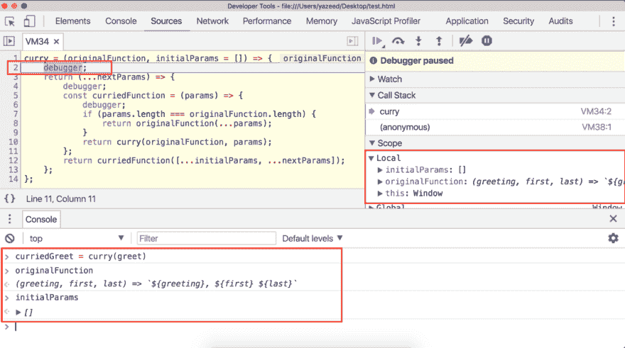
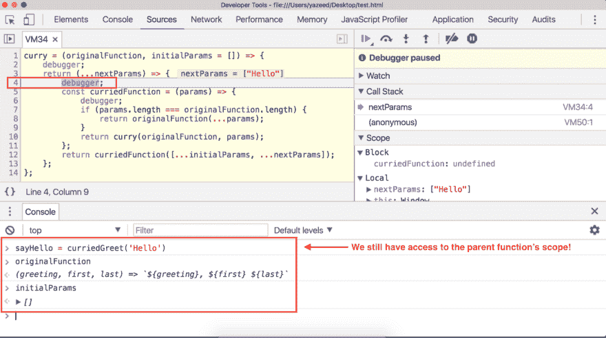
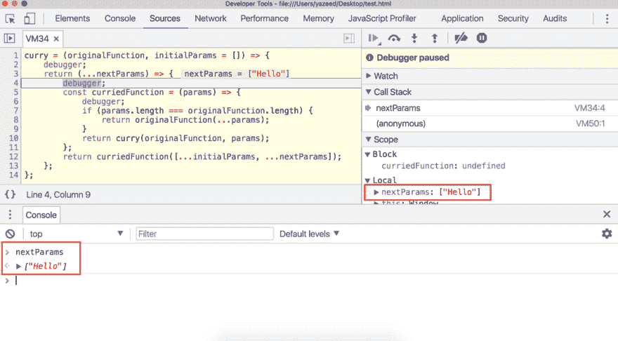
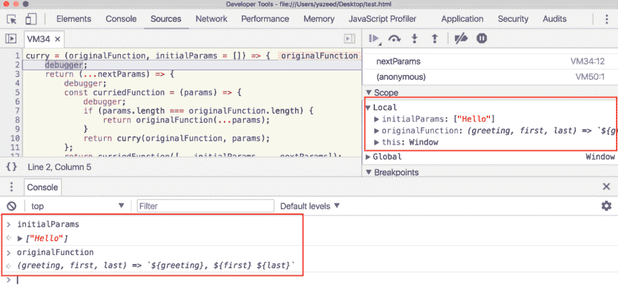
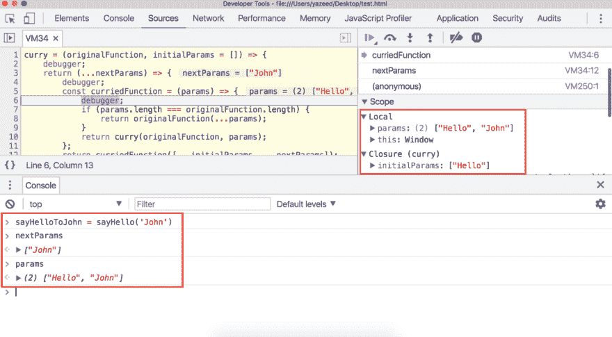
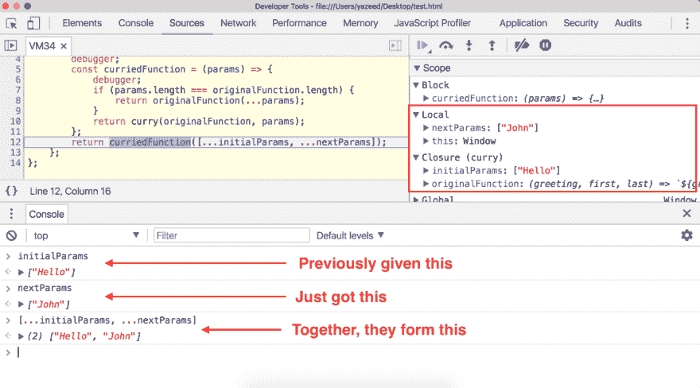
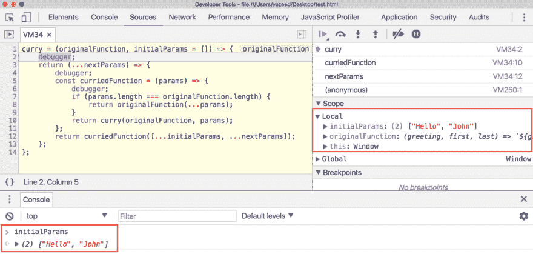
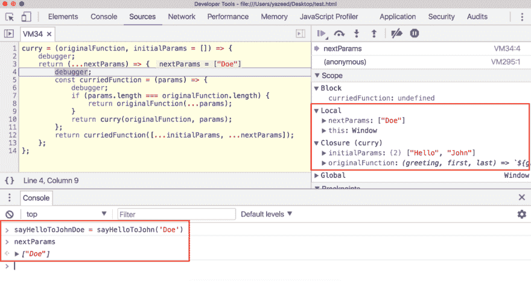
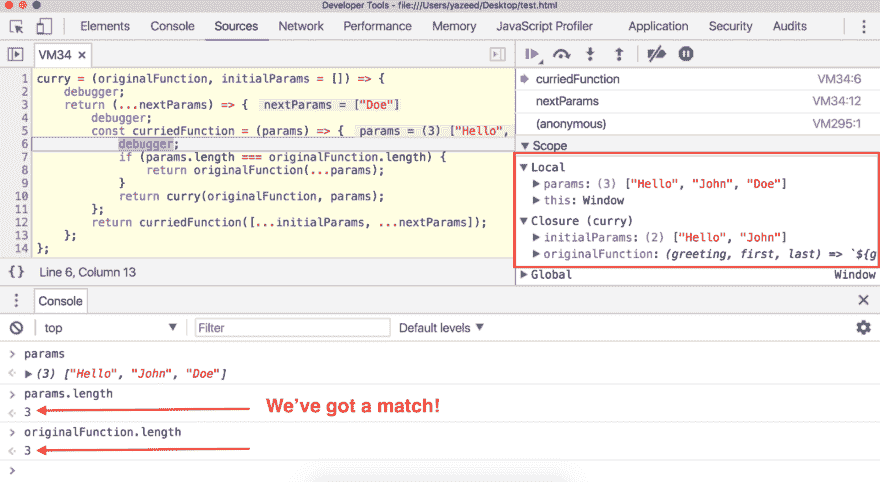
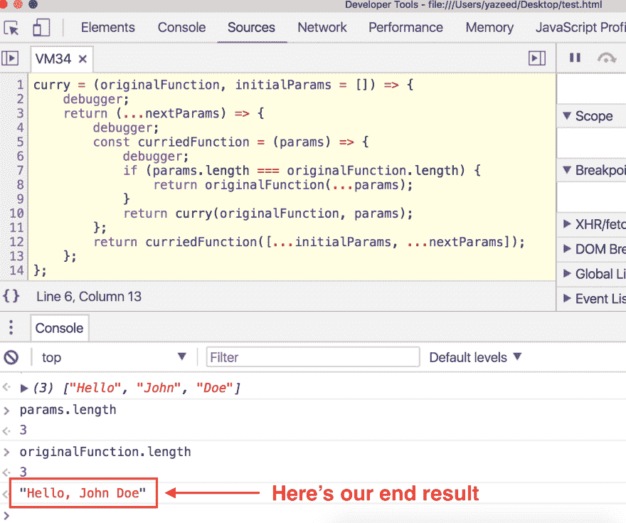

# 7 分钟深刻理解谄媚

> 原文：<https://dev.to/yazeedb/deeply-understand-currying-in-7-minutes-1ago>

*原贴于[yazeedb.com](https://yazeedb.com)T3】*

埃里克·埃利奥特杰出的[创作软件](https://medium.com/javascript-scene/the-rise-and-fall-and-rise-of-functional-programming-composable-software-c2d91b424c8c)系列最初让我对函数式编程感到兴奋。这是必读的。

在这个系列的某个地方，他提到了*阿谀奉承*。计算机科学和数学都同意这个定义:

> Currying 将多参数函数转换为一元(单参数)函数。

Curried 函数接受许多参数**，一次一个**。所以如果你有

```
greet = (greeting, first, last) => `${greeting}, ${first}  ${last}`;

greet('Hello', 'Bruce', 'Wayne'); // Hello, Bruce Wayne 
```

正确地奉承`greet`会给你

```
curriedGreet = curry(greet);

curriedGreet('Hello')('Bruce')('Wayne'); // Hello, Bruce Wayne 
```

这个三参数函数变成了三个一元函数。当您提供一个参数时，会弹出一个新的函数，期待下一个参数。

[](https://res.cloudinary.com/practicaldev/image/fetch/s--84hvrKuK--/c_limit%2Cf_auto%2Cfl_progressive%2Cq_auto%2Cw_880/https://thepracticaldev.s3.amazonaws.com/i/7np833ublebvdsj38rcv.jpeg)

## 妥善？

我说“适当地迎合”是因为一些`curry`函数在使用上更加灵活。Currying 在理论上很棒，但是在 JavaScript 中为每个参数调用一个函数会很累。

[Ramda 的](https://ramdajs.com/) `curry`函数让你像这样调用`curriedGreet`:

```
// greet requires 3 params: (greeting, first, last)

// these all return a function looking for (first, last)
curriedGreet('Hello');
curriedGreet('Hello')();
curriedGreet()('Hello')()();

// these all return a function looking for (last)
curriedGreet('Hello')('Bruce');
curriedGreet('Hello', 'Bruce');
curriedGreet('Hello')()('Bruce')();

// these return a greeting, since all 3 params were honored
curriedGreet('Hello')('Bruce')('Wayne');
curriedGreet('Hello', 'Bruce', 'Wayne');
curriedGreet('Hello', 'Bruce')()()('Wayne'); 
```

请注意，您可以选择一次给出多个参数。这种实现在编写代码时更有用。

如上所述，你可以永远不带参数地调用这个函数，它总是返回一个需要剩余参数的函数。

## 这怎么可能？

埃利奥特先生分享了一个与拉姆达非常相似的实现。这是代码，或者他恰当地称之为魔法:

```
const curry = (f, arr = []) => (...args) =>
  ((a) => (a.length === f.length ? f(...a) : curry(f, a)))([...arr, ...args]); 
```

## 嗯……😐

[](/news/conteimg/2019/07/that-code-is-hard-to-read-cmm.jpeg)

是的，我知道...简洁得令人难以置信，让我们一起重构欣赏吧。

## 此版本工作原理相同

我还在 Chrome 开发工具中添加了一些`debugger`语句来检查它。

```
curry = (originalFunction, initialParams = []) => {
  debugger;

  return (...nextParams) => {
    debugger;

    const curriedFunction = (params) => {
      debugger;

      if (params.length === originalFunction.length) {
        return originalFunction(...params);
      }

      return curry(originalFunction, params);
    };

    return curriedFunction([...initialParams, ...nextParams]);
  };
}; 
```

打开您的[开发者工具](https://developers.google.com/web/tools/chrome-devtools/)并跟随！

## 就这么办吧！

将`greet`和`curry`粘贴到您的控制台中。然后进入`curriedGreet = curry(greet)`开始疯狂。

### 第二行暂停

[](https://res.cloudinary.com/practicaldev/image/fetch/s--7mE-aVEO--/c_limit%2Cf_auto%2Cfl_progressive%2Cq_auto%2Cw_880/https://cdn-images-1.medium.com/max/1600/1%2A8_q3YkOu6fDzIEMY65lqUg.png)

检查我们的两个参数，我们看到`originalFunction`是`greet`和`initialParams`默认为空数组，因为我们没有提供它。移动到下一个断点，哦，等等…就这样。

没错。刚刚返回一个新函数，它需要 3 个参数。在控制台中键入`curriedGreet`来看看我在说什么。

当你玩够了，让我们变得更疯狂一点，做
`sayHello = curriedGreet('Hello')`。

### 第 4 行暂停

[](https://res.cloudinary.com/practicaldev/image/fetch/s--2uahYaHr--/c_limit%2Cf_auto%2Cfl_progressive%2Cq_auto%2Cw_880/https://cdn-images-1.medium.com/max/1600/1%2AFXCJQi5Numlbis5d_bGsjw.png)

在继续之前，在您的控制台中键入`originalFunction`和`initialParams`。注意，即使我们在一个全新的函数中，我们仍然可以访问这两个参数。这是因为从父函数返回的函数享有其父函数的作用域。

#### 现实生活中的传承

在父函数传递之后，他们把参数留给他们的孩子使用。有点像现实生活中的继承。

`curry`最初被赋予`originalFunction`和`initialParams`，然后返回一个“子”函数。那两个变量还没有被[处理掉](https://developer.mozilla.org/en-US/docs/Web/JavaScript/Memory_Management)，因为也许那个孩子需要它们。如果他没有，*那么*这个范围就会被清理掉，因为当没有人提到你的时候，那就是你真正死亡的时候。

### 好了，回到第 4 行…

[](https://res.cloudinary.com/practicaldev/image/fetch/s--nXMa9H-u--/c_limit%2Cf_auto%2Cfl_progressive%2Cq_auto%2Cw_880/https://cdn-images-1.medium.com/max/1600/1%2A_TFVnxtqgisi1i0q_K3dUQ.png)

检查`nextParams`并看到它是`['Hello']`…一个数组？但是我想我们说的是`curriedGreet(‘Hello’)`，不是`curriedGreet(['Hello'])`！

正确:我们用`'Hello'`调用了`curriedGreet`，但是由于 [rest 语法](https://developer.mozilla.org/en-US/docs/Web/JavaScript/Reference/Operators/Spread_operator#Rest_syntax_%28parameters%29)，我们已经将 `'Hello'`变成了`['Hello']`。

### Y THO？！

`curry`是一个通用函数，可以提供 1 个、10 个或 10，000，000 个参数，因此它需要一种方法来引用所有这些参数。像这样使用 rest 语法可以捕获一个数组中的每个参数，这使得`curry`的工作更加容易。

让我们跳到下一条`debugger`语句。

### 现在 6 号线，但是坚持住。

您可能已经注意到，第 12 行实际上运行在第 6 行的`debugger`语句之前。如果没有，靠近点看。我们的程序在第 5 行定义了一个名为`curriedFunction`的函数，在第 12 行使用它，然后*然后*我们点击第 6 行的`debugger`语句。还有`curriedFunction`是用什么调用的？

```
[...initialParams, ...nextParams]; 
```

优优。看第 5 行的`params`，你会看到`['Hello']`。`initialParams`和`nextParams`都是数组，所以我们使用方便的[扩展操作符](https://developer.mozilla.org/en-US/docs/Web/JavaScript/Reference/Operators/Spread_operator#Syntax)将它们展平并组合成一个数组。

这是好事发生的地方。

[](https://res.cloudinary.com/practicaldev/image/fetch/s--Z16kY5Z0--/c_limit%2Cf_auto%2Cfl_progressive%2Cq_auto%2Cw_880/https://cdn-images-1.medium.com/max/1600/1%2ApM31i2QVNxVUiqj9aZzVvg.png)

第 7 行说“如果`params`和`originalFunction`长度相同，用我们的参数调用`greet`，我们就完成了。”这提醒了我…

### JavaScript 函数也有长度

这就是`curry`的神奇之处！这就是它决定是否需要更多参数的方式。

在 JavaScript 中，函数的`.length`属性告诉你*它需要多少个参数*。

```
greet.length; // 3

iTakeOneParam = (a) => {};
iTakeTwoParams = (a, b) => {};

iTakeOneParam.length; // 1
iTakeTwoParams.length; // 2 
```

如果我们提供的参数和预期的参数匹配，我们就很好，只需将它们交给原始函数并完成工作！

### 那是 baller🏀

但是在我们的例子中，参数和函数长度是*而不是*相同。我们只提供了`‘Hello’`，所以`params.length`是 1，`originalFunction.length`是 3，因为`greet`期望 3 个参数:`greeting, first, last`。

### 那么接下来会发生什么呢？

既然那个`if`语句的计算结果是`false`，代码将跳到第 10 行，并重新调用我们的主`curry`函数。它再次接收`greet`，这次是`'Hello'`，再次开始疯狂。

那是[递归](https://developer.mozilla.org/en-US/docs/Glossary/Recursion)，朋友们。

本质上是一个无限循环的自我调用、渴求参数的函数，直到它们的客人满了才会停止。最热情的款待。

[](https://res.cloudinary.com/practicaldev/image/fetch/s--XPFrM4NO--/c_limit%2Cf_auto%2Cfl_progressive%2Cq_auto%2Cw_880/https://cdn-images-1.medium.com/max/1600/1%2AAZKiupYSanV5iJSQWrtUwg.png)

### 第二回

参数和之前一样，只是这次`initialParams`是`['Hello']`。再次跳过退出循环。在控制台中键入我们的新变量，`sayHello`。这是另一个函数，仍然期待更多的参数，但我们越来越热…

让我们用`sayHelloToJohn = sayHello('John')`打开暖气。

我们又在 4 号线里面了，`nextParams`就是`['John']`。跳到第 6 行的下一个调试器，检查`params`:是`['Hello', 'John']`！🙀

[](https://res.cloudinary.com/practicaldev/image/fetch/s--eOryZMAx--/c_limit%2Cf_auto%2Cfl_progressive%2Cq_auto%2Cw_880/https://cdn-images-1.medium.com/max/1600/1%2Apej6yZ-vGvA2T9LgIIc-vg.png)

### 为什么，为什么，为什么？

因为记住，第 12 行说“嘿`curriedFunction`，他上次给了我`'Hello'`，这次给了我`‘John’`。把它们都放在这个数组里`[...initialParams, ...nextParams]`。

[](https://res.cloudinary.com/practicaldev/image/fetch/s--xM0llzyO--/c_limit%2Cf_auto%2Cfl_progressive%2Cq_auto%2Cw_880/https://cdn-images-1.medium.com/max/1600/1%2ALjvk2BMLxIsbJ09idgStdg.png)

现在`curriedFunction`再次将这些`params`的`length`与`originalFunction`进行比较，由于`2 < 3`我们移动到第 10 行并再次调用`curry`！当然，我们传递`greet`和我们的两个参数`['Hello', 'John']`

[](https://res.cloudinary.com/practicaldev/image/fetch/s--t6mLX4L3--/c_limit%2Cf_auto%2Cfl_progressive%2Cq_auto%2Cw_880/https://cdn-images-1.medium.com/max/1600/1%2AEYv9jdo2id8tynbTI5SXYQ.png)

我们已经很接近了，让我们结束这一切，重新得到完整的问候！

`sayHelloToJohnDoe = sayHelloToJohn('Doe')`

我想我们知道接下来会发生什么。

[](https://res.cloudinary.com/practicaldev/image/fetch/s--WnjqsQxz--/c_limit%2Cf_auto%2Cfl_progressive%2Cq_auto%2Cw_880/https://cdn-images-1.medium.com/max/1600/1%2AtMJvls2j9eAjrCGykVN84g.png)[](https://res.cloudinary.com/practicaldev/image/fetch/s--gmX4RZ5s--/c_limit%2Cf_auto%2Cfl_progressive%2Cq_auto%2Cw_880/https://cdn-images-1.medium.com/max/1600/1%2ANHm1TMo8Tjk7jQVlGGa9zQ.png)[](https://res.cloudinary.com/practicaldev/image/fetch/s--q6fKgpCw--/c_limit%2Cf_auto%2Cfl_progressive%2Cq_auto%2Cw_880/https://cdn-images-1.medium.com/max/1600/1%2AeTwjEYLKGCGJoqdP4Xe9hA.png)

## 大功告成

`greet`得到了他的参数，`curry`停止了循环，我们收到了我们的问候:`Hello, John Doe`。

继续使用这个函数。尝试一次提供多个参数或不提供参数，想怎么疯狂就怎么疯狂。看看在返回你期望的输出之前`curry`要递归多少次。

```
curriedGreet('Hello', 'John', 'Doe');
curriedGreet('Hello', 'John')('Doe');
curriedGreet()()('Hello')()('John')()()()()('Doe'); 
```

非常感谢[埃里克·埃利奥特](https://medium.com/@_ericelliott)把这个介绍给我，更感谢你和我一起欣赏`curry`。下次见！

更多类似的内容，请查看[yazeedb.com](https://yazeedb.com)！