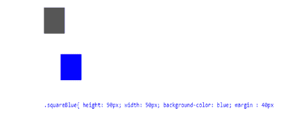
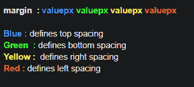
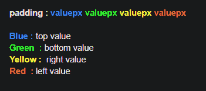
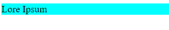
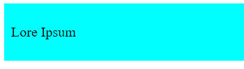

# 揭开 CSS(实用方法)的神秘面纱。我

> 原文：<https://dev.to/mkilmer/demystifying-css-a-pratical-approach-part-i-1bbc>

我决定写一个关于 **`CSS`** 的教程，去神秘化一些关于 css 的属性和概念。这是一系列文章的第一部分。然后，享受！

# 边距与填充

**边距**:定义一个元素相对于浏览器元素的`exterior space`。例如:要给一个按钮相对于页面顶部 10px 的空间。因此，margin 属性定义了元素的边距。

**`margin`** 单独使用意味着在**顶部**、**左侧**、**右侧**和**底部**以相同的间距值给出一个边距，但是仍然可以为每个含义定义特定的值。

**`margin-top`** :上间距
**`margin-bottom`** :下间距
**`margin-right`** :右间距
**`margin-left`** :左间距

**例题**

**T2`element without margin`**

**T2`element with margin`**

也就是说，从边距，可以为所有方向定义相同的间距值，因为可以具体选择哪些方向将具有间距。

**Padding** :设置相对于元素边缘的间距。也就是说，定义了一个较大元素中一个元素的水平和垂直间距。

像 margin 一样，padding 属性可以定义四个方向的间距:上、下、右和左。

**例题**

**T2`element without padding`**

**T2`element with padding`**

**结论**🎉

“揭开 CSS(实用方法)的神秘面纱”系列的第一部分就这样结束了。感谢一切，并等待其他部分！