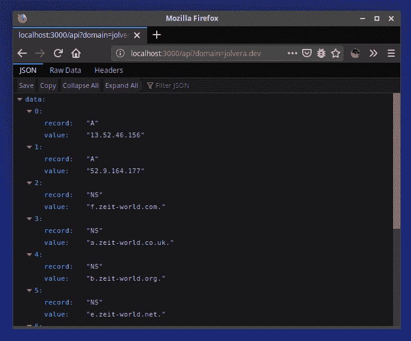

# 立即在 ZEIT 上部署 Python 无服务器功能

> 原文：<https://dev.to/jolvera/deploy-a-python-serverless-function-on-zeit-now-22cf>

> [也发表在我的博客上](https://jolvera.dev/posts/deploy-a-python-serverless-function-on-zeit-now)

让我们使用 Python 无服务器函数编写一个 API 端点，该函数将为我们提供来自给定域的 JSON 格式的 DNS 记录。我们将发送一个带有名为“domain”的查询参数的 GET 请求，即，

`GET https://localhost:3000/api?domain="jolvera.dev"`

我们将使用的工具是 ZEIT 帐户、npm、now-cli 和浏览器。我假设您已经安装了 npm 和浏览器。

我们将要编写的 API 实际上就是我如何启动 [DNS 检查](https://dnscheck.app)原型的。DNS 检查诞生于向客户和同事解释当我们进行 DNS 更改时域发生了什么的需要。提供 DNS 查找信息的工具已经存在，但在我看来，大多数工具还不够简单。

这个项目我们只需要两个依赖项， [Bottle](https://bottlepy.org/docs/dev/) 和 [dnspython](http://www.dnspython.org/) 。

## 创建 Python 函数

第一步是创建一个返回 DNS 记录的函数(例如，A、CNAME、MX。)的给定域名。

```
import dns.resolver

ids = [
    "A",
    "NS",
    "CNAME",
    "SOA",
    "MX",
    "TXT",
    "AAAA",
]

def resolve(domain: str):
    result = []
    for record in ids:
        try:
            answers = dns.resolver.query(domain, record)
            data = [{"record": record, "value": rdata.to_text()} for rdata in answers]
            for item in data:
                result.append(item)
        except Exception as e:
            print(e)
    return result

print(resolve('jolvera.dev')) 
```

在我们的计算机中创建任何文件之前，[让我们在 Repl.it](https://repl.it/@jolvera/DNS-records) 中试试这个功能。如果一切正常，您将得到类似于
的内容

```
[
    {
        'record': 'A',
        'value': '3.19.25.128'
    },
    {
        'record': 'A',
        'value': '3.19.23.166'
    },
    {
        'record': 'NS',
        'value': 'b.zeit-world.org.'
    },
    {
        'record': 'NS',
        'value': 'e.zeit-world.net.'
    },
    {
        'record': 'NS',
        'value': 'f.zeit-world.com.'
    },
    {
        'record': 'NS',
        'value': 'a.zeit-world.co.uk.'
    },
    {
        'record': 'MX',
        'value': '10aspmx1.migadu.com.'
    },
    {
        'record': 'TXT',
        'value': '"v=spf1 a mx include:spf.migadu.com ~all"'
    }
] 
```

尝试不同的域，确保它可以工作，然后继续创建 API 端点。

## 将功能转换为无服务器功能

我们将要使用的无服务器平台是 ZEIT Now。它们使得无服务器开发变得非常容易，项目部署也变得非常愉快。

按照这个例子，在[zeit.co](http://zeit.co/)创建一个账户，然后通过运行`npm i -g now`在你的系统中安装 Now，这样你就可以开始了。

### 文件夹结构

创建一个文件夹，命名为`dnscheck`，然后在里面创建另一个文件夹，命名为`api`。

```
$ mkdir dnscheck
$ mkdir dnscheck/api 
```

这个文件夹结构就是你所需要的。

### 虚拟环境

Python 最佳实践表明我们需要一个虚拟环境，所以我们不会在系统中全局安装我们的依赖项(就像我们在 Python 世界中对`npm i -g now`所做的那样)。
在这个例子中，我将使用`virtualenv`，但是你也可以使用[诗歌](https://poetry.eustace.io/)或者 [Pipenv](https://docs.pipenv.org/en/latest/) 。我选择了这里的`virtualenv`来简化事情。
在`dnscheck/api`文件夹中，创建一个新的虚拟环境。

```
$ cd dnscheck/api
(dnscheck/api) $ virtualenv venv 
```

然后，激活虚拟环境。

```
(dnscheck/api) $ ./venv/bin/activate 
```

这样，我们的虚拟环境就准备好了，我们可以开始安装只在我们的项目中可用的依赖项。我们从安装`dnspython`和`bottle`开始。

```
(dnscheck/api) $ pip install bottle dnspython 
```

然后我们创建一个`requirements.txt`文件，列出我们正在使用的所有依赖项。现在在部署时使用它来安装依赖项。

```
(dnscheck/api) $ pip freeze > requirements.txt 
```

### API 端点带瓶

在`api/`文件夹中，创建一个名为 [`index.py`](http://index.py/) 的文件。在里面写下面的代码。

```
from bottle import Bottle, request
import dns.resolver

app = Bottle()

ids = [
    "A",
    "NS",
    "CNAME",
    "SOA",
    "MX",
    "TXT",
    "AAAA",
]

@app.get('/api')
def api():
    domain = request.query.get('domain')
    result = resolve(domain)
    return dict(data=result)

def resolve(domain: str):
    result = []
    for record in ids:
        try:
            answers = dns.resolver.query(domain, record)
            data = [{"record": record, "value": rdata.to_text()} 
                    for rdata in answers]
            for item in data:
                result.append(item)
        except Exception as e:
            print(e)
    return result 
```

这段代码监听`http://localhost:3000/api`中的 get 请求，并试图获取一个名为`domain`的查询参数，因此为了获取数据，我们必须向[发送一个 GET 请求。domain=jolvera.dev](http://localhost:3000/api?domain=jolvera.dev) 或者直接在浏览器中打开网址。

要在本地测试它，在`dnscheck/`文件夹中运行`now dev`、

```
(dnscheck/api) $ cd ..
(dnscheck) $ now dev 
```

如果一切正常，您应该可以获得开发 URL。

```
> Ready! Available at http://localhost:3000 
```

如果有，就去你的浏览器访问 [http://localhost:3000/api？domain=jolvera.dev](http://localhost:3000/api?domain=jolvera.dev) ，您应该会在 JSON 中看到如下截图所示的响应。

[](https://res.cloudinary.com/practicaldev/image/fetch/s--ODFYUVhq--/c_limit%2Cf_auto%2Cfl_progressive%2Cq_auto%2Cw_880/https://i.imgur.com/FfukFI0.png)

### 部署到现在

万事俱备，将我们的无服务器功能部署到现在，分享给全世界！

在`dnscheck/`文件夹内运行`now`

```
(dnscheck) $ now 
```

如果一切顺利，我们将得到一个类似于 https://dnscheck-example-2k7pyj3cr.now.sh/的 URL，在我的例子中，我得到了 https://dnscheck-post-example.jolvera.now.sh/的 T2，你可以测试我的域名到 https://dnscheck-post-example.jolvera.now.sh/api?的 T4domain=jolvera.dev 。

[查看项目运行情况。](https://i.imgur.com/t7l26yB.gifv)

## 结论

我们能够将一个小创意原型化成一个可行的 API，并轻松地在网上分享。我们在这篇文章中所做的是我的项目的前提，也是我必须让一些东西工作的思路。在我让这个例子工作之后，我不断尝试新的想法，并添加了域验证、Next.js 前端等等。

能够用这些工具将一个想法原型化到一个 API 中，鼓励我更频繁地尝试新事物。一旦你有了第一个工作实例，你就会有动力继续下去，建造更多的东西。你可以在这两个资源库中查看我完成的项目 dnscheck.app:

*   [DNS 检查前端](https://github.com/j0lv3r4/dnscheck-frontend)
*   [DNS 检查无服务器功能](https://github.com/j0lv3r4/dnscheck)